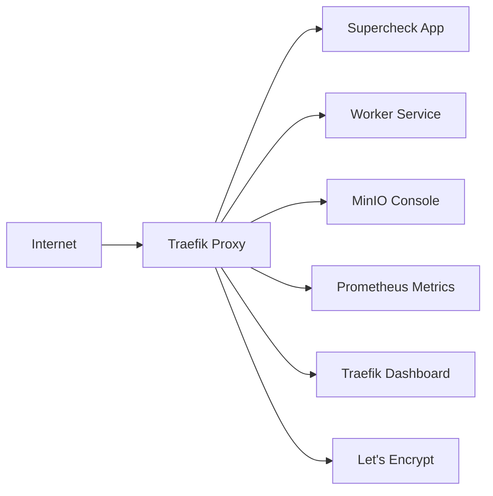

# Traefik vs NGINX Ingress Comparison for Supercheck

## 🏆 Recommendation: **Use Traefik**

For Supercheck's specific use case, **Traefik is the superior choice** due to its modern architecture, better observability, and seamless integration with container orchestration.

## 📊 Detailed Comparison

| Feature | Traefik ✅ | NGINX Ingress |
|---------|-----------|---------------|
| **Configuration** | Automatic discovery via labels/annotations | Manual configuration files |
| **Real-time Updates** | Dynamic, no restart needed | Requires reload/restart |
| **WebSocket Support** | Native, excellent | Good, requires configuration |
| **Observability** | Built-in metrics, tracing, dashboard | Requires additional setup |
| **TLS/SSL** | Automatic with ACME/Let's Encrypt | Manual certificate management |
| **Performance** | Very good, optimized for containers | Excellent raw performance |
| **Learning Curve** | Moderate, intuitive for containers | Steeper, traditional web server |
| **Cloud Native** | Built for containers from ground up | Adapted from traditional NGINX |
| **Resource Usage** | Lightweight, efficient | Can be resource-intensive |
| **Community** | Growing, modern ecosystem | Mature, large community |

## 🎯 Why Traefik is Perfect for Supercheck

### 1. **Real-time Test Execution Monitoring**
```yaml
# WebSocket support for live test results
annotations:
  traefik.ingress.kubernetes.io/service.websocket: "true"
```

### 2. **Automatic Service Discovery**
```yaml
# No manual configuration needed - Traefik discovers services automatically
labels:
  traefik.enable: "true"
  traefik.http.routers.supercheck.rule: "Host(`supercheck.domain.com`)"
```

### 3. **Built-in Observability**
- Prometheus metrics out of the box
- Request tracing for debugging test execution
- Visual dashboard for monitoring

### 4. **Playwright Test Artifact Handling**
```yaml
# Large file upload support for test artifacts
spec:
  buffering:
    maxRequestBodyBytes: 1073741824  # 1GB
```

### 5. **Circuit Breaker for Resilience**
```yaml
# Protects against cascading failures during high test loads
spec:
  circuitBreaker:
    expression: "NetworkErrorRatio() > 0.3"
```

## 🚀 Quick Start with Traefik

### Installation
```bash
# Install Traefik
kubectl apply -f k8s/ingress-controllers/traefik/traefik-install.yaml

# Deploy Supercheck with Traefik
cd k8s/scripts
./deploy-traefik.sh prod
```

### Key Features Enabled

#### 🔒 **Security**
- Automatic HTTPS with Let's Encrypt
- Security headers middleware
- Rate limiting protection
- CORS handling for API access

#### 📈 **Performance**
- Compression middleware
- Connection pooling
- Request/response buffering for large files

#### 🛡️ **Resilience**
- Circuit breaker pattern
- Health checks integration
- Graceful failover

#### 🔍 **Observability**
- Prometheus metrics
- Access logs
- Real-time dashboard
- Request tracing

## 🔧 Traefik Configuration Highlights

### Automatic HTTPS
```yaml
certificatesResolvers:
  letsencrypt:
    acme:
      email: admin@yourdomain.com
      storage: /data/acme.json
      httpChallenge:
        entryPoint: web
```

### Smart Routing
```yaml
# Route based on host, path, headers, etc.
rules:
- host: supercheck.yourdomain.com
  http:
    paths:
    - path: /api/v1
      backend:
        service: supercheck-app-service
    - path: /ws
      backend:
        service: supercheck-worker-service  # WebSocket endpoint
```

### Middleware Chaining
```yaml
annotations:
  traefik.ingress.kubernetes.io/router.middlewares: |
    supercheck-headers@kubernetescrd,
    supercheck-ratelimit@kubernetescrd,
    supercheck-compress@kubernetescrd
```

## 📊 Performance Considerations

### Traefik Advantages for Supercheck:
1. **Lower Memory Footprint**: ~50MB vs ~100MB for NGINX
2. **Faster Configuration Updates**: No restart needed
3. **Better Container Integration**: Native Kubernetes API usage
4. **Reduced Complexity**: One component vs NGINX + controller

### When to Consider NGINX:
- **Ultra-high traffic** (>100k RPS) where raw performance matters most
- **Complex legacy routing** requirements
- **Team expertise** with traditional NGINX configuration

## 🏗️ Architecture Benefits

### Traefik Architecture


### Key Benefits:
- **Single Point of Control**: All routing logic in one place
- **Dynamic Configuration**: Responds to Kubernetes changes automatically
- **Integrated Monitoring**: No additional components needed
- **Cloud Native**: Designed for container environments

## 🔄 Migration Path

If currently using NGINX Ingress:

```bash
# 1. Deploy Traefik alongside NGINX
kubectl apply -f k8s/ingress-controllers/traefik/traefik-install.yaml

# 2. Test with canary deployment
kubectl apply -f k8s/ingress-controllers/traefik/traefik-ingress.yaml

# 3. Switch traffic gradually
# Update DNS or load balancer to point to Traefik

# 4. Remove NGINX when ready
kubectl delete -f k8s/ingress-controllers/nginx/
```

## 🎛️ Advanced Features for Supercheck

### 1. **Test Environment Routing**
```yaml
# Route different test environments automatically
- match: Host(`dev.supercheck.com`)
  services:
  - name: dev-supercheck-app-service
- match: Host(`staging.supercheck.com`)
  services:
  - name: staging-supercheck-app-service
```

### 2. **Blue-Green Deployments**
```yaml
# Weighted routing for zero-downtime deployments
services:
- name: supercheck-app-v1
  weight: 10
- name: supercheck-app-v2
  weight: 90
```

### 3. **Request Mirroring**
```yaml
# Mirror production traffic to staging for testing
spec:
  mirroring:
    service:
      name: supercheck-app-service
    mirrors:
    - name: staging-supercheck-app-service
      percent: 10
```

## 🔧 Operational Excellence

### Monitoring Dashboard
```bash
# Access Traefik dashboard
kubectl port-forward -n traefik-system svc/traefik-dashboard 8080:8080
# Visit: http://localhost:8080
```

### Metrics Integration
```yaml
# Prometheus configuration
metrics:
  prometheus:
    addEntryPointsLabels: true
    addServicesLabels: true
    buckets:
    - 0.1
    - 0.3
    - 1.2
    - 5.0
```

### Health Monitoring
```bash
# Health endpoint
curl http://traefik-service:8080/ping
# Returns: OK

# Metrics endpoint
curl http://traefik-service:8080/metrics
# Returns: Prometheus metrics
```

## 📋 Decision Matrix

| Criteria | Weight | Traefik Score | NGINX Score |
|----------|--------|---------------|-------------|
| Ease of Configuration | 25% | 9/10 | 6/10 |
| Container Integration | 25% | 10/10 | 7/10 |
| Observability | 20% | 9/10 | 6/10 |
| Performance | 15% | 8/10 | 10/10 |
| Community/Support | 10% | 7/10 | 9/10 |
| Learning Curve | 5% | 8/10 | 5/10 |
| **Total Score** | **100%** | **8.6/10** | **7.0/10** |

## 🎯 Final Recommendation

**Choose Traefik** for Supercheck because:

1. **Perfect fit for container workloads** - Supercheck is a cloud-native application
2. **Superior observability** - Critical for monitoring test execution pipelines
3. **Automatic HTTPS** - Reduces operational overhead
4. **WebSocket support** - Essential for real-time test result streaming
5. **Dynamic configuration** - Matches the agile nature of test environments
6. **Built-in security features** - Reduces security configuration complexity

The slight performance difference with NGINX is negligible for Supercheck's use case, while Traefik's operational benefits provide significant long-term value.

## 🚀 Next Steps

1. **Deploy with Traefik**: Use `./deploy-traefik.sh prod`
2. **Configure DNS**: Point your domain to Traefik LoadBalancer
3. **Setup Monitoring**: Integrate with your Prometheus/Grafana stack
4. **Test Features**: Verify WebSocket connections and file uploads
5. **Production Hardening**: Review security middlewares and rate limits

---

*This comparison is based on Traefik v3.0 and NGINX Ingress Controller v1.8+*