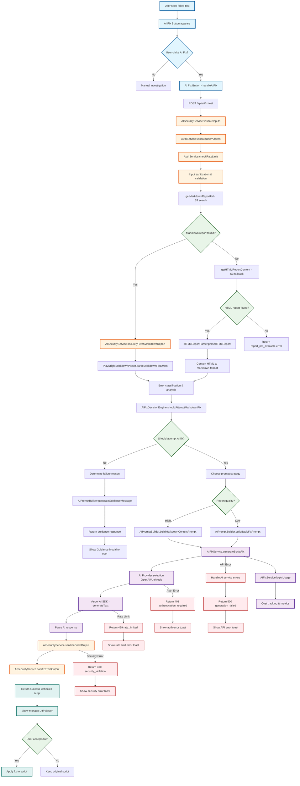

# AI-Powered Test Fix Feature Documentation

## Overview

The AI Fix feature analyzes failed Playwright tests and automatically suggests intelligent fixes using advanced language models. It supports both OpenAI and Anthropic providers with comprehensive error classification, security validation, and an intuitive Monaco-based diff interface.

## Architecture

### AI Fix Flow Diagram



### Core Components

- **AI Service** (`/app/src/lib/ai-service.ts`) - Vercel AI SDK integration with OpenAI/Anthropic
- **Security Layer** (`/app/src/lib/ai-security.ts`) - Input/output sanitization and validation
- **Error Classifier** (`/app/src/lib/ai-classifier.ts`) - Intelligent error analysis and fixability detection
- **Prompt Builder** (`/app/src/lib/ai-prompts.ts`) - Context-aware prompt optimization
- **HTML Parser** (`/app/src/lib/html-report-parser.ts`) - Fallback HTML report processing
- **API Route** (`/app/src/app/api/ai/fix-test/route.ts`) - RESTful endpoint with comprehensive error handling
- **UI Components** - Smart button and Monaco diff viewer integration

### Key Features

- **Multi-Provider Support** - OpenAI GPT-4o-mini (recommended) and Anthropic Claude
- **Intelligent Analysis** - Distinguishes between AI-fixable issues and environmental problems
- **Security-First Design** - Comprehensive input sanitization and output validation
- **Fallback Strategy** - Uses HTML reports when markdown reports aren't available
- **Production Ready** - Rate limiting, monitoring, cost control, and error handling

## Quick Setup

### 1. Choose Your AI Provider

**OpenAI (Recommended):**
- Cost-effective with GPT-4o-mini (~$0.001-0.005 per fix)
- Fast response times
- Excellent code understanding

**Anthropic Claude (Alternative):**
- Good for sensitive data scenarios
- Reliable fallback option

### 2. Get API Keys

**For OpenAI:**
1. Visit [OpenAI Platform](https://platform.openai.com/api-keys)
2. Create a new API key
3. Copy the key (starts with `sk-`)

**For Anthropic:**
1. Visit [Anthropic Console](https://console.anthropic.com/)
2. Create a new API key
3. Copy the key

### 3. Configure Environment Variables

**Production (.env):**
```bash
# Enable AI Fix feature
NEXT_PUBLIC_NEXT_PUBLIC_AI_FIX_ENABLED=true

# Provider configuration
AI_PROVIDER=openai
AI_MODEL=gpt-4o-mini

# API Keys (add your actual keys)
OPENAI_API_KEY=sk-your-actual-openai-key-here
ANTHROPIC_API_KEY=your-anthropic-key-here

# Service configuration
AI_TIMEOUT_MS=30000
AI_MAX_REQUESTS_PER_HOUR=100
```

**Development:**
```bash
# Start with AI Fix disabled for development
NEXT_PUBLIC_AI_FIX_ENABLED=false

# Add your development keys when ready to test
# OPENAI_API_KEY=sk-your-dev-key-here
```

## Environment Variables Reference

| Variable | Required | Default | Description |
|----------|----------|---------|-------------|
| `NEXT_PUBLIC_AI_FIX_ENABLED` | Yes | `false` | Enable/disable AI Fix feature |
| `AI_PROVIDER` | Yes | `openai` | AI provider: `openai` or `anthropic` |
| `AI_MODEL` | Yes | `gpt-4o-mini` | Model to use for fixes |
| `OPENAI_API_KEY` | Conditional | - | Required if using OpenAI |
| `ANTHROPIC_API_KEY` | Conditional | - | Required if using Anthropic |
| `AI_TIMEOUT_MS` | No | `30000` | Request timeout in milliseconds |
| `AI_MAX_REQUESTS_PER_HOUR` | No | `100` | Rate limit per user per hour |

## Supported Models

### OpenAI Models
- `gpt-4o-mini` (Recommended) - Cost-effective and fast
- `gpt-4o` - Most capable, higher cost
- `gpt-4-turbo` - Balanced performance and cost

### Anthropic Models
- `claude-3-haiku-20240307` - Fast and cost-effective
- `claude-3-sonnet-20240229` - Balanced performance

## How It Works

### 1. Test Execution & Failure Detection

When a Playwright test fails, the system:
- Generates detailed markdown failure reports (preferred)
- Falls back to HTML report parsing if needed
- Stores reports in S3 with structured paths

### 2. User Interaction

- **"AI Fix" button** appears next to Run button when tests fail
- User clicks to initiate AI analysis
- System validates permissions and rate limits

### 3. Intelligent Analysis Pipeline

```
Failed Test → Report Analysis → Error Classification → Fix Decision → AI Generation
```

**Error Classification Categories:**

**AI-Fixable:**
- ✅ Selector Issues (wrong/outdated selectors)
- ✅ Timing Problems (wait/timeout issues)
- ✅ Assertion Failures (expected vs actual mismatches)
- ✅ Navigation Errors (routing/page load issues)
- ✅ Data Issues (validation fixes)

**Requires Manual Investigation:**
- ❌ Network Issues (connectivity problems)
- ❌ Authentication Failures (login/auth system issues)
- ❌ Infrastructure Down (services unavailable)
- ❌ Permission Denied (access control issues)
- ❌ Resource Constraints (memory, CPU limits)

### 4. Smart Response Strategy

**For AI-Fixable Issues:**
- Generates optimized fix using context-aware prompts
- Shows Monaco diff editor with side-by-side comparison
- User can review, edit, and accept/reject changes

**For Environmental Issues:**
- Shows professional guidance modal
- Provides actionable troubleshooting steps
- Categorizes the problem type for targeted assistance

## Dependencies

The AI fix feature uses modern, well-maintained dependencies:

```json
{
  "dependencies": {
    "ai": "^5.0.42",
    "@ai-sdk/openai": "^2.0.29",
    "@ai-sdk/anthropic": "^2.0.15",
    "@aws-sdk/client-s3": "^3.x.x",
    "jsdom": "^24.x.x"
  }
}
```

## Implementation Details

### AI Service Architecture

```typescript
// Core service with multi-provider support
export class AIFixService {
  static async generateScriptFix(request: AIFixRequest): Promise<AIFixResponse>
  static async healthCheck(): Promise<HealthStatus>
}
```

**Key Features:**
- Automatic provider selection based on configuration
- Built-in retry logic with exponential backoff
- Token usage tracking and cost monitoring
- Comprehensive error handling with sanitized messages

### Security Framework

```typescript
export class AISecurityService {
  static sanitizeCodeInput(code: string): string
  static sanitizeCodeOutput(code: string): string
  static validateReportUrl(url: string): boolean
  static securelyFetchMarkdownReport(url: string): Promise<string>
}
```

**Security Measures:**
- **Input Sanitization** - Removes dangerous patterns (eval, Function, etc.)
- **Output Validation** - Scans AI responses for malicious content
- **URL Validation** - Only trusted S3 endpoints allowed
- **Rate Limiting** - Per-user and per-organization limits
- **Content Size Limits** - 50KB script, 100KB markdown maximum
- **Authentication** - Better Auth integration with RBAC
- **Audit Logging** - Complete security event trail

### Error Classification System

The system uses pattern matching and keyword analysis to classify errors:

```typescript
interface ErrorClassification {
  category: FailureCategory;
  confidence: number; // 0-1 scale
  aiFixable: boolean;
  keywords: string[];
  patterns: RegExp[];
  severity: 'low' | 'medium' | 'high' | 'critical';
}
```

**Classification Process:**
1. **Parse Reports** - Extract error information from markdown/HTML
2. **Pattern Matching** - Apply regex patterns and keyword detection
3. **Confidence Scoring** - Calculate reliability of classification
4. **Fix Decision** - Determine if AI should attempt a fix

### Prompt Engineering

The system uses context-aware prompts optimized for different scenarios:

**Markdown-Based Prompts (Preferred):**
```typescript
// Rich context from Playwright's detailed failure reports
buildMarkdownContextPrompt({
  failedScript,
  testType,
  markdownContent // Full error report with stack traces, page snapshots
})
```

**Basic Prompts (Fallback):**
```typescript
// When detailed reports aren't available
buildBasicFixPrompt({
  failedScript,
  testType,
  reason // Basic error context
})
```

**Prompt Optimization:**
- Test type-specific guidance (browser, API, database, custom)
- Token efficiency with content truncation
- Structured response format for reliable parsing
- Best practice recommendations built-in

## API Reference

### POST `/api/ai/fix-test`

**Request Body:**
```json
{
  "failedScript": "string", // Test script content (max 50KB)
  "testType": "browser|api|custom|database",
  "testId": "string", // Test execution ID
  "executionContext": {
    "timestamp": "ISO8601",
    "userAgent": "string"
  }
}
```

**Success Response (AI Fix):**
```json
{
  "success": true,
  "fixedScript": "string", // Sanitized fixed code
  "explanation": "string", // Human-readable explanation
  "confidence": 0.85, // AI confidence score (0-1)
  "contextSource": "markdown|html|basic_analysis",
  "aiMetrics": {
    "model": "gpt-4o-mini",
    "duration": 1500, // milliseconds
    "tokensUsed": 1200,
    "promptTokens": 800,
    "completionTokens": 400
  },
  "errorAnalysis": {
    "totalErrors": 2,
    "fixableErrors": 2,
    "topIssues": ["selector_issues", "timing_problems"]
  }
}
```

**Guidance Response (Non-fixable):**
```json
{
  "success": false,
  "reason": "not_fixable|markdown_not_available|rate_limited|security_violation",
  "message": "Human-readable explanation",
  "guidance": "Actionable troubleshooting steps",
  "errorAnalysis": {
    "totalErrors": 1,
    "categories": ["network_issues"]
  }
}
```

### GET `/api/ai/fix-test` (Health Check)

**Response:**
```json
{
  "status": "healthy|unhealthy",
  "timestamp": "2025-01-01T12:00:00Z",
  "service": "ai-fix-api",
  "details": "Optional error details"
}
```

## User Interface

### AI Fix Button

**Behavior:**
- Appears next to Run button when tests fail
- Disabled during test execution or if no script available
- Shows loading state during AI analysis
- Gradient purple-to-pink styling for visual prominence

### Monaco Diff Viewer

**Features:**
- Side-by-side comparison (original vs AI-fixed)
- Syntax highlighting for JavaScript/TypeScript
- Editable AI suggestions (user can modify before accepting)
- Confidence badge and explanation bullets
- Accept/Reject controls with proper state management

**User Flow:**
1. **Review Changes** - See exactly what the AI suggests changing
2. **Edit if Needed** - Modify AI suggestions in the editor
3. **Accept/Reject** - Apply changes or keep original script
4. **Toast Feedback** - Clear success/rejection messages

### Guidance Modal

**For Non-Fixable Issues:**
- Professional, clean design with appropriate icons
- Categorized guidance based on error type
- Actionable next steps with specific recommendations
- Context information (test type, analysis source)
- Quick access to detailed reports

## Testing the Setup

### 1. Basic Configuration Test

```bash
# Enable the feature
NEXT_PUBLIC_AI_FIX_ENABLED=true
OPENAI_API_KEY=your-actual-key
```

### 2. Create a Failing Test

```javascript
// Simple selector issue test
await page.click('#non-existent-button');
```

### 3. Verify Integration

1. Run the test (should fail)
2. Look for "AI Fix" button next to Run button
3. Click button to trigger analysis
4. Verify appropriate response (diff viewer or guidance)

### 4. Health Check

```bash
curl http://localhost:3000/api/ai/fix-test
```

## Troubleshooting

### Button Not Appearing
- ✅ Check `NEXT_PUBLIC_NEXT_PUBLIC_AI_FIX_ENABLED=true`
- ✅ Ensure test actually failed (status = 'failed')
- ✅ Verify user has test execution permissions
- ✅ Check browser console for errors

### API Errors
- ✅ Verify API key is correct and active
- ✅ Check rate limits on your AI provider account
- ✅ Ensure `AI_PROVIDER` matches your API key type
- ✅ Check network connectivity and firewall rules

### Security Errors
- ✅ Verify S3 endpoint configuration is correct
- ✅ Check that test reports are being generated and uploaded
- ✅ Ensure proper AWS credentials and permissions

### Performance Issues
- ✅ Reduce `AI_TIMEOUT_MS` if requests are too slow
- ✅ Switch to `gpt-4o-mini` for faster responses
- ✅ Implement organization-level rate limiting
- ✅ Check S3 region and network latency

### Common Error Patterns

**"Markdown report not found":**
- Test didn't fail properly or reports weren't generated
- Check test execution logs and S3 bucket contents
- Verify Playwright reporter configuration

**"Rate limit exceeded":**
- Too many requests in short time period
- Implement user-level rate limiting with Redis
- Consider increasing limits for power users

**"Authentication required":**
- User session expired or insufficient permissions
- Check Better Auth configuration
- Verify RBAC permissions for test access

## Cost Management

### Estimated Costs (per fix request)

- **GPT-4o-mini:** ~$0.001-0.005 per request
- **GPT-4o:** ~$0.01-0.05 per request
- **Claude-3-Haiku:** ~$0.001-0.003 per request

### Optimization Strategies

1. **Model Selection** - Use `gpt-4o-mini` for development and most use cases
2. **Rate Limiting** - Set appropriate per-user limits
3. **Content Optimization** - Truncate very long error reports
4. **Usage Monitoring** - Track token usage per organization
5. **Prompt Efficiency** - Remove redundant information from prompts

### Monitoring & Analytics

```typescript
// Built-in usage tracking
export class AIMonitoringService {
  static async trackUsage(metrics: {
    userId: string;
    organizationId: string;
    testType: string;
    tokensUsed: number;
    duration: number;
    success: boolean;
    model: string;
  })
}
```

**Metrics Tracked:**
- Token usage per request and organization
- Response times and success rates
- Error categories and resolution patterns
- User adoption and feature usage
- Cost tracking per organization

## Production Deployment

### Pre-Deployment Checklist

- [ ] Set strong, unique API keys
- [ ] Configure appropriate rate limits
- [ ] Set `NEXT_PUBLIC_AI_FIX_ENABLED=true`
- [ ] Monitor initial usage and costs
- [ ] Set up alerts for high usage
- [ ] Review security logs
- [ ] Test with representative failing tests
- [ ] Verify S3 bucket permissions and access
- [ ] Configure monitoring and alerting

### Monitoring

- **AI Usage** - Track through provider dashboards
- **Application Logs** - Monitor for errors and performance issues
- **Cost Alerts** - Set up billing alerts and usage quotas
- **Rate Limit Effectiveness** - Monitor hit rates and user feedback
- **Success Metrics** - Track fix acceptance rates and user satisfaction

### Security Considerations

- **API Key Rotation** - Regularly rotate AI provider keys
- **Rate Limit Monitoring** - Watch for abuse patterns
- **Content Validation** - Log and review flagged content
- **Access Control** - Audit user permissions and test access
- **S3 Security** - Ensure proper bucket policies and access controls

## Advanced Configuration

### Custom Model Configuration

```bash
# Use different models for different providers
AI_PROVIDER=openai
AI_MODEL=gpt-4o  # Higher capability for complex issues

# Or use Anthropic for sensitive data
AI_PROVIDER=anthropic
AI_MODEL=claude-3-sonnet-20240229
```

### Rate Limiting with Redis

```typescript
// Production rate limiting implementation
export class RedisRateLimit {
  static async checkUserLimit(userId: string): Promise<boolean>
  static async checkOrgLimit(orgId: string): Promise<boolean>
}
```

### Custom Error Classifications

```typescript
// Extend the error classifier for domain-specific patterns
const customClassifications = {
  DATABASE_CONNECTION: {
    category: 'infrastructure_down',
    keywords: ['connection refused', 'database timeout'],
    patterns: [/ECONNREFUSED.*database/i]
  }
}
```

## Contributing

The AI Fix feature is designed to be extensible and maintainable:

### Adding New Error Classifications

1. **Define Classification** - Add new categories to `FailureCategory` enum
2. **Add Patterns** - Include keywords and regex patterns
3. **Update Decision Logic** - Modify fixability determination
4. **Test Coverage** - Add test cases for new patterns

### Supporting New AI Providers

1. **Extend AIFixService** - Add provider configuration
2. **Update Model Mapping** - Configure model names and capabilities
3. **Test Integration** - Verify API compatibility
4. **Update Documentation** - Add setup instructions

### UI Enhancements

1. **Component Extensions** - Enhance diff viewer or guidance modal
2. **Accessibility** - Ensure WCAG compliance
3. **Mobile Support** - Test responsive behavior
4. **Keyboard Navigation** - Support power user workflows

## Support

For issues with the AI Fix feature:

1. **Check Troubleshooting** - Review common issues above
2. **Application Logs** - Check browser console and server logs
3. **Environment Variables** - Verify all required settings
4. **Test with Minimal Case** - Use simple failing test to isolate issues
5. **Provider Status** - Check OpenAI/Anthropic service status
6. **Community Support** - Ask questions in project discussions

## Future Enhancements

### Planned Features

1. **Custom Model Training** - Train on internal test patterns for better fixes
2. **Multi-Language Support** - Extend beyond TypeScript/JavaScript
3. **Fix History** - Track and learn from user acceptance patterns
4. **Integration Testing** - AI-powered integration test generation
5. **Visual Testing** - AI-powered visual regression fix suggestions
6. **Batch Processing** - Fix multiple failed tests simultaneously
7. **Learning System** - Improve suggestions based on user feedback

### Architecture Improvements

1. **Caching Layer** - Cache common fixes and patterns
2. **Webhook Integration** - Real-time notifications for fix results
3. **Plugin System** - Allow custom fix providers and strategies
4. **A/B Testing** - Compare different AI models and prompts
5. **Metrics Dashboard** - Real-time usage and performance monitoring

---

The AI-powered test fix feature represents a significant advancement in automated testing workflows, providing intelligent assistance while maintaining security, cost-effectiveness, and user control. It's designed to integrate seamlessly with existing Supercheck functionality while offering a path for continuous improvement and extension.