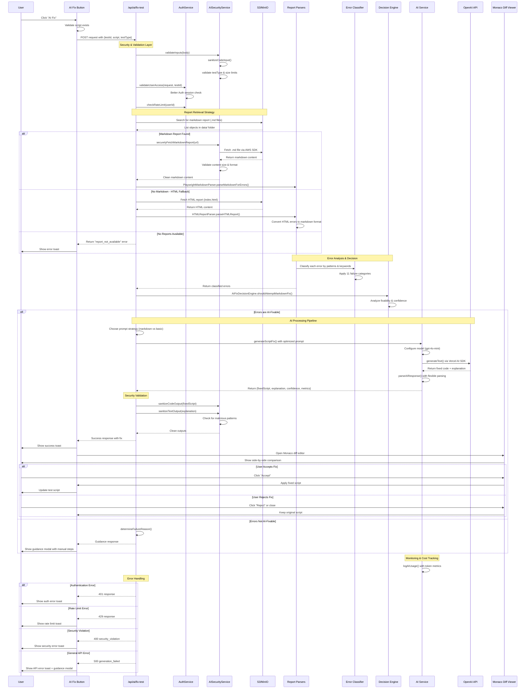
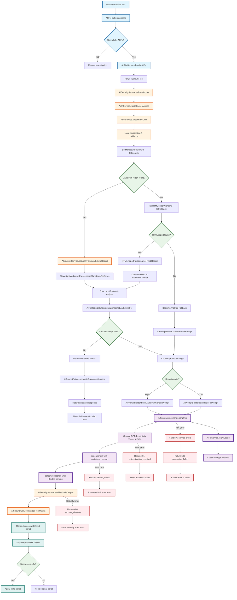

# AI-Powered Test Fix Feature Documentation

## Overview

The AI Fix feature analyzes failed Playwright tests and automatically suggests intelligent fixes using OpenAI's advanced language models. Currently optimized for **OpenAI GPT-4o-mini** with comprehensive error classification, security validation, and an intuitive Monaco-based diff interface.

## Architecture

### Complete AI Fix Sequence Diagram



### Simplified AI Fix Flow Diagram



### Core Components

#### Backend Services
- **AI Service** (`/app/src/lib/ai-service.ts`) - Vercel AI SDK integration with OpenAI GPT-4o-mini
- **Security Layer** (`/app/src/lib/ai-security.ts`) - Input/output sanitization and validation with AWS SDK integration
- **Error Classifier** (`/app/src/lib/ai-classifier.ts`) - 11-category intelligent error analysis with confidence scoring
- **Prompt Builder** (`/app/src/lib/ai-prompts.ts`) - Test type-specific prompt optimization with comment preservation
- **HTML Parser** (`/app/src/lib/html-report-parser.ts`) - JSDOM-based fallback HTML report processing
- **API Route** (`/app/src/app/api/ai/fix-test/route.ts`) - RESTful endpoint with comprehensive error handling and fallback strategies

#### UI Components
- **AI Fix Button** (`/app/src/components/playground/ai-fix-button.tsx`) - Gradient purple-to-pink button with loading states
- **Diff Viewer** (`/app/src/components/playground/ai-diff-viewer.tsx`) - Monaco Editor side-by-side comparison
- **Guidance Modal** (`/app/src/components/playground/guidance-modal.tsx`) - Professional guidance for non-fixable issues
- **Playground Integration** (`/app/src/components/playground/index.tsx`) - Main integration point with permission checking

### Key Features

- **OpenAI Integration** - Optimized for GPT-4o-mini with Vercel AI SDK (Anthropic support implemented but not actively used)
- **Intelligent Error Classification** - 11-category system distinguishing AI-fixable vs manual investigation issues
- **Security-First Design** - Comprehensive input sanitization, output validation, and AWS SDK integration
- **Multi-Source Analysis** - Markdown reports (preferred), HTML fallback, and basic script analysis
- **Production Ready** - Rate limiting, monitoring, cost control, token usage tracking, and comprehensive error handling
- **Comment Preservation** - Strict requirement to maintain all original code comments
- **Flexible Parsing** - Handles various AI response formats with robust error recovery

## Quick Setup

### 1. AI Provider Configuration

**OpenAI GPT-4o-mini (Only Supported Provider):**
- Cost-effective (~$0.001-0.005 per fix)
- Fast response times (90-second timeout)
- Excellent Playwright test understanding
- Optimized prompts for test type-specific fixes
- Direct integration with Vercel AI SDK

### 2. Get API Keys

**For OpenAI (Required):**
1. Visit [OpenAI Platform](https://platform.openai.com/api-keys)
2. Create a new API key
3. Copy the key (starts with `sk-`)
4. Ensure your account has GPT-4o-mini access

### 3. Configure Environment Variables

**Production (.env):**
```bash
# Enable AI Fix feature
NEXT_PUBLIC_AI_FIX_ENABLED=true

# OpenAI Configuration (Primary)
AI_MODEL=gpt-4o-mini
OPENAI_API_KEY=your-openai-api-key-here

# AI Service Configuration
AI_TIMEOUT_MS=90000          # Request timeout (10000-120000ms)
AI_MAX_RETRIES=2             # Retry attempts (1-5)
AI_TEMPERATURE=0.1           # Response randomness (0.0-2.0)
```

**Development:**
```bash
# Start with AI Fix disabled for development
NEXT_PUBLIC_AI_FIX_ENABLED=false

# Add your development keys when ready to test
# OPENAI_API_KEY=sk-your-dev-key-here
```

## Environment Variables Reference

| Variable | Required | Default | Description |
|----------|----------|---------|-------------|
| `NEXT_PUBLIC_AI_FIX_ENABLED` | Yes | `false` | Enable/disable AI Fix feature |
| `AI_MODEL` | Yes | `gpt-4o-mini` | OpenAI model to use for fixes |
| `OPENAI_API_KEY` | Yes | - | OpenAI API key (required) |
| `AI_TIMEOUT_MS` | No | `90000` | Request timeout (10000-120000ms) |
| `AI_MAX_RETRIES` | No | `2` | Number of retry attempts (1-5) |
| `AI_TEMPERATURE` | No | `0.1` | Response randomness (0.0-2.0) |

## Supported Models

### Supported OpenAI Models
- `gpt-4o-mini` (Recommended & Default) - Cost-effective, fast, excellent for test fixes
- `gpt-4o` - Most capable, higher cost, for complex scenarios
- `gpt-4-turbo` - Balanced performance and cost
- `gpt-3.5-turbo` - Budget option (older model)

## How It Works

### 1. Test Execution & Failure Detection

When a Playwright test fails, the system:
- Generates detailed markdown failure reports (preferred)
- Falls back to HTML report parsing if needed
- Stores reports in S3 with structured paths

### 2. User Interaction

- **"AI Fix" button** appears next to Run button when tests fail
- User clicks to initiate AI analysis
- System validates permissions and rate limits

### 3. Intelligent Analysis Pipeline

```
Failed Test → Report Analysis → Error Classification → Fix Decision → AI Generation
```

**Error Classification Categories:**

**AI-Fixable Categories (4 types):**
- ✅ **Selector Issues** - Wrong/outdated selectors, element not found, visibility problems
- ✅ **Timing Problems** - Wait/timeout issues, race conditions, navigation timeouts
- ✅ **Assertion Failures** - Expected vs actual mismatches, toBe/toEqual issues
- ✅ **Navigation Errors** - Routing/page load issues, URL problems
- ✅ **Data Issues** - Missing/corrupt test data, validation fixes (AI can suggest fixes)

**Requires Manual Investigation (6 types):**
- ❌ **Network Issues** - Connectivity problems, HTTP 5xx errors
- ❌ **Authentication Failures** - Login/auth system issues, HTTP 401/403
- ❌ **Infrastructure Down** - Database/services unavailable, maintenance mode
- ❌ **Permission Denied** - Access control issues, insufficient rights
- ❌ **Resource Constraints** - Memory, CPU limits, process killed

**Unknown Category:**
- ❓ **Unknown** - Moderate confidence, AI attempts fix for unclassified issues

### 4. Smart Response Strategy

**For AI-Fixable Issues:**
- Generates optimized fix using context-aware prompts
- Shows Monaco diff editor with side-by-side comparison
- User can review, edit, and accept/reject changes

**For Environmental Issues:**
- Shows professional guidance modal
- Provides actionable troubleshooting steps
- Categorizes the problem type for targeted assistance

## Dependencies

The AI fix feature uses modern, well-maintained dependencies:

```json
{
  "dependencies": {
    "ai": "^5.0.42",
    "@ai-sdk/openai": "^2.0.29",
    "@aws-sdk/client-s3": "^3.787.0",
    "@aws-sdk/s3-request-presigner": "^3.787.0",
    "@monaco-editor/react": "^4.7.0",
    "monaco-editor": "^0.52.2",
    "jsdom": "^27.0.0",
    "lucide-react": "^0.476.0",
    "sonner": "^2.0.3"
  }
}
```

## Implementation Details

### AI Service Architecture

```typescript
// Core service optimized for OpenAI
export class AIFixService {
  static async generateScriptFix(request: AIFixRequest): Promise<AIFixResponse>
  static async healthCheck(): Promise<HealthStatus>
  private static getModel(): OpenAI // Returns OpenAI model instance
  private static optimizePrompt(prompt: string, testType?: string): string
  private static parseAIResponse(response: string): ParsedResponse
}
```

**Key Features:**
- OpenAI GPT-4o-mini optimization with Vercel AI SDK
- Flexible AI response parsing for various formats
- Token usage tracking and cost monitoring
- Comprehensive error handling with sanitized messages
- Configurable timeout (10-120 seconds) and retry logic (1-5 attempts)
- Temperature control for response consistency (0.0-2.0)

### Security Framework

```typescript
export class AISecurityService {
  static validateInputs(body: Record<string, unknown>): ValidatedInput
  static sanitizeCodeInput(code: string): string
  static sanitizeCodeOutput(code: string): string
  static sanitizeTextOutput(text: string): string
  static validateReportUrl(url: string): boolean
  static securelyFetchMarkdownReport(url: string): Promise<string>
}

export class AuthService {
  static async validateUserAccess(request: Request, testId: string): Promise<UserSession>
  static async checkRateLimit(request: Request, userId: string): Promise<void>
}
```

**Security Measures:**
- **Input Validation** - Type checking, size limits (50KB script), test type validation
- **Input Sanitization** - Removes dangerous patterns (eval, Function, setTimeout, etc.)
- **Output Validation** - Scans AI responses for malicious content including data URIs
- **URL Validation** - Trusted S3/MinIO endpoints only (including localhost for development)
- **Content Size Limits** - 50KB script, 100KB markdown maximum
- **AWS SDK Integration** - Secure S3 fetching with proper credentials
- **Authentication** - Better Auth integration with session validation
- **Rate Limiting** - Per-user rate limiting framework (Redis implementation ready)
- **Error Sanitization** - API key redaction in error messages

### Error Classification System

The system uses pattern matching and keyword analysis to classify errors:

```typescript
interface ErrorClassification {
  category: FailureCategory;
  confidence: number; // 0-1 scale
  aiFixable: boolean;
  keywords: string[];
  patterns: RegExp[];
  severity: 'low' | 'medium' | 'high' | 'critical';
}
```

**Classification Process:**
1. **Parse Reports** - Extract error information from markdown/HTML with expanded Playwright patterns
2. **Pattern Matching** - Apply 11-category regex patterns and keyword detection
3. **Confidence Scoring** - Calculate reliability (0-1 scale) with category-specific weights
4. **Fix Decision** - Multi-factor analysis considering error types, confidence, and fixability
5. **Fallback Analysis** - Basic script analysis when no detailed reports available

### Prompt Engineering

The system uses context-aware prompts optimized for different scenarios:

**Markdown-Based Prompts (Preferred):**
```typescript
// Rich context from Playwright's detailed failure reports
buildMarkdownContextPrompt({
  failedScript,
  testType,
  markdownContent // Full error report with optimized content
})
```

**Basic Prompts (Fallback):**
```typescript
// When detailed reports aren't available
buildBasicFixPrompt({
  failedScript,
  testType,
  reason // Basic error context
})
```

**Prompt Engineering Features:**
- **Test Type Specialization** - Browser, API, database, custom-specific instructions
- **Comment Preservation** - Strict requirements to maintain all original comments
- **Token Optimization** - Smart content truncation (8000 chars) preserving critical sections
- **Response Format Control** - FIXED_SCRIPT, EXPLANATION, CONFIDENCE structure
- **Best Practice Integration** - Playwright-specific patterns and recommendations
- **Flexible Parsing** - Handles various AI response formats with robust error recovery

## API Reference

### POST `/api/ai/fix-test`

**Request Body:**
```json
{
  "failedScript": "string", // Test script content (max 50KB)
  "testType": "browser|api|custom|database",
  "testId": "string", // Test execution ID
  "executionContext": {
    "timestamp": "ISO8601",
    "userAgent": "string"
  }
}
```

**Success Response (AI Fix):**
```json
{
  "success": true,
  "fixedScript": "string", // Sanitized fixed code
  "explanation": "string", // Human-readable explanation
  "confidence": 0.85, // AI confidence score (0-1)
  "contextSource": "markdown|html|basic_analysis",
  "aiMetrics": {
    "model": "gpt-4o-mini",
    "duration": 1500, // milliseconds
    "tokensUsed": 1200,
    "promptTokens": 800,
    "completionTokens": 400
  },
  "errorAnalysis": {
    "totalErrors": 2,
    "fixableErrors": 2,
    "topIssues": ["selector_issues", "timing_problems"]
  }
}
```

**Guidance Response (Non-fixable):**
```json
{
  "success": false,
  "reason": "not_fixable|markdown_not_available|rate_limited|security_violation",
  "message": "Human-readable explanation",
  "guidance": "Actionable troubleshooting steps",
  "errorAnalysis": {
    "totalErrors": 1,
    "categories": ["network_issues"]
  }
}
```

### GET `/api/ai/fix-test` (Health Check)

**Response:**
```json
{
  "status": "healthy|unhealthy",
  "timestamp": "2025-01-01T12:00:00Z",
  "service": "ai-fix-api",
  "details": "Optional error details"
}
```

## User Interface

### AI Fix Button

**Behavior:**
- Appears next to Run button when tests fail
- Disabled during test execution or if no script available
- Shows loading state during AI analysis
- Gradient purple-to-pink styling for visual prominence

### Monaco Diff Viewer

**Features:**
- Side-by-side comparison (original vs AI-fixed)
- Syntax highlighting for JavaScript/TypeScript
- Editable AI suggestions (user can modify before accepting)
- Confidence badge and explanation bullets
- Accept/Reject controls with proper state management

**User Flow:**
1. **Review Changes** - See exactly what the AI suggests changing
2. **Edit if Needed** - Modify AI suggestions in the editor
3. **Accept/Reject** - Apply changes or keep original script
4. **Toast Feedback** - Clear success/rejection messages

### Guidance Modal

**For Non-Fixable Issues:**
- Professional, clean design with appropriate icons
- Categorized guidance based on error type
- Actionable next steps with specific recommendations
- Context information (test type, analysis source)
- Quick access to detailed reports

## Testing the Setup

### 1. Basic Configuration Test

```bash
# Enable the feature
NEXT_PUBLIC_AI_FIX_ENABLED=true
OPENAI_API_KEY=your-actual-key
```

### 2. Create a Failing Test

```javascript
// Simple selector issue test
await page.click('#non-existent-button');
```

### 3. Verify Integration

1. Run the test (should fail)
2. Look for "AI Fix" button next to Run button
3. Click button to trigger analysis
4. Verify appropriate response (diff viewer or guidance)

### 4. Health Check

```bash
curl http://localhost:3000/api/ai/fix-test
```

## Troubleshooting

### Button Not Appearing
- ✅ Check `NEXT_PUBLIC_AI_FIX_ENABLED=true` (note: no double prefix)
- ✅ Ensure test actually failed (status = 'failed')
- ✅ Verify user has test execution permissions
- ✅ Check browser console for errors
- ✅ Confirm script content exists and is not empty

### API Errors
- ✅ Verify `OPENAI_API_KEY` is correct and active
- ✅ Check rate limits on your OpenAI account
- ✅ Ensure GPT-4o-mini model access in your OpenAI account
- ✅ Check network connectivity and firewall rules
- ✅ Verify timeout settings (`AI_TIMEOUT_MS`) are appropriate

### Security Errors
- ✅ Verify S3/MinIO endpoint configuration is correct
- ✅ Check that test reports are being generated and uploaded to correct bucket
- ✅ Ensure proper AWS credentials and MinIO permissions
- ✅ Confirm `S3_TEST_BUCKET_NAME` matches your bucket configuration
- ✅ Check AWS SDK connectivity to S3/MinIO service

### Performance Issues
- ✅ Increase `AI_TIMEOUT_MS` for slow responses (default 90 seconds)
- ✅ Using `gpt-4o-mini` for optimal speed and cost balance
- ✅ Implement Redis-based rate limiting for production
- ✅ Check S3/MinIO region and network latency
- ✅ Monitor token usage and request duration metrics

### Common Error Patterns

**"Markdown report not found":**
- Test didn't fail properly or reports weren't generated
- Check test execution logs and S3 bucket contents
- Verify Playwright reporter configuration

**"Rate limit exceeded":**
- Too many requests in short time period
- Implement user-level rate limiting with Redis
- Consider increasing limits for power users

**"Authentication required":**
- User session expired or insufficient permissions
- Check Better Auth configuration
- Verify RBAC permissions for test access

## Cost Management

### Estimated Costs (per fix request)

- **GPT-4o-mini (Primary):** ~$0.001-0.005 per request
- **GPT-4o (Advanced):** ~$0.01-0.05 per request
- **GPT-4-turbo:** ~$0.005-0.02 per request
- **GPT-3.5-turbo (Budget):** ~$0.0005-0.002 per request

### Optimization Strategies

1. **Model Selection** - Use `gpt-4o-mini` for optimal cost/performance balance
2. **Rate Limiting** - Implement Redis-based per-user limits (default: 100/hour)
3. **Content Optimization** - Smart markdown truncation (8000 chars) preserving critical sections
4. **Usage Monitoring** - Built-in token usage tracking with cost calculation
5. **Prompt Efficiency** - Test type-specific prompts with optimized token usage
6. **Timeout Configuration** - Adjustable timeout (10-120 seconds) based on model requirements

### Monitoring & Analytics

```typescript
// Built-in usage tracking in AIFixService
export class AIFixService {
  private static async logAIUsage(usage: AIUsageLog): Promise<void> {
    const logEntry = {
      timestamp: new Date().toISOString(),
      service: 'ai-fix',
      success: boolean;
      duration: number;
      tokensUsed?: number;
      error?: string;
      model: string;
      testType?: string;
    };
    console.log('[AI Usage]', logEntry);
    // TODO: Implement database/monitoring system integration
  }
}
```

**Metrics Tracked:**
- Token usage per request and organization
- Response times and success rates
- Error categories and resolution patterns
- User adoption and feature usage
- Cost tracking per organization

## Production Deployment

### Pre-Deployment Checklist

- [ ] Set strong, unique API keys
- [ ] Configure appropriate rate limits
- [ ] Set `NEXT_PUBLIC_AI_FIX_ENABLED=true`
- [ ] Monitor initial usage and costs
- [ ] Set up alerts for high usage
- [ ] Review security logs
- [ ] Test with representative failing tests
- [ ] Verify S3 bucket permissions and access
- [ ] Configure monitoring and alerting

### Monitoring

- **AI Usage** - Track through provider dashboards
- **Application Logs** - Monitor for errors and performance issues
- **Cost Alerts** - Set up billing alerts and usage quotas
- **Rate Limit Effectiveness** - Monitor hit rates and user feedback
- **Success Metrics** - Track fix acceptance rates and user satisfaction

### Security Considerations

- **API Key Rotation** - Regularly rotate AI provider keys
- **Rate Limit Monitoring** - Watch for abuse patterns
- **Content Validation** - Log and review flagged content
- **Access Control** - Audit user permissions and test access
- **S3 Security** - Ensure proper bucket policies and access controls

## Advanced Configuration

### Custom Model Configuration

```bash
# OpenAI Model Selection
AI_MODEL=gpt-4o-mini     # Recommended default
# AI_MODEL=gpt-4o        # Higher capability, higher cost
# AI_MODEL=gpt-4-turbo   # Balanced performance
# AI_MODEL=gpt-3.5-turbo # Budget option

# Service Configuration
AI_TIMEOUT_MS=90000       # 90 seconds (adjust based on model)
AI_TEMPERATURE=0.1        # Low for consistent fixes
AI_MAX_RETRIES=2         # Retry attempts
```


### Custom Error Classifications

```typescript
// Extend the 11-category system in ai-classifier.ts
const ERROR_CLASSIFICATIONS: Record<FailureCategory, ErrorClassification> = {
  [FailureCategory.SELECTOR_ISSUES]: {
    category: FailureCategory.SELECTOR_ISSUES,
    confidence: 0.85,
    aiFixable: true,
    keywords: ['locator', 'selector', 'element', 'not found'],
    patterns: [/locator.*not found/i],
    severity: 'medium'
  },
  // ... 10 other categories with confidence scoring
};
```

## Contributing

The AI Fix feature is designed to be extensible and maintainable:

### Adding New Error Classifications

1. **Define Classification** - Add new categories to `FailureCategory` enum
2. **Add Patterns** - Include keywords and regex patterns
3. **Update Decision Logic** - Modify fixability determination
4. **Test Coverage** - Add test cases for new patterns

### Supporting New AI Providers

1. **Extend AIFixService** - Add provider configuration
2. **Update Model Mapping** - Configure model names and capabilities
3. **Test Integration** - Verify API compatibility
4. **Update Documentation** - Add setup instructions

### UI Enhancements

1. **Component Extensions** - Enhance diff viewer or guidance modal
2. **Accessibility** - Ensure WCAG compliance
3. **Mobile Support** - Test responsive behavior
4. **Keyboard Navigation** - Support power user workflows

## Support

For issues with the AI Fix feature:

1. **Check Troubleshooting** - Review common issues above
2. **Application Logs** - Check browser console and server logs
3. **Environment Variables** - Verify all required settings
4. **Test with Minimal Case** - Use simple failing test to isolate issues
5. **Provider Status** - Check OpenAI/Anthropic service status
6. **Community Support** - Ask questions in project discussions

## Future Enhancements

### Planned Features

1. **Advanced Monitoring** - Database integration for usage tracking and cost monitoring
2. **Fix History** - Track and learn from user acceptance patterns
3. **Multi-Language Support** - Extend beyond TypeScript/JavaScript to Python, C#, etc.
4. **Batch Processing** - Fix multiple failed tests simultaneously
5. **Enhanced Classification** - Machine learning-based error categorization
6. **Visual Testing** - AI-powered visual regression fix suggestions
7. **Alternative AI Providers** - Consider Anthropic Claude or other providers for specific use cases

### Architecture Improvements

1. **Database Integration** - Store usage metrics and cost tracking in PostgreSQL
2. **Redis Caching** - Cache common fixes and classification patterns
3. **Webhook Integration** - Real-time notifications for fix results
4. **Plugin System** - Allow custom fix providers and classification strategies
5. **A/B Testing** - Compare different models, prompts, and classification approaches
6. **Metrics Dashboard** - Real-time usage, success rates, and cost monitoring
7. **Advanced Security** - Enhanced content scanning and security validation

## Current Implementation Status

### ✅ Production Ready Features
- OpenAI GPT-4o-mini integration with Vercel AI SDK
- 11-category intelligent error classification system
- Comprehensive security validation and sanitization
- Monaco Editor-based diff viewer with confidence scoring
- AWS SDK integration for S3/MinIO report fetching
- Flexible AI response parsing with error recovery
- Comment preservation requirements
- Toast notifications and error handling

### ❌ Not Yet Implemented
- Advanced monitoring and cost tracking (basic console logging only)
- Database integration for metrics (console logging only)


---

The AI-powered test fix feature represents a significant advancement in automated testing workflows, providing intelligent assistance while maintaining security, cost-effectiveness, and user control. It's designed to integrate seamlessly with existing Supercheck functionality using modern tools like Vercel AI SDK, Monaco Editor, and AWS SDK for a robust, production-ready solution.