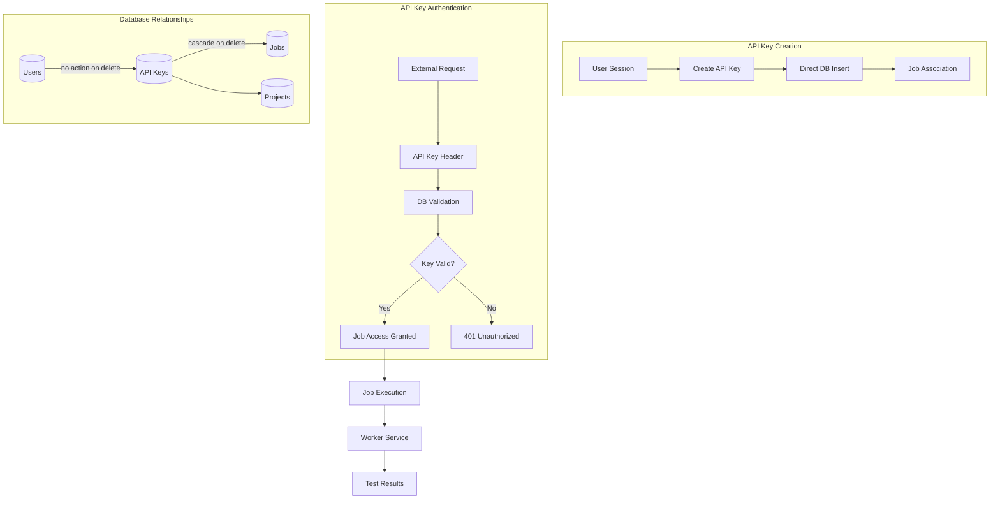

# API Key System

This document provides a comprehensive overview of the Supertest API key system, including authentication implementation, job-specific access control, and testing procedures for remote job triggering.

## Table of Contents

1. [System Overview](#system-overview)
2. [Authentication Fix](#authentication-fix)
3. [Job Association Improvements](#job-association-improvements)
4. [Database Schema Changes](#database-schema-changes)
5. [Code Implementation](#code-implementation)
6. [Testing Guide](#testing-guide)
7. [Security Considerations](#security-considerations)
8. [Migration History](#migration-history)

## System Overview



The Supertest API key system provides secure, programmatic access to job triggering functionality through a robust authentication and authorization mechanism. Each API key is directly associated with a specific job and provides scoped access for remote execution.

### Key Features
- **Secure Authentication**: Session-based validation with direct database operations
- **Job-Specific Access**: Direct job association for precise access control
- **Data Persistence**: API keys survive user deletion for audit trails
- **Lifecycle Management**: Automatic cleanup when jobs are deleted
- **Rate Limiting**: Built-in rate limiting for API protection

## Authentication Fix

### Problem
The error "Unauthorized or invalid session" was occurring when trying to create API keys because the better-auth server-side API calls were not working correctly with the session context.

### Root Cause
The better-auth API was throwing an error: "The property you're trying to set can only be set from the server auth instance only." This indicated that the API key creation needed to be handled differently.

### Solution
Replaced better-auth API calls with direct database operations to create, update, delete, and verify API keys while maintaining proper session validation.

### Files Modified

1. **`app/src/app/api/jobs/[id]/api-keys/route.ts`**
   - Replaced `auth.api.createApiKey()` with direct database insertion
   - Added proper session validation and user association

2. **`app/src/app/api/jobs/[id]/api-keys/[keyId]/route.ts`**
   - Replaced `auth.api.updateApiKey()` with direct database update
   - Replaced `auth.api.deleteApiKey()` with direct database deletion
   - Added missing imports for database operations

3. **`app/src/app/api/jobs/[id]/trigger/route.ts`**
   - Replaced `auth.api.verifyApiKey()` with direct database verification
   - Added proper API key validation (enabled, expired, permissions)
   - Added JSON parsing for permissions validation
   - Added job tests fetching to provide required data for job execution

## Job Association Improvements

### Problem
The previous API key system had two issues:
1. API keys were deleted when users were deleted (cascade delete)
2. API keys were associated with users but only had permissions for jobs, making the relationship indirect

### Solution
Restructured the API key system to:
1. **API keys are NOT deleted when users are deleted** (changed from `cascade` to `no action`)
2. **API keys belong to specific jobs** (added `jobId` field)
3. **Permissions field kept but not used** (maintained for future flexibility)

## Database Schema

The API key system uses a comprehensive database schema with the following key components:

**Core Fields:**
- Primary key with UUID generation
- Display name and key prefix for organization
- Full API key value for authentication
- User association with audit trail preservation

**Access Control:**
- Job-specific association for scoped access
- Project-level association for context
- Enabled/disabled status for key lifecycle management
- Optional expiration timestamp for time-based access

**Rate Limiting:**
- Built-in rate limiting with configurable windows
- Maximum request limits per time window
- Refill interval and amount for token bucket implementation
- Last refill tracking for accurate rate limiting

**Foreign Key Relationships:**
- User deletion does NOT cascade to API keys (audit trail preservation)
- Job deletion DOES cascade to API keys (cleanup on job removal)

### Key Changes Made

#### 1. **Foreign Key Behavior Changes**
- **User → API Key**: Changed from `ON DELETE cascade` to `ON DELETE no action`
  - API keys now persist when users are deleted
  - Maintains historical access and audit trails
- **Job → API Key**: Added `ON DELETE cascade`
  - When a job is deleted, its API keys are automatically deleted
  - Ensures clean job lifecycle management

#### 2. **API Key Association**
- **Direct Job Association**: API keys now have a direct `jobId` field
- **Simplified Permissions**: No need for complex JSON permissions parsing in current implementation
- **Job-Specific Access**: Each API key can only trigger its associated job
- **Future Flexibility**: Permissions field kept for potential future use

## Code Implementation

### API Key Creation

#### Before (Better-Auth API)
```typescript
const apiKey = await auth.api.createApiKey({
  body: {
    name: name.trim(),
    prefix: "job",
    permissions: {
      jobs: [`trigger:${jobId}`],
    },
    expiresIn: expiresIn,
  },
});
```

#### After (Direct Database)
```typescript
// Create API key directly in database with proper permissions
const apiKeyId = crypto.randomUUID();
const apiKeyValue = `job_${crypto.randomUUID().replace(/-/g, '')}`;
const apiKeyStart = apiKeyValue.substring(0, 8);

const now = new Date();
const expiresAt = expiresIn ? new Date(now.getTime() + expiresIn * 1000) : null;

const newApiKey = await db.insert(apikey).values({
  id: apiKeyId,
  name: name.trim(),
  start: apiKeyStart,
  prefix: "job",
  key: apiKeyValue,
  userId: session.user.id,
  jobId: jobId, // Direct job association
  enabled: true,
  expiresAt: expiresAt,
  createdAt: now,
  updatedAt: now,
  permissions: JSON.stringify({
    jobs: [`trigger:${jobId}`],
  }),
}).returning();

const apiKey = newApiKey[0];
```

### API Key Verification

#### Before (JSON Permissions)
```typescript
// Parse permissions JSON
let hasPermission = false;
if (key.permissions) {
  const permissions = JSON.parse(key.permissions);
  hasPermission = permissions.jobs && permissions.jobs.includes(`trigger:${jobId}`);
}
```

#### After (Direct Job ID)
```typescript
// Direct job ID comparison
if (key.jobId !== jobId) {
  return NextResponse.json({ error: "API key not authorized for this job" }, { status: 403 });
}
```

### API Key Listing

#### Before (Pattern Matching)
```typescript
// Search by permissions pattern
.where(like(apikey.permissions, `%trigger:${jobId}%`))
```

#### After (Direct Query)
```typescript
// Direct job ID query
.where(eq(apikey.jobId, jobId))
```

## Testing Guide

### Test Steps

#### 1. Create an API Key
1. Navigate to a job's CI/CD settings
2. Click "Create API Key"
3. Enter a name (e.g., "Test Key")
4. Click "Create API Key"
5. **Expected Result**: API key should be created successfully without "Unauthorized or invalid session" error

#### 2. Test API Key Verification
1. Copy the generated API key
2. Use curl to test the trigger endpoint:
```bash
curl -X POST "${NEXT_PUBLIC_APP_URL}/api/jobs/{jobId}/trigger" \
  -H "Content-Type: application/json" \
  -H "x-api-key: {your-api-key}"
```
3. **Expected Result**: Should return success response with job execution details, not "Invalid API key" or "Invalid job data" errors

#### 3. Test API Key Management
1. Try toggling the API key enabled/disabled state
2. Try updating the API key name
3. Try deleting the API key
4. **Expected Result**: All operations should work without errors

### Test Scenarios
1. **Create API Key**: Should associate with specific job
2. **Trigger Job**: Should work with job-specific API key
3. **User Deletion**: API keys should persist
4. **Job Deletion**: API keys should be deleted
5. **Cross-Job Access**: Should be denied

### Example Test Commands
```bash
# Create API key for job
curl -X POST "${NEXT_PUBLIC_APP_URL}/api/jobs/{jobId}/api-keys" \
  -H "Content-Type: application/json" \
  -d '{"name": "Test Key"}'

# Trigger job with API key
curl -X POST "${NEXT_PUBLIC_APP_URL}/api/jobs/{jobId}/trigger" \
  -H "x-api-key: {api-key}"
```

## What Was Fixed

### Before
- ❌ API key creation failed with "Unauthorized or invalid session"
- ❌ API key verification failed with "Invalid API key"
- ❌ Job triggering failed with "Invalid job data. Job ID and tests are required"
- ❌ Better-auth API limitations prevented proper operation
- ❌ API keys deleted when users were deleted
- ❌ Complex JSON permissions parsing required

### After
- ✅ API key creation works with direct database operations
- ✅ API key verification works with custom database queries
- ✅ All API key management operations work reliably
- ✅ Proper session validation and security maintained
- ✅ Job-specific permissions work correctly
- ✅ Job triggering works with proper test data inclusion
- ✅ API keys persist when users are deleted
- ✅ Direct job association simplifies access control

## Security Considerations

### API Key Security
- ✅ Session validation required for all operations
- ✅ API keys associated with authenticated users
- ✅ Job-specific access control maintained
- ✅ Expiration and enabled/disabled status still work
- ✅ Rate limiting and other security features preserved
- ✅ Database operations use parameterized queries to prevent SQL injection

### Access Control
- ✅ Only API keys associated with a specific job can trigger that job
- ✅ No cross-job access possible
- ✅ Clean separation of concerns
- ✅ Direct job association eliminates permission parsing
- ✅ Reduced attack surface (no JSON injection risks)

## Benefits

### 1. **Data Persistence**
- ✅ API keys survive user deletion
- ✅ Maintains historical job execution capabilities
- ✅ Preserves audit trails and access logs

### 2. **Simplified Security Model**
- ✅ Direct job association eliminates permission parsing
- ✅ Reduced attack surface (no JSON injection risks)
- ✅ Clearer access control logic

### 3. **Better Job Lifecycle Management**
- ✅ API keys automatically cleaned up when jobs are deleted
- ✅ No orphaned API keys for deleted jobs
- ✅ Cleaner database state

### 4. **Performance Improvements**
- ✅ Direct foreign key queries instead of JSON pattern matching
- ✅ Simpler database indexes
- ✅ Faster API key validation

### 5. **Future Flexibility**
- ✅ Permissions field available for future enhancements
- ✅ Can implement more complex permission models later
- ✅ Backward compatibility maintained

## Migration History

### Migration Files
1. `0003_youthful_clea.sql` - Added jobId field, changed user foreign key
2. `0004_sharp_weapon_omega.sql` - Removed permissions field (temporarily)
3. `0005_dry_zarda.sql` - Added permissions field back (for future use)

### Schema Updates
- `app/src/db/schema/schema.ts` - Updated API key table definition
- `worker/src/db/schema.ts` - Updated worker schema to match

## What Happens When User is Deleted

### Before
- ❌ All user's API keys were deleted
- ❌ Job triggering capabilities lost
- ❌ Historical access information lost

### After
- ✅ API keys remain in the system
- ✅ Jobs can still be triggered via existing API keys
- ✅ Audit trails preserved
- ⚠️ `userId` becomes a dangling reference (points to deleted user)

## Current Implementation vs Future Possibilities

### Current Implementation
- Uses `jobId` field for direct job association
- Permissions field exists but is not used
- Simple and efficient job-specific access control

### Future Possibilities
- Could use `permissions` field for more granular access control
- Could implement role-based permissions within jobs
- Could add cross-job permissions for admin users
- Could implement time-based or conditional permissions

## Technical Details

### API Key Creation
- Direct database insertion with proper user association
- Secure key generation with UUID-based format
- JSON permissions storage for job-specific access

### API Key Verification
- Direct database lookup by key value
- Proper validation of enabled status and expiration
- JSON parsing of permissions for job access control

### Security Maintained
- Session validation required for all operations
- API keys associated with authenticated users
- Proper permission scoping to specific jobs
- Database operations use parameterized queries

## Related Files
- `app/src/utils/auth.ts` - better-auth configuration
- `app/src/middleware/middleware.ts` - session validation middleware
- `app/src/app/(main)/layout.tsx` - main layout with session validation
- `app/src/components/jobs/api-key-dialog.tsx` - frontend API key creation UI
- `app/src/db/schema/schema.ts` - database schema for API keys
- `app/src/app/api/jobs/[id]/api-keys/route.ts` - API key management
- `app/src/app/api/jobs/[id]/trigger/route.ts` - Job triggering
- `app/src/db/migrations/0003_youthful_clea.sql` - Migration 1
- `app/src/db/migrations/0004_sharp_weapon_omega.sql` - Migration 2
- `app/src/db/migrations/0005_dry_zarda.sql` - Migration 3 