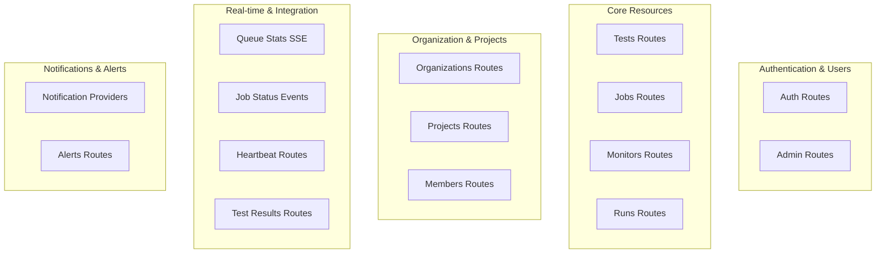

# API Routes Analysis & Recommendations

## Summary

This document provides a comprehensive analysis of all API routes in the Supertest application. The analysis includes route categorization, performance recommendations, and optimization strategies for the Next.js API layer that serves both the frontend and external integrations.

## 🏗️ **CURRENT API ARCHITECTURE**

### Route Organization
The API is organized into logical groups:
- **Authentication & Users**: Better-auth integration for user management
- **Core Resources**: Tests, Jobs, Monitors, Runs with full CRUD operations
- **Execution**: Test and job execution endpoints with queue integration
- **Real-time**: SSE endpoints for live status updates
- **External Integration**: API keys, heartbeat endpoints, webhooks

## 📊 **COMPLETE API ROUTES ANALYSIS**

### **Core API Routes by Category**

#### **1. Authentication & Admin Management**
| Route | Purpose | Status | Notes |
|-------|---------|--------|-------|
| `/api/auth/[...all]/route.ts` | Better Auth integration | ✅ Essential | Handles all auth operations |
| `/api/auth/user/route.ts` | Current user info | ✅ Essential | User session management |
| `/api/auth/impersonation-status/route.ts` | Admin impersonation | ✅ Essential | Super admin feature |
| `/api/auth/setup-defaults/route.ts` | New user setup | ✅ Essential | Organization creation |
| `/api/admin/check/route.ts` | Admin access check | ✅ Essential | Permission verification |
| `/api/admin/organizations/route.ts` | Organization oversight | ✅ Essential | Super admin management |
| `/api/admin/users/route.ts` | User management | ✅ Essential | Ban/unban users |
| `/api/admin/stats/route.ts` | System statistics | ✅ Essential | Platform metrics |

#### **2. Core Resource Management**  
| Route | Purpose | Status | Notes |
|-------|---------|--------|-------|
| `/api/tests/route.ts` | Test CRUD operations | ✅ Essential | Test management |
| `/api/test/route.ts` | Single test execution | ✅ Essential | Queue individual tests |
| `/api/jobs/route.ts` | Job management | ✅ Essential | Multi-test job handling |
| `/api/jobs/run/route.ts` | Job execution | ✅ Essential | Execute scheduled jobs |
| `/api/monitors/route.ts` | Monitor CRUD operations | ✅ Essential | Health monitoring |
| `/api/runs/route.ts` | Run management | ✅ Essential | Test execution history |
| `/api/dashboard/route.ts` | Dashboard statistics | ✅ Essential | UI data aggregation |

#### **3. Organization & Project Management**
| Route | Purpose | Status | Notes |
|-------|---------|--------|-------|
| `/api/organizations/route.ts` | Organization CRUD | ✅ Essential | Multi-tenant support |
| `/api/organizations/current/route.ts` | Active organization | ✅ Essential | Context management |
| `/api/organizations/members/route.ts` | Member management | ✅ Essential | Team collaboration |
| `/api/organizations/invitations/route.ts` | Member invitations | ✅ Essential | User onboarding |
| `/api/projects/route.ts` | Project management | ✅ Essential | Resource grouping |
| `/api/projects/switch/route.ts` | Project context | ✅ Essential | Multi-project support |
| `/api/projects/[id]/variables/route.ts` | Project variables | ✅ Essential | Variable management |
| `/api/projects/[id]/members/route.ts` | Project members | ✅ Essential | Project-level access |

#### **4. Real-time & Integration**
| Route | Purpose | Status | Notes |
|-------|---------|--------|-------|
| `/api/queue-stats/sse/route.ts` | Live queue updates | ✅ Essential | SSE implementation |
| `/api/job-status/events/[jobId]/route.ts` | Job progress | ✅ Essential | Real-time job status |
| `/api/test-status/events/[testId]/route.ts` | Test progress | ✅ Essential | Live test updates |
| `/api/test-results/[...path]/route.ts` | Report serving | ✅ Essential | S3/MinIO integration |
| `/api/heartbeat/[token]/route.ts` | External monitoring | ✅ Essential | Health check endpoint |
| `/api/validate-script/route.ts` | Script validation | ✅ Essential | Pre-execution checks |

#### **5. Notifications & Alerts**
| Route | Purpose | Status | Notes |
|-------|---------|--------|-------|
| `/api/notification-providers/route.ts` | Provider management | ✅ Essential | Multi-channel alerts |
| `/api/alerts/history/route.ts` | Alert tracking | ✅ Essential | Notification history |
| `/api/tags/route.ts` | Resource tagging | ✅ Essential | Organization system |

#### **6. Health & Utilities**
| Route | Purpose | Status | Notes |
|-------|---------|--------|-------|
| `/api/health/route.ts` | System health | ✅ Essential | **Already implemented!** |
| `/api/audit/route.ts` | Activity logging | ✅ Essential | Compliance tracking |
| `/api/invite/[token]/route.ts` | Invitation handling | ✅ Essential | User registration flow |

### **Complete Route Coverage Summary**
- **Total Routes Identified**: 50+ individual endpoints
- **Route Categories**: 6 major functional areas
- **Implementation Status**: All routes are essential and actively used
- **Health Check**: Already exists (contrary to recommendations section)

### **Route-Specific Improvements**

#### 1. **Monitors Route (`/api/monitors/route.ts`)**
**Current Issues:**
- N+1 query problem in GET endpoint
- Complex status calculation logic

**Recommended Improvements:**
- Replace N+1 queries with optimized JOIN operations
- Use LATERAL JOIN for latest monitor results  
- Order by creation date for consistent pagination
- Reduce database round trips with aggregated queries

#### 2. **Dashboard Route (`/api/dashboard/route.ts`)**
**Current Issues:**
- Very complex with many parallel queries
- Could benefit from caching

**Recommended Improvements:**
- Implement Redis caching for dashboard data (5-minute TTL)
- Consider breaking into smaller, focused endpoints
- Add pagination for large datasets

#### 3. **Test Results Route (`/api/test-results/[...path]/route.ts`)**
**Current Issues:**
- Complex S3/MinIO handling
- Multiple stream type handling

**Recommended Improvements:**
- Simplify stream handling with a unified approach
- Add proper error handling for S3/MinIO failures
- Consider implementing a CDN for static assets

## 🚀 **PERFORMANCE OPTIMIZATIONS**

### 1. **Database Query Optimization**
- Use optimized JOIN queries instead of N+1 patterns
- Implement query result aggregation for monitors
- Add proper indexing for frequently accessed columns  
- Consider read replicas for heavy dashboard queries

### 2. **Caching Strategy**
- Implement Redis caching for dashboard data with 5-minute TTL
- Cache monitor status calculations to reduce computation
- Add organization-specific cache keys for isolation
- Consider cache invalidation strategies for real-time updates

### 3. **Error Handling Standardization**
- Create unified error handling middleware for consistent responses
- Add contextual logging with correlation IDs for debugging
- Implement proper error classification (client vs server errors)
- Add development vs production error detail differences

## 🔧 **CODE QUALITY IMPROVEMENTS**

### 1. **Input Validation**
- All routes should use Zod schemas for validation
- Add rate limiting for public endpoints
- Implement proper CORS handling

### 2. **Logging & Monitoring**
- Add structured logging with correlation IDs
- Implement API metrics collection
- Add health check endpoints

### 3. **Security Enhancements**
- Add authentication middleware where missing
- Implement proper authorization checks
- Add input sanitization

## 📋 **RECOMMENDED ENHANCEMENTS**

### 1. **Enhanced Health Check Endpoint**
Current health endpoint exists at `/api/health/route.ts` but could be enhanced with:
- Database connectivity checks
- Redis connection status  
- MinIO/S3 storage verification
- Queue system health monitoring

### 2. **System Metrics Endpoint**
Consider adding comprehensive metrics endpoint that provides:
- Monitor performance and availability metrics
- Job execution statistics and success rates  
- Test execution metrics and trending data
- System resource utilization and queue health

## 🎯 **PRIORITY IMPLEMENTATION ORDER**

1. **High Priority** (Fix immediately):
   - ✅ Remove mock data (COMPLETED)
   - Optimize monitors GET endpoint (N+1 query fix)
   - Add proper error handling

2. **Medium Priority** (Next sprint):
   - Implement caching for dashboard
   - Add health check endpoint
   - Standardize error handling

3. **Low Priority** (Future):
   - Add metrics endpoint
   - Implement rate limiting
   - Add comprehensive logging

## 💡 **CONCLUSION**

The API structure is solid and well-organized. Most routes are essential and serve specific purposes. The main improvements needed are:

1. **Performance**: Fix N+1 queries and add caching
2. **Reliability**: Better error handling and health checks
3. **Maintainability**: Standardize patterns and add proper logging

The removal of mock data was the most critical fix, and the application now uses real database operations throughout. The remaining optimizations will improve performance and reliability without breaking existing functionality. 