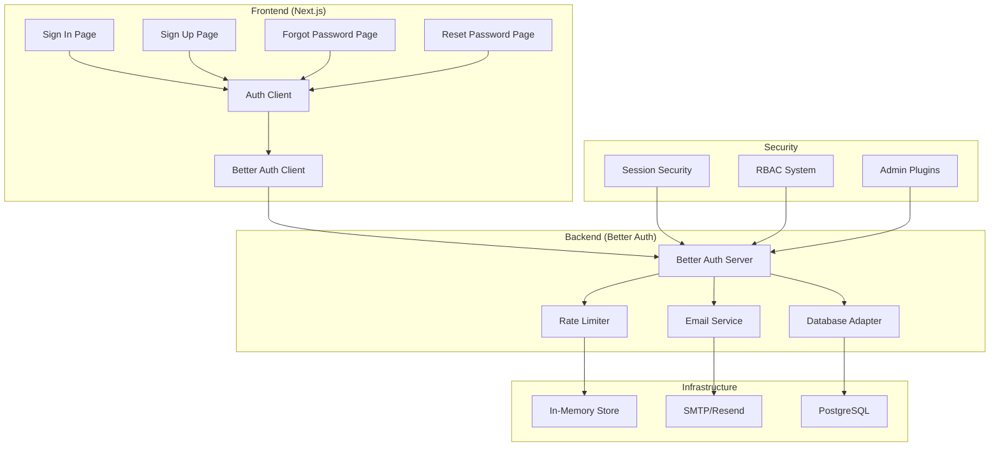
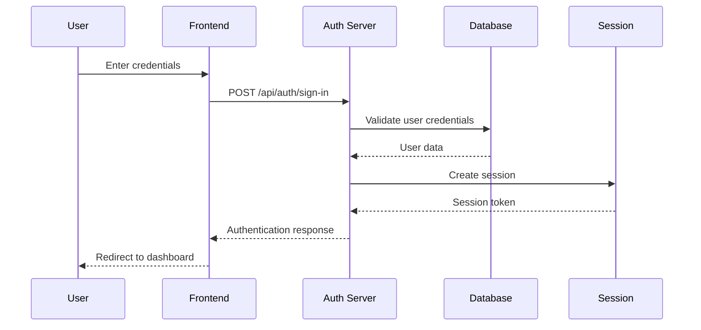
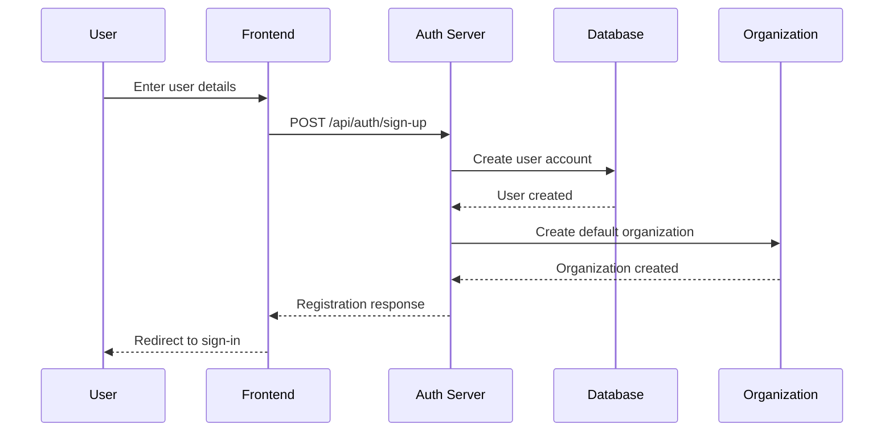
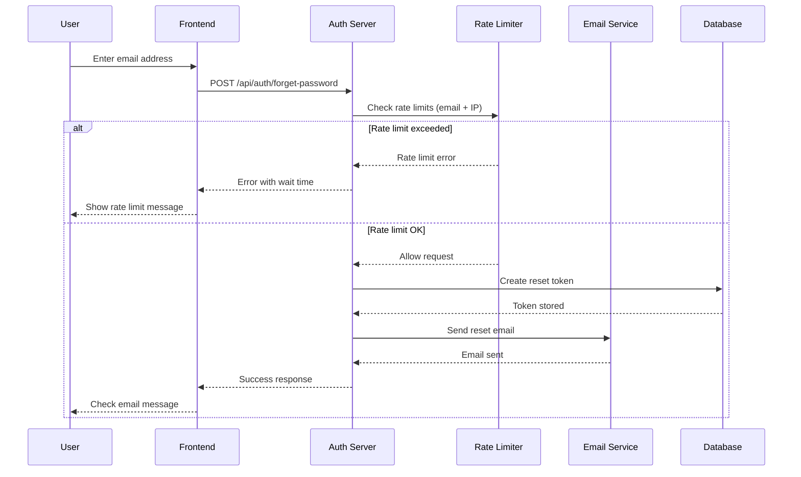
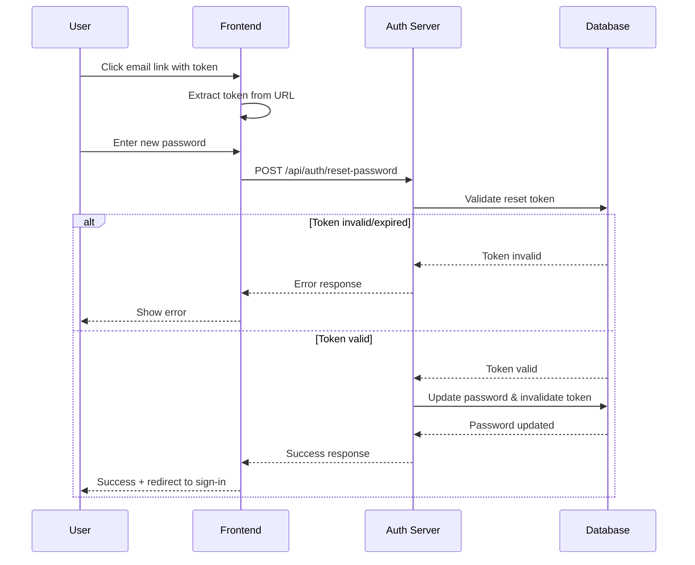
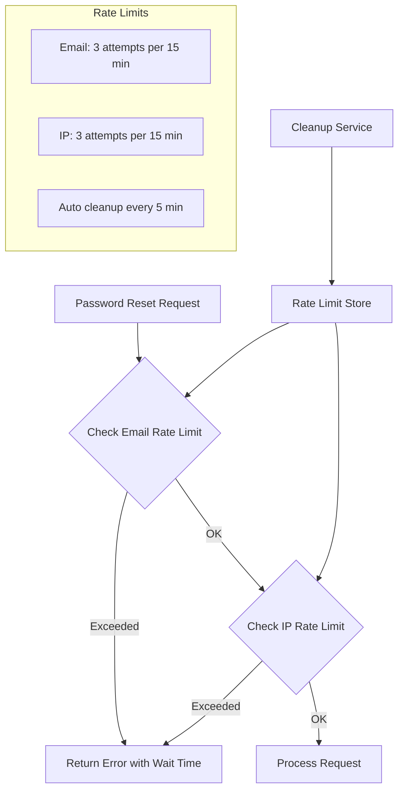
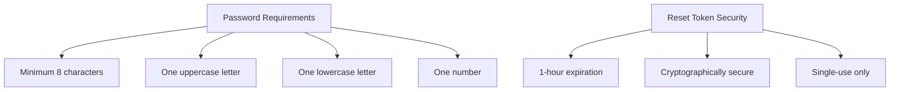
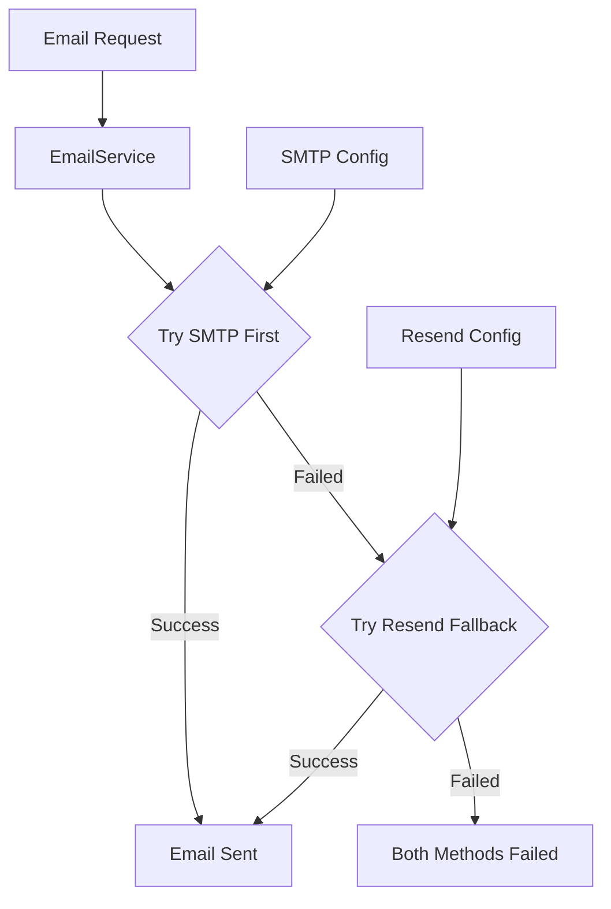
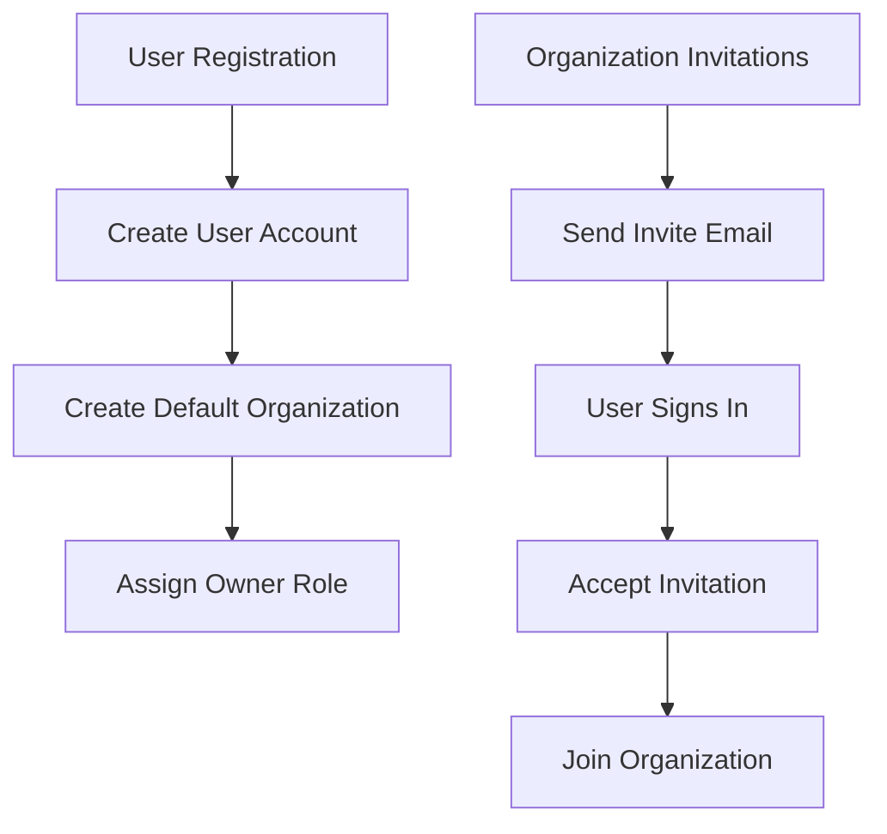

# Authentication System Documentation

## Overview

Supercheck uses **Better Auth** as its authentication framework, providing a secure, feature-rich authentication system with email/password authentication, organization management, and comprehensive security features.

## Architecture

## Authentication Flow

### Sign In Flow

### Sign Up Flow

### Forgot Password Flow

### Reset Password Flow

## Security Features

### Rate Limiting

**Rate Limiting Rules:**
- **Password Reset**: 3 attempts per email per 15 minutes
- **IP Protection**: 3 attempts per IP address per 15 minutes
- **Dual Protection**: Both email and IP limits apply simultaneously
- **Automatic Cleanup**: Expired entries removed every 5 minutes

### Password Security

### Session Management

**Session Features:**
- **Duration**: 7 days with automatic renewal
- **Update Age**: 24 hours (session refreshes daily)
- **Security**: Secure HTTP-only cookies
- **IP Tracking**: Optional IP consistency checks

## User Interface

### Sign-In Page Features

- **Email/Password Authentication**
- **Password Visibility Toggle** 
- **"Forgot Password?" Link**
- **Organization Invitation Support**
- **Notification Context Awareness**
- **Responsive Design** with brand integration

### Forgot Password Page Features

- **Email Input with Validation**
- **Success State** with clear instructions
- **Rate Limiting Error Handling**
- **Retry Option** if email not received
- **Back to Sign-In Navigation**

### Reset Password Page Features

- **Token Validation** from URL parameters
- **Strong Password Requirements** with real-time validation
- **Password Confirmation** matching
- **Password Visibility Toggles** for both fields
- **Success State** with auto-redirect
- **Comprehensive Error Handling**

## Email Integration

### Email Service Architecture

### Email Templates

**Password Reset Email Features:**
- **Professional HTML Template** with inline CSS
- **Plain Text Fallback** for compatibility
- **Clear Call-to-Action** button
- **Security Warnings** about expiration and unauthorized requests
- **Branded Design** consistent with application
- **1-Hour Expiration Notice**

### Email Configuration

**Environment Variables:**
- **SMTP**: `SMTP_HOST`, `SMTP_PORT`, `SMTP_USER`, `SMTP_PASSWORD`, `SMTP_SECURE`, `SMTP_FROM_EMAIL`
- **Resend**: `RESEND_API_KEY`, `RESEND_FROM_EMAIL`
- **Control**: `SMTP_ENABLED`, `RESEND_ENABLED`

## Organization Integration

### Multi-Tenant Architecture

**Organization Features:**
- **Automatic Organization Creation** on user registration
- **Role-Based Access Control** (Owner, Admin, Editor, Viewer)
- **Organization Invitations** via email
- **Multi-Organization Support** per user
- **Organization Switching** in UI

## API Integration

### Better Auth Endpoints

**Available Endpoints:**
- `POST /api/auth/sign-in` - User authentication
- `POST /api/auth/sign-up` - User registration  
- `POST /api/auth/sign-out` - Session termination
- `POST /api/auth/forget-password` - Password reset request
- `POST /api/auth/reset-password` - Password reset execution
- `GET /api/auth/session` - Current session info

### Client SDK Integration

**Available Methods:**
- `signIn.email({ email, password })` - Email/password sign-in
- `signUp.email({ email, password, name })` - User registration
- `forgetPassword({ email, redirectTo })` - Password reset request
- `resetPassword({ newPassword, token })` - Password reset
- `signOut()` - Session termination
- `useSession()` - React hook for session state

## Database Schema

### Authentication Tables

**Core Tables:**
- **user**: User accounts with email, hashed passwords, roles
- **session**: Active user sessions with tokens and metadata
- **account**: OAuth and email/password account linkings
- **verification**: Password reset tokens and email verifications

**Organization Tables:**
- **organization**: Organization entities with metadata
- **member**: User-organization relationships with roles
- **invitation**: Pending organization invitations

## Security Best Practices

### Implementation Security

✅ **Password Storage**: Secure bcrypt hashing with salt
✅ **Token Security**: Cryptographically secure random tokens
✅ **Session Security**: HTTP-only, secure cookies
✅ **Rate Limiting**: Multi-layer abuse prevention
✅ **Email Security**: Professional templates with warnings
✅ **Input Validation**: Client and server-side validation
✅ **Error Handling**: Secure error messages without information leakage

### Production Considerations

**Required Security Setup:**
1. **Change Default Secrets**: Generate strong `BETTER_AUTH_SECRET`
2. **Configure Email**: Set up SMTP or Resend for production email delivery
3. **Environment Variables**: Secure all email credentials
4. **HTTPS Only**: Ensure all authentication happens over HTTPS
5. **Rate Limiting**: Monitor and adjust rate limits based on usage patterns
6. **Session Monitoring**: Implement session monitoring and suspicious activity detection

## Monitoring and Logging

### Security Events Logged

- **Authentication Attempts**: Success/failure with IP addresses
- **Password Reset Requests**: Email addresses and IP addresses
- **Rate Limiting Events**: Blocked requests with timing
- **Session Events**: Creation, expiration, and termination
- **Email Delivery**: Success/failure status for password resets

### Metrics to Monitor

- **Authentication Success Rate**
- **Password Reset Request Volume**  
- **Rate Limiting Trigger Frequency**
- **Email Delivery Success Rate**
- **Session Duration Patterns**

## Future Enhancements

### Planned Features

- **Two-Factor Authentication (2FA)** integration
- **OAuth Provider Support** (Google, GitHub, etc.)
- **Advanced Session Security** with device tracking
- **Enhanced Rate Limiting** with Redis backend
- **Audit Logging** for compliance requirements
- **Password Policy Configuration** via environment variables

### Scalability Considerations

- **Redis Rate Limiting**: Move from in-memory to Redis for multi-instance deployments
- **Email Queue**: Implement email queuing for high-volume scenarios  
- **Session Storage**: Consider Redis session storage for better scalability
- **Monitoring Integration**: Add metrics collection and alerting