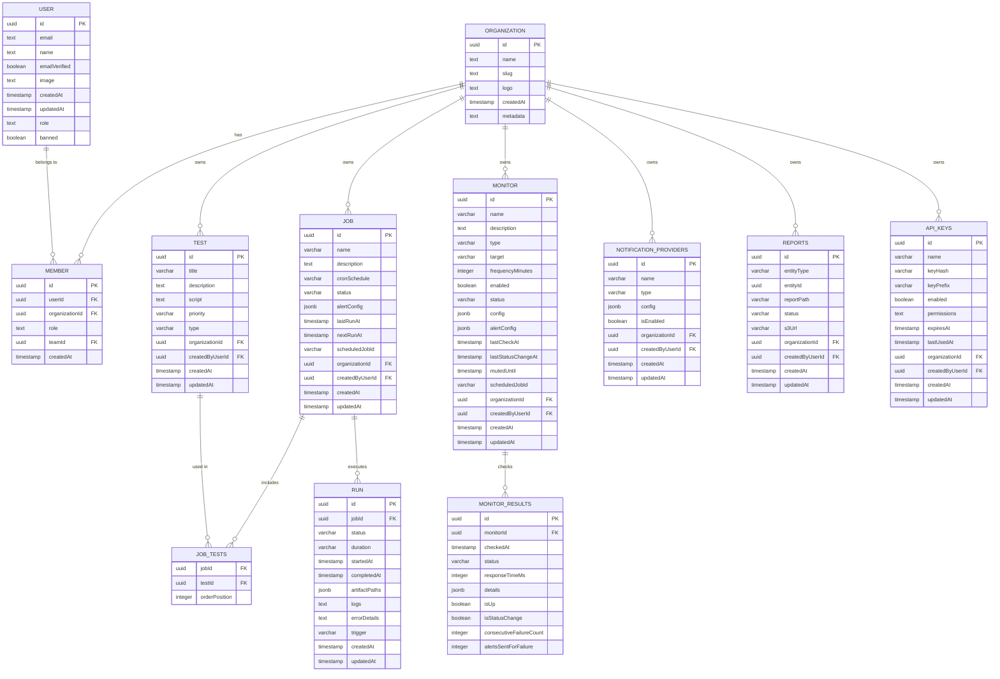
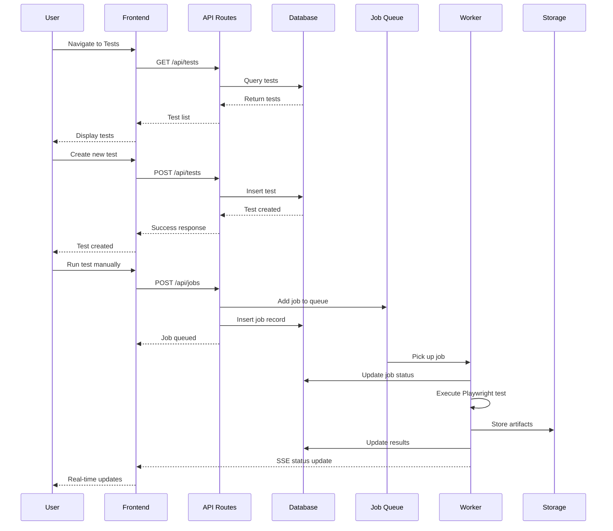
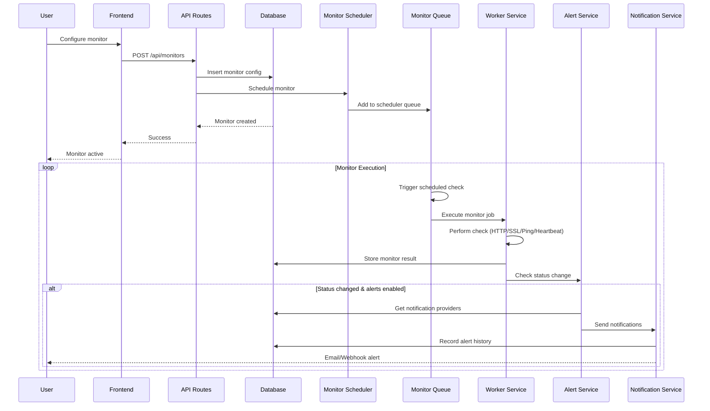
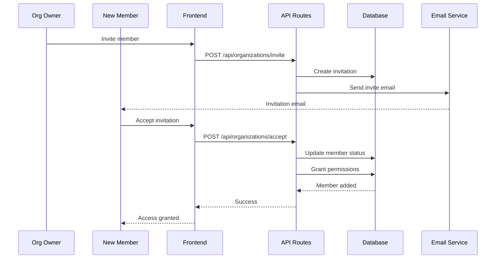
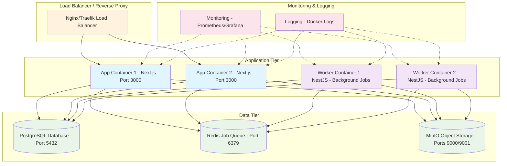
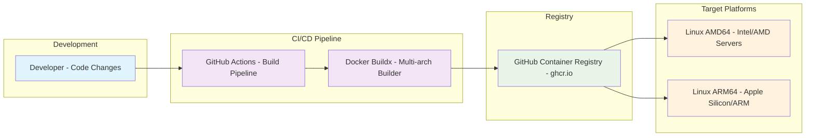

# Supercheck Platform Overview

## Platform Summary
**Supercheck** is a comprehensive end-to-end testing and monitoring platform engineered with a distributed, cloud-native architecture designed for enterprise scalability and reliability.

---

## System Architecture

### High-Level Architecture

```mermaid
graph TB
    subgraph frontend ["Frontend Layer"]
        FE[Frontend Service - Next.js]
        UI[User Interface]
        API[REST APIs]
        JSCHED[Job Scheduler]
        MSCHED[Monitor Scheduler]
        DB_MIG[DB Migrations]
        
        FE --> UI
        FE --> API
        FE --> JSCHED
        FE --> MSCHED
        FE --> DB_MIG
    end
    
    subgraph processing ["Processing Layer"]
        WS[Worker Service - NestJS]
        TE[Playwright Tests]
        ME[HTTP/SSL/Ping/Heartbeat]
        QP[BullMQ Processors]
        CM[Resource Limits]
        NS[Alert Service]
        
        WS --> TE
        WS --> ME
        WS --> QP
        WS --> CM
        WS --> NS
    end
    
    subgraph queue ["Queue Layer"]
        RD[(Redis - BullMQ)]
        JQ[Test/Job Execution]
        MQ[Monitor Execution]
        SQ[Job/Monitor Schedulers]
        NQ[Heartbeat Notifications]
        
        RD --> JQ
        RD --> MQ
        RD --> SQ
        RD --> NQ
    end
    
    subgraph storage ["Storage Layer"]
        PG[(PostgreSQL Database)]
        MO[(MinIO Object Storage)]
        TABLES[Tests/Jobs/Monitors/Results]
        ARTS[Reports/Traces/Screenshots]
        
        PG --> TABLES
        MO --> ARTS
    end
    
    FE <--> WS
    FE <--> PG
    FE <--> RD
    WS <--> RD
    WS <--> PG
    WS <--> MO
    
    classDef frontend fill:#e1f5fe
    classDef worker fill:#f3e5f5
    classDef queue fill:#fff3e0
    classDef storage fill:#e8f5e8
    
    class FE,UI,API,JSCHED,MSCHED,DB_MIG frontend
    class WS,TE,ME,QP,CM,NS worker
    class RD,JQ,MQ,SQ,NQ queue
    class PG,MO,TABLES,ARTS storage
```



### Component Breakdown

#### Frontend Service (Next.js)
- **Location**: `/app`
- **Responsibilities**:
  - User interface and experience
  - API routes for data operations
  - Job scheduling and management
  - Database migrations
  - Real-time updates via SSE

#### Worker Service (NestJS)
- **Location**: `/worker`
- **Responsibilities**:
  - Playwright test execution
  - Parallel processing with capacity management
  - Queue job processing
  - Test artifact generation

#### Infrastructure Layer
- **PostgreSQL**: Primary database with Drizzle ORM
- **Redis**: Job queuing with BullMQ
- **MinIO**: S3-compatible storage for test artifacts

---

## Core Platform Features

### End-to-End Testing Capabilities
- Playwright-based browser automation
- Parallel test execution
- Configurable timeouts and retries
- Real-time status updates
- Comprehensive test reports

### Job Scheduling & Management
- Cron-based scheduling
- Manual job triggers
- API key authentication
- Job history tracking
- Queue-based execution

### Comprehensive Monitoring System
- HTTP/HTTPS endpoint monitoring
- Heartbeat monitoring
- Response time metrics
- Uptime calculations
- Availability tracking

### Enterprise Alerting & Notifications
- Multi-channel notifications (email, webhooks)
- Rule-based alerting
- Custom notification conditions
- Provider quota management

### Multi-Tenant Architecture
- Organization-based isolation
- Member management
- Role-based access control
- Secure API access

---

## Technology Stack

### Backend Technologies
- **Next.js 14**: Full-stack React framework
- **NestJS**: Scalable Node.js framework
- **Drizzle ORM**: Type-safe database operations
- **Better Auth**: Authentication system
- **BullMQ**: Job queue management

### Frontend Technologies
- **React 18**: Component-based UI
- **TypeScript**: Type safety
- **Tailwind CSS**: Utility-first styling
- **Server-Sent Events**: Real-time updates

### Infrastructure
- **PostgreSQL**: Relational database
- **Redis**: In-memory data store
- **MinIO**: Object storage
- **Docker**: Containerization
- **Playwright**: Browser automation

---

## Database Schema Design

### Entity Relationship Diagram



---

## System Data Flow

### Test Execution Flow

```mermaid
flowchart LR
    A[User Trigger - Manual/API/Schedule] --> B[Test/Job API - Next.js Routes]
    B --> C[Capacity Verification - Queue Stats Check]
    C --> D[Job Creation - Database Insert]
    D --> E[Queue Addition - BullMQ Redis]
    E --> F[Test Execution Processor - NestJS Worker]
    F --> G[Execution Service - Test Orchestration]
    G --> H[Playwright Runner - Browser Automation]
    H --> I[Report Generation - HTML Reports/Traces]
    I --> J[Artifact Upload - MinIO S3 Storage]
    J --> K[Database Update - Status & Results]
    K --> L[Redis Publish - Status Events]
    L --> M[SSE Stream - Real-time Updates]
    
    subgraph frontend ["Frontend Layer"]
        A
        B
        M
    end
    
    subgraph validation ["Validation Layer"]
        C
        D
    end
    
    subgraph queue ["Queue Layer"]
        E
        F
    end
    
    subgraph exec ["Execution Layer"]
        G
        H
        I
    end
    
    subgraph storage ["Storage Layer"]
        J
        K
        L
    end
    
    classDef frontend fill:#e1f5fe
    classDef validation fill:#fff8e1
    classDef queue fill:#fff3e0
    classDef exec fill:#f3e5f5
    classDef storage fill:#e8f5e8
    
    class A,B,M frontend
    class C,D validation
    class E,F queue
    class G,H,I exec
    class J,K,L storage
```



### Monitoring Flow

```mermaid
flowchart LR
    A[User/API Trigger - Manual/Schedule] --> B[Monitor API - Next.js Routes]
    B --> C[Monitor Service - Create/Update Config]
    C --> D[Monitor Scheduler - Schedule Setup]
    D --> E[Monitor Scheduler Queue - BullMQ Redis]
    E --> F[Monitor Scheduler Processor - NestJS Worker]
    F --> G[Add Execution Job - One-time Job]
    G --> H[Monitor Execution Queue - BullMQ Redis]
    H --> I[Monitor Processor - NestJS Worker]
    I --> J[Monitor Service - Execute Monitor]
    J --> K{Monitor Type}
    K -->|HTTP/Website| L[HTTP Request - Status/Response/SSL Check]
    K -->|Ping Host| M[ICMP Ping - Platform Detection]
    K -->|Port Check| N[TCP/UDP Connection - Socket Test]
    K -->|Heartbeat| O[Missed Ping Check - Grace Period Logic]
    L --> P[Result Processing - Status Determination]
    M --> P
    N --> P
    O --> P
    P --> Q[Save Monitor Result - Database Update]
    Q --> R[Monitor Status Update - Last Check Time]
    R --> S[Status Change Detection - Previous vs Current]
    S --> T[Threshold Evaluation - Consecutive Failures/Success]
    T --> U[Monitor Alert Service - Notification Logic]
    U --> V[Notification Service - Multi-Provider Dispatch]
    V --> W[Provider Delivery - Email/Slack/Webhook/etc]
    W --> X[Alert History - Audit Trail]
    
    subgraph frontend ["Frontend Layer"]
        A
        B
        C
    end
    
    subgraph schedule ["Scheduling Layer"]
        D
        E
        F
        G
    end
    
    subgraph exec ["Execution Layer"]
        H
        I
        J
        K
        L
        M
        N
        O
    end
    
    subgraph analysis ["Analysis Layer"]
        P
        Q
        R
        S
        T
    end
    
    subgraph delivery ["Notification Layer"]
        U
        V
        W
        X
    end
    
    classDef frontend fill:#e1f5fe
    classDef schedule fill:#fff3e0
    classDef exec fill:#f3e5f5
    classDef analysis fill:#e8f5e8
    classDef delivery fill:#fce4ec
    
    class A,B,C frontend
    class D,E,F,G schedule
    class H,I,J,K,L,M,N,O exec
    class P,Q,R,S,T analysis
    class U,V,W,X delivery
```



---

## Key User Workflows

### 1. **Creating and Running a Test**



### 2. **Setting Up Monitoring**



### 3. **Organization Management**



---

## Scalability & Performance Architecture

### Horizontal Scaling
- **Worker Scaling**: Multiple NestJS workers
- **Queue Distribution**: Redis-based job distribution
- **Capacity Management**: Configurable limits
- **Resource Isolation**: Container-based deployment

### Performance Features
- **Parallel Execution**: Multiple tests simultaneously
- **Artifact Caching**: MinIO with presigned URLs
- **Database Optimization**: Indexed queries
- **Memory Management**: Configurable timeouts

---

## Security Architecture

### Authentication & Authorization
- Better Auth integration
- Session management
- API key authentication
- Role-based access control

### Infrastructure Security
- Redis authentication
- Database connection pooling
- Environment variable management
- Secure artifact storage

---

## Production Deployment Architecture

### Container Deployment Diagram



### Multi-Architecture Support



### Production Deployment Features
- **Registry**: GitHub Container Registry
- **Platforms**: Linux AMD64/ARM64
- **Health Checks**: Service readiness validation
- **Migration Handling**: Automatic database updates
- **Scaling**: Horizontal container scaling
- **Load Balancing**: Multi-instance load distribution

---

## Operational Metrics & Analytics

### Test Execution Metrics
- Test success/failure rates
- Execution duration trends
- Resource utilization
- Queue processing times

### Monitoring Metrics
- Endpoint availability
- Response time trends
- Alert frequency
- Notification delivery rates

### System Metrics
- Worker capacity utilization
- Database performance
- Queue depth analysis
- Storage usage patterns

---

## Platform Demonstration Areas

1. **System Dashboard**: Comprehensive platform status and activity overview
2. **Test Development**: Interactive test creation and configuration
3. **Execution Monitoring**: Real-time job processing and status tracking
4. **Service Monitoring**: Uptime and performance monitoring configuration
5. **Alert Configuration**: Multi-channel notification setup and management
6. **Analytics & Reporting**: Detailed test results and monitoring analytics
7. **Organization Management**: Multi-tenant administration and user management
8. **API Integration**: Programmatic platform access and automation examples

---

## Quick Start Guide

```bash
# Production deployment (default)
export DOMAIN=your-domain.com
export REDIS_PASSWORD=your-secure-redis-password
docker-compose up -d

# View logs
docker-compose logs -f app
docker-compose logs -f worker

# Development setup (local)
cd app && npm run dev
cd worker && npm run dev

# Build multi-arch images
./scripts/docker-images.sh
```

---

## Documentation & Support Resources

- **Source Repository**: Complete platform source code and development resources
- **Container Registry**: Pre-built multi-architecture deployment images
- **Technical Documentation**: Comprehensive deployment and configuration guides
- **API Documentation**: Complete OpenAPI specifications and integration examples