# Database Schema Design

## Entity Relationship Diagram

This diagram represents the complete database schema for the Supercheck application, based on the main app schema.

> **Updated:** January 2025 - Table names corrected to match actual schema implementation (camelCase naming convention)

```mermaid
erDiagram
    USER {
        uuid id PK
        text name
        text email
        boolean emailVerified
        text image
        timestamp createdAt
        timestamp updatedAt
        text role
        boolean banned
        text banReason
        timestamp banExpires
    }
    
    ORGANIZATION {
        uuid id PK
        text name
        text slug
        text logo
        timestamp createdAt
        text metadata
    }
    
    MEMBER {
        uuid id PK
        uuid organizationId FK
        uuid userId FK
        text role
        timestamp createdAt
    }
    
    INVITATION {
        uuid id PK
        uuid organizationId FK
        text email
        text role
        text status
        timestamp expiresAt
        uuid inviterId FK
        text selectedProjects
    }
    
    PROJECTS {
        uuid id PK
        uuid organizationId FK
        varchar name
        varchar slug
        text description
        boolean isDefault
        varchar status
        timestamp createdAt
        timestamp updatedAt
    }
    
    projectMembers {
        uuid id PK
        uuid userId FK
        uuid projectId FK
        varchar role
        timestamp createdAt
    }
    
    TESTS {
        uuid id PK
        uuid organizationId FK
        uuid projectId FK
        uuid createdByUserId FK
        varchar title
        text description
        text script
        varchar priority
        varchar type
        timestamp createdAt
        timestamp updatedAt
    }
    
    JOBS {
        uuid id PK
        uuid organizationId FK
        uuid projectId FK
        uuid createdByUserId FK
        varchar name
        text description
        varchar cronSchedule
        varchar status
        jsonb alertConfig
        timestamp lastRunAt
        timestamp nextRunAt
        varchar scheduledJobId
        timestamp createdAt
        timestamp updatedAt
    }
    
    jobTests {
        uuid jobId FK
        uuid testId FK
        integer orderPosition
    }
    
    RUNS {
        uuid id PK
        uuid jobId FK
        uuid projectId FK
        varchar status
        varchar duration
        timestamp startedAt
        timestamp completedAt
        jsonb artifactPaths
        text logs
        text errorDetails
        varchar trigger
        timestamp createdAt
        timestamp updatedAt
    }
    
    MONITORS {
        uuid id PK
        uuid organizationId FK
        uuid projectId FK
        uuid createdByUserId FK
        varchar name
        text description
        varchar type
        varchar target
        integer frequencyMinutes
        boolean enabled
        varchar status
        jsonb config
        jsonb alertConfig
        timestamp lastCheckAt
        timestamp lastStatusChangeAt
        timestamp mutedUntil
        varchar scheduledJobId
        timestamp createdAt
        timestamp updatedAt
    }
    
    monitorResults {
        uuid id PK
        uuid monitorId FK
        timestamp checkedAt
        varchar status
        integer responseTimeMs
        jsonb details
        boolean isUp
        boolean isStatusChange
        integer consecutiveFailureCount
        integer alertsSentForFailure
    }
    
    TAGS {
        uuid id PK
        uuid organizationId FK
        uuid projectId FK
        uuid createdByUserId FK
        varchar name
        varchar color
        timestamp createdAt
        timestamp updatedAt
    }
    
    monitorTags {
        uuid monitorId FK
        uuid tagId FK
        timestamp assignedAt
    }
    
    testTags {
        uuid testId FK
        uuid tagId FK
        timestamp assignedAt
    }
    
    notificationProviders {
        uuid id PK
        uuid organizationId FK
        uuid projectId FK
        uuid createdByUserId FK
        varchar name
        varchar type
        jsonb config
        boolean isEnabled
        timestamp createdAt
        timestamp updatedAt
    }
    
    monitorNotificationSettings {
        uuid monitorId FK
        uuid notificationProviderId FK
        timestamp createdAt
    }
    
    jobNotificationSettings {
        uuid jobId FK
        uuid notificationProviderId FK
        timestamp createdAt
    }
    
    REPORTS {
        uuid id PK
        uuid organizationId FK
        uuid createdByUserId FK
        varchar entityType
        uuid entityId
        varchar reportPath
        varchar status
        varchar s3Url
        timestamp createdAt
        timestamp updatedAt
    }
    
    ALERTS {
        uuid id PK
        uuid organizationId FK
        uuid monitorId FK
        boolean enabled
        jsonb notificationProviders
        boolean alertOnFailure
        boolean alertOnRecovery
        boolean alertOnSslExpiration
        boolean alertOnSuccess
        boolean alertOnTimeout
        integer failureThreshold
        integer recoveryThreshold
        text customMessage
        timestamp createdAt
        timestamp updatedAt
    }
    
    alertHistory {
        uuid id PK
        text message
        varchar type
        varchar target
        varchar targetType
        uuid monitorId FK
        uuid jobId FK
        varchar provider
        varchar status
        timestamp sentAt
        text errorMessage
    }
    
    apikey {
        uuid id PK
        text name
        text start
        text prefix
        text key
        uuid userId FK
        uuid jobId FK
        uuid projectId FK
        text refillInterval
        text refillAmount
        timestamp lastRefillAt
        boolean enabled
        boolean rateLimitEnabled
        text rateLimitTimeWindow
        text rateLimitMax
        text requestCount
        text remaining
        timestamp lastRequest
        timestamp expiresAt
        timestamp createdAt
        timestamp updatedAt
        text permissions
        text metadata
    }
    
    SESSION {
        uuid id PK
        timestamp expiresAt
        text token
        timestamp createdAt
        timestamp updatedAt
        text ipAddress
        text userAgent
        uuid userId FK
        uuid activeOrganizationId FK
        uuid activeProjectId FK
        text impersonatedBy
    }
    
    ACCOUNT {
        uuid id PK
        text accountId
        text providerId
        uuid userId FK
        text accessToken
        text refreshToken
        text idToken
        timestamp accessTokenExpiresAt
        timestamp refreshTokenExpiresAt
        text scope
        text password
        timestamp createdAt
        timestamp updatedAt
    }
    
    VERIFICATION {
        uuid id PK
        text identifier
        text value
        timestamp expiresAt
        timestamp createdAt
        timestamp updatedAt
    }
    
    auditLogs {
        uuid id PK
        uuid userId FK
        uuid organizationId FK
        varchar action
        jsonb details
        timestamp createdAt
    }
    
    NOTIFICATIONS {
        uuid id PK
        uuid userId FK
        varchar type
        jsonb content
        varchar status
        timestamp sentAt
        timestamp createdAt
    }
    
    projectVariables {
        uuid id PK
        uuid projectId FK
        varchar key
        text value
        text encryptedValue
        boolean isSecret
        text description
        uuid createdByUserId FK
        timestamp createdAt
        timestamp updatedAt
    }
    
    %% Core Relationships
    USER ||--o{ MEMBER : "belongs to"
    USER ||--o{ INVITATION : "invites"
    USER ||--o{ projectMembers : "member of"
    USER ||--o{ SESSION : "has"
    USER ||--o{ ACCOUNT : "linked to"
    USER ||--o{ apikey : "owns"
    USER ||--o{ NOTIFICATIONS : "receives"
    USER ||--o{ auditLogs : "performs"
    USER ||--o{ projectVariables : "creates"
    
    ORGANIZATION ||--o{ MEMBER : "has members"
    ORGANIZATION ||--o{ INVITATION : "has invitations"
    ORGANIZATION ||--o{ PROJECTS : "contains"
    ORGANIZATION ||--o{ TESTS : "owns"
    ORGANIZATION ||--o{ JOBS : "owns"
    ORGANIZATION ||--o{ MONITORS : "owns"
    ORGANIZATION ||--o{ TAGS : "owns"
    ORGANIZATION ||--o{ notificationProviders : "configures"
    ORGANIZATION ||--o{ REPORTS : "generates"
    ORGANIZATION ||--o{ ALERTS : "manages"
    ORGANIZATION ||--o{ auditLogs : "tracks"
    
    PROJECTS ||--o{ projectMembers : "has members"
    PROJECTS ||--o{ TESTS : "contains"
    PROJECTS ||--o{ JOBS : "contains"
    PROJECTS ||--o{ MONITORS : "contains"
    PROJECTS ||--o{ TAGS : "organizes"
    PROJECTS ||--o{ notificationProviders : "uses"
    PROJECTS ||--o{ RUNS : "executes"
    PROJECTS ||--o{ apikey : "accesses"
    PROJECTS ||--o{ projectVariables : "contains"
    
    %% Test & Job Relationships
    JOBS ||--o{ jobTests : "includes"
    TESTS ||--o{ jobTests : "used in"
    JOBS ||--o{ RUNS : "executes"
    JOBS ||--o{ alertHistory : "triggers"
    JOBS ||--o{ jobNotificationSettings : "notifies via"
    JOBS ||--o{ apikey : "accessed by"
    
    %% Monitor Relationships
    MONITORS ||--o{ monitorResults : "produces"
    MONITORS ||--o{ ALERTS : "configured for"
    MONITORS ||--o{ alertHistory : "triggers"
    MONITORS ||--o{ monitorNotificationSettings : "notifies via"
    MONITORS ||--o{ monitorTags : "tagged with"
    
    %% Tag Relationships
    TAGS ||--o{ monitorTags : "applied to monitors"
    TAGS ||--o{ testTags : "applied to tests"
    TESTS ||--o{ testTags : "tagged with"
    
    %% Notification Relationships
    notificationProviders ||--o{ monitorNotificationSettings : "used by monitors"
    notificationProviders ||--o{ jobNotificationSettings : "used by jobs"
    
    %% Session & Auth Relationships
    SESSION ||--o{ ORGANIZATION : "active org"
    SESSION ||--o{ PROJECTS : "active project"
```

## Schema Notes

### Key Features
- **Multi-tenant Architecture**: Organizations contain projects, users are members of organizations
- **Project-based Access Control**: Users can have different roles in different projects
- **Variable Management**: Project-scoped variables and secrets with encryption support
- **Comprehensive Monitoring**: HTTP/website/ping/port/heartbeat monitoring with results tracking
- **Test Automation**: Tests can be grouped into jobs with cron scheduling
- **Flexible Notifications**: Multiple notification providers (email, Slack, webhooks, etc.)
- **Audit Trail**: Complete audit logging of user actions
- **API Access**: Fine-grained API key management with rate limiting

### Role Hierarchy
- **Organization Level**: `org_owner`, `org_admin`, `project_admin`, `project_editor`, `project_viewer`
- **Project Level**: `project_admin`, `project_editor`, `project_viewer`

### Data Types
- All IDs use UUID for better security and distribution
- JSON fields for flexible configuration storage
- Comprehensive timestamp tracking for audit purposes
