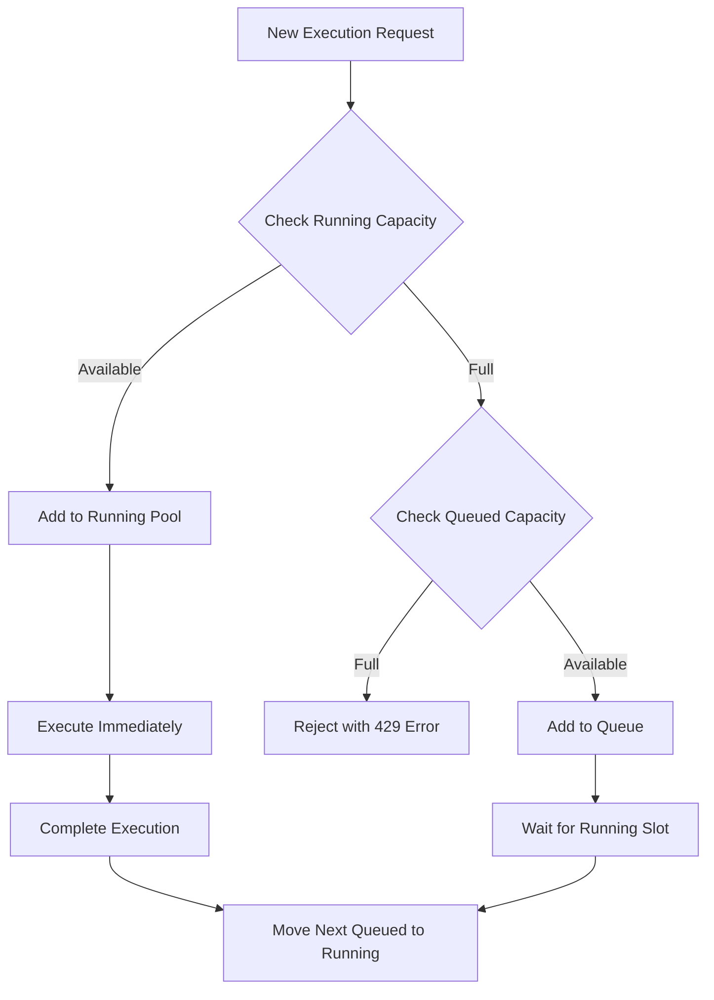

# Parallel Execution and Capacity Management

This document outlines Supertest's sophisticated parallel execution system that provides real-time visibility into test and job execution while enforcing configurable capacity limits to ensure system stability and optimal resource utilization.

## Overview

The application implements a multi-level capacity management system that controls how many tests and jobs can run simultaneously, ensuring system stability while providing optimal resource utilization.

## Core Concepts

### 1. Execution Types

The system distinguishes between different types of executions:

- **Single Test Execution**: Individual test runs from the Playground
- **Job Execution**: Multiple tests run as part of a job
- **Parallel Executions**: Each test or job run counts as a separate "execution"

### 2. Capacity Limits

The system enforces two primary limits:

- **Running Capacity (default: 5)**: Maximum number of concurrent executions that can run simultaneously
- **Queued Capacity (default: 50)**: Maximum number of executions that can be queued when running capacity is full

### 3. Execution Flow

## Implementation Details

### 1. Capacity Configuration Architecture

The system uses environment-based capacity configuration:

**Running Capacity Management:**
- Default running capacity set to 5 concurrent executions
- Configurable through RUNNING_CAPACITY environment variable  
- Enforced at both API and worker levels for consistency

**Queue Capacity Limits:**
- Default queued capacity set to 50 pending executions
- Configurable through QUEUED_CAPACITY environment variable
- Hard limit enforced at API layer with HTTP 429 responses when exceeded

**Environment Integration:**
- All capacity limits are environment-configurable for different deployment scenarios
- Production deployments can adjust limits based on server resources
- Graceful degradation when capacity limits are reached

### 2. Queue Statistics Service Architecture

The system provides comprehensive real-time queue monitoring:

**Statistics Interface:**
- Running count and capacity tracking
- Queued count and capacity monitoring  
- Real-time updates through Redis integration
- Comprehensive queue health metrics

**Redis Integration:**
- Direct Redis connection for queue statistics
- BullMQ key pattern analysis for accurate counts
- Parallel processing for multiple queue monitoring
- Connection optimization with timeout handling

**Queue Monitoring Strategy:**
- Active job counting through Redis list operations
- In-progress execution tracking via job metadata
- Processing state detection through BullMQ patterns
- Error-resilient statistics collection

**Calculation Strategy:**
- Multi-phase count aggregation for accurate statistics
- Active and processing job differentiation
- Waiting and delayed job tracking for queue depth
- Capacity-aware calculation logic for running vs queued classification

**Queue State Analysis:**
- WAITING jobs tracked from Redis list structures
- DELAYED jobs monitored through sorted sets
- Running slot calculation based on current capacity utilization
- Dynamic queued count based on available running capacity

**Error Handling:**
- Graceful degradation on Redis connection failures
- Individual job error isolation to prevent statistics failure
- Comprehensive error logging for debugging capacity issues
- Fallback mechanisms for partial statistics collection

**Resource Management:**
- Automatic Redis connection cleanup
- Connection pooling for efficiency
- Graceful handling of connection termination
- Silent error handling for cleanup operations

### 3. Capacity Enforcement Architecture

#### A. API Layer Enforcement

The API layer provides the first line of capacity enforcement:

**Pre-submission Verification:**
- Verifies queue capacity before accepting new jobs
- Throws HTTP 429 errors when queued capacity is exceeded
- Allows immediate execution when running capacity is available

**Capacity Check Strategy:**
- Two-phase verification (running capacity, then queued capacity)
- Running capacity priority for immediate execution
- Conservative error handling when capacity cannot be verified

**Error Handling:**
- Specific error messages for capacity limit violations
- Fallback protection when Redis is unavailable
- Comprehensive logging for capacity enforcement decisions

#### B. Worker Layer Enforcement

Workers provide secondary capacity enforcement:

**Pre-processing Verification:**
- Workers check capacity before processing jobs
- Only processes jobs when within running capacity
- Prevents over-subscription of worker resources

**Processing Decision Logic:**
- Simple capacity comparison for processing decisions
- Fail-safe behavior when capacity checks fail
- Integration with queue statistics for real-time decisions

### 4. UI Components Architecture

#### A. Real-time Capacity Display

The user interface provides live capacity monitoring:

**Parallel Threads Component:**
- Real-time capacity statistics display
- Progress bars for running and queued capacity
- Visual indicators for capacity utilization levels

**Statistics Integration:**
- Uses custom hooks for queue statistics
- Automatic refresh for live updates
- Loading states and error handling

**Progress Visualization:**
- Running capacity progress calculation
- Queued capacity utilization display
- Color-coded indicators for capacity states

#### B. Server-Sent Events (SSE) Integration

Real-time updates through SSE connections:

**Live Statistics Streaming:**
- Continuous queue statistics updates
- Real-time capacity monitoring
- Efficient client-server communication

**Update Frequency:**
- Configurable update intervals
- On-demand updates for capacity changes
- Efficient bandwidth usage for statistics

## Advanced Features

### 1. Capacity Monitoring and Alerting

**Queue Health Monitoring:**
- Continuous monitoring of queue depth
- Capacity utilization tracking
- Performance metrics collection

**Alerting Integration:**
- Capacity threshold alerts
- Queue backup notifications
- Performance degradation warnings

### 2. Dynamic Scaling Considerations

**Horizontal Scaling:**
- Multiple worker instances supported
- Distributed capacity management
- Load balancing across workers

**Vertical Scaling:**
- Resource-based capacity adjustment
- Memory and CPU utilization monitoring
- Dynamic capacity scaling based on system resources

### 3. Performance Optimization

**Redis Performance:**
- Optimized Redis queries for statistics
- Connection pooling for efficiency
- Minimal Redis operations for capacity checks

**Statistics Caching:**
- Short-term caching of capacity statistics
- Reduced Redis query frequency
- Balance between accuracy and performance

## Production Configuration

### Resource Planning

**Capacity Sizing:**
- Running capacity based on server resources
- Queue capacity for peak load handling
- Memory requirements for concurrent executions

**Performance Tuning:**
- Redis optimization for queue operations
- Worker process optimization
- Database connection pooling

### Monitoring and Observability

**Metrics Collection:**
- Capacity utilization metrics
- Queue depth monitoring
- Execution duration tracking

**Performance Monitoring:**
- Queue processing time
- Capacity enforcement effectiveness
- System resource utilization

### Troubleshooting

**Common Issues:**
- Capacity limit configuration
- Redis connection failures
- Statistics accuracy problems

**Debugging Tools:**
- Queue statistics endpoints
- Capacity enforcement logging
- Redis queue inspection commands

## Benefits

### 1. System Stability
- **Resource Protection**: Prevents system overload through capacity limits
- **Graceful Degradation**: Provides clear feedback when limits are reached
- **Predictable Performance**: Maintains consistent response times under load

### 2. User Experience
- **Real-time Feedback**: Live capacity information for users
- **Clear Communication**: Specific error messages for capacity limits
- **Visual Indicators**: Progress bars and status displays

### 3. Operational Excellence
- **Configurable Limits**: Environment-based capacity configuration
- **Comprehensive Monitoring**: Detailed queue and capacity metrics
- **Production Ready**: Battle-tested capacity management system