# Better Auth RBAC System Documentation

## Overview

Supercheck implements a **hybrid RBAC system** that combines Better Auth's built-in organization and admin plugins with custom role-based access control for project-level resources. The system supports user impersonation, multi-organization membership, and granular permissions across different contexts.

## Recent Updates (Current Implementation)

### Key Changes Made:
1. **Fixed Ban/Unban Functionality**: Now uses direct database operations instead of Better Auth admin plugin due to environment variable restrictions
2. **Enhanced Role Display**: Super admin interface shows highest role across all organizations with organization count for multi-org users
3. **Improved Permission System**: Unified approach using `useProjectContext()` for consistent permission checking across all UI components
4. **Role Mapping**: Comprehensive role conversion between database values and RBAC enum values
5. **Fixed Invited User Organization Creation**: Prevented invited users from getting unwanted default organizations

## Database Schema & Role Storage

### Role Tables and Context

The system uses multiple tables for different contexts:


**Role Storage Context:**

1. **`user` table**: Stores system-level roles (e.g., for super admins)
2. **`member` table**: Organization-level roles for users in organizations
3. **`project_members` table**: Project-specific roles for users within projects
4. **`project_variables` table**: Project-specific variables and secrets with creator tracking

### Current Database Role Values

**Role Names:**
- `super_admin` → SUPER_ADMIN (system-wide control)
- `org_owner` → ORG_OWNER (organization owner)
- `org_admin` → ORG_ADMIN (organization admin)  
- `project_admin` → PROJECT_ADMIN (project admin - full control within assigned projects)
- `project_editor` → PROJECT_EDITOR (project editor - can create/edit/delete resources)
- `project_viewer` → PROJECT_VIEWER (read-only access)

**Default Values:**
- Both `member` and `project_members` tables default to `'project_viewer'`

### Role Conversion Logic

The system uses `normalizeRole()` from `role-normalizer.ts` to convert database role strings to RBAC enum values. This function handles all role format variations and provides safe defaults for unknown values.

## Better Auth Integration

### Architecture Components

- **Better Auth Admin Plugin**: Handles system-level user management
- **Better Auth Organization Plugin**: Manages organization membership and roles
- **Custom Access Control**: Extends Better Auth with project-level resources
- **Unified Permission System**: Combines Better Auth permissions with custom resources

### RBAC Architecture Overview


### Core Configuration

The system uses Better Auth's `createAccessControl` function with custom statements defining permissions for system-level resources (admin plugin), organization resources (organization plugin), and custom project-level resources including tests, jobs, monitors, runs, API keys, notifications, and tags.

## Role System with Better Auth

### The 6 Unified Roles

1. **SUPER_ADMIN** (`super_admin`) - System-wide access using Better Auth admin plugin
2. **ORG_OWNER** (`owner`) - Full organization control via Better Auth organization plugin  
3. **ORG_ADMIN** (`admin`) - Organization management via Better Auth organization plugin
4. **PROJECT_ADMIN** (`project_admin`) - Custom role for full project administration within assigned projects
5. **PROJECT_EDITOR** (`project_editor`) - Custom role for project-specific editing
6. **PROJECT_VIEWER** (`project_viewer`) - Custom role for read-only access

### Better Auth Role Mapping

The system maps each RBAC role enum to its corresponding Better Auth role configuration with appropriate permission sets.

### Role Hierarchy & Access Levels


**Text-based Hierarchy:**

```
SUPER_ADMIN (System-wide via Environment Variables + Custom Logic)
    ├── User management (ban/unban via direct DB operations)
    ├── System-wide impersonation
    ├── All organization and project permissions
    └── Access to super admin interface

ORG_OWNER (Organization-wide via Better Auth Organization Plugin)
    ├── Full organization control (including deletion)
    ├── All member management features
    ├── Full access to all projects in organization
    └── Can create/edit/delete jobs, tests, monitors

ORG_ADMIN (Organization-wide via Better Auth Organization Plugin)  
    ├── Organization management (cannot delete organization)
    ├── Member management features
    ├── Full access to all projects in organization
    └── Can create/edit/delete jobs, tests, monitors

PROJECT_ADMIN (Project-specific Role)
    ├── View organization info
    ├── Full admin access to assigned projects only
    ├── Can manage project members within assigned projects
    ├── Can create/edit/delete jobs, tests, monitors in assigned projects
    └── Cannot manage organization or add new members

PROJECT_EDITOR (Project-specific Role)
    ├── View organization info
    ├── Edit access to assigned projects only
    ├── Can create/edit/delete jobs, tests, monitors in assigned projects
    └── Cannot manage organization or members

PROJECT_VIEWER (Project-specific Role - Read Only)
    ├── View organization info
    ├── Read-only access to assigned projects
    ├── Can only VIEW jobs, tests, monitors, runs
    └── Cannot create, edit, or delete any resources
```

### Current Permission Matrix

| Resource | Super Admin | Org Owner | Org Admin | Project Admin | Project Editor | Project Viewer |
|----------|-------------|-----------|-----------|---------------|----------------|----------------|
| Users (ban/unban) | ✅ | ❌ | ❌ | ❌ | ❌ | ❌ |
| Organizations | ✅ | ✅ (own) | ✅ (own) | 👁️ (view) | 👁️ (view) | 👁️ (view) |
| Organization Members | ✅ | ✅ | ✅ | 👁️ (view) | 👁️ (view) | 👁️ (view) |
| Projects | ✅ | ✅ | ✅ | ✅ (assigned) | 👁️ (assigned) | 👁️ (assigned) |
| Project Members | ✅ | ✅ | ✅ | ✅ (assigned projects) | 👁️ (assigned projects) | 👁️ (assigned projects) |
| Jobs | ✅ | ✅ | ✅ | ✅ (assigned projects) | ✅ (assigned projects) | 👁️ (assigned projects) |
| Tests | ✅ | ✅ | ✅ | ✅ (assigned projects) | ✅ (assigned projects) | 👁️ (assigned projects) |
| Monitors | ✅ | ✅ | ✅ | ✅ (assigned projects) | ✅ (assigned projects) | 👁️ (assigned projects) |
| Runs | ✅ | ✅ | ✅ | ✅ (assigned projects) | ✅ (assigned projects) | 👁️ (assigned projects) |

Legend: ✅ = Full Access, 👁️ = View Only, ❌ = No Access

### Permission Matrix Diagram

```mermaid
flowchart TD
    subgraph "Resource Access Control"
        subgraph "System Resources"
            SR1[User Management<br/>ban/unban] --> SA[SUPER_ADMIN ✅]
            SR1 --> OTHERS1[All Others ❌]
        end
        
        subgraph "Organization Resources"
            OR1[Organization CRUD] --> SA
            OR1 --> OO[ORG_OWNER ✅]
            OR1 --> OA[ORG_ADMIN ✅*]
            OR1 --> PROJ_ROLES1[Project Roles 👁️]
            
            OR2[Member Management] --> SA
            OR2 --> OO
            OR2 --> OA
            OR2 --> PROJ_ROLES2[Project Roles 👁️]
        end
        
        subgraph "Project Resources"
            PR1[Project Management] --> SA
            PR1 --> OO
            PR1 --> OA
            PR1 --> PA[PROJECT_ADMIN ✅*]
            PR1 --> PE[PROJECT_EDITOR 👁️]
            PR1 --> PV[PROJECT_VIEWER 👁️]
            
            PR2[Tests/Jobs/Monitors] --> SA
            PR2 --> OO
            PR2 --> OA
            PR2 --> PA
            PR2 --> PE2[PROJECT_EDITOR ✅*]
            PR2 --> PV2[PROJECT_VIEWER 👁️]
        end
    end
    
    style SA fill:#ff6b6b,stroke:#d63031,color:#fff
    style OO fill:#fd79a8,stroke:#e84393,color:#fff
    style OA fill:#fdcb6e,stroke:#e17055,color:#fff
    style PA fill:#a29bfe,stroke:#6c5ce7,color:#fff
    style PE2 fill:#55a3ff,stroke:#2d96ff,color:#fff
    style PV2 fill:#74b9ff,stroke:#0984e3,color:#fff
```



**Notes:**
- ✅* = Access limited to assigned projects only (for project-specific roles)
- OA cannot delete organizations (unlike OO)

## Current Implementation Details

### Permission Checking Architecture

**UI Components use `useProjectContext()` approach:**
UI components consistently check permissions by getting the current project context and normalizing the user's role for permission evaluation.

**Project Context Resolution:**
1. Gets active project from session table
2. Queries `project_members` table for user's role in that project  
3. Returns role string (e.g., 'project_viewer', 'project_editor', 'org_owner')
4. Role string gets normalized to RBAC enum via `normalizeRole()`

### Super Admin User Management

**Role Display Logic:**
- Calls `getUserHighestRole()` for each user
- Checks environment variables first (SUPER_ADMIN_USER_IDS, SUPER_ADMIN_EMAILS)
- Queries all organization memberships and returns highest role
- Shows organization count for multi-org users: "User Name (3 orgs)"

**Ban/Unban Implementation:**
Uses direct database operations instead of Better Auth admin plugin due to environment variable restrictions.

## User Organization Management

### Invited vs Sign-up Users

The system distinguishes between two types of users to prevent unwanted organization creation:

**Sign-up Users:**
- Users who register directly through the sign-up form
- Get a default organization with format: `{User Name}'s Organization`
- Automatically become `org_owner` of their default organization
- Get a default project within their organization

**Invited Users:**
- Users who join through organization invitations
- Only get membership in organizations they were invited to
- Do not get default organizations created
- Only have access to projects they were specifically invited to

### Default Organization Creation Logic

The system uses multiple safeguards to prevent invited users from getting default organizations:

1. **Better Auth Plugin Configuration**: `allowUserToCreateOrganization: false` disables automatic organization creation
2. **Setup Defaults API**: Checks for recent invitations within 24 hours before creating defaults
3. **Setup Checker Component**: Verifies organization membership before attempting to create defaults
4. **Impersonation Safeguard**: Removed automatic default creation during admin impersonation

### Implementation Details

**Setup Defaults Check:**
The system checks if a user was recently invited within the last 24 hours before creating default organizations.

**Setup Checker Enhancement:**
The system verifies if users have existing organization membership to determine if they're invited users who shouldn't get default organizations.

## Known Issues & Troubleshooting

### Issue: Project Viewer Permissions Not Working During Impersonation

**Status: ✅ RESOLVED** - The permission system is now working correctly with the updated role normalization.

**Previous Symptoms:**
- When impersonating a project_viewer user, edit/delete buttons remained enabled
- Console showed role conversion and permission checks but buttons weren't disabled

**Resolution:**
The issue was resolved with the implementation of the `normalizeRole()` function and improved permission checking logic:

1. **Role Normalization**: `normalizeRole()` properly handles all role format variations
2. **Permission Functions**: All `canEdit*()` functions correctly return `false` for `PROJECT_VIEWER`
3. **UI Integration**: Components properly use `useProjectContext()` for consistent permission checking

**Current Implementation Verification:**
The permission system now correctly restricts PROJECT_VIEWER permissions to view-only access, with all edit functions properly returning false.

### Issue: Role Values Inconsistency

**Status: ✅ RESOLVED** - All roles now use standardized naming format.

The system uses consistent role naming throughout:
- `super_admin`, `org_owner`, `org_admin`, `project_admin`, `project_editor`, `project_viewer`

## Better Auth Permission System

### Server-Side Permission Checking

The system uses Better Auth's built-in APIs for organization/admin permissions and custom permission logic for project-level resources.

### Client-Side Permission Checking

Better Auth client hooks provide organization permissions while custom hooks handle project-specific permissions. Components use these hooks to control UI elements based on user roles.

## Admin Plugin Integration

### System Administration Features

Better Auth's admin plugin provides comprehensive system-level administration:

**Available Features:**
- ✅ User creation and management (`auth.api.createUser`, `auth.api.listUsers`)
- ✅ User role assignment (`auth.api.setRole`)  
- ✅ User banning and unbanning (`auth.api.banUser`, `auth.api.unbanUser`)
- ✅ User impersonation (`auth.api.impersonateUser`)
- ✅ Session management (`auth.api.listUserSessions`, `auth.api.revokeUserSession`)
- ✅ Password management (`auth.api.setUserPassword`)

**Super Admin Setup:**
Configured using environment variables with appropriate role mappings.

**Usage Examples:**
Server-side admin operations use Better Auth's API methods with permission checks, while client-side components use permission hooks to control access.

## Organization Plugin Integration

### Organization Management Features

Better Auth's organization plugin handles multi-tenancy:

**Available Features:**
- ✅ Organization creation and management
- ✅ Member invitation and management
- ✅ Role-based organization permissions
- ✅ Active organization switching
- ✅ Organization-scoped permissions

**Configuration:**
Configured with organization limits, role mappings, and custom email handling while disabling automatic organization creation.

**Server-Side Organization Operations:**
Uses Better Auth's organization permission APIs for member invitation and management.

**Client-Side Organization Management:**
Components use permission hooks to control access to member management and invitation features.

## API Integration Patterns

### Server Actions with Better Auth

**Updated Server Action Pattern:**
Server actions now use Better Auth's permission system instead of custom RBAC context building, providing more streamlined and standardized permission checking.

### API Routes with Better Auth
API routes use Better Auth middleware for authentication and permission validation before executing handler logic.

## Permission Matrix with Better Auth

### System-Level Permissions (Better Auth Admin Plugin)

| Permission | SUPER_ADMIN |
|------------|-------------|
| **User Management** |
| user:create | ✅ |
| user:update | ✅ |
| user:delete | ✅ |
| user:view | ✅ |
| user:impersonate | ✅ |
| **Session Management** |
| session:list | ✅ |
| session:revoke | ✅ |
| session:delete | ✅ |

### Organization-Level Permissions (Better Auth Organization Plugin)

| Permission | SUPER_ADMIN | ORG_OWNER | ORG_ADMIN | PROJECT_ADMIN | PROJECT_EDITOR | PROJECT_VIEWER |
|------------|-------------|-----------|-----------|---------------|----------------|----------------|
| **Organization Management** |
| organization:create | ✅ | ✅ | ❌ | ❌ | ❌ | ❌ |
| organization:update | ✅ | ✅ | ✅ | ❌ | ❌ | ❌ |
| organization:delete | ✅ | ✅ | ❌ | ❌ | ❌ | ❌ |
| organization:view | ✅ | ✅ | ✅ | ✅ | ✅ | ✅ |
| **Member Management** |
| member:create | ✅ | ✅ | ✅ | ❌ | ❌ | ❌ |
| member:update | ✅ | ✅ | ✅ | ❌ | ❌ | ❌ |
| member:delete | ✅ | ✅ | ✅ | ❌ | ❌ | ❌ |
| member:view | ✅ | ✅ | ✅ | ✅ | ✅ | ✅ |
| **Invitation Management** |
| invitation:create | ✅ | ✅ | ✅ | ❌ | ❌ | ❌ |
| invitation:cancel | ✅ | ✅ | ✅ | ❌ | ❌ | ❌ |
| invitation:view | ✅ | ✅ | ✅ | ✅ | ✅ | ✅ |

### Custom Resource Permissions

| Permission | SUPER_ADMIN | ORG_OWNER | ORG_ADMIN | PROJECT_ADMIN* | PROJECT_EDITOR* | PROJECT_VIEWER |
|------------|-------------|-----------|-----------|----------------|-----------------|----------------|
| **Project Management** |
| project:create | ✅ | ✅ | ✅ | ❌ | ❌ | ❌ |
| project:update | ✅ | ✅ | ✅ | ❌ | ❌ | ❌ |
| project:delete | ✅ | ✅ | ✅ | ❌ | ❌ | ❌ |
| project:view | ✅ | ✅ | ✅ | ✅ | ✅ | ✅ |
| **Test Management** |
| test:create | ✅ | ✅ | ✅ | ✅ | ✅ | ❌ |
| test:update | ✅ | ✅ | ✅ | ✅ | ✅ | ❌ |
| test:delete | ✅ | ✅ | ✅ | ✅ | ❌ | ❌ |
| test:view | ✅ | ✅ | ✅ | ✅ | ✅ | ✅ |
| test:run | ✅ | ✅ | ✅ | ✅ | ✅ | ❌ |
| **Job Management** |
| job:create | ✅ | ✅ | ✅ | ✅ | ✅ | ❌ |
| job:update | ✅ | ✅ | ✅ | ✅ | ✅ | ❌ |
| job:delete | ✅ | ✅ | ✅ | ✅ | ❌ | ❌ |
| job:view | ✅ | ✅ | ✅ | ✅ | ✅ | ✅ |
| job:trigger | ✅ | ✅ | ✅ | ✅ | ✅ | ❌ |

*\* PROJECT_ADMIN and PROJECT_EDITOR permissions apply only to their assigned projects*

## Implementation Files

### Core Better Auth Integration
- `/app/src/utils/auth.ts` - Better Auth server configuration with plugins
- `/app/src/utils/auth-client.ts` - Better Auth client configuration  
- `/app/src/lib/rbac/permissions.ts` - Access control statements and roles
- `/app/src/lib/rbac/middleware.ts` - Server-side permission checking
- `/app/src/hooks/use-better-auth-permissions.ts` - Client-side permission hooks

### Better Auth Configuration Files
Server and client configurations include admin, organization, and API key plugins with appropriate role mappings and access control settings.

## Migration from Custom RBAC

### Key Changes

**Migration Summary:**
The system migrated from custom RBAC context building to Better Auth's standardized permission checking, simplifying both server-side and client-side permission validation.

### Migration Benefits

1. **Better Auth Features**: Access to admin and organization plugin functionality
2. **Standardized APIs**: Use industry-standard permission checking patterns
3. **Client-Server Consistency**: Unified permission system across all layers
4. **Enhanced Security**: Built-in protection against common auth vulnerabilities
5. **Better Developer Experience**: Type-safe permission checking with excellent TypeScript support

## Testing Better Auth Integration

The system includes comprehensive testing for admin plugin features (user management, impersonation, banning), organization plugin features (organization creation, member invitation, permission checking), and role-based permission validation.

## Security Benefits

### 1. Industry-Standard Security
- **Proven Security Model**: Leverages Better Auth's battle-tested security patterns
- **Built-in Protections**: CSRF protection, session management, and security headers
- **Regular Updates**: Benefits from Better Auth's security updates and patches

### 2. Enhanced Permission System
- **Granular Control**: Fine-grained permissions for all resources
- **Type Safety**: Full TypeScript support with compile-time permission checking
- **Consistent API**: Unified permission checking across client and server

### 3. Better Admin Security
- **Secure Impersonation**: Built-in user impersonation with audit trails
- **Session Management**: Comprehensive session control and monitoring
- **User Management**: Secure user creation, modification, and deletion

### 4. Organization Security
- **Multi-tenancy**: Secure organization isolation and member management
- **Invitation System**: Secure member invitation with email verification
- **Role Management**: Dynamic role assignment with permission validation

## Conclusion

The Better Auth RBAC integration provides a robust, scalable, and secure permission system that combines the power of Better Auth's admin and organization plugins with custom project-level permissions. This hybrid approach offers:

**Key Advantages:**
- **Standards Compliance**: Uses industry-standard authentication and authorization patterns
- **Enhanced Security**: Built-in protection against common vulnerabilities
- **Developer Experience**: Excellent TypeScript support and intuitive APIs
- **Scalability**: Supports complex permission hierarchies and multi-tenant architectures
- **Maintainability**: Reduced custom code with standardized permission checking
- **Feature Rich**: Access to comprehensive admin and organization management features
- **Future Proof**: Easy to extend with additional Better Auth plugins and features

The system successfully bridges Better Auth's built-in features with custom business logic, providing a comprehensive RBAC solution that meets the complex requirements of a modern SaaS application while maintaining security best practices and developer productivity.