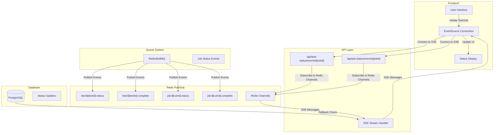

# Real-Time Status Updates with Server-Sent Events (SSE)

This document outlines the comprehensive Server-Sent Events (SSE) implementation in Supercheck for real-time status updates, providing live feedback for test execution, job processing, and queue statistics using Redis pub/sub events.

## Overview

The application uses Server-Sent Events (SSE) to provide real-time status updates for test and job execution. This enables users to see live progress without polling the server, creating a responsive and engaging user experience. The system uses Redis pub/sub events for immediate status updates instead of database polling.

## Architecture

### 1. SSE Flow Diagram

### 2. SSE Implementation Components

#### A. Frontend EventSource Implementation

The frontend establishes SSE connections for real-time updates:

**Connection Management:**
- Creates EventSource connections for test and job status updates
- Handles automatic reconnection on connection failures  
- Implements proper connection cleanup to prevent memory leaks

**Message Processing:**
- Parses JSON messages from SSE streams
- Normalizes status values for consistent UI updates
- Handles different completion states (completed, passed, failed, error)

**UI Integration:**
- Updates loading states based on execution progress
- Changes visual indicators for running vs completed states
- Closes connections when execution completes to conserve resources

**Error Handling:**
- Graceful handling of parsing errors in SSE messages
- Fallback mechanisms for connection failures
- Comprehensive logging for debugging SSE issues

#### B. Job Status SSE Implementation

For job execution, the system implements enhanced SSE handling:

**Enhanced State Management:**
- Manages multiple concurrent job executions simultaneously
- Tracks active runs and running jobs using React state and refs
- Prevents duplicate completion notifications through run-specific flags

**Resource Management:**
- Maintains EventSource connections in a centralized registry
- Automatically closes connections on job completion
- Removes completed jobs from active tracking sets

**User Experience Features:**
- Dismisses loading toasts when jobs complete
- Provides immediate feedback on job success or failure status
- Updates UI state to reflect completion of all running jobs

**Job Context Integration:**
- Integrates with React context for global job state management
- Handles terminal status detection (completed, failed, passed, error)
- Maintains consistency between UI state and actual job status

## API Implementation

### 1. Test Status SSE Endpoint Architecture

The test status endpoint provides real-time updates for individual test execution:

**Request Processing:**
- Extracts testId from URL path parameters
- Validates test existence and user permissions
- Establishes SSE streaming connection with proper headers

**Initial State Checking:**
- Queries database for existing test results
- Immediately returns completed status if test already finished
- Provides instant feedback for previously completed tests

**Stream Management:**
- Creates ReadableStream for continuous data flow
- Implements proper connection lifecycle management
- Handles connection cleanup on client disconnection

**Redis Integration:**
- Subscribes to test-specific Redis channels for real-time updates
- Processes pub/sub messages and forwards them to SSE clients
- Maintains channel subscriptions until connection closes

**Error Handling:**
- Graceful handling of Redis connection failures
- Proper stream closure on errors or completion
- Comprehensive logging for debugging connection issues

### 2. Job Status SSE Endpoint Architecture

The job status endpoint handles multi-test job execution updates:

**Enhanced Job Processing:**
- Supports both individual tests and complex job workflows
- Tracks run-specific status updates using unique run identifiers  
- Handles job completion with artifact path information

**Connection Management:**
- Implements keep-alive ping mechanisms for long-running connections
- Provides graceful connection cleanup on client disconnection
- Manages subscription lifecycles for multiple concurrent job monitoring

**Fallback Mechanisms:**
- Database polling as backup for missed Redis events
- Configurable fallback intervals to balance performance and reliability
- Ensures no status updates are missed even with Redis issues

## Redis Integration

### Channel Strategy

The system uses a structured Redis channel naming convention:

**Test Channels:**
- `test:${testId}:status` - Real-time status updates during execution
- `test:${testId}:complete` - Final completion notification with results

**Job Channels:**
- `job:${runId}:status` - Job progress updates and intermediate results
- `job:${runId}:complete` - Job completion with final status and artifacts

### Publisher Implementation

The worker services publish status updates to Redis channels:

**Test Execution Updates:**
- Running status when test execution begins
- Progress updates during test execution phases
- Completion status with results and artifact URLs

**Job Execution Updates:**
- Job start notifications with initial status
- Multi-test progress tracking within jobs
- Final job completion with aggregated results

## Benefits

### 1. Real-Time User Experience
- **Immediate Feedback**: Users see status changes instantly without page refresh
- **Progress Tracking**: Live updates during long-running test executions
- **Resource Efficiency**: No polling overhead, connections only when needed

### 2. Scalability
- **Redis Pub/Sub**: Efficient message distribution to multiple clients
- **Connection Pooling**: Optimized resource usage for concurrent users
- **Event-Driven**: Minimal server load compared to polling approaches

### 3. Reliability
- **Fallback Mechanisms**: Database polling ensures no missed updates
- **Connection Recovery**: Automatic reconnection handling for network issues
- **Error Resilience**: Graceful degradation when components are unavailable

### 4. Development Experience
- **Comprehensive Logging**: Detailed debugging information for troubleshooting
- **Type Safety**: Full TypeScript integration for message structures
- **Testing Support**: Easy to test with mock EventSource implementations

## Usage Patterns

### Frontend Integration

Components integrate SSE using standard EventSource API:
- Establish connections when tests or jobs start
- Handle message parsing and status updates
- Clean up connections on component unmount or completion

### Backend Integration

API routes provide SSE endpoints with:
- Proper CORS and security headers
- Redis subscription management
- Connection lifecycle handling
- Fallback polling mechanisms

## Production Considerations

### Performance
- Connection limits based on server capacity
- Efficient Redis pub/sub channel management
- Proper memory cleanup for long-lived connections

### Monitoring
- SSE connection metrics and health checks
- Redis pub/sub performance monitoring
- Error rate tracking for connection failures

### Security
- Authentication validation for SSE endpoints
- Rate limiting for connection establishment
- Proper error message sanitization to prevent information leakage