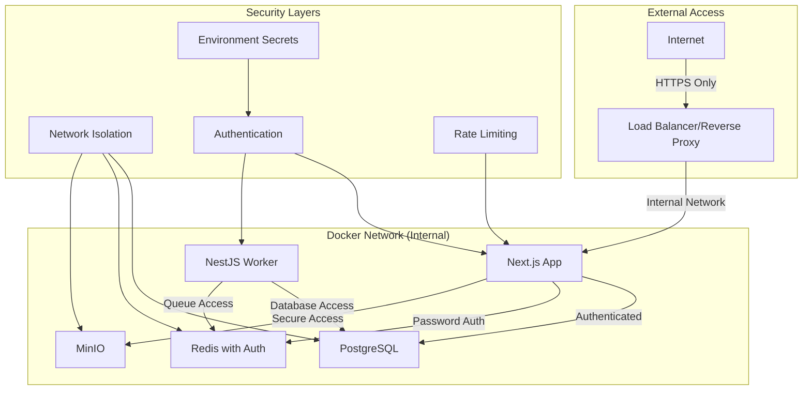

# Security Configuration Guide

## Security Architecture

This document outlines the security configurations required for production deployments.

## 🔐 Redis Security (Critical)

### Issue
By default, Redis is accessible without authentication and may be publicly exposed, creating a security vulnerability.

### Solution
The updated `docker-compose.yml` includes the following security measures:

1. **Authentication Required**: Redis now requires a password
2. **No Public Port**: Redis port is not exposed outside the Docker network
3. **Protected Mode**: Redis runs in protected mode

### Configuration

#### Environment Variables
Configure Redis authentication in your environment configuration:
- Set a strong, unique Redis password in your `.env` file
- Use environment variable substitution for password management
- Ensure the password is at least 32 characters long with mixed character types

#### Docker Compose Security
Redis container security configuration includes:
- **Password Authentication**: Requires authentication for all connections
- **Network Isolation**: No public port exposure, only accessible within Docker network
- **Protected Mode**: Prevents external access when authentication is required

#### Connection Authentication
Application services use authenticated Redis connections:
- Connection strings include password authentication
- All Redis operations require proper authentication
- Connection pooling maintains authenticated sessions

## 🚨 Production Deployment Checklist

### Before Deploying:

1. **Change Default Passwords**
   - Update Redis password in environment configuration
   - Set unique Better Auth secret for session security
   - Use strong, randomly generated passwords for all services

2. **Verify Security Settings**
   - Confirm Redis is not publicly accessible using network scanning tools
   - Verify database connections are properly authenticated
   - Test that services cannot be accessed without proper credentials

3. **Database Security**
   - Use strong PostgreSQL passwords
   - Limit database access to application containers only
   - Consider using SSL connections for database

4. **Environment Variables**
   - Never commit sensitive data to version control
   - Use secure methods to deploy environment variables
   - Rotate secrets regularly

## 🛡️ Additional Security Measures

### Network Security
- Use Docker's internal networks (already configured)
- Consider using Docker secrets for sensitive data
- Implement reverse proxy with SSL termination

### Application Security
- Email notifications use environment variables only (no UI exposure of SMTP credentials)
- API keys have proper rate limiting
- Input validation on all endpoints

### Monitoring
- Monitor failed login attempts
- Set up alerts for unusual activity
- Regular security audits

## 🔧 Testing Security

### Redis Security Test
Test Redis security configuration:
- **External Access Test**: Attempts to connect from outside Docker network should fail
- **Internal Access Test**: Connections from within Docker network should require password
- **Authentication Test**: Valid password should allow successful connections
- **Invalid Password Test**: Incorrect passwords should be rejected

### Port Scanning
Verify network security through port scanning:
- Check what ports are publicly accessible on your server
- Confirm only necessary ports are exposed (HTTP, HTTPS, SSH)
- Ensure database and cache ports are not publicly accessible

## 📞 Incident Response

If you receive security notifications (like the BSI Redis report):

1. **Immediate Action**: Stop the affected service
2. **Assess Impact**: Check if data was compromised
3. **Fix Configuration**: Apply security patches
4. **Monitor**: Watch for unusual activity
5. **Report**: Document the incident and resolution

## 🔄 Regular Maintenance

- Update container images regularly
- Review and rotate secrets quarterly
- Monitor security advisories for dependencies
- Perform regular security scans

---

**Remember**: Security is an ongoing process, not a one-time setup. Stay vigilant and keep your systems updated.