# Supercheck Platform Architecture

## 🏗️ **System Architecture Overview**

Supercheck is built with a modern, distributed architecture designed for scalability, reliability, and performance. The system combines multiple specialized services to deliver comprehensive testing, monitoring, and AI-powered test fixing capabilities.

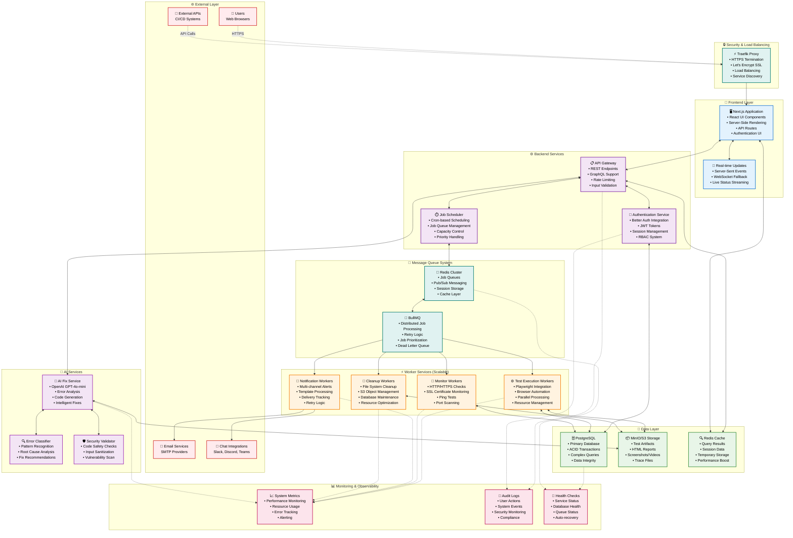

## 🔄 **Data Flow Architecture**

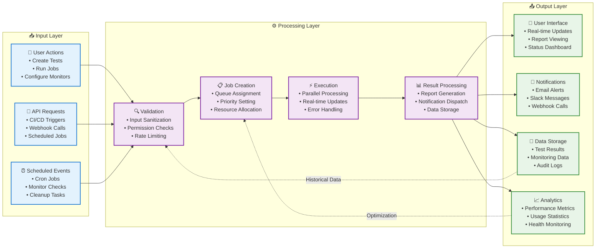

## 🎯 **Core Service Interactions**

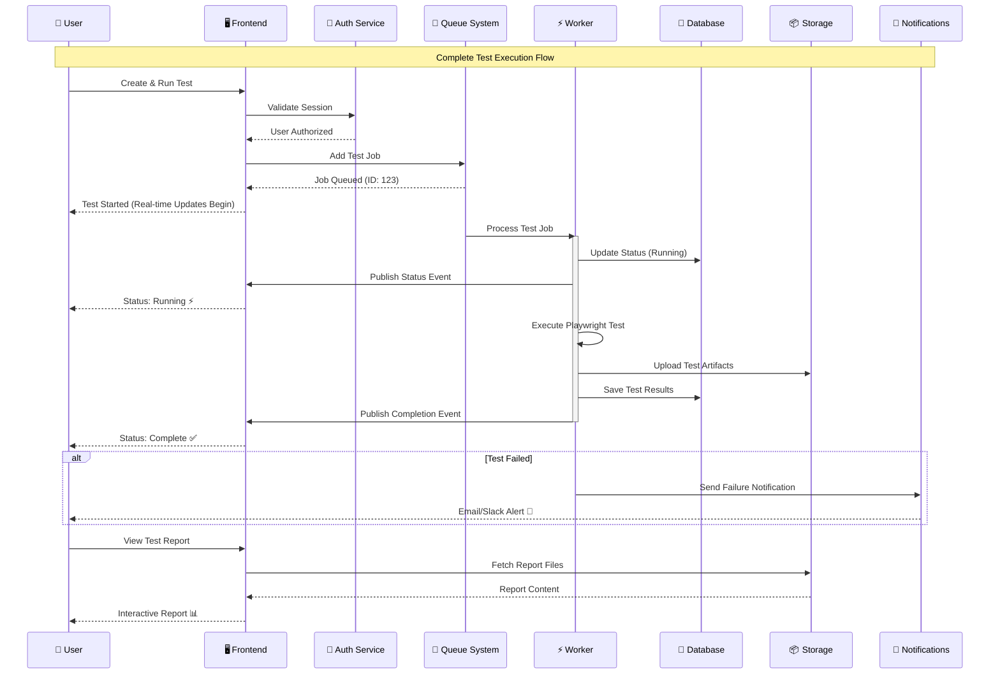

## 🏢 **Multi-Tenant Architecture**

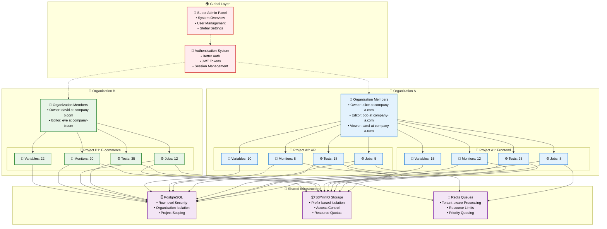

## 🔧 **Technology Stack**

### **Frontend Stack**
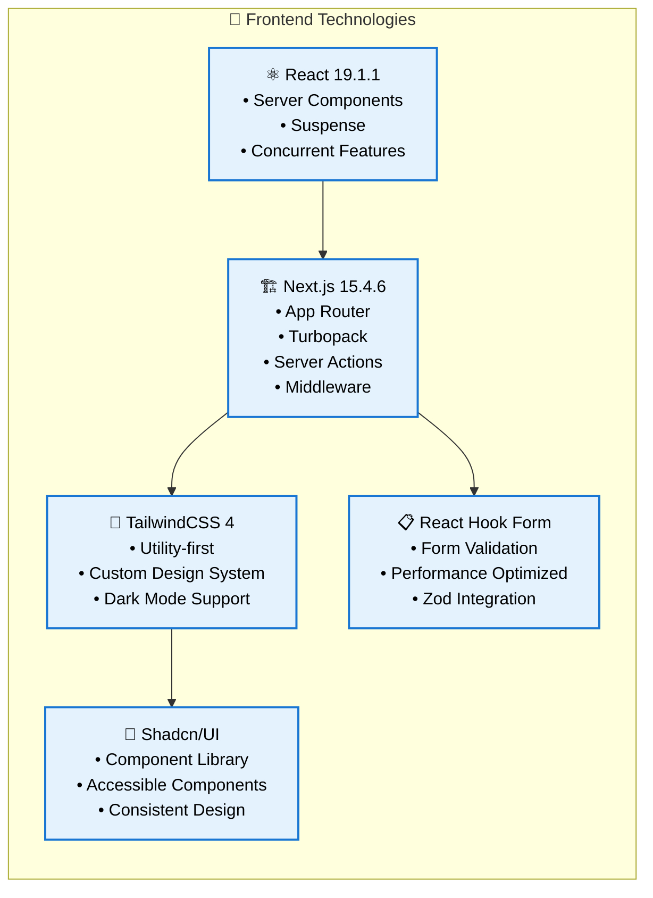

### **Backend Stack**
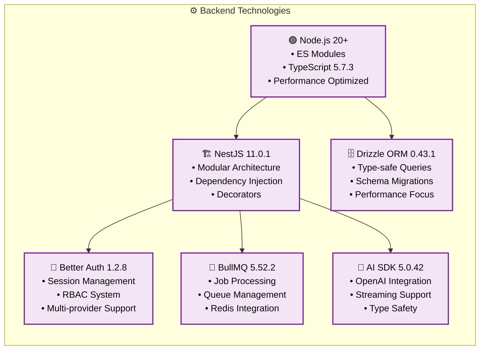

### **Testing & Automation Stack**
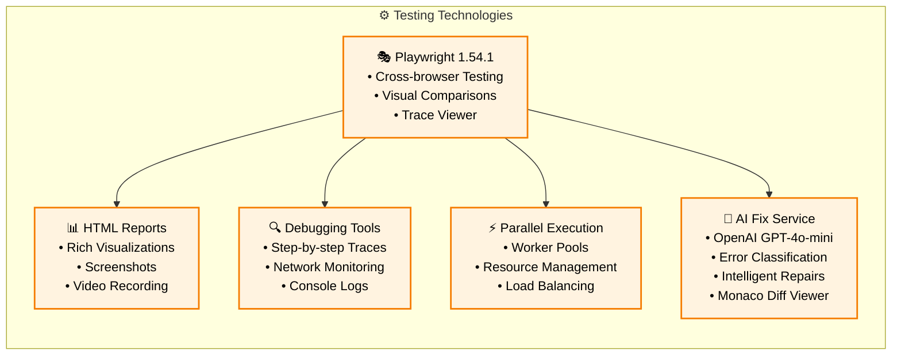

### **Infrastructure Stack**
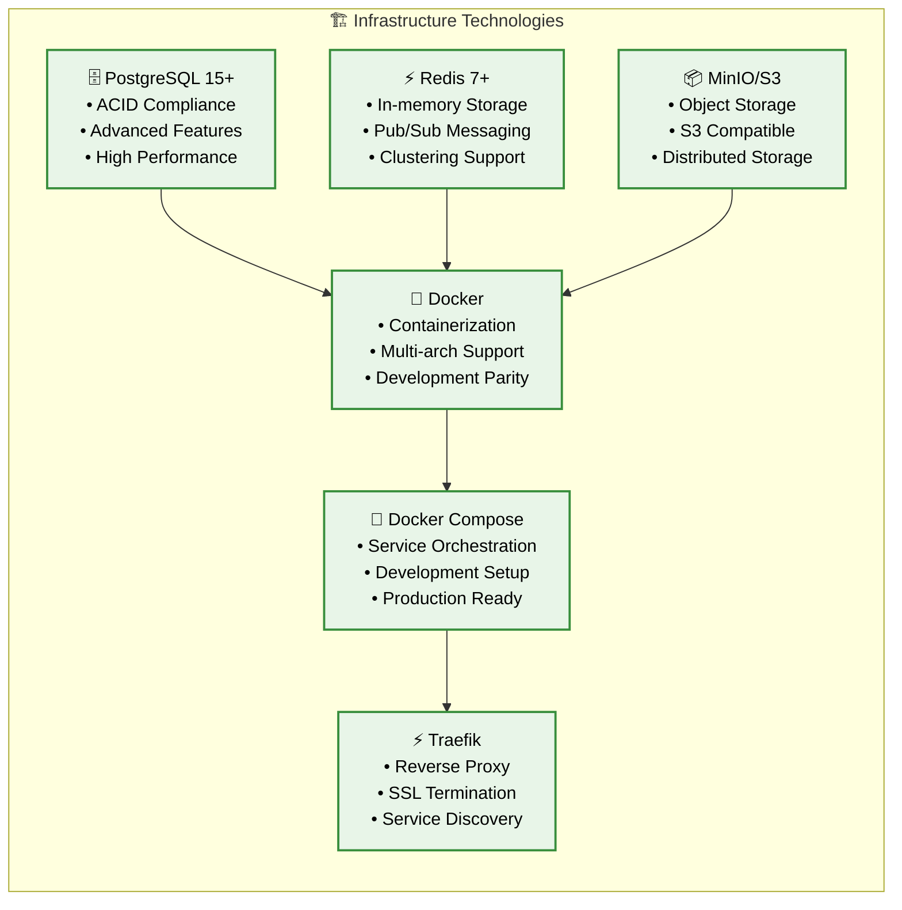

## 🚀 **Deployment Architecture**

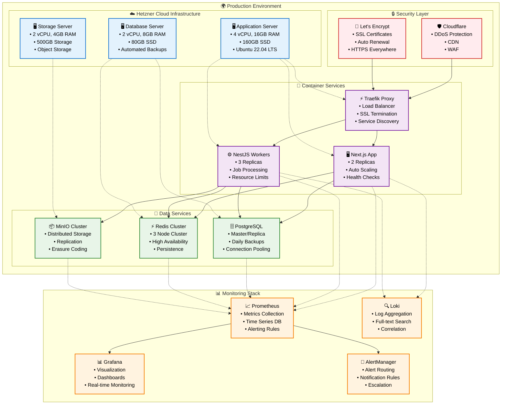

## 📈 **Scalability & Performance**

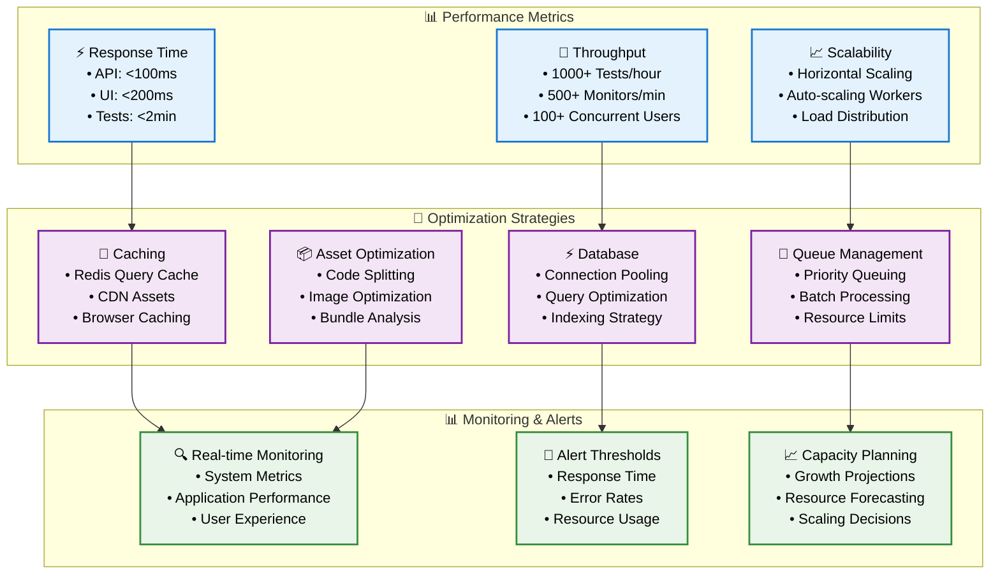

## 🔐 **Security Architecture**

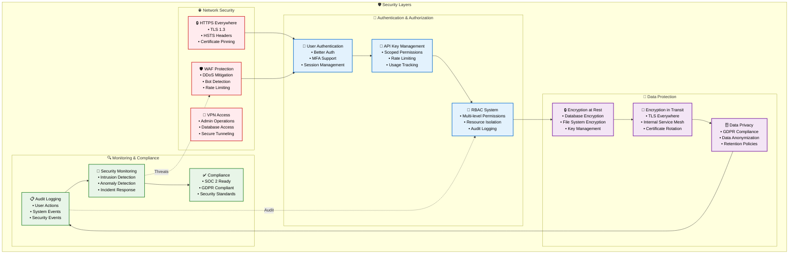

## 🎯 **Key Architectural Principles**

### **🏗️ Design Principles**
- **🔄 Microservices Architecture**: Loosely coupled, independently deployable services
- **📈 Horizontal Scalability**: Scale out rather than up for better performance
- **🛡️ Security by Design**: Security considerations built into every layer
- **🔧 DevOps Integration**: Infrastructure as code, automated deployments
- **📊 Observability First**: Comprehensive monitoring, logging, and metrics

### **⚡ Performance Principles**
- **⚡ Async Processing**: Non-blocking operations for better responsiveness
- **💾 Intelligent Caching**: Multi-layer caching strategy for optimal performance
- **🔄 Queue-based Processing**: Decoupled, reliable job processing
- **📦 Resource Optimization**: Efficient resource utilization and cleanup

### **🔐 Security Principles**
- **🔒 Zero Trust**: Never trust, always verify
- **🛡️ Defense in Depth**: Multiple security layers
- **📋 Audit Everything**: Comprehensive logging and monitoring
- **🔐 Least Privilege**: Minimal required permissions

### **🚀 Operational Principles**
- **📊 Monitoring & Alerting**: Proactive system monitoring
- **🔄 Automated Recovery**: Self-healing systems where possible
- **📈 Capacity Planning**: Predictive scaling and resource management
- **⚙️ Testing Strategy**: Comprehensive testing at all levels

This architecture ensures Supercheck is robust, scalable, and maintainable while providing excellent performance and security for enterprise-grade testing and monitoring operations.