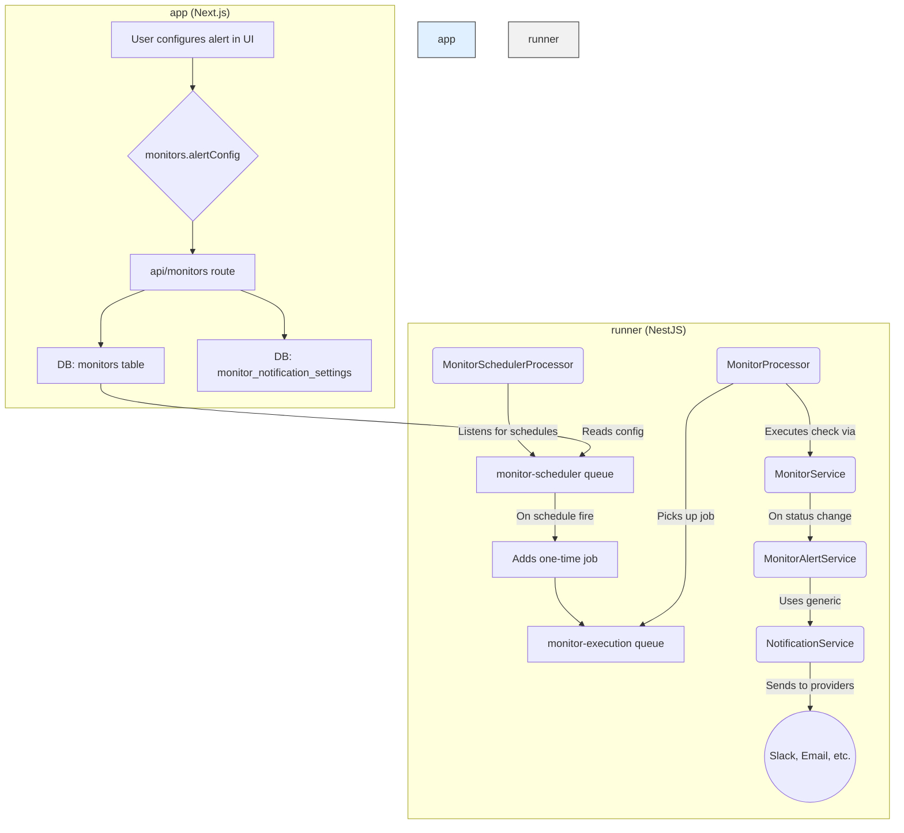

# Alerts and Notifications System Breakdown

This document provides a detailed end-to-end explanation of the alerting and notification system for both monitors and jobs.

## High-Level Overview

The system is architecturally divided into two main components:

1.  **`app` (Next.js Frontend):** The user-facing application where users configure monitors, jobs, and their respective alert settings. It includes the API endpoints that the frontend consumes.
2.  **`runner` (NestJS Backend):** A background worker service responsible for scheduling and executing monitors and jobs, evaluating alert conditions, and dispatching notifications through various providers.

The two services communicate via a **Redis**-backed message queue (**BullMQ**), which allows the `app` to offload long-running tasks to the `runner` asynchronously.

## I. Monitor Alerting Flow

The monitor alerting flow is a sophisticated process designed to be robust and scalable. It can be broken down into the following stages:

### 1. Configuration

- **Where:** `app` (Frontend UI)
- **How:** Users create or edit a monitor and configure its `alertConfig`. This configuration is stored as a JSONB object in the `alertConfig` column of the `monitors` table in the database.

**Key `alertConfig` properties:**
- `enabled`: A boolean to toggle alerts for the monitor.
- `notificationProviders`: An array of `notification_provider` IDs to send alerts to.
- `alertOnFailure`: A boolean to send an alert when the monitor status changes to `down`.
- `alertOnRecovery`: A boolean to send an alert when the monitor status changes from `down` to `up`.
- `failureThreshold`: Number of consecutive failures before an alert is sent. (Note: current implementation in `monitor.service.ts` alerts on the first status change, this might be a feature to align).

When a monitor is created or updated, the API endpoint (`app/src/app/api/monitors/route.ts`) also updates the `monitor_notification_settings` join table, linking the monitor to its selected notification providers.

### 2. Scheduling

- **Where:** `runner`
- **How:** The `runner` service uses a `monitor-scheduler` queue. For each `enabled` monitor, a repeating job is added to this queue based on its `frequencyMinutes`.
- **Component:** `runner/src/scheduler/processors/monitor-scheduler.processor.ts`
- **Logic:** When a scheduled job fires, the `MonitorSchedulerProcessor`'s only responsibility is to add a *new, one-time* job to the `monitor-execution` queue. This pattern effectively creates a distributed cron system.

### 3. Execution

- **Where:** `runner`
- **How:** The `MonitorProcessor` listens for jobs on the `monitor-execution` queue.
- **Component:** `runner/src/monitor/monitor.processor.ts`
- **Logic:**
    1. The `process` method picks up the job.
    2. It calls `this.monitorService.executeMonitor(job.data)`.
    3. The `executeMonitor` method in `runner/src/monitor/monitor.service.ts` performs the actual check (e.g., HTTP request, ping) and returns a `MonitorExecutionResult`.
    4. Upon successful completion of the job, the `onCompleted` event handler in `MonitorProcessor` is triggered.

### 4. Result Processing & Alert Triggering

- **Where:** `runner`
- **How:** The `onCompleted` handler in `MonitorProcessor` calls `this.monitorService.saveMonitorResult(result)`.
- **Component:** `runner/src/monitor/monitor.service.ts`
- **Logic (`saveMonitorResult`):**
    1. The new result is saved to the `monitor_results` table.
    2. The `status` on the `monitors` table is updated.
    3. It compares the `currentStatus` (`up`/`down`) with the `previousStatus`.
    4. **Crucially**, if `isStatusChange` is `true` and `monitor.alertConfig.enabled` is `true`, it proceeds to check if an alert should be sent.
    5. It checks the `alertOnFailure` and `alertOnRecovery` flags from the monitor's `alertConfig`.
    6. If conditions are met, it calls `this.monitorAlertService.sendNotification(...)`.

### 5. Notification Dispatch

- **Where:** `runner`
- **How:** The `MonitorAlertService` is responsible for preparing and sending the notification.
- **Components:**
    - `runner/src/monitor/services/monitor-alert.service.ts`
    - `runner/src/notification/notification.service.ts` (generic service)
- **Logic:**
    1. `sendNotification` in `MonitorAlertService` retrieves the full monitor details and the associated notification providers.
    2. It constructs a `NotificationPayload` containing details like title, message, severity, and metadata. It will use `customMessage` from `alertConfig` if present.
    3. It then calls the generic `this.notificationService.sendNotificationToMultipleProviders(...)`.
    4. This generic service iterates through the providers (e.g., Slack, Email) and sends the notification using the specific logic for each provider type.

### Flow Diagram: Monitor Alerting

## II. Job Alerting Flow

Job alerting follows a similar pattern but is triggered by the completion of a test job rather than a scheduled monitor.

- **Trigger:** A job execution is completed by the `JobExecutionProcessor`.
- **Component:** `runner/src/execution/processors/job-execution.processor.ts`
- **Logic (`handleJobNotifications`):**
    1. After a job finishes, the processor retrieves the job's configuration, which includes an `alertConfig` similar to monitors. This config is stored on the `jobs` table.
    2. It retrieves the associated notification providers.
    3. **Threshold Logic:** Unlike the current monitor alerting, job alerting explicitly checks for `failureThreshold` and `recoveryThreshold`. It fetches recent job runs and counts consecutive successes or failures.
    4. **Alert Triggering:** An alert is sent only if the number of consecutive statuses meets the configured threshold (e.g., alert on the 3rd consecutive failure).
    5. **Dispatch:** If an alert is warranted, it constructs a `NotificationPayload` and uses the same generic `NotificationService` to send it.

### Key Differences from Monitor Alerting

- **Trigger:** Job completion vs. scheduled monitor check.
- **Thresholds:** Job alerting has a more advanced, explicit threshold implementation that considers consecutive run statuses. Monitor alerting currently triggers on the first status change.
- **Configuration:** Stored on the `jobs` table instead of the `monitors` table.

## III. Database Schema

The core tables supporting this system are:

- **`monitors`**: Stores monitor configurations, including the `alertConfig` JSONB field.
- **`jobs`**: Stores job configurations, also with an `alertConfig` field.
- **`notification_providers`**: Stores the configuration for each notification channel (e.g., Slack webhook URL, SMTP server details).
- **`monitor_notification_settings`**: A many-to-many join table linking `monitors` to `notification_providers`.
- **`job_notification_settings`**: (Presumed, based on monitor implementation) A join table linking `jobs` to `notification_providers`.
- **`alert_history`**: (Presumed, based on `MONITORING_README.md`) Stores a record of every alert sent.

This document should provide a solid foundation for understanding the current system and planning future improvements. 