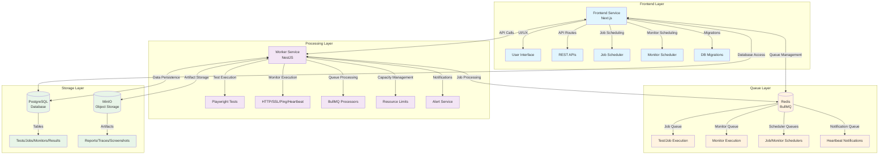
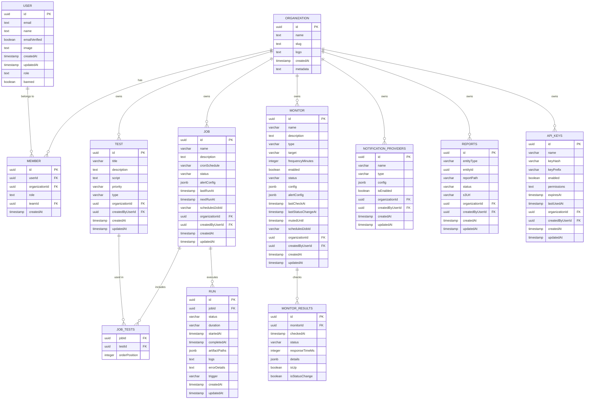
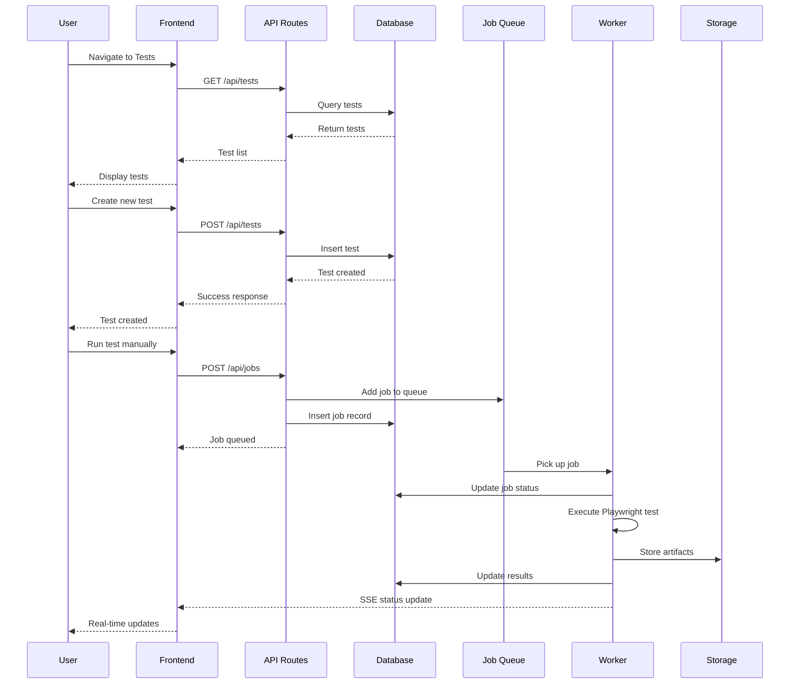
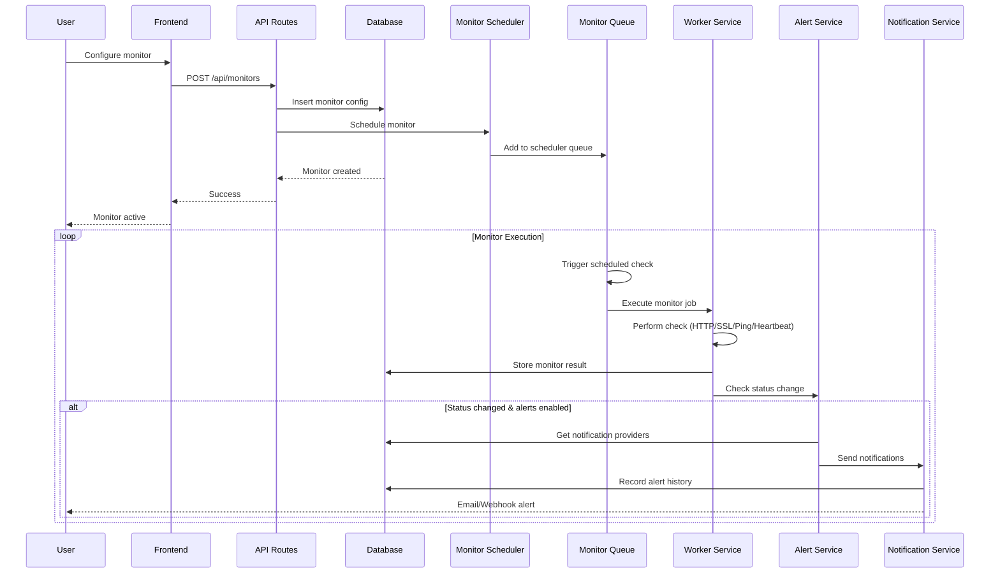
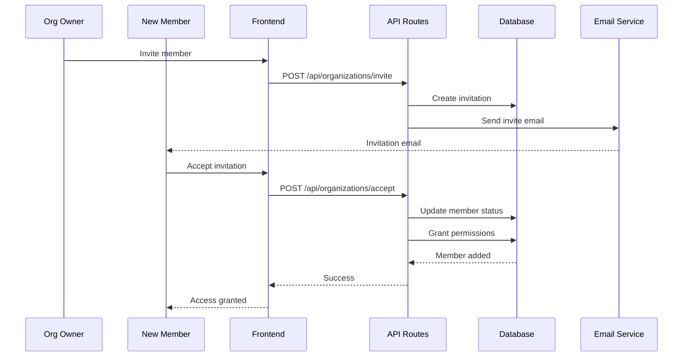
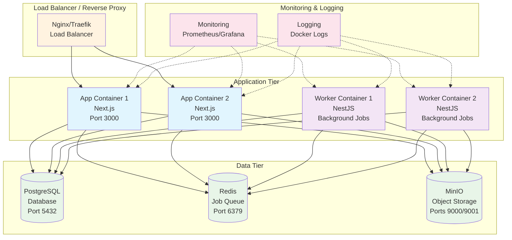
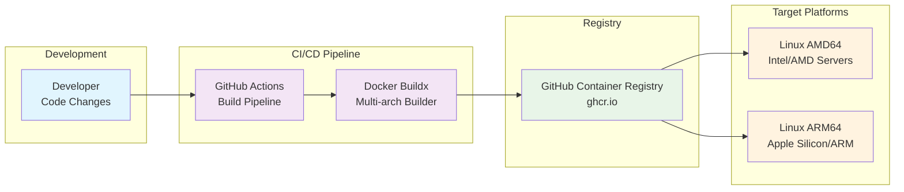

# Supercheck - Platform Demo

## 🎯 Overview
**Supercheck** is a comprehensive end-to-end testing and monitoring platform built with a distributed, scalable architecture.

---

## 🏗️ System Architecture

### High-Level Architecture



### Component Breakdown

#### 🎨 Frontend Service (Next.js)
- **Location**: `/app`
- **Responsibilities**:
  - User interface and experience
  - API routes for data operations
  - Job scheduling and management
  - Database migrations
  - Real-time updates via SSE

#### ⚙️ Worker Service (NestJS)
- **Location**: `/runner`
- **Responsibilities**:
  - Playwright test execution
  - Parallel processing with capacity management
  - Queue job processing
  - Test artifact generation

#### 🗄️ Infrastructure Layer
- **PostgreSQL**: Primary database with Drizzle ORM
- **Redis**: Job queuing with BullMQ
- **MinIO**: S3-compatible storage for test artifacts

---

## 🚀 Core Features

### 1. **End-to-End Testing**
- Playwright-based browser automation
- Parallel test execution
- Configurable timeouts and retries
- Real-time status updates
- Comprehensive test reports

### 2. **Job Scheduling & Management**
- Cron-based scheduling
- Manual job triggers
- API key authentication
- Job history tracking
- Queue-based execution

### 3. **Monitoring System**
- HTTP/HTTPS endpoint monitoring
- Heartbeat monitoring
- Response time metrics
- Uptime calculations
- Availability tracking

### 4. **Alerting & Notifications**
- Multi-channel notifications (email, webhooks)
- Rule-based alerting
- Custom notification conditions
- Provider quota management

### 5. **Multi-Tenant Support**
- Organization-based isolation
- Member management
- Role-based access control
- Secure API access

---

## 🛠️ Technology Stack

### Backend Technologies
- **Next.js 14**: Full-stack React framework
- **NestJS**: Scalable Node.js framework
- **Drizzle ORM**: Type-safe database operations
- **Better Auth**: Authentication system
- **BullMQ**: Job queue management

### Frontend Technologies
- **React 18**: Component-based UI
- **TypeScript**: Type safety
- **Tailwind CSS**: Utility-first styling
- **Server-Sent Events**: Real-time updates

### Infrastructure
- **PostgreSQL**: Relational database
- **Redis**: In-memory data store
- **MinIO**: Object storage
- **Docker**: Containerization
- **Playwright**: Browser automation

---

## 🗄️ Database Schema

### Entity Relationship Diagram



---

## 📊 Data Flow

### Test Execution Flow

```mermaid
flowchart LR
    A[User Trigger<br/>Manual/API/Schedule] --> B[Test/Job API<br/>Next.js Routes]
    B --> C[Capacity Verification<br/>Queue Stats Check]
    C --> D[Job Creation<br/>Database Insert]
    D --> E[Queue Addition<br/>BullMQ Redis]
    E --> F[Test Execution Processor<br/>NestJS Worker]
    F --> G[Execution Service<br/>Test Orchestration]
    G --> H[Playwright Runner<br/>Browser Automation]
    H --> I[Report Generation<br/>HTML Reports/Traces]
    I --> J[Artifact Upload<br/>MinIO S3 Storage]
    J --> K[Database Update<br/>Status & Results]
    K --> L[Redis Publish<br/>Status Events]
    L --> M[SSE Stream<br/>Real-time Updates]
    
    subgraph "Frontend Layer"
        A
        B
        M
    end
    
    subgraph "Validation Layer"
        C
        D
    end
    
    subgraph "Queue Layer"
        E
        F
    end
    
    subgraph "Execution Layer"
        G
        H
        I
    end
    
    subgraph "Storage Layer"
        J
        K
        L
    end
    
    classDef frontend fill:#e1f5fe
    classDef validation fill:#fff8e1
    classDef queue fill:#fff3e0
    classDef exec fill:#f3e5f5
    classDef storage fill:#e8f5e8
    
    class A,B,M frontend
    class C,D validation
    class E,F queue
    class G,H,I exec
    class J,K,L storage
```



### Monitoring Flow

```mermaid
flowchart LR
    A[User/API Trigger<br/>Manual/Schedule] --> B[Monitor API<br/>Next.js Routes]
    B --> C[Monitor Service<br/>Create/Update Config]
    C --> D[Monitor Scheduler<br/>Schedule Setup]
    D --> E[Monitor Scheduler Queue<br/>BullMQ Redis]
    E --> F[Monitor Scheduler Processor<br/>NestJS Worker]
    F --> G[Add Execution Job<br/>One-time Job]
    G --> H[Monitor Execution Queue<br/>BullMQ Redis]
    H --> I[Monitor Processor<br/>NestJS Worker]
    I --> J[Monitor Service<br/>Execute Monitor]
    J --> K{Monitor Type}
    K --> |HTTP/Website| L[HTTP Request<br/>Status/Response/SSL Check]
    K --> |Ping Host| M[ICMP Ping<br/>Platform Detection]
    K --> |Port Check| N[TCP/UDP Connection<br/>Socket Test]
    K --> |Heartbeat| O[Missed Ping Check<br/>Grace Period Logic]
    L --> P[Result Processing<br/>Status Determination]
    M --> P
    N --> P
    O --> P
    P --> Q[Save Monitor Result<br/>Database Update]
    Q --> R[Monitor Status Update<br/>Last Check Time]
    R --> S[Status Change Detection<br/>Previous vs Current]
    S --> T[Threshold Evaluation<br/>Consecutive Failures/Success]
    T --> U[Monitor Alert Service<br/>Notification Logic]
    U --> V[Notification Service<br/>Multi-Provider Dispatch]
    V --> W[Provider Delivery<br/>Email/Slack/Webhook/etc]
    W --> X[Alert History<br/>Audit Trail]
    
    subgraph "Frontend Layer"
        A
        B
        C
    end
    
    subgraph "Scheduling Layer"
        D
        E
        F
        G
    end
    
    subgraph "Execution Layer"
        H
        I
        J
        K
        L
        M
        N
        O
    end
    
    subgraph "Analysis Layer"
        P
        Q
        R
        S
        T
    end
    
    subgraph "Notification Layer"
        U
        V
        W
        X
    end
    
    classDef frontend fill:#e1f5fe
    classDef schedule fill:#fff3e0
    classDef exec fill:#f3e5f5
    classDef analysis fill:#e8f5e8
    classDef delivery fill:#fce4ec
    
    class A,B,C frontend
    class D,E,F,G schedule
    class H,I,J,K,L,M,N,O exec
    class P,Q,R,S,T analysis
    class U,V,W,X delivery
```



---

## 🎭 Demo Scenarios & User Workflows

### 1. **Creating and Running a Test**



### 2. **Setting Up Monitoring**



### 3. **Organization Management**



---

## 📈 Scalability & Performance

### Horizontal Scaling
- **Worker Scaling**: Multiple NestJS workers
- **Queue Distribution**: Redis-based job distribution
- **Capacity Management**: Configurable limits
- **Resource Isolation**: Container-based deployment

### Performance Features
- **Parallel Execution**: Multiple tests simultaneously
- **Artifact Caching**: MinIO with presigned URLs
- **Database Optimization**: Indexed queries
- **Memory Management**: Configurable timeouts

---

## 🔒 Security Features

### Authentication & Authorization
- Better Auth integration
- Session management
- API key authentication
- Role-based access control

### Infrastructure Security
- Redis authentication
- Database connection pooling
- Environment variable management
- Secure artifact storage

---

## 🚀 Deployment Architecture

### Container Deployment Diagram



### Multi-Architecture Support



### Production Deployment Features
- **Registry**: GitHub Container Registry
- **Platforms**: Linux AMD64/ARM64
- **Health Checks**: Service readiness validation
- **Migration Handling**: Automatic database updates
- **Scaling**: Horizontal container scaling
- **Load Balancing**: Multi-instance load distribution

---

## 📋 Key Metrics & Insights

### Test Execution Metrics
- Test success/failure rates
- Execution duration trends
- Resource utilization
- Queue processing times

### Monitoring Metrics
- Endpoint availability
- Response time trends
- Alert frequency
- Notification delivery rates

### System Metrics
- Worker capacity utilization
- Database performance
- Queue depth analysis
- Storage usage patterns

---

## 🎪 Live Demo Points

1. **Dashboard Overview**: System status and recent activity
2. **Test Creation**: Step-by-step test setup
3. **Job Execution**: Real-time job monitoring
4. **Monitor Configuration**: Uptime monitoring setup
5. **Alert Management**: Notification rule configuration
6. **Reporting**: Test results and monitoring reports
7. **Organization**: Multi-tenant features
8. **API Integration**: Programmatic access examples

---

## 🔗 Quick Start Commands

```bash
# Production deployment (default)
export DOMAIN=your-domain.com
export REDIS_PASSWORD=your-secure-redis-password
docker-compose up -d

# View logs
docker-compose logs -f app
docker-compose logs -f worker

# Development setup (local)
cd app && npm run dev
cd runner && npm run dev

# Build multi-arch images
./scripts/docker-images.sh
```

---

## 📞 Support & Documentation

- **GitHub**: Repository with full source code
- **Docker Hub**: Pre-built multi-arch images
- **Documentation**: Comprehensive setup guides
- **API Reference**: OpenAPI specifications