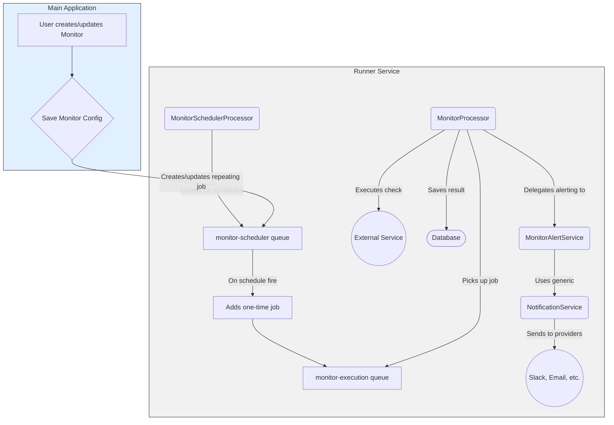

# Monitoring Queue Architecture

This document outlines the architecture of the background job processing system for the monitoring features, managed by the `runner` service using BullMQ and Redis.

## I. Active Monitor Scheduling & Execution

This system is used for monitors that actively check a target, such as HTTP, Ping, and Port checks. It is designed for heterogeneous scheduling, where each monitor can have a unique frequency.

### Queues

1.  **`monitor-scheduler`**
    *   **Purpose**: Manages the schedules for all active monitors.
    *   **Job Type**: Repeating jobs.
    *   **How it Works**: A unique, repeating job is created for each active monitor based on its configured frequency (e.g., every 5 minutes). When a job's schedule fires, its only task is to add a *new, one-time* execution job to the `monitor-execution` queue. This queue acts as a distributed cron system.

2.  **`monitor-execution`**
    *   **Purpose**: To execute the actual monitor checks.
    *   **Job Type**: One-time jobs.
    *   **How it Works**: The `MonitorProcessor` listens to this queue. It picks up jobs, executes the check, and saves the result. If a notification is required (e.g., status change), it delegates the task to the `MonitorAlertService`, which then uses the generic `NotificationService` to send alerts.

### Diagram: Active Monitoring Flow



## II. Passive Heartbeat Monitoring

This system handles two distinct scenarios for heartbeat monitors: passive checking for missed pings and immediate notifications from explicit pass/fail signals.

### A. Passive Checking (The "Janitor")

This flow is designed to catch "silent failures" where a service stops pinging without sending a failure signal.

1.  **`heartbeat-checker`**
    *   **Purpose**: To periodically check for missed heartbeats.
    *   **Job Type**: Singleton, repeating job.
    *   **How it Works**: A single repeating job runs at a fixed system interval (e.g., every minute). It triggers the `HeartbeatCheckerProcessor`, which queries the database for **all** heartbeat monitors and checks if any have missed their expected ping. This is a highly efficient batch process.

### B. Immediate Notifications (The "Express Lane")

This flow provides instant alerts when a service explicitly signals its status.

1.  **`heartbeat-ping-notification`**
    *   **Purpose**: To decouple immediate notification requests for heartbeat pings from the main application.
    *   **Job Type**: One-time jobs.
    *   **How it Works**: When the `app` receives a ping on a `/fail` or `/pass` URL for a heartbeat monitor, it first checks if the status has changed. If it has (e.g., was `up`, now `/fail`), it immediately updates the database and dispatches a job to this queue. The `runner` has a processor that listens to this queue and sends the alert, ensuring the `app` remains fast and responsive.

### Diagram: Heartbeat Notification Flow

```mermaid
graph TD
    subgraph Monitored Service
        J[Cron Job / Service];
    end

    subgraph app [Main Application]
        K[/api/heartbeat/.../fail]
        L[/api/heartbeat/.../pass]

        J -- "Pings on failure" --> K;
        J -- "Pings on success" --> L;

        K -- "If status changes" --> M{Adds job};
        L -- "If status changes" --> M;
        M --> N[heartbeat-ping-notification queue];
    end

    subgraph runner [Runner Service]
        O(HeartbeatPingNotificationProcessor) -- "Picks up job" --> N;
        O -- "Sends notification" --> P((Slack, Email, etc.));
    end

    style runner fill:#f1f1f1,stroke:#333
    style app fill:#e1f0ff,stroke:#333
```

This dual approach for heartbeats provides both robust passive checking and highly responsive immediate alerting. 