# Supercheck Deployment Architecture Diagrams

This document contains comprehensive architectural diagrams for all Supercheck deployment options, providing visual representations of how the platform can be deployed across different infrastructure and orchestration platforms.

## 📋 Table of Contents

- [High-Level Architecture](#high-level-architecture)
- [Component Overview](#component-overview)
- [Docker Compose Architecture](#docker-compose-architecture)
- [Docker Swarm Architecture](#docker-swarm-architecture)
- [Kubernetes Architecture](#kubernetes-architecture)
- [Windows Server Architecture](#windows-server-architecture)
- [Cloud Provider Architectures](#cloud-provider-architectures)
- [Network Architecture](#network-architecture)
- [Data Flow Diagrams](#data-flow-diagrams)
- [Scaling Architectures](#scaling-architectures)
- [Security Architecture](#security-architecture)

## 🏗️ High-Level Architecture

### System Overview

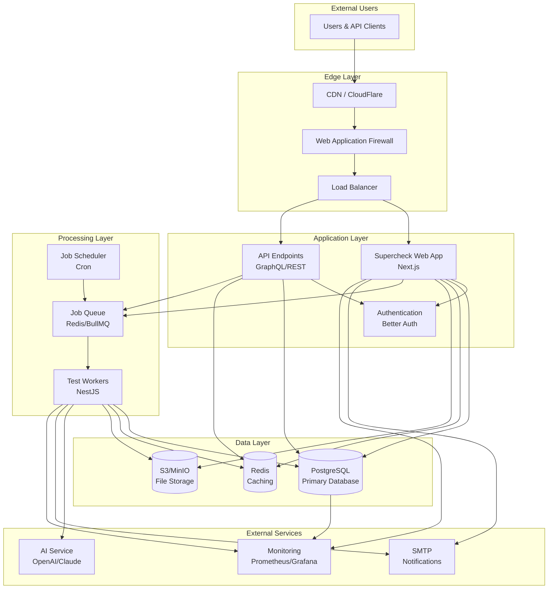

### Multi-Cluster Architecture

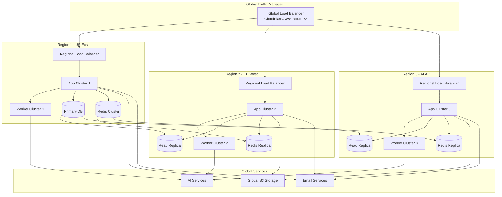

## 🧩 Component Overview

### Core Components

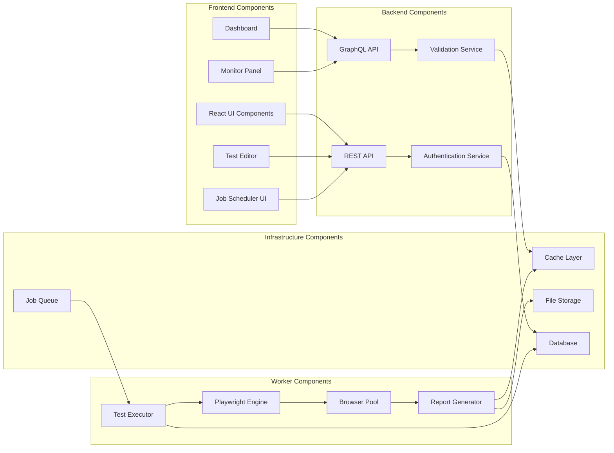

## 🐳 Docker Compose Architecture

### Single Server Deployment

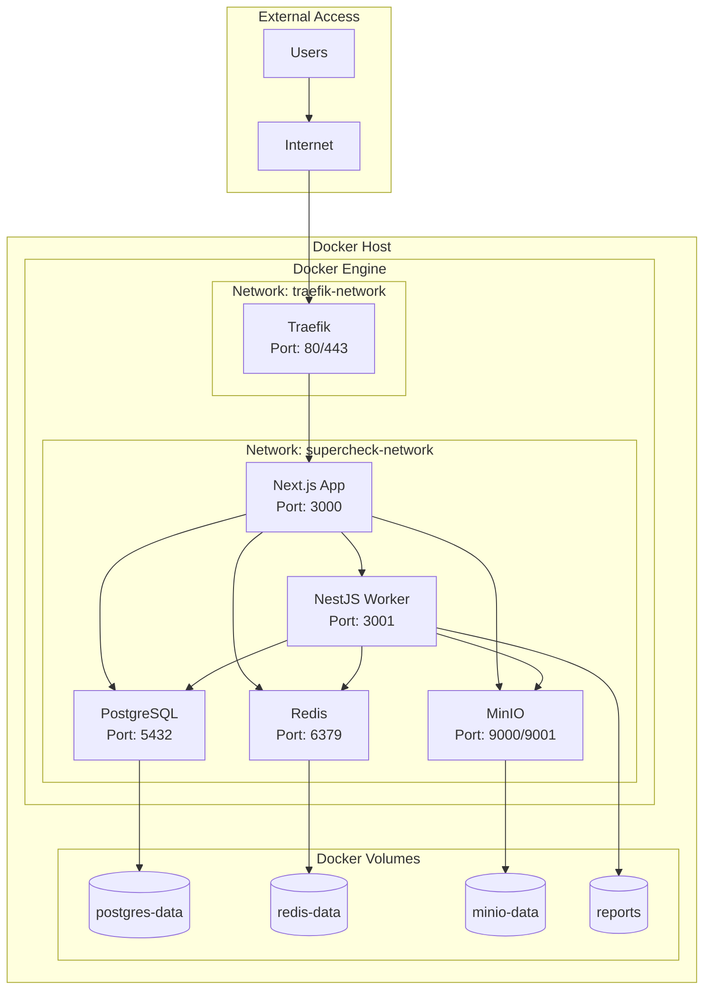

### Docker Compose with External Services

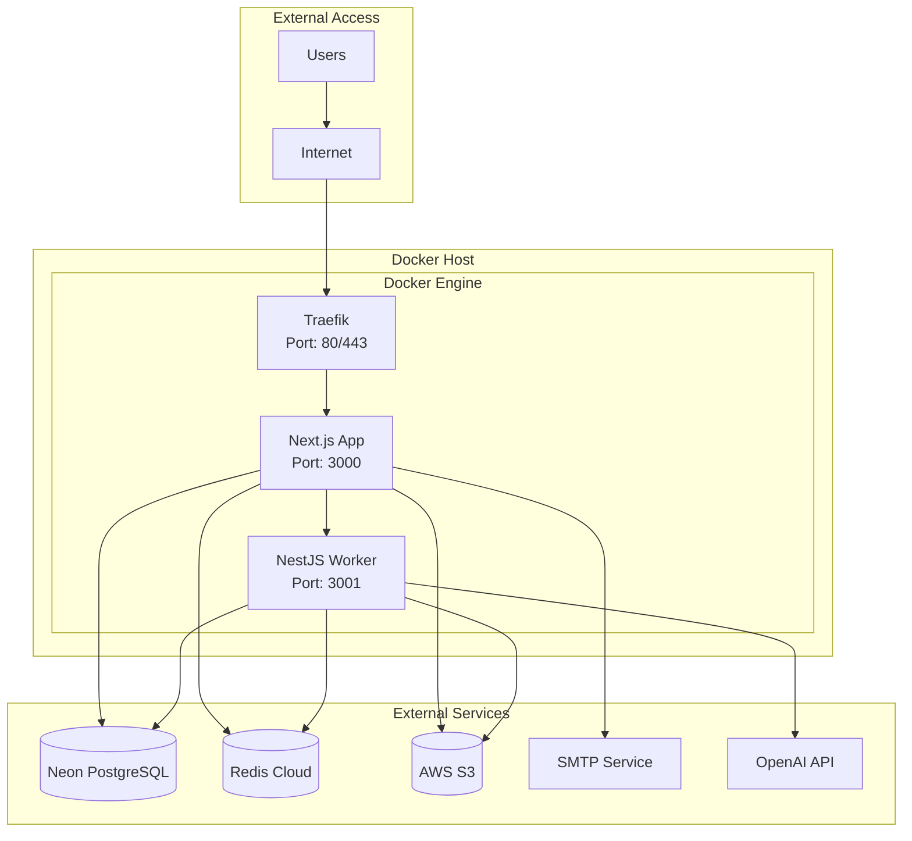

## 🐙 Docker Swarm Architecture

### Multi-Node Cluster

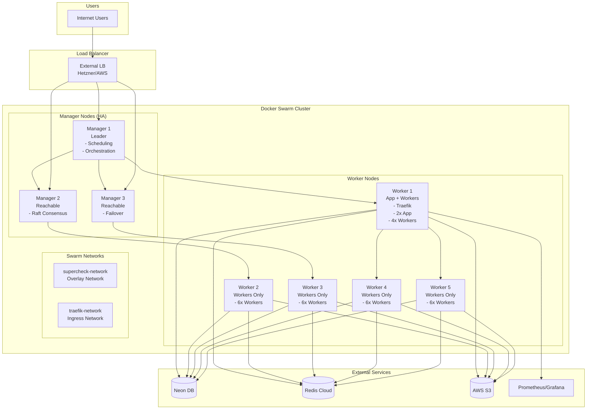

### Docker Swarm Service Distribution

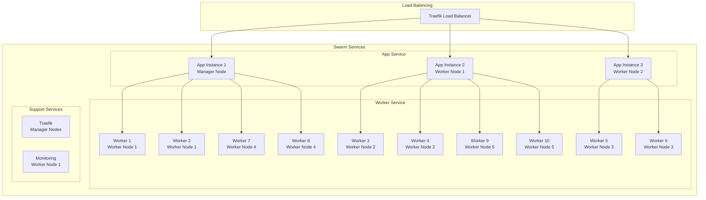

## ☸️ Kubernetes Architecture

### K3s Cluster Architecture

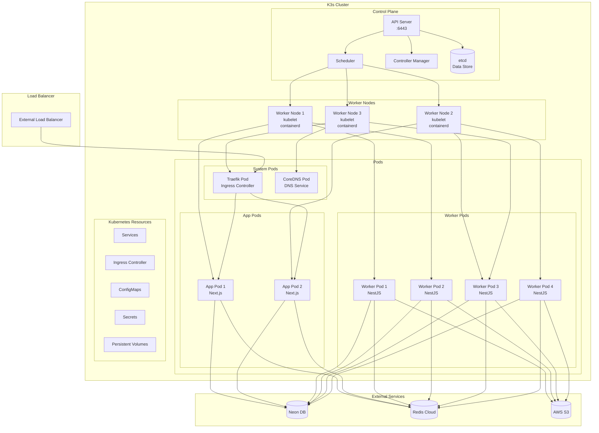

### Kubernetes Resource Relationships

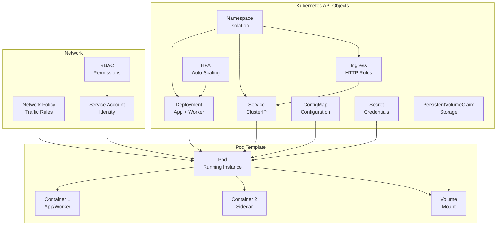

## 🪟 Windows Server Architecture

### Windows Container Deployment

```mermaid
graph TB
    subgraph "Windows Server"
        subgraph "Docker Desktop"
            App[Supercheck App<br/>Windows Container]
            Worker[Supercheck Worker<br/>Windows Container]
        end

        subgraph "IIS"
            IIS[IIS Server<br/>Reverse Proxy]
            AppPool[Application Pool]
        end

        subgraph "Windows Services"
            NodeJS[Node.js Runtime]
            PM2[PM2 Process Manager]
        end

        subgraph "Storage"
            LocalStorage[Local Storage<br/>C:\supercheck]
            Backup[Backup Storage]
        end
    end

    subgraph "External Services"
        SQL[(SQL Server)]
        Redis[(Redis on Linux)]
        Blob[Azure Blob Storage]
    end

    subgraph "Network"
        Firewall[Windows Firewall]
        AD[Active Directory]
    end

    IIS --> App
    App --> Worker
    App --> SQL
    App --> Redis
    Worker --> SQL
    Worker --> Redis
    Worker --> Blob

    App --> LocalStorage
    Worker --> LocalStorage
    LocalStorage --> Backup

    Firewall --> IIS
    AD --> IIS
```

### Native Windows Deployment

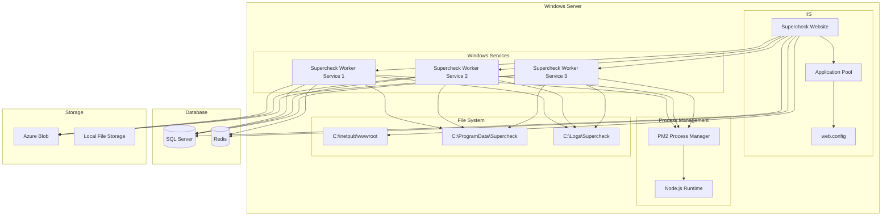

## ☁️ Cloud Provider Architectures

### AWS ECS Deployment

```mermaid
graph TB
    subgraph "AWS Cloud"
        subgraph "VPC"
            subgraph "Public Subnets"
                ALB[Application Load Balancer]
                NAT[NAT Gateway]
            end

            subgraph "Private Subnets"
                ECS[ECS Cluster]
                App[App Service<br/>Fargate]
                Worker[Worker Service<br/>Fargate]
            end

            subgraph "Database Subnets"
                RDS[(RDS PostgreSQL)]
            end
        end

        subgraph "ElastiCache"
            Redis[(ElastiCache Redis)]
        end

        subgraph "S3"
            Bucket[S3 Buckets]
        end

        subgraph "CloudWatch"
            Logs[CloudWatch Logs]
            Metrics[CloudWatch Metrics]
        end

        subgraph "IAM"
            Role[IAM Roles]
        end
    end

    subgraph "Internet"
        Users[Users]
        Internet[Internet]
    end

    Internet --> ALB
    ALB --> App
    App --> Worker
    App --> RDS
    App --> Redis
    App --> Bucket
    Worker --> RDS
    Worker --> Redis
    Worker --> Bucket

    App --> Logs
    Worker --> Logs
    App --> Metrics
    Worker --> Metrics

    ECS --> Role
    App --> Role
    Worker --> Role

    Users --> Internet
```

### Google Cloud GKE Deployment

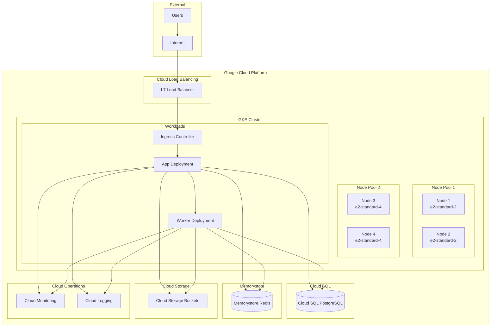

### Azure AKS Deployment

```mermaid
graph TB
    subgraph "Azure Cloud"
        subgraph "Resource Group"
            subgraph "AKS Cluster"
                subgraph "System Node Pool"
                    SystemNode[System Node<br/>B2s]
                end

                subgraph "User Node Pool"
                    UserNode1[User Node 1<br/>Standard_D2s_v3]
                    UserNode2[User Node 2<br/>Standard_D2s_v3]
                    UserNode3[User Node 3<br/>Standard_D2s_v3]
                end

                subgraph "Pods"
                    AppPods[App Pods]
                    WorkerPods[Worker Pods]
                end
            end

            subgraph "Azure Database"
                PostgreSQL[Azure Database for PostgreSQL]
            end

            subgraph "Azure Cache"
                Redis[Azure Cache for Redis]
            end

            subgraph "Storage"
                StorageAccount[Azure Storage Account]
            end

            subgraph "Networking"
                VNet[Virtual Network]
                AG[Azure Application Gateway]
            end

            subgraph "Monitor"
                Monitor[Azure Monitor]
            end
        end
    end

    subgraph "Internet"
        Users[Users]
        Internet[Internet]
    end

    Internet --> AG
    AG --> VNet
    VNet --> AppPods
    AppPods --> WorkerPods
    AppPods --> PostgreSQL
    AppPods --> Redis
    AppPods --> StorageAccount
    WorkerPods --> PostgreSQL
    WorkerPods --> Redis
    WorkerPods --> StorageAccount

    AppPods --> Monitor
    WorkerPods --> Monitor

    Users --> Internet
```

### Hetzner Cloud Deployment

```mermaid
graph TB
    subgraph "Hetzner Cloud"
        subgraph "Private Network"
            subgraph "Manager Nodes"
                M1[Manager 1<br/>CAX21<br/>Falkenstein]
                M2[Manager 2<br/>CAX21<br/>Nuremberg]
                M3[Manager 3<br/>CAX21<br/>Helsinki]
            end

            subgraph "Worker Nodes"
                W1[Worker 1<br/>CAX31<br/>Falkenstein]
                W2[Worker 2<br/>CAX31<br/>Falkenstein]
                W3[Worker 3<br/>CAX31<br/>Nuremberg]
                W4[Worker 4<br/>CAX31<br/>Nuremberg]
                W5[Worker 5<br/>CAX31<br/>Helsinki]
            end

            subgraph "Docker Swarm"
                App[App Services]
                Worker[Worker Services]
                Traefik[Traefik Ingress]
            end
        end

        subgraph "Load Balancer"
            LB[Load Balancer 11<br/>Hetzner LB]
        end

        subgraph "Firewall"
            FW[Firewall Rules]
        end

        subgraph "Placement Groups"
            Managers[Placement Group: Managers]
            Workers[Placement Group: Workers]
        end
    end

    subgraph "External Services"
        Neon[(Neon DB)]
        RedisCloud[(Redis Cloud)]
        S3[(Hetzner Storage Box)]
    end

    subgraph "Internet"
        Users[Users]
        Internet[Internet]
    end

    Internet --> LB
    LB --> FW
    FW --> M1
    FW --> M2
    FW --> M3

    M1 --> App
    M2 --> App
    M3 --> App
    M1 --> Worker
    M2 --> Worker
    M3 --> Worker

    W1 --> Worker
    W2 --> Worker
    W3 --> Worker
    W4 --> Worker
    W5 --> Worker

    App --> Neon
    App --> RedisCloud
    App --> S3
    Worker --> Neon
    Worker --> RedisCloud
    Worker --> S3

    M1 --> Managers
    M2 --> Managers
    M3 --> Managers
    W1 --> Workers
    W2 --> Workers
    W3 --> Workers
    W4 --> Workers
    W5 --> Workers

    Users --> Internet
```

## 🌐 Network Architecture

### Network Topology Overview

```mermaid
graph TB
    subgraph "Internet"
        Internet[Internet]
        CDN[CloudFlare CDN]
        WAF[Web Application Firewall]
    end

    subgraph "DMZ"
        LB[External Load Balancer]
        FW[Firewall]
    end

    subgraph "Application Network"
        AppLB[Internal Load Balancer]
        AppNet[Application Subnet<br/>10.0.1.0/24]
        WorkerNet[Worker Subnet<br/>10.0.2.0/24]
    end

    subgraph "Data Network"
        DBNet[Database Subnet<br/>10.0.3.0/24]
        CacheNet[Cache Subnet<br/>10.0.4.0/24]
        StorageNet[Storage Subnet<br/>10.0.5.0/24]
    end

    subgraph "Management Network"
        MgmtNet[Management Subnet<br/>10.0.6.0/24]
        MonitorNet[Monitoring Subnet<br/>10.0.7.0/24]
    end

    Internet --> CDN
    CDN --> WAF
    WAF --> LB
    LB --> FW
    FW --> AppLB

    AppLB --> AppNet
    AppLB --> WorkerNet

    AppNet --> DBNet
    AppNet --> CacheNet
    AppNet --> StorageNet

    WorkerNet --> DBNet
    WorkerNet --> CacheNet
    WorkerNet --> StorageNet

    MgmtNet --> AppNet
    MgmtNet --> WorkerNet
    MgmtNet --> DBNet

    MonitorNet --> AppNet
    MonitorNet --> WorkerNet
    MonitorNet --> DBNet
```

### Service Mesh Architecture

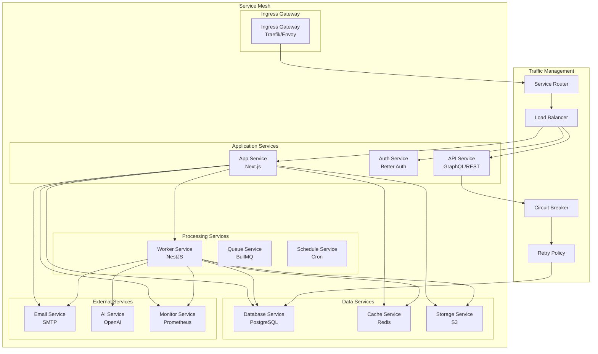

## 📊 Data Flow Diagrams

### Test Execution Flow

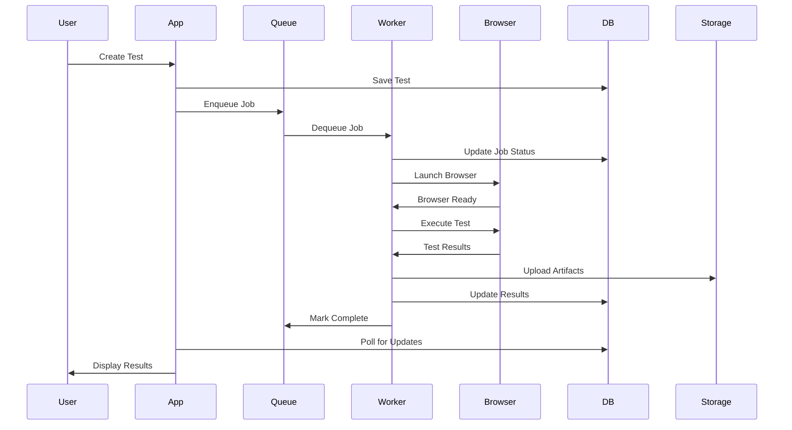

### Monitoring Flow

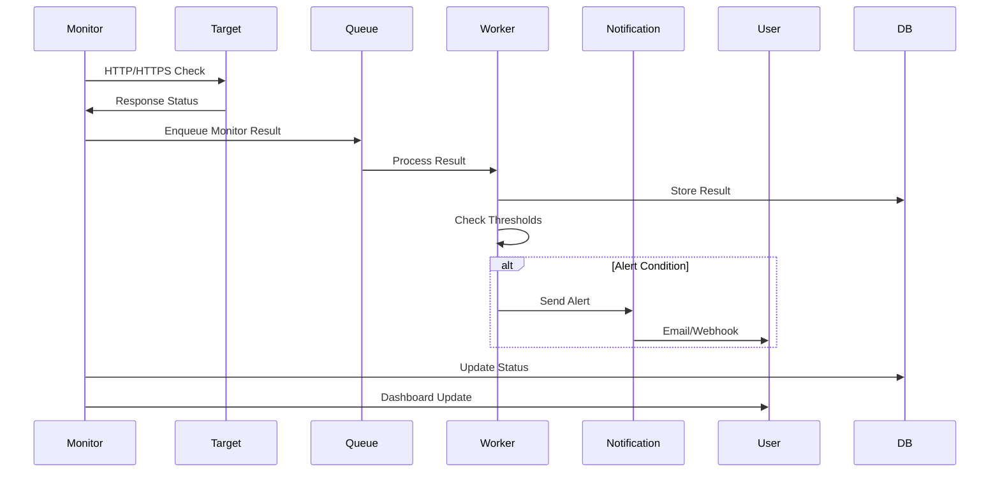

### Job Scheduling Flow

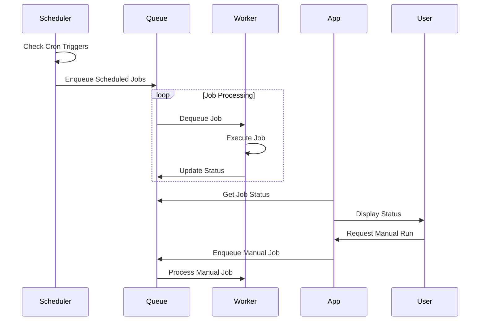

## 📈 Scaling Architectures

### Auto-scaling Architecture

```mermaid
graph TB
    subgraph "Monitoring Layer"
        Prometheus[Prometheus<br/>Metrics Collection]
        Grafana[Grafana<br/>Visualization]
        AlertManager[AlertManager<br/>Alerting]
    end

    subgraph "Auto-scaling Layer"
        HPA[Horizontal Pod Autoscaler]
        VPA[Vertical Pod Autoscaler]
        ClusterAutoscaler[Cluster Autoscaler]
    end

    subgraph "Application Layer"
        App[Application Pods]
        Worker[Worker Pods]
        Queue[Job Queue]
    end

    subgraph "Infrastructure Layer"
        Nodes[Cluster Nodes]
        LoadBalancer[Load Balancer]
    end

    Prometheus --> HPA
    Prometheus --> VPA
    Prometheus --> ClusterAutoscaler

    HPA --> App
    HPA --> Worker
    VPA --> App
    VPA --> Worker
    ClusterAutoscaler --> Nodes

    App --> Queue
    Worker --> Queue
    App --> LoadBalancer
    Worker --> LoadBalancer

    Nodes --> App
    Nodes --> Worker
```

### Multi-region Scaling

```mermaid
graph TB
    subgraph "Global Layer"
        GlobalLB[Global Load Balancer]
        DNS[DNS / Geo-routing]
        CDN[Content Delivery Network]
    end

    subgraph "Region 1 - Primary"
        LB1[Regional Load Balancer]
        App1[App Cluster 1]
        Worker1[Worker Cluster 1]
        DB1[(Primary Database)]
        Redis1[(Primary Redis)]
    end

    subgraph "Region 2 - Secondary"
        LB2[Regional Load Balancer]
        App2[App Cluster 2]
        Worker2[Worker Cluster 2]
        DB2[(Read Replica)]
        Redis2[(Read Replica)]
    end

    subgraph "Region 3 - DR"
        LB3[Regional Load Balancer]
        App3[App Cluster 3]
        Worker3[Worker Cluster 3]
        DB3[(Backup Replica)]
        Redis3[(Backup Redis)]
    end

    subgraph "Global Services"
        GlobalStorage[Global S3]
        GlobalCache[Global CDN]
        GlobalDNS[Global DNS]
    end

    DNS --> GlobalLB
    GlobalLB --> LB1
    GlobalLB --> LB2
    GlobalLB --> LB3

    LB1 --> App1
    LB2 --> App2
    LB3 --> App3

    App1 --> Worker1
    App2 --> Worker2
    App3 --> Worker3

    App1 --> DB1
    App2 --> DB2
    App3 --> DB3

    DB1 --> DB2
    DB1 --> DB3

    App1 --> Redis1
    App2 --> Redis2
    App3 --> Redis3

    Redis1 --> Redis2
    Redis1 --> Redis3

    App1 --> GlobalStorage
    App2 --> GlobalStorage
    App3 --> GlobalStorage

    Worker1 --> GlobalCache
    Worker2 --> GlobalCache
    Worker3 --> GlobalCache
```

## 🔒 Security Architecture

### Security Layers

```mermaid
graph TB
    subgraph "Edge Security"
        WAF[Web Application Firewall]
        DDoS[DDoS Protection]
        CDN[CloudFlare CDN]
    end

    subgraph "Network Security"
        FW[Firewall Rules]
        VPC[Virtual Private Cloud]
        Subnets[Private Subnets]
        NACL[Network ACLs]
    end

    subgraph "Application Security"
        Auth[Authentication<br/>Better Auth]
        RBAC[Role-Based Access Control]
        APIKeys[API Key Management]
        RateLimit[Rate Limiting]
    end

    subgraph "Data Security"
        Encryption[Encryption at Rest]
        TLS[TLS in Transit]
        Secrets[Secrets Management]
        Backup[Secure Backups]
    end

    subgraph "Container Security"
        ImageScan[Image Scanning]
        RuntimeSec[Runtime Security]
        NetworkPolicy[Network Policies]
        PodSecurity[Pod Security]
    end

    subgraph "Monitoring Security"
        AuditLogs[Audit Logging]
        SIEM[Security Information]
        Alerts[Security Alerts]
        Compliance[Compliance Checks]
    end

    WAF --> FW
    FW --> Auth
    Auth --> Encryption
    Encryption --> ImageScan
    ImageScan --> AuditLogs

    DDoS --> VPC
    VPC --> RBAC
    RBAC --> TLS
    TLS --> RuntimeSec
    RuntimeSec --> SIEM

    CDN --> Subnets
    Subnets --> APIKeys
    APIKeys --> Secrets
    Secrets --> NetworkPolicy
    NetworkPolicy --> Alerts

    NACL --> RateLimit
    RateLimit --> Backup
    Backup --> PodSecurity
    PodSecurity --> Compliance
```

### Zero Trust Architecture

```mermaid
graph TB
    subgraph "Identity Layer"
        IdP[Identity Provider]
        MFA[Multi-Factor Auth]
        SSO[Single Sign-On]
        UserMgmt[User Management]
    end

    subgraph "Policy Engine"
        Policy[Access Policies]
        Context[Contextual Access]
        Risk[Risk Assessment]
        Adaptive[Adaptive Auth]
    end

    subgraph "Network Segmentation"
        MicroSeg[Micro-segmentation]
        ServiceMesh[Service Mesh]
        mTLS[mTLS Encryption]
        ZeroTrustNet[Zero Trust Network]
    end

    subgraph "Application Security"
        APIGateway[API Gateway]
        ServiceAuth[Service Auth]
        JWT[JWT Tokens]
        OAuth[OAuth 2.0]
    end

    subgraph "Data Protection"
        DataEncryption[Data Encryption]
        KeyManagement[Key Management]
        DataClassification[Data Classification]
        DLP[Data Loss Prevention]
    end

    subgraph "Threat Detection"
        Anomaly[Anomaly Detection]
        ThreatIntel[Threat Intelligence]
        Behavioral[Behavioral Analysis]
        Response[Automated Response]
    end

    IdP --> Policy
    Policy --> MicroSeg
    MicroSeg --> APIGateway
    APIGateway --> DataEncryption
    DataEncryption --> Anomaly

    MFA --> Context
    Context --> ServiceMesh
    ServiceMesh --> ServiceAuth
    ServiceAuth --> KeyManagement
    KeyManagement --> ThreatIntel

    SSO --> Risk
    Risk --> mTLS
    mTLS --> JWT
    JWT --> DataClassification
    DataClassification --> Behavioral

    UserMgmt --> Adaptive
    Adaptive --> ZeroTrustNet
    ZeroTrustNet --> OAuth
    OAuth --> DLP
    DLP --> Response
```

---

These architectural diagrams provide comprehensive visual representations of all Supercheck deployment options, helping technical teams understand the infrastructure, networking, and security aspects of each deployment scenario.
