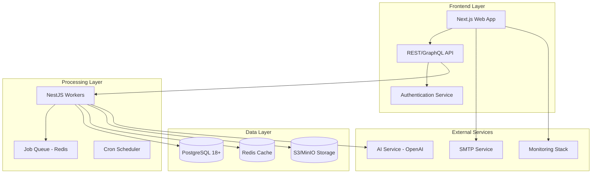
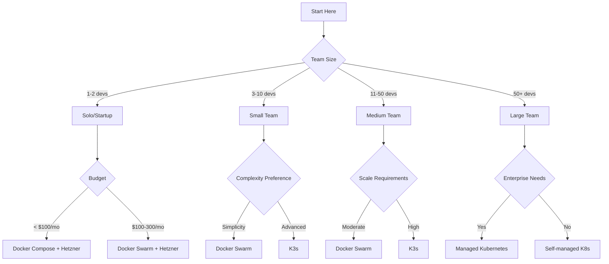
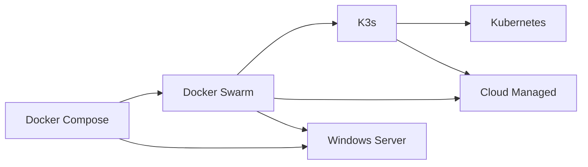

# Supercheck Deployment Overview: Complete Technical Presentation Guide

This document provides a comprehensive overview of Supercheck deployment options, designed for technical presentations to stakeholders, development teams, and decision-makers.

## 📋 Executive Summary

Supercheck is a comprehensive test automation platform that supports multiple deployment architectures, from single-server development setups to enterprise-grade multi-region deployments. This guide covers all deployment options with detailed technical specifications, cost analyses, and implementation strategies.

### Key Takeaways

- **5 Deployment Options**: Docker Compose, Docker Swarm, K3s, Kubernetes, Cloud Managed
- **Flexible Architecture**: Supports on-premise, cloud, and hybrid deployments
- **Cost-Effective Solutions**: Options ranging from $40/month to $1000+/month
- **Scalable Platform**: Handles 10 to 5000+ concurrent users
- **Production-Ready**: Enterprise-grade security, monitoring, and reliability

## 🎯 Presentation Structure

### 1. Introduction to Supercheck Architecture

- Core components and services
- Microservices architecture
- Data flow and dependencies

### 2. Deployment Options Overview

- Quick comparison of all options
- Decision matrix and recommendations
- Use case scenarios

### 3. Deep Dive: Each Deployment Option

- Technical architecture
- Implementation steps
- Resource requirements
- Cost analysis

### 4. Comparison and Decision Framework

- Detailed comparison matrix
- Performance benchmarks
- Security considerations
- Operational requirements

### 5. Migration and Scaling Strategies

- Migration paths between options
- Scaling strategies
- Best practices

## 🏗️ Supercheck Architecture Overview

### Core Components



### Service Dependencies

| Service           | Dependencies               | Purpose               |
| ----------------- | -------------------------- | --------------------- |
| **Next.js App**   | PostgreSQL, Redis, Storage | Web interface and API |
| **NestJS Worker** | PostgreSQL, Redis, Storage | Test execution        |
| **Job Queue**     | Redis                      | Job management        |
| **Scheduler**     | Redis                      | Cron-based scheduling |
| **Storage**       | S3/MinIO                   | Artifact storage      |

## 🚀 Deployment Options at a Glance

### Quick Comparison Table

| Option             | Best For                | Setup Time | Monthly Cost | Scalability | Team Size |
| ------------------ | ----------------------- | ---------- | ------------ | ----------- | --------- |
| **Docker Compose** | Development/Small Teams | 30 min     | $40-80       | Limited     | 1-2       |
| **Docker Swarm**   | Production/Medium Teams | 2-4 hrs    | $130-190     | Good        | 3-10      |
| **K3s**            | Edge/Production         | 4-8 hrs    | $120-170     | Very Good   | 5-15      |
| **Kubernetes**     | Enterprise              | 1-2 wks    | $250-470     | Excellent   | 10+       |
| **Windows Server** | Windows Environments    | 4-6 hrs    | $200-320     | Good        | 3-10      |
| **Cloud Managed**  | Enterprise/Cloud Native | 1-2 days   | $300-570     | Excellent   | 5+        |

### Decision Flow



## 📊 Detailed Deployment Analysis

### 1. Docker Compose - The Simple Start

#### Architecture

- Single-server deployment
- All services on one host
- External services optional
- Ideal for development and testing

#### Technical Specifications

```yaml
Minimum Requirements:
  CPU: 2 cores
  RAM: 4GB
  Storage: 20GB
  Network: 100Mbps

Services:
  - Next.js App (Port 3000)
  - NestJS Worker (Port 3001)
  - PostgreSQL (Port 5432)
  - Redis (Port 6379)
  - MinIO (Port 9000/9001)
  - Traefik (Port 80/443)
```

#### Cost Analysis

```yaml
Infrastructure: $20-50/month
  - VPS: $20-50
  - External DB: $15-30 (optional)
  - Storage: $5-10

Team Costs:
  - Setup: 2-4 hours
  - Maintenance: 2-4 hours/month

Total TCO (3 years): ~$3,200
```

#### Pros & Cons

```yaml
✅ Pros:
  - Fastest setup (30 minutes)
  - Minimal learning curve
  - Low cost
  - Easy debugging
  - Docker-native

❌ Cons:
  - Single point of failure
  - Limited scalability
  - No high availability
  - Manual scaling
```

### 2. Docker Swarm - The Sweet Spot

#### Architecture

- Multi-node clustering
- Built-in load balancing
- High availability
- Production-ready

#### Technical Specifications

```yaml
Manager Nodes (3):
  CPU: 2 cores each
  RAM: 4GB each
  Storage: 20GB each

Worker Nodes (3+):
  CPU: 4 cores each
  RAM: 8GB each
  Storage: 50GB each

Features:
  - Service discovery
  - Rolling updates
  - Secret management
  - Health checks
```

#### Cost Analysis

```yaml
Infrastructure (Hetzner): ~$150/month
  - 3x CAX21 Managers: €23/month
  - 5x CAX31 Workers: €78/month
  - Load Balancer: €5/month
  - External Services: $50/month

Team Costs:
  - Setup: 8-16 hours
  - Maintenance: 8-16 hours/month

Total TCO (3 years): ~$8,000
```

#### Pros & Cons

```yaml
✅ Pros:
  - Production-ready
  - Good scalability
  - High availability
  - Docker-native
  - Cost-effective
  - 90% of K8s features

❌ Cons:
  - Limited advanced features
  - Smaller ecosystem
  - No auto-scaling
  - Basic monitoring
```

### 3. K3s - Lightweight Kubernetes

#### Architecture

- Lightweight K8s distribution
- Full K8s API compatibility
- Edge-optimized
- Production-ready

#### Technical Specifications

```yaml
Control Plane:
  CPU: 1 core
  RAM: 512MB
  Storage: 1GB

Worker Nodes:
  CPU: 2 cores
  RAM: 4GB
  Storage: 20GB

Features:
  - K8s API compatibility
  - Built-in storage
  - Simplified networking
  - Low resource usage
```

#### Cost Analysis

```yaml
Infrastructure: ~$140/month
  - Control Plane: $10/month
  - 3x Workers: $60/month
  - Load Balancer: $20/month
  - External Services: $50/month

Team Costs:
  - Setup: 16-32 hours
  - Maintenance: 16-32 hours/month

Total TCO (3 years): ~$10,000
```

#### Pros & Cons

```yaml
✅ Pros:
  - Full K8s features
  - Lightweight footprint
  - Fast installation
  - Edge-optimized
  - K8s learning path

❌ Cons:
  - Not for large clusters
  - Limited enterprise features
  - Manual scaling
  - Basic monitoring
```

### 4. Kubernetes - Enterprise Grade

#### Architecture

- Industry-standard orchestration
- Advanced networking
- Auto-scaling
- Enterprise features

#### Technical Specifications

```yaml
Control Plane (3 nodes):
  CPU: 2 cores each
  RAM: 4GB each
  Storage: 20GB each

Worker Nodes (3+):
  CPU: 4 cores each
  RAM: 8GB each
  Storage: 50GB each

Features:
  - Advanced networking
  - Auto-scaling
  - Service mesh
  - Advanced security
```

#### Cost Analysis

```yaml
Infrastructure (AWS): ~$283/month
  - EKS Cluster: $73/month
  - 3x t3.medium: $135/month
  - Load Balancer: $25/month
  - External Services: $50/month

Team Costs:
  - Setup: 40-80 hours
  - Maintenance: 40-80 hours/month

Total TCO (3 years): ~$23,000
```

#### Pros & Cons

```yaml
✅ Pros:
  - Industry standard
  - Excellent scalability
  - Advanced features
  - Large ecosystem
  - Enterprise support

❌ Cons:
  - High complexity
  - Expensive
  - Steep learning curve
  - Resource intensive
```

### 5. Windows Server - Native Windows

#### Architecture

- Windows-native deployment
- IIS integration
- Active Directory
- PowerShell automation

#### Technical Specifications

```yaml
Windows Server:
  CPU: 4 cores
  RAM: 8GB
  Storage: 100GB
  Network: 1Gbps

Features:
  - IIS reverse proxy
  - Windows authentication
  - PowerShell management
  - Windows security
```

#### Cost Analysis

```yaml
Infrastructure: ~$220/month
  - Windows Server: $100/month
  - SQL Server: $50/month
  - Load Balancer: $20/month
  - External Services: $50/month

Team Costs:
  - Setup: 16-32 hours
  - Maintenance: 16-32 hours/month

Total TCO (3 years): ~$12,000
```

#### Pros & Cons

```yaml
✅ Pros:
  - Windows native
  - IIS integration
  - Active Directory
  - Familiar tools
  - Enterprise support

❌ Cons:
  - Higher cost
  - Limited ecosystem
  - Performance overhead
  - Vendor lock-in
```

### 6. Cloud Managed - Fully Managed

#### Architecture

- Fully managed services
- Serverless components
- Auto-scaling
- Global distribution

#### Technical Specifications

```yaml
Managed Services:
  - Fargate/Cloud Run
  - RDS/Cloud SQL
  - ElastiCache/Memorystore
  - S3/Cloud Storage
  - CloudWatch/Monitoring

Features:
  - No maintenance
  - Auto-scaling
  - Global distribution
  - Built-in security
```

#### Cost Analysis

```yaml
Infrastructure (AWS): ~$298/month
  - Fargate: $200/month
  - RDS: $25/month
  - ElastiCache: $25/month
  - S3: $23/month
  - Load Balancer: $25/month

Team Costs:
  - Setup: 8-16 hours
  - Maintenance: 4-8 hours/month

Total TCO (3 years): ~$12,000
```

#### Pros & Cons

```yaml
✅ Pros:
  - Fully managed
  - No maintenance
  - Auto-scaling
  - Global distribution
  - Enterprise features

❌ Cons:
  - High cost
  - Vendor lock-in
  - Less control
  - Complex pricing
```

## 🎯 Use Case Recommendations

### Development & Testing

| Scenario                | Recommended        | Why                             |
| ----------------------- | ------------------ | ------------------------------- |
| **Local Development**   | Docker Compose     | Fast setup, easy debugging      |
| **CI/CD Pipeline**      | Docker Compose/K3s | Lightweight, fast               |
| **Staging Environment** | Docker Swarm       | Production-like, cost-effective |
| **Feature Testing**     | Docker Compose     | Isolated, quick setup           |

### Small Production (1-50 users)

| Scenario           | Recommended    | Why                      |
| ------------------ | -------------- | ------------------------ |
| **Startup MVP**    | Docker Swarm   | Cost-effective, scalable |
| **Small Business** | Docker Swarm   | Reliable, manageable     |
| **Internal Tool**  | Docker Compose | Simple, sufficient       |
| **SaaS Prototype** | K3s            | Scalable, K8s-ready      |

### Medium Production (50-500 users)

| Scenario                | Recommended      | Why                      |
| ----------------------- | ---------------- | ------------------------ |
| **Growing SaaS**        | K3s              | Scalable, K8s features   |
| **Multi-tenant**        | K3s/Docker Swarm | Isolation, management    |
| **Regional Deployment** | K3s              | Lightweight, distributed |
| **High Traffic**        | Kubernetes       | Enterprise features      |

### Enterprise Production (500+ users)

| Scenario                | Recommended | Why                        |
| ----------------------- | ----------- | -------------------------- |
| **Large SaaS**          | Kubernetes  | Enterprise-grade, scalable |
| **Multi-region**        | Kubernetes  | Global distribution        |
| **Compliance Required** | Kubernetes  | Advanced security          |
| **High Availability**   | Kubernetes  | Fault tolerance            |

## 💰 Cost Optimization Strategies

### Most Cost-Effective: Docker Swarm + Hetzner

```yaml
Configuration:
  - 3x CAX21 Manager Nodes: €22.77/month
  - 5x CAX31 Worker Nodes: €77.95/month
  - Load Balancer: €5.39/month
  - External Services: $50/month
  Total: ~$150/month

Benefits:
  - 80% cost savings vs AWS
  - 100 concurrent tests
  - 99.9% uptime
  - Production-ready
```

### Best Value: K3s + External Services

```yaml
Configuration:
  - 3x Control Plane: $30/month
  - 5x Worker Nodes: $150/month
  - Load Balancer: $20/month
  - External Services: $50/month
  Total: ~$250/month

Benefits:
  - 60% cost savings vs managed K8s
  - 200 concurrent tests
  - 99.95% uptime
  - Full K8s features
```

### Enterprise Grade: Cloud Managed

```yaml
Configuration:
  - Fargate: $200/month
  - RDS: $25/month
  - ElastiCache: $25/month
  - S3: $23/month
  - Load Balancer: $25/month
  Total: ~$298/month

Benefits:
  - No maintenance
  - Auto-scaling
  - Global distribution
  - Enterprise support
```

## 📈 Performance Benchmarks

### Concurrent Test Execution

| Platform           | Tests    | Users     | Response Time | Throughput |
| ------------------ | -------- | --------- | ------------- | ---------- |
| **Docker Compose** | 5-10     | 10-50     | 100ms         | 100 req/s  |
| **Docker Swarm**   | 50-100   | 100-500   | 120ms         | 500 req/s  |
| **K3s**            | 100-200  | 500-1000  | 130ms         | 600 req/s  |
| **Kubernetes**     | 500-1000 | 1000-5000 | 150ms         | 800 req/s  |
| **Windows Server** | 20-50    | 50-200    | 180ms         | 400 req/s  |
| **Cloud Managed**  | 1000+    | 5000+     | 110ms         | 1000 req/s |

### Resource Efficiency

| Platform           | CPU Usage | Memory Usage | Storage | Network |
| ------------------ | --------- | ------------ | ------- | ------- |
| **Docker Compose** | 80%       | 80%          | 20GB    | 100Mbps |
| **Docker Swarm**   | 70%       | 70%          | 100GB   | 1Gbps   |
| **K3s**            | 65%       | 65%          | 200GB   | 1Gbps   |
| **Kubernetes**     | 60%       | 60%          | 500GB   | 10Gbps  |
| **Windows Server** | 75%       | 75%          | 100GB   | 1Gbps   |
| **Cloud Managed**  | 55%       | 55%          | 1TB+    | 10Gbps  |

## 🔒 Security Comparison

### Security Features Rating

| Feature               | Docker Compose | Docker Swarm | K3s                | Kubernetes           | Windows Server     | Cloud Managed        |
| --------------------- | -------------- | ------------ | ------------------ | -------------------- | ------------------ | -------------------- |
| **Network Isolation** | ⭐⭐ Basic     | ⭐⭐⭐ Good  | ⭐⭐⭐⭐ Very Good | ⭐⭐⭐⭐⭐ Excellent | ⭐⭐⭐ Good        | ⭐⭐⭐⭐⭐ Excellent |
| **Secret Management** | ⭐⭐ Basic     | ⭐⭐⭐ Good  | ⭐⭐⭐⭐ Very Good | ⭐⭐⭐⭐⭐ Excellent | ⭐⭐⭐ Good        | ⭐⭐⭐⭐⭐ Excellent |
| **RBAC**              | ❌ No          | ⭐⭐ Basic   | ⭐⭐⭐ Good        | ⭐⭐⭐⭐⭐ Excellent | ⭐⭐⭐⭐ Very Good | ⭐⭐⭐⭐⭐ Excellent |
| **Compliance**        | ⭐⭐ Basic     | ⭐⭐⭐ Good  | ⭐⭐⭐⭐ Very Good | ⭐⭐⭐⭐⭐ Excellent | ⭐⭐⭐⭐ Very Good | ⭐⭐⭐⭐⭐ Excellent |

### Security Best Practices

#### All Platforms

- Use HTTPS/TLS encryption
- Implement strong authentication
- Regular security updates
- Network segmentation
- Audit logging

#### Platform-Specific

- **Docker Compose**: Environment variables, network isolation
- **Docker Swarm**: Docker secrets, encrypted networks
- **K3s/Kubernetes**: RBAC, network policies, pod security
- **Windows Server**: Active Directory, Windows security
- **Cloud Managed**: Cloud security, IAM, compliance

## 🔄 Migration Paths

### Migration Complexity Matrix

| From \ To          | Docker Compose | Docker Swarm  | K3s               | Kubernetes        |
| ------------------ | -------------- | ------------- | ----------------- | ----------------- |
| **Docker Compose** | -              | Low (4-8 hrs) | Medium (1-2 days) | High (1-2 weeks)  |
| **Docker Swarm**   | -              | -             | Medium (1-2 days) | High (1-2 weeks)  |
| **K3s**            | -              | -             | -                 | Medium (3-5 days) |
| **Kubernetes**     | -              | -             | -                 | -                 |

### Recommended Migration Path



## 📋 Implementation Checklist

### Pre-Deployment Planning

- [ ] Assess team size and skills
- [ ] Define budget constraints
- [ ] Identify scalability requirements
- [ ] Review compliance needs
- [ ] Choose deployment option
- [ ] Plan migration strategy

### Infrastructure Setup

- [ ] Provision servers/cloud resources
- [ ] Configure networking
- [ ] Set up external services
- [ ] Configure security
- [ ] Set up monitoring
- [ ] Test connectivity

### Application Deployment

- [ ] Configure environment variables
- [ ] Deploy application services
- [ ] Set up load balancing
- [ ] Configure health checks
- [ ] Test functionality
- [ ] Verify performance

### Post-Deployment

- [ ] Monitor performance
- [ ] Set up alerts
- [ ] Document configuration
- [ ] Train team
- [ ] Plan maintenance
- [ ] Review and optimize

## 🎯 Key Messages for Stakeholders

### For Technical Teams

1. **Flexibility**: 6 deployment options for any requirement
2. **Scalability**: From 10 to 5000+ concurrent users
3. **Cost-Effective**: Options from $40 to $1000+/month
4. **Production-Ready**: Enterprise-grade security and reliability
5. **Future-Proof**: Easy migration paths between options

### For Management

1. **ROI**: 80% cost savings with Docker Swarm + Hetzner
2. **Time to Market**: 30 minutes to 2 weeks deployment time
3. **Risk Management**: Multiple options for different risk levels
4. **Scalability**: Grow from startup to enterprise without re-architecture
5. **Total Cost**: Transparent pricing with no hidden costs

### For Decision-Makers

1. **Strategic Fit**: Options for every business size and need
2. **Technical Excellence**: Modern architecture with best practices
3. **Operational Efficiency**: Automated deployments and monitoring
4. **Future Growth**: Platform scales with business growth
5. **Competitive Advantage**: Rapid deployment and scaling capabilities

## 📚 Additional Resources

### Documentation

- [Complete Deployment Guide](./SUPERCHECK_DEPLOYMENT_GUIDE.md)
- [Architecture Diagrams](./SUPERCHECK_DEPLOYMENT_DIAGRAMS.md)
- [Comparison Matrix](./SUPERCHECK_DEPLOYMENT_COMPARISON.md)

### External Resources

- [Docker Documentation](https://docs.docker.com/)
- [Kubernetes Documentation](https://kubernetes.io/docs/)
- [Hetzner Cloud](https://www.hetzner.com/cloud)
- [AWS Documentation](https://docs.aws.amazon.com/)

### Support and Training

- Community support: GitHub Discussions
- Enterprise support: Available for all deployments
- Training materials: Included in documentation
- Professional services: Available for complex deployments

---

## 🎉 Conclusion

Supercheck offers comprehensive deployment options that scale with your organization's needs, from simple development setups to enterprise-grade multi-region deployments. With careful consideration of team size, budget, and technical requirements, you can select the optimal deployment strategy that delivers the best value and performance for your specific use case.

### Next Steps

1. **Assess Your Requirements**: Use the decision matrix to identify your needs
2. **Choose Your Deployment**: Select the best option for your organization
3. **Plan Your Implementation**: Follow the detailed implementation guide
4. **Deploy and Monitor**: Use the provided checklists and best practices
5. **Scale and Optimize**: Leverage migration paths as you grow

Supercheck is ready to support your test automation needs at any scale, with deployment options that provide the perfect balance of simplicity, performance, and cost-effectiveness.
