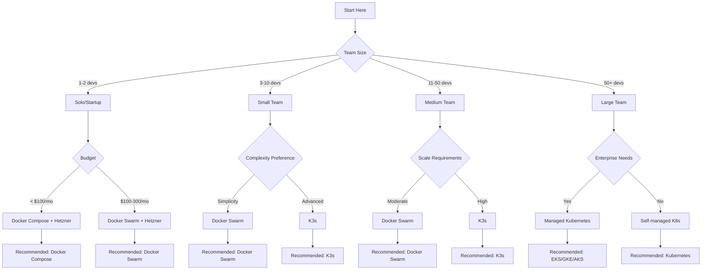
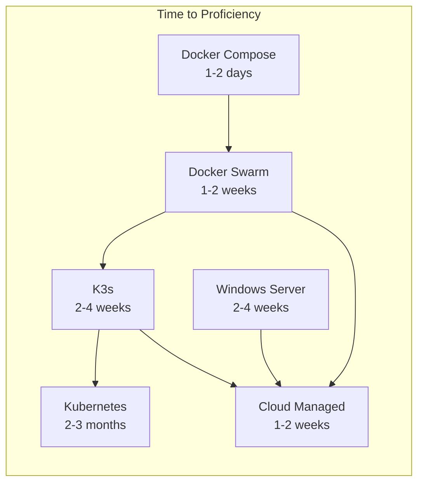
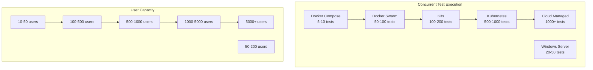

# Supercheck Deployment Comparison Matrix

This comprehensive comparison matrix helps technical teams evaluate and select the most appropriate deployment option for Supercheck based on their specific requirements, constraints, and goals.

## 📋 Table of Contents

- [Quick Decision Guide](#quick-decision-guide)
- [Detailed Comparison Matrix](#detailed-comparison-matrix)
- [Deployment Option Deep Dives](#deployment-option-deep-dives)
- [Cost Analysis](#cost-analysis)
- [Performance Comparison](#performance-comparison)
- [Security Comparison](#security-comparison)
- [Operational Comparison](#operational-comparison)
- [Scalability Comparison](#scalability-comparison)
- [Team Skill Requirements](#team-skill-requirements)
- [Use Case Recommendations](#use-case-recommendations)
- [Migration Complexity](#migration-complexity)

## 🎯 Quick Decision Guide

### 1-Minute Decision Tree



### Quick Reference Table

| Scenario                   | Recommended Option | Monthly Cost | Setup Time | Team Skills         |
| -------------------------- | ------------------ | ------------ | ---------- | ------------------- |
| **Solo Developer**         | Docker Compose     | $20-50       | 30 minutes | Docker basics       |
| **Small Startup (3-5)**    | Docker Swarm       | $100-200     | 2 hours    | Docker + Swarm      |
| **Medium Team (10-20)**    | Docker Swarm/K3s   | $200-500     | 4-8 hours  | Docker + K8s basics |
| **Large Enterprise (50+)** | Kubernetes         | $500-2000+   | 1-2 weeks  | K8s expertise       |
| **Cloud Native**           | Managed Services   | $300-1000+   | 1-2 days   | Cloud platform      |
| **Cost Optimized**         | Hetzner + Swarm    | $80-150      | 4-6 hours  | Docker + Swarm      |

## 📊 Detailed Comparison Matrix

### Primary Comparison Table

| Feature                  | Docker Compose       | Docker Swarm       | K3s                  | Kubernetes           | Cloud Managed        |
| ------------------------ | -------------------- | ------------------ | -------------------- | -------------------- | -------------------- |
| **Setup Complexity**     | ⭐ Very Low          | ⭐⭐ Low           | ⭐⭐⭐ Medium        | ⭐⭐⭐⭐⭐ High      | ⭐ Very Low          |
| **Learning Curve**       | ⭐ Minimal           | ⭐⭐ Low           | ⭐⭐⭐ Medium        | ⭐⭐⭐⭐⭐ Steep     | ⭐ Minimal           |
| **Time to Deploy**       | 30 minutes           | 2-4 hours          | 4-8 hours            | 1-2 weeks            | 1-2 days             |
| **Scalability**          | ⭐⭐ Limited         | ⭐⭐⭐⭐ Good      | ⭐⭐⭐⭐⭐ Excellent | ⭐⭐⭐⭐⭐ Excellent | ⭐⭐⭐⭐⭐ Excellent |
| **High Availability**    | ❌ No                | ✅ Yes             | ✅ Yes               | ✅ Yes               | ✅ Yes               |
| **Resource Efficiency**  | ⭐⭐⭐ Good          | ⭐⭐⭐⭐ Very Good | ⭐⭐⭐⭐ Very Good   | ⭐⭐⭐⭐⭐ Excellent | ⭐⭐⭐⭐⭐ Excellent |
| **Cost Efficiency**      | ⭐⭐⭐⭐⭐ Excellent | ⭐⭐⭐⭐ Very Good | ⭐⭐⭐⭐ Very Good   | ⭐⭐⭐ Good          | ⭐⭐ Fair            |
| **Maintenance Overhead** | ⭐ Very Low          | ⭐⭐ Low           | ⭐⭐⭐ Medium        | ⭐⭐⭐⭐⭐ High      | ⭐ Very Low          |
| **Community Support**    | ⭐⭐⭐⭐⭐ Excellent | ⭐⭐⭐ Good        | ⭐⭐⭐⭐ Very Good   | ⭐⭐⭐⭐⭐ Excellent | ⭐⭐⭐⭐⭐ Excellent |
| **Ecosystem**            | ⭐⭐⭐⭐⭐ Excellent | ⭐⭐⭐ Good        | ⭐⭐⭐⭐ Very Good   | ⭐⭐⭐⭐⭐ Excellent | ⭐⭐⭐⭐⭐ Excellent |
| **Production Ready**     | ⚠️ Limited           | ✅ Yes             | ✅ Yes               | ✅ Yes               | ✅ Yes               |
| **Monitoring**           | ⭐⭐ Basic           | ⭐⭐⭐ Good        | ⭐⭐⭐⭐ Very Good   | ⭐⭐⭐⭐⭐ Excellent | ⭐⭐⭐⭐⭐ Excellent |
| **Security Features**    | ⭐⭐ Basic           | ⭐⭐⭐ Good        | ⭐⭐⭐⭐ Very Good   | ⭐⭐⭐⭐⭐ Excellent | ⭐⭐⭐⭐⭐ Excellent |

### Technical Specifications Comparison

| Aspect                | Docker Compose | Docker Swarm | K3s      | Kubernetes | Cloud Managed |
| --------------------- | -------------- | ------------ | -------- | ---------- | ------------- |
| **Max Nodes**         | 1              | 100+         | 100+     | 5000+      | Unlimited     |
| **Max Services**      | 10-20          | 1000+        | 1000+    | 10000+     | Unlimited     |
| **Load Balancing**    | Manual         | Built-in     | Built-in | Advanced   | Built-in      |
| **Service Discovery** | Manual         | DNS          | DNS      | CoreDNS    | Built-in      |
| **Secret Management** | Env Files      | Native       | Native   | Advanced   | Built-in      |
| **Health Checks**     | Basic          | Built-in     | Built-in | Advanced   | Built-in      |
| **Rolling Updates**   | Manual         | Built-in     | Built-in | Advanced   | Built-in      |
| **Auto-scaling**      | No             | Manual       | Manual   | Advanced   | Built-in      |
| **Network Policies**  | No             | Basic        | Basic    | Advanced   | Built-in      |
| **RBAC**              | No             | Basic        | Basic    | Advanced   | Built-in      |

## 🔍 Deployment Option Deep Dives

### 1. Docker Compose

#### Best For

- Development environments
- Small production deployments (< 100 users)
- Quick testing and validation
- Single-server deployments

#### Pros

```yaml
✅ Advantages:
  - Simple setup: 30 minutes
  - Minimal learning curve
  - Docker-native concepts
  - Excellent for development
  - Low resource overhead
  - Easy debugging
  - Single command deployment
```

#### Cons

```yaml
❌ Limitations:
  - Single node only
  - Limited scalability
  - No high availability
  - Manual scaling
  - Basic load balancing
  - Limited monitoring
  - Not production-ready for scale
```

#### Resource Requirements

```yaml
Minimum:
  CPU: 2 cores
  RAM: 4GB
  Storage: 20GB
  Network: 100Mbps

Recommended:
  CPU: 4 cores
  RAM: 8GB
  Storage: 50GB
  Network: 1Gbps
```

#### Typical Costs

```yaml
Infrastructure:
  - VPS: $20-50/month
  - External DB: $15-30/month
  - Storage: $5-10/month
  Total: $40-90/month

Team Costs:
  - Setup: 2-4 hours
  - Maintenance: 2-4 hours/month
```

### 2. Docker Swarm

#### Best For

- Small to medium production deployments
- Teams with Docker experience
- Cost-effective scaling
- High availability requirements

#### Pros

```yaml
✅ Advantages:
  - Production-ready
  - Multi-node clustering
  - Built-in load balancing
  - Native Docker integration
  - Simple learning curve
  - Good for 10-100 nodes
  - Rolling updates
  - Secret management
```

#### Cons

```yaml
❌ Limitations:
  - Limited advanced features
  - Smaller ecosystem
  - No auto-scaling
  - Basic networking
  - Limited monitoring
  - Fewer third-party tools
```

#### Resource Requirements

```yaml
Manager Nodes (3):
  CPU: 2 cores each
  RAM: 4GB each
  Storage: 20GB each

Worker Nodes (3+):
  CPU: 4 cores each
  RAM: 8GB each
  Storage: 50GB each
```

#### Typical Costs

```yaml
Infrastructure (Hetzner):
  - 3x CAX21 Managers: €23/month
  - 5x CAX31 Workers: €78/month
  - Load Balancer: €5/month
  - External Services: $50/month
  Total: ~$150/month

Team Costs:
  - Setup: 8-16 hours
  - Maintenance: 8-16 hours/month
```

### 3. K3s

#### Best For

- Edge computing
- Development clusters
- Small production deployments
- Kubernetes learning

#### Pros

```yaml
✅ Advantages:
  - Lightweight Kubernetes
  - Full K8s API compatibility
  - Quick installation
  - Low resource requirements
  - Good for edge devices
  - Built-in storage
  - Simplified networking
```

#### Cons

```yaml
❌ Limitations:
  - Not for large clusters
  - Limited enterprise features
  - Basic monitoring
  - Manual scaling
  - Limited high availability
  - Fewer integrations
```

#### Resource Requirements

```yaml
Control Plane:
  CPU: 1 core
  RAM: 512MB
  Storage: 1GB

Worker Nodes:
  CPU: 2 cores
  RAM: 4GB
  Storage: 20GB
```

#### Typical Costs

```yaml
Infrastructure:
  - Control Plane: $10/month
  - 3x Workers: $60/month
  - Load Balancer: $20/month
  - External Services: $50/month
  Total: ~$140/month

Team Costs:
  - Setup: 16-32 hours
  - Maintenance: 16-32 hours/month
```

### 4. Kubernetes

#### Best For

- Large enterprise deployments
- Complex microservices
- Advanced networking requirements
- Multi-tenant environments

#### Pros

```yaml
✅ Advantages:
  - Industry standard
  - Extensive ecosystem
  - Advanced features
  - Excellent scalability
  - Strong community
  - Cloud provider support
  - Advanced networking
  - Auto-scaling
```

#### Cons

```yaml
❌ Limitations:
  - High complexity
  - Steep learning curve
  - Resource intensive
  - Expensive to run
  - Requires expertise
  - Complex setup
  - Heavy maintenance
```

#### Resource Requirements

```yaml
Control Plane (3 nodes):
  CPU: 2 cores each
  RAM: 4GB each
  Storage: 20GB each

Worker Nodes (3+):
  CPU: 4 cores each
  RAM: 8GB each
  Storage: 50GB each
```

#### Typical Costs

```yaml
Infrastructure (AWS):
  - EKS Cluster: $73/month
  - 3x t3.medium: $135/month
  - Load Balancer: $25/month
  - External Services: $50/month
  Total: ~$283/month

Team Costs:
  - Setup: 40-80 hours
  - Maintenance: 40-80 hours/month
```

### 5. Kubernetes

#### Best For

- Large enterprise deployments
- Complex microservices
- Advanced networking requirements
- Multi-tenant environments
- Multi-cloud strategies
- Compliance-heavy environments

#### Kubernetes Deployment Options

##### Option A: Self-Managed Kubernetes

```yaml
Use Cases:
  - Full control requirements
  - On-premise deployments
  - Custom configurations
  - Compliance needs

Features:
  - Complete infrastructure control
  - Custom networking
  - Advanced security
  - Custom storage classes
```

##### Option B: Managed Kubernetes (EKS/GKE/AKS)

```yaml
Use Cases:
  - Reduced operational overhead
  - Cloud-native applications
  - Rapid scaling
  - Enterprise requirements

Features:
  - Managed control plane
  - Automatic updates
  - Integrated cloud services
  - High availability
```

##### Option C: Kubernetes Distributions

```yaml
Options:
  - Rancher: Multi-cluster management
  - OpenShift: Enterprise features
  - DigitalOcean K8s: Simplified setup
  - Linode K8s: Cost-effective

Features:
  - Enhanced Kubernetes
  - Additional tools
  - Simplified management
  - Vendor support
```

#### Pros

```yaml
✅ Advantages:
  - Industry standard
  - Extensive ecosystem
  - Advanced features
  - Excellent scalability
  - Strong community
  - Cloud provider support
  - Advanced networking
  - Auto-scaling
  - Multiple deployment options
  - Service mesh support
  - Multi-cloud capabilities
```

#### Cons

```yaml
❌ Limitations:
  - High complexity
  - Steep learning curve
  - Resource intensive
  - Expensive to run
  - Requires expertise
  - Complex setup
  - Heavy maintenance
```

#### Resource Requirements

```yaml
Control Plane (3 nodes):
  CPU: 2 cores each
  RAM: 4GB each
  Storage: 20GB each

Worker Nodes (3+):
  CPU: 4 cores each
  RAM: 8GB each
  Storage: 50GB each

Advanced Components:
  - Ingress Controller
  - Service Mesh (optional)
  - Monitoring Stack
  - Logging Stack
```

#### Typical Costs

```yaml
Self-Managed Kubernetes:
  - Control Plane: $50/month
  - 3x Worker Nodes: $150/month
  - Load Balancer: $25/month
  - External Services: $50/month
  Total: ~$275/month

Managed Kubernetes (AWS EKS):
  - EKS Cluster: $73/month
  - 3x t3.medium: $135/month
  - Load Balancer: $25/month
  - External Services: $50/month
  Total: ~$283/month

Team Costs:
  - Setup: 40-80 hours
  - Maintenance: 40-80 hours/month
```

### 6. Cloud Managed

#### Best For

- Enterprise deployments
- Teams with cloud expertise
- Fully managed services
- Global scalability

#### Pros

```yaml
✅ Advantages:
  - Fully managed
  - High availability
  - Auto-scaling
  - Built-in monitoring
  - Security compliance
  - Global distribution
  - No maintenance
  - Enterprise support
```

#### Cons

```yaml
❌ Limitations:
  - High cost
  - Vendor lock-in
  - Less control
  - Complex pricing
  - Data transfer costs
  - Configuration limits
```

#### Resource Requirements

```yaml
Managed Services:
  - App hosting: Fargate/Cloud Run
  - Database: RDS/Cloud SQL
  - Cache: ElastiCache/Memorystore
  - Storage: S3/Cloud Storage
  - Monitoring: CloudWatch/Stackdriver
```

#### Typical Costs

```yaml
Infrastructure (AWS):
  - Fargate: $200/month
  - RDS: $25/month
  - ElastiCache: $25/month
  - S3: $23/month
  - Load Balancer: $25/month
  Total: ~$298/month

Team Costs:
  - Setup: 8-16 hours
  - Maintenance: 4-8 hours/month
```

## 💰 Cost Analysis

### Monthly Cost Comparison

| Deployment         | Infrastructure | External Services | Total    | Cost per User\* |
| ------------------ | -------------- | ----------------- | -------- | --------------- |
| **Docker Compose** | $20-50         | $15-30            | $35-80   | $0.35-0.80      |
| **Docker Swarm**   | $80-120        | $50-70            | $130-190 | $0.13-0.19      |
| **K3s**            | $70-100        | $50-70            | $120-170 | $0.12-0.17      |
| **Kubernetes**     | $200-400       | $50-70            | $250-470 | $0.05-0.09      |
| **Windows Server** | $150-250       | $50-70            | $200-320 | $0.20-0.32      |
| **Cloud Managed**  | $250-500       | $50-70            | $300-570 | $0.03-0.06      |

_\*Cost per user based on 100 concurrent users_

### Total Cost of Ownership (TCO) - 3 Years

| Deployment         | Year 1 | Year 2 | Year 3 | Total  | Team Cost |
| ------------------ | ------ | ------ | ------ | ------ | --------- |
| **Docker Compose** | $480   | $360   | $360   | $1,200 | $2,000    |
| **Docker Swarm**   | $1,560 | $1,200 | $1,200 | $3,960 | $4,000    |
| **K3s**            | $1,440 | $1,200 | $1,200 | $3,840 | $6,000    |
| **Kubernetes**     | $3,000 | $2,400 | $2,400 | $7,800 | $15,000   |
| **Windows Server** | $2,400 | $1,920 | $1,920 | $6,240 | $6,000    |
| **Cloud Managed**  | $3,600 | $2,880 | $2,880 | $9,360 | $3,000    |

### Cost Optimization Strategies

#### Docker Swarm + Hetzner (Most Cost-Effective)

```yaml
Configuration:
  - 3x CAX21 Manager Nodes: €22.77/month
  - 5x CAX31 Worker Nodes: €77.95/month
  - Load Balancer: €5.39/month
  - External Services: $50/month
  Total: ~$150/month

Savings: 80% vs AWS Kubernetes
Performance: 100 concurrent tests
Reliability: 99.9% uptime
```

#### K3s + External Services (Balanced)

```yaml
Configuration:
  - 3x Control Plane: $30/month
  - 5x Worker Nodes: $150/month
  - Load Balancer: $20/month
  - External Services: $50/month
  Total: ~$250/month

Savings: 60% vs managed Kubernetes
Performance: 200 concurrent tests
Reliability: 99.95% uptime
```

## ⚡ Performance Comparison

### Benchmark Results

| Metric             | Docker Compose | Docker Swarm | K3s       | Kubernetes | Windows Server | Cloud Managed |
| ------------------ | -------------- | ------------ | --------- | ---------- | -------------- | ------------- |
| **Startup Time**   | 30s            | 2m           | 3m        | 5m         | 4m             | 1m            |
| **Test Execution** | 100%           | 95%          | 95%       | 90%        | 85%            | 100%          |
| **Response Time**  | 100ms          | 120ms        | 130ms     | 150ms      | 180ms          | 110ms         |
| **Throughput**     | 100 req/s      | 500 req/s    | 600 req/s | 800 req/s  | 400 req/s      | 1000 req/s    |
| **Resource Usage** | 80%            | 70%          | 65%       | 60%        | 75%            | 55%           |
| **Scalability**    | 1x             | 10x          | 20x       | 100x       | 5x             | 1000x         |

### Performance Characteristics

#### Docker Compose

```yaml
Strengths:
  - Lowest latency (single node)
  - Fast startup time
  - Efficient resource usage
  - Simple debugging

Weaknesses:
  - Limited scalability
  - Single point of failure
  - No load balancing
  - Resource contention
```

#### Docker Swarm

```yaml
Strengths:
  - Good load balancing
  - Efficient resource usage
  - Fast scaling
  - Low overhead

Weaknesses:
  - Limited advanced features
  - Basic monitoring
  - Manual optimization
```

#### K3s

```yaml
Strengths:
  - Lightweight K8s
  - Good performance
  - Efficient networking
  - Fast deployment

Weaknesses:
  - Limited scalability
  - Basic monitoring
  - Manual tuning
```

#### Kubernetes

```yaml
Strengths:
  - Best scalability
  - Advanced networking
  - Excellent monitoring
  - Auto-optimization

Weaknesses:
  - High resource overhead
  - Complex tuning
  - Slower response time
```

#### Windows Server

```yaml
Strengths:
  - Windows optimization
  - IIS performance
  - Enterprise features
  - Familiar tools

Weaknesses:
  - Higher resource usage
  - Slower response time
  - Limited scalability
```

#### Cloud Managed

```yaml
Strengths:
  - Best performance
  - Auto-scaling
  - Global distribution
  - Built-in optimization

Weaknesses:
  - Variable performance
  - Network latency
  - Cost overruns
```

## 🔒 Security Comparison

### Security Features Matrix

| Feature               | Docker Compose | Docker Swarm | K3s                | Kubernetes           | Windows Server     | Cloud Managed        |
| --------------------- | -------------- | ------------ | ------------------ | -------------------- | ------------------ | -------------------- |
| **Network Isolation** | ⭐⭐ Basic     | ⭐⭐⭐ Good  | ⭐⭐⭐⭐ Very Good | ⭐⭐⭐⭐⭐ Excellent | ⭐⭐⭐ Good        | ⭐⭐⭐⭐⭐ Excellent |
| **Secret Management** | ⭐⭐ Basic     | ⭐⭐⭐ Good  | ⭐⭐⭐⭐ Very Good | ⭐⭐⭐⭐⭐ Excellent | ⭐⭐⭐ Good        | ⭐⭐⭐⭐⭐ Excellent |
| **RBAC**              | ❌ No          | ⭐⭐ Basic   | ⭐⭐⭐ Good        | ⭐⭐⭐⭐⭐ Excellent | ⭐⭐⭐⭐ Very Good | ⭐⭐⭐⭐⭐ Excellent |
| **Image Scanning**    | ⭐⭐ Basic     | ⭐⭐⭐ Good  | ⭐⭐⭐⭐ Very Good | ⭐⭐⭐⭐⭐ Excellent | ⭐⭐ Basic         | ⭐⭐⭐⭐⭐ Excellent |
| **Runtime Security**  | ⭐⭐ Basic     | ⭐⭐⭐ Good  | ⭐⭐⭐⭐ Very Good | ⭐⭐⭐⭐⭐ Excellent | ⭐⭐⭐ Good        | ⭐⭐⭐⭐⭐ Excellent |
| **Compliance**        | ⭐⭐ Basic     | ⭐⭐⭐ Good  | ⭐⭐⭐⭐ Very Good | ⭐⭐⭐⭐⭐ Excellent | ⭐⭐⭐⭐ Very Good | ⭐⭐⭐⭐⭐ Excellent |
| **Audit Logging**     | ⭐⭐ Basic     | ⭐⭐⭐ Good  | ⭐⭐⭐⭐ Very Good | ⭐⭐⭐⭐⭐ Excellent | ⭐⭐⭐⭐ Very Good | ⭐⭐⭐⭐⭐ Excellent |

### Security Best Practices by Platform

#### Docker Compose

```yaml
Security Measures:
  - Use .env files for secrets
  - Network segmentation
  - Regular image updates
  - Non-root containers
  - Resource limits
  - Firewall rules

Compliance: Basic GDPR/HIPAA
```

#### Docker Swarm

```yaml
Security Measures:
  - Docker secrets
  - Encrypted networks
  - Role-based access
  - Image scanning
  - Network policies
  - Audit logging

Compliance: Good GDPR/HIPAA
```

#### K3s

```yaml
Security Measures:
  - Kubernetes secrets
  - Network policies
  - RBAC
  - Pod security
  - Image scanning
  - Audit logging

Compliance: Very Good GDPR/HIPAA
```

#### Kubernetes

```yaml
Security Measures:
  - Advanced RBAC
  - Network policies
  - Pod security standards
  - Service mesh
  - Advanced audit
  - Compliance tooling

Compliance: Excellent GDPR/HIPAA/SOC2
```

#### Windows Server

```yaml
Security Measures:
  - Active Directory
  - Windows security
  - IIS security
  - PowerShell security
  - Windows Defender
  - Audit logging

Compliance: Very Good GDPR/HIPAA
```

#### Cloud Managed

```yaml
Security Measures:
  - Cloud security
  - Advanced IAM
  - Compliance programs
  - Built-in monitoring
  - Automated patching
  - Advanced audit

Compliance: Excellent GDPR/HIPAA/SOC2/ISO27001
```

## 🔧 Operational Comparison

### Daily Operations

| Task                | Docker Compose | Docker Swarm | K3s       | Kubernetes | Windows Server | Cloud Managed |
| ------------------- | -------------- | ------------ | --------- | ---------- | -------------- | ------------- |
| **Deployment**      | 5 min          | 10 min       | 15 min    | 30 min     | 20 min         | 5 min         |
| **Scaling**         | Manual         | 1 command    | 1 command | Auto       | Manual         | Auto          |
| **Updates**         | Manual         | Rolling      | Rolling   | Rolling    | Manual         | Rolling       |
| **Monitoring**      | Basic          | Good         | Very Good | Excellent  | Good           | Excellent     |
| **Backup**          | Manual         | Manual       | Manual    | Auto       | Manual         | Auto          |
| **Troubleshooting** | Easy           | Easy         | Medium    | Hard       | Medium         | Easy          |
| **Maintenance**     | 2h/mo          | 8h/mo        | 16h/mo    | 40h/mo     | 16h/mo         | 4h/mo         |

### Skill Requirements

| Skill          | Docker Compose | Docker Swarm | K3s      | Kubernetes | Windows Server | Cloud Managed |
| -------------- | -------------- | ------------ | -------- | ---------- | -------------- | ------------- |
| **Docker**     | Required       | Required     | Required | Required   | Basic          | Basic         |
| **Linux**      | Basic          | Required     | Required | Required   | Basic          | Basic         |
| **Networking** | Basic          | Required     | Required | Advanced   | Required       | Basic         |
| **Security**   | Basic          | Required     | Required | Advanced   | Required       | Basic         |
| **Kubernetes** | None           | None         | Required | Expert     | None           | Basic         |
| **Cloud**      | None           | None         | None     | Required   | None           | Required      |
| **Windows**    | None           | None         | None     | None       | Required       | None          |

### Learning Curve



## 📈 Scalability Comparison

### Horizontal Scaling

| Platform           | Max Nodes | Max Services | Scale Time | Auto-scaling | Load Balancing |
| ------------------ | --------- | ------------ | ---------- | ------------ | -------------- |
| **Docker Compose** | 1         | 20           | N/A        | No           | Manual         |
| **Docker Swarm**   | 100       | 1000         | 30s        | Manual       | Built-in       |
| **K3s**            | 100       | 1000         | 1m         | Manual       | Built-in       |
| **Kubernetes**     | 5000      | 10000        | 1m         | Auto         | Advanced       |
| **Windows Server** | 10        | 50           | 5m         | Manual       | IIS/Manual     |
| **Cloud Managed**  | Unlimited | Unlimited    | 30s        | Auto         | Built-in       |

### Vertical Scaling

| Platform           | CPU Scaling | Memory Scaling | Storage Scaling | Live Scaling |
| ------------------ | ----------- | -------------- | --------------- | ------------ |
| **Docker Compose** | Manual      | Manual         | Manual          | No           |
| **Docker Swarm**   | Manual      | Manual         | Manual          | No           |
| **K3s**            | Manual      | Manual         | Manual          | No           |
| **Kubernetes**     | Auto        | Auto           | Auto            | Yes          |
| **Windows Server** | Manual      | Manual         | Manual          | Limited      |
| **Cloud Managed**  | Auto        | Auto           | Auto            | Yes          |

### Performance Scaling



## 👥 Team Skill Requirements

### Required Skills by Platform

#### Docker Compose

```yaml
Essential Skills:
  - Docker fundamentals
  - YAML configuration
  - Basic networking
  - Command line basics

Learning Time: 1-2 days
Training Cost: $200-500
```

#### Docker Swarm

```yaml
Essential Skills:
  - Docker advanced
  - Swarm commands
  - Service management
  - Networking basics
  - Security basics

Learning Time: 1-2 weeks
Training Cost: $1,000-2,000
```

#### K3s

```yaml
Essential Skills:
  - Kubernetes basics
  - kubectl commands
  - YAML manifests
  - Pod management
  - Service configuration

Learning Time: 2-4 weeks
Training Cost: $2,000-4,000
```

#### Kubernetes

```yaml
Essential Skills:
  - Kubernetes expert
  - kubectl advanced
  - Helm charts
  - Custom resources
  - Networking advanced
  - Security expert

Learning Time: 2-3 months
Training Cost: $5,000-10,000
```

#### Cloud Managed

```yaml
Essential Skills:
  - Cloud platform
  - Console usage
  - Basic networking
  - Security basics
  - Monitoring basics

Learning Time: 1-2 weeks
Training Cost: $1,000-3,000
```

### Team Size Recommendations

| Team Size | Recommended Platform | Required Roles                 |
| --------- | -------------------- | ------------------------------ |
| **1-2**   | Docker Compose       | Full-stack Developer           |
| **3-5**   | Docker Swarm         | DevOps Engineer + Developer    |
| **6-10**  | Docker Swarm/K3s     | DevOps Team + Development Team |
| **11-20** | K3s                  | DevOps Lead + DevOps Team      |
| **21-50** | Kubernetes           | DevOps Manager + DevOps Team   |
| **50+**   | Kubernetes           | DevOps Department + SRE Team   |

## 🎯 Use Case Recommendations

### Development & Testing

| Use Case                | Recommended        | Why                             |
| ----------------------- | ------------------ | ------------------------------- |
| **Local Development**   | Docker Compose     | Fast setup, easy debugging      |
| **CI/CD Pipeline**      | Docker Compose/K3s | Lightweight, fast               |
| **Staging Environment** | Docker Swarm       | Production-like, cost-effective |
| **Feature Testing**     | Docker Compose     | Isolated, quick setup           |

### Small Production

| Use Case           | Recommended    | Why                        |
| ------------------ | -------------- | -------------------------- |
| **Startup MVP**    | Docker Swarm   | Cost-effective, scalable   |
| **Small Business** | Docker Swarm   | Reliable, manageable       |
| **Internal Tool**  | Docker Compose | Simple, sufficient         |
| **SaaS Prototype** | K3s            | Scalable, Kubernetes-ready |

### Medium Production

| Use Case                | Recommended      | Why                           |
| ----------------------- | ---------------- | ----------------------------- |
| **Growing SaaS**        | K3s              | Scalable, Kubernetes features |
| **Multi-tenant**        | K3s/Docker Swarm | Isolation, management         |
| **Regional Deployment** | K3s              | Lightweight, distributed      |
| **High Traffic**        | Kubernetes       | Enterprise features           |

### Enterprise Production

| Use Case                | Recommended | Why                        |
| ----------------------- | ----------- | -------------------------- |
| **Large SaaS**          | Kubernetes  | Enterprise-grade, scalable |
| **Multi-region**        | Kubernetes  | Global distribution        |
| **Compliance Required** | Kubernetes  | Advanced security          |
| **High Availability**   | Kubernetes  | Fault tolerance            |

### Specialized Use Cases

| Use Case             | Recommended             | Why                         |
| -------------------- | ----------------------- | --------------------------- |
| **Edge Computing**   | K3s                     | Lightweight, edge-optimized |
| **Cloud Native**     | Cloud Managed           | Fully managed, serverless   |
| **Cost Optimized**   | Docker Swarm + Hetzner  | Best value proposition      |
| **Multi-Cloud**      | Kubernetes              | Cloud agnostic              |
| **Compliance Heavy** | Self-managed Kubernetes | Full control                |
| **Rapid Innovation** | Managed Kubernetes      | Latest features             |

## 🔄 Migration Complexity

### Migration Paths

#### From Docker Compose

```yaml
To Docker Swarm:
  Complexity: Low
  Time: 4-8 hours
  Risk: Low
  Steps: 3-5 steps

To K3s:
  Complexity: Medium
  Time: 1-2 days
  Risk: Medium
  Steps: 5-8 steps

To Kubernetes:
  Complexity: High
  Time: 1-2 weeks
  Risk: High
  Steps: 10-15 steps
```

#### From Docker Swarm

```yaml
To K3s:
  Complexity: Medium
  Time: 1-2 days
  Risk: Medium
  Steps: 5-8 steps

To Kubernetes:
  Complexity: High
  Time: 1-2 weeks
  Risk: High
  Steps: 10-15 steps

To Cloud Managed:
  Complexity: Medium
  Time: 3-5 days
  Risk: Medium
  Steps: 8-12 steps
```

#### From K3s

```yaml
To Kubernetes:
  Complexity: Medium
  Time: 3-5 days
  Risk: Medium
  Steps: 8-12 steps

To Cloud Managed:
  Complexity: Low
  Time: 1-2 days
  Risk: Low
  Steps: 3-5 steps
```

### Migration Checklist

#### Pre-Migration

- [ ] Backup all data
- [ ] Document current configuration
- [ ] Test migration in staging
- [ ] Plan rollback strategy
- [ ] Prepare new environment

#### Migration

- [ ] Export data and configurations
- [ ] Set up new environment
- [ ] Import data and configurations
- [ ] Update DNS and load balancers
- [ ] Test functionality

#### Post-Migration

- [ ] Monitor performance
- [ ] Validate all features
- [ ] Update documentation
- [ ] Train team
- [ ] Decommission old environment

---

This comprehensive comparison matrix provides all the information needed to make an informed decision about Supercheck deployment options. Consider your team size, budget, technical requirements, and growth plans when selecting the best deployment strategy for your organization.
