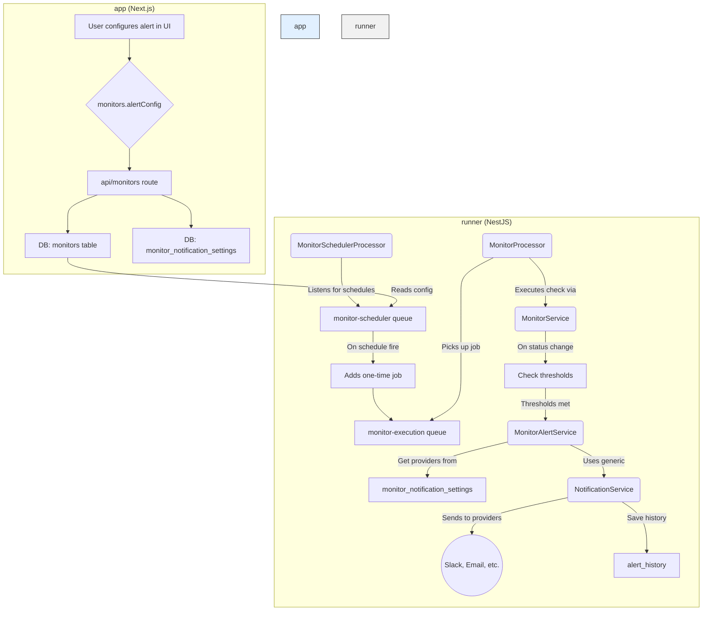

# Alerts and Notifications System Breakdown

This document provides a detailed end-to-end explanation of the alerting and notification system for both monitors and jobs, including the latest improvements for threshold logic.

## High-Level Overview

The system is architecturally divided into two main components:

1.  **`app` (Next.js Frontend):** The user-facing application where users configure monitors, jobs, and their respective alert settings. It includes the API endpoints that the frontend consumes.
2.  **`runner` (NestJS Backend):** A background worker service responsible for scheduling and executing monitors and jobs, evaluating alert conditions, and dispatching notifications through various providers.

The two services communicate via a **Redis**-backed message queue (**BullMQ**), which allows the `app` to offload long-running tasks to the `runner` asynchronously.

## Alert Configuration Validation

### Validation Requirements

When alerts are enabled for either monitors or jobs, the following validation rules apply:

1. **At least one notification provider must be selected**: Users must choose at least one notification provider (email, Slack, webhook, etc.) to receive alerts.

2. **At least one alert type must be selected**: Users must select at least one of the following alert types:
   - For monitors: `alertOnFailure`, `alertOnRecovery`, `alertOnSslExpiration`
   - For jobs: `alertOnFailure`, `alertOnSuccess`, `alertOnTimeout`

### Implementation

Validation is implemented at multiple levels:

1. **Frontend Validation**: Real-time validation in the AlertSettings component shows error messages when requirements are not met.

2. **Form Submission Validation**: Job and monitor forms prevent submission when validation fails, showing toast error messages.

3. **Server-Side Validation**: API routes and server actions validate alert configurations before saving to the database.

### Default Provider Removal

The system no longer supports default notification providers. Each notification provider must be explicitly configured and selected for each monitor or job. This ensures users have full control over their alert configurations and prevents confusion about which providers are being used.

## I. Monitor Alerting Flow

The monitor alerting flow is a sophisticated process designed to be robust and scalable. It can be broken down into the following stages:

### 1. Configuration

- **Where:** `app` (Frontend UI)
- **How:** Users create or edit a monitor and configure its `alertConfig`. This configuration is stored as a JSONB object in the `alertConfig` column of the `monitors` table in the database.

**Key `alertConfig` properties:**
- `enabled`: A boolean to toggle alerts for the monitor.
- `notificationProviders`: An array of `notification_provider` IDs to send alerts to.
- `alertOnFailure`: A boolean to send an alert when the monitor status changes to `down`.
- `alertOnRecovery`: A boolean to send an alert when the monitor status changes from `down` to `up`.
- `failureThreshold`: Number of consecutive failures before an alert is sent (default: 1).
- `recoveryThreshold`: Number of consecutive successes before a recovery alert is sent (default: 1).
- `customMessage`: Optional custom message to include in notifications.

### 2. Scheduling

- **Where:** `app` (Frontend UI)
- **How:** When a monitor is created or updated, the system schedules it using BullMQ repeatable jobs.
- **Component:** `app/src/lib/monitor-scheduler.ts`
- **Logic:** When a scheduled job fires, the `MonitorSchedulerProcessor`'s only responsibility is to add a *new, one-time* job to the `monitor-execution` queue. This pattern effectively creates a distributed cron system.

### 3. Execution

- **Where:** `runner`
- **How:** The `MonitorProcessor` listens for jobs on the `monitor-execution` queue.
- **Component:** `runner/src/monitor/monitor.processor.ts`
- **Logic:**
    1. The `process` method picks up the job.
    2. It calls `this.monitorService.executeMonitor(job.data)`.
    3. The `executeMonitor` method in `runner/src/monitor/monitor.service.ts` performs the actual check (e.g., HTTP request, ping) and returns a `MonitorExecutionResult`.
    4. Upon successful completion of the job, the `onCompleted` event handler in `MonitorProcessor` is triggered.

### 4. Result Processing & Alert Triggering

- **Where:** `runner`
- **How:** The `onCompleted` handler in `MonitorProcessor` calls `this.monitorService.saveMonitorResult(result)`.
- **Component:** `runner/src/monitor/monitor.service.ts`
- **Logic (`saveMonitorResult`):**
    1. The new result is saved to the `monitor_results` table.
    2. The `status` on the `monitors` table is updated.
    3. It compares the `currentStatus` (`up`/`down`) with the `previousStatus`.
    4. **Threshold Logic:** If `isStatusChange` is `true` and `monitor.alertConfig.enabled` is `true`, it fetches recent monitor results and calculates consecutive failures/successes.
    5. **Alert Conditions:** An alert is sent only if:
       - For failures: `alertOnFailure` is true AND consecutive failures >= `failureThreshold`
       - For recoveries: `alertOnRecovery` is true AND consecutive successes >= `recoveryThreshold`
    6. If conditions are met, it calls `this.monitorAlertService.sendNotification(...)`.

### 5. Notification Dispatch

- **Where:** `runner`
- **How:** The `MonitorAlertService` is responsible for preparing and sending the notification.
- **Components:**
    - `runner/src/monitor/services/monitor-alert.service.ts`
    - `runner/src/notification/notification.service.ts` (generic service)
- **Logic:**
    1. `sendNotification` in `MonitorAlertService` retrieves the full monitor details.
    2. It queries the `monitor_notification_settings` join table to get associated notification providers.
    3. It constructs a `NotificationPayload` containing details like title, message, severity, and metadata. It will use `customMessage` from `alertConfig` if present.
    4. It then calls the generic `this.notificationService.sendNotificationToMultipleProviders(...)`.
    5. This generic service iterates through the providers (e.g., Slack, Email) and sends the notification using the specific logic for each provider type.
    6. **Alert History:** After sending notifications, it saves a record to the `alert_history` table with the notification status and any error messages.

### Flow Diagram: Monitor Alerting



## II. Job Alerting Flow

Job alerting follows a similar pattern but is triggered by the completion of a test job rather than a scheduled monitor.

- **Trigger:** A job execution is completed by the `JobExecutionProcessor`.
- **Component:** `runner/src/execution/processors/job-execution.processor.ts`
- **Logic (`handleJobNotifications`):**
    1. After a job finishes, the processor retrieves the job's configuration, which includes an `alertConfig` similar to monitors. This config is stored on the `jobs` table.
    2. It retrieves the associated notification providers from the `job_notification_settings` join table.
    3. **Threshold Logic:** Job alerting explicitly checks for `failureThreshold` and `recoveryThreshold`. It fetches recent job runs and counts consecutive successes or failures.
    4. **Alert Triggering:** An alert is sent only if the number of consecutive statuses meets the configured threshold (e.g., alert on the 3rd consecutive failure).
    5. **Dispatch:** If an alert is warranted, it constructs a `NotificationPayload` and uses the same generic `NotificationService` to send it.
    6. **Alert History:** After sending notifications, it saves a record to the `alert_history` table.

### Key Differences from Monitor Alerting

- **Trigger:** Job completion vs. scheduled monitor check.
- **Thresholds:** Both job and monitor alerting now use the same threshold implementation that considers consecutive run statuses.
- **Configuration:** Stored on the `jobs` table instead of the `monitors` table.
- **Data Source:** Job alerting uses `runs` table for threshold calculation, while monitor alerting uses `monitor_results` table.

## III. Threshold Logic Explained

The threshold logic prevents alert spam by ensuring alerts are only sent after a specified number of consecutive failures or successes.

### How Threshold Logic Works

1. **Data Collection:** The system fetches recent results (monitor checks or job runs) ordered by timestamp.
2. **Consecutive Counting:** It counts consecutive failures or successes starting from the most recent result.
3. **Threshold Check:** An alert is only sent if the consecutive count meets or exceeds the configured threshold.
4. **Status Reset:** When the status changes (e.g., from failure to success), the consecutive count resets.

### Threshold Example

**Scenario:** Monitor with `failureThreshold: 3`, checking every 5 minutes

```
10:00 AM: Monitor Down → No Alert (1 consecutive < threshold)
10:05 AM: Still Down → No Alert (2 consecutive < threshold)
10:10 AM: Still Down → Alert Sent (3 consecutive = threshold)
10:15 AM: Still Down → No Alert (deduplication prevents spam)
10:20 AM: Monitor Up → Recovery Alert Sent (1 consecutive = threshold)
```

### Threshold Benefits

- **Prevents False Alarms:** Requires multiple consecutive failures before alerting
- **Reduces Alert Noise:** Avoids alerting on temporary issues
- **Configurable Sensitivity:** Different thresholds for different types of monitors/jobs
- **Recovery Detection:** Separate thresholds for failure and recovery alerts

## IV. Database Schema

The core tables supporting this system are:

- **`monitors`**: Stores monitor configurations, including the `alertConfig` JSONB field.
- **`jobs`**: Stores job configurations, also with an `alertConfig` field.
- **`notification_providers`**: Stores the configuration for each notification channel (e.g., Slack webhook URL, SMTP server details).
- **`monitor_notification_settings`**: A many-to-many join table linking `monitors` to `notification_providers`.
- **`job_notification_settings`**: A many-to-many join table linking `jobs` to `notification_providers`.
- **`alert_history`**: Stores a log of all sent alerts with their status and any error messages.
- **`monitor_results`**: Stores individual monitor check results used for threshold calculations.
- **`runs`**: Stores job execution results used for threshold calculations.

## V. Notification Provider Types

The system supports multiple notification provider types:

### Email
- **Configuration:** SMTP server details, from/to addresses
- **Use Case:** Traditional email notifications
- **Features:** HTML formatting, custom subjects

### Slack
- **Configuration:** Webhook URL, channel name
- **Use Case:** Team collaboration, real-time notifications
- **Features:** Rich formatting, @mentions, custom emojis

### Webhook
- **Configuration:** URL, HTTP method, headers, body template
- **Use Case:** Integration with external systems
- **Features:** Custom payloads, authentication

### Telegram
- **Configuration:** Bot token, chat ID
- **Use Case:** Mobile notifications, personal alerts
- **Features:** Instant delivery, mobile-friendly

### Discord
- **Configuration:** Webhook URL
- **Use Case:** Gaming communities, developer teams
- **Features:** Rich embeds, custom formatting

## VI. Alert History and Monitoring

### Alert History Table

The `alert_history` table provides a complete audit trail:

```sql
CREATE TABLE alert_history (
    id UUID PRIMARY KEY,
    type VARCHAR(50) NOT NULL, -- 'monitor_failure', 'job_success', etc.
    message TEXT NOT NULL,
    target VARCHAR(255) NOT NULL, -- Monitor/Job name
    target_type VARCHAR(50) NOT NULL, -- 'monitor' or 'job'
    monitor_id UUID REFERENCES monitors(id),
    job_id UUID REFERENCES jobs(id),
    provider VARCHAR(100) NOT NULL, -- Notification provider used
    status VARCHAR(50) NOT NULL, -- 'sent', 'failed', 'pending'
    error_message TEXT, -- Error details if failed
    sent_at TIMESTAMP DEFAULT NOW()
);
```

### Benefits of Alert History

- **Complete Audit Trail:** Track all sent alerts and their status
- **Debugging Support:** Error messages help troubleshoot notification issues
- **Analytics:** Monitor alert patterns and success rates
- **Compliance:** Maintain records for regulatory requirements

## VII. Error Handling and Resilience

### Notification Service Error Handling

The notification system includes comprehensive error handling:

1. **Provider-Level Errors:** Each notification provider handles its own errors
2. **Partial Failures:** If some providers succeed and others fail, the system tracks both
3. **Retry Logic:** Failed notifications can be retried with exponential backoff
4. **Error Logging:** All errors are logged with detailed context
5. **Status Tracking:** Alert history tracks success/failure status for each notification

### System Resilience Features

- **Queue-Based Processing:** Notifications are processed asynchronously
- **Database Persistence:** Alert configurations and history are stored in the database
- **Multiple Providers:** Redundancy through multiple notification channels
- **Graceful Degradation:** System continues to function even if some providers fail

## VIII. Configuration Best Practices

### Alert Configuration

1. **Threshold Settings:**
   - Use `failureThreshold: 2-3` for most monitors to avoid false alarms
   - Use `recoveryThreshold: 1-2` for quick recovery notifications
   - Adjust based on monitor frequency and criticality

2. **Notification Providers:**
   - Configure multiple providers for redundancy
   - Use different providers for different alert types
   - Test provider configurations regularly

3. **Custom Messages:**
   - Include relevant context in custom messages
   - Use variables like `{monitor_name}`, `{target_url}`
   - Keep messages concise but informative

### Monitor Configuration

1. **Check Frequency:**
   - Balance between responsiveness and system load
   - More critical monitors can use higher frequencies
   - Consider provider rate limits

2. **Alert Types:**
   - Enable `alertOnFailure` for most monitors
   - Enable `alertOnRecovery` for important services
   - Enable `alertOnSslExpiration` for HTTPS monitors

## IX. Future Enhancements

### Planned Features

1. **Advanced Thresholds:** Time-based thresholds (e.g., alert after 3 failures in 10 minutes)
2. **Alert Suppression:** Maintenance windows and scheduled downtime
3. **Alert Routing:** Different providers for different alert types
4. **Alert Templates:** Customizable message templates
5. **Alert Escalation:** Multi-level escalation for critical issues
6. **Alert Analytics:** Dashboard for alert patterns and trends
7. **Alert Integration:** Webhook endpoints for external integrations
8. **Alert Intelligence:** Machine learning for alert optimization

### Advanced Features

1. **Alert Automation:** Automatically trigger actions based on alerts
2. **Alert Intelligence:** Use machine learning to predict and prevent issues
3. **Alert Analytics:** Provide insights into alert patterns and system health
4. **Multi-tenant Alerting:** Support for different alert configurations per organization
5. **Alert Integration:** Integrate with external incident management systems

This document provides a solid foundation for understanding the current system and planning future improvements.

## X. Complete System Overview

### How All Features Work Together

The alerting system combines multiple sophisticated features to provide intelligent, reliable notifications:

1. **Threshold Logic** prevents false alarms by requiring consecutive failures/successes
2. **Alert History** provides complete audit trail and debugging capabilities
3. **Multi-Provider Support** ensures reliable delivery through redundancy
4. **Validation** ensures proper configuration before alerts are sent

### Complete Alert Flow Example

**Scenario:** Monitor with `failureThreshold: 3`, checking every 5 minutes

```mermaid
timeline
    title Complete Alert Flow Example
    section 10:00 AM
        Monitor Down : No Alert (1 consecutive < threshold)
    section 10:05 AM
        Still Down : No Alert (2 consecutive < threshold)
    section 10:10 AM
        Still Down : Regular Alert Sent (3 consecutive = threshold)
    section 10:15 AM
        Still Down : No Alert (threshold already met)
    section 10:20 AM
        Still Down : No Alert (threshold already met)
    section 10:25 AM
        Still Down : No Alert (threshold already met)
    section 10:30 AM
        Still Down : No Alert (threshold already met)
    section 10:35 AM
        Still Down : No Alert (threshold already met)
    section 11:00 AM
        Still Down : No Alert (threshold already met)
    section 11:05 AM
        Monitor Up : Recovery Alert Sent (1 consecutive = threshold)
```

### System Benefits

- **Intelligent Alerting:** Only sends alerts when thresholds are met
- **Complete Audit Trail:** All alerts are logged with status and errors
- **Flexible Configuration:** Rich alert configuration options for different scenarios
- **Multi-Provider Support:** Send alerts to multiple channels simultaneously
- **Error Handling:** Robust error handling with detailed logging
- **Validation:** Ensures proper configuration before alerts are sent

### Configuration Best Practices

1. **Threshold Settings:**
   - Use `failureThreshold: 2-3` for most monitors to avoid false alarms
   - Use `recoveryThreshold: 1-2` for quick recovery notifications
   - Adjust based on monitor frequency and criticality

2. **Notification Providers:**
   - Configure multiple providers for redundancy
   - Use different providers for different alert types
   - Test provider configurations regularly

3. **Alert Types:**
   - Enable `alertOnFailure` for most monitors
   - Enable `alertOnRecovery` for important services
   - Enable `alertOnSslExpiration` for HTTPS monitors

4. **Monitoring and Maintenance:**
   - Regularly review alert history for patterns
   - Monitor notification provider success rates
   - Update alert configurations based on system behavior 