# Core Service Interactions - Detailed Workflows

This document provides comprehensive sequence diagrams for the core execution workflows in Supercheck: Test execution, Job execution, Monitor execution, and Status Page management.

## ⚙️ **Test Execution Workflow (Playground)**

```mermaid
sequenceDiagram
    participant U as 👤 User
    participant F as 🖥️ Next.js Frontend
    participant V as 🔍 Validation API
    participant Q as 📨 Redis/BullMQ
    participant W as ⚡ NestJS Worker
    participant E as ⚙️ Execution Service
    participant P as 🎭 Playwright Runner
    participant D as 🗄️ PostgreSQL
    participant S as 📦 MinIO/S3 Storage
    participant R as 🚥 Redis Pub/Sub

    Note over U,R: Single Test Execution Flow (Playground)

    %% Script Validation Phase
    U->>F: Write test code & click "Run Test"
    F->>V: POST /api/validate-script
    V-->>F: Validation response

    alt Script validation fails
        F-->>U: Show validation errors
    else Script validation passes
        %% Test Creation & Queuing
        F->>F: Generate unique testId
        F->>D: Create test record (status: pending)
        F->>Q: Add to 'test-execution' queue
        Q-->>F: Job queued successfully
        F-->>U: Test started (show loading state)

        %% SSE Connection Setup
        F->>F: Open SSE /api/test-status/events/[testId]
        F->>R: Subscribe to test channels
        R-->>F: SSE connection established

        %% Worker Processing
        Q->>W: TestExecutionProcessor picks up job
        activate W
        W->>D: Update test status (running)
        W->>R: Publish status event
        R-->>F: SSE: status='running'
        F-->>U: Update UI (running state)

        %% Test Execution
        W->>E: Call runSingleTest()
        activate E
        E->>E: Create unique run directory
        E->>E: Generate test script file
        E->>E: Configure Playwright settings
        E->>P: Execute test with Playwright
        activate P
        P->>P: Run browser automation
        P->>P: Generate screenshots/videos
        P->>P: Create HTML report
        P->>P: Generate trace files
        P-->>E: Execution results
        deactivate P

        %% Result Processing
        E->>E: Process test artifacts
        E->>S: Upload report & artifacts
        S-->>E: Upload complete
        E->>D: Create report record
        E-->>W: Test execution complete
        deactivate E

        %% Completion & Cleanup
        W->>D: Update test status (completed/failed)
        W->>R: Publish completion event
        deactivate W
        R-->>F: SSE: test complete
        F->>F: Close SSE connection
        F-->>U: Show completion toast

        %% Report Viewing
        U->>F: Click "View Report"
        F->>F: GET /api/test-results/[...path]
        F->>S: Fetch report files
        S-->>F: Report content
        F-->>U: Display interactive report
    end
```

## 🕒 **Job Execution Workflow (Multi-Test Jobs)**

```mermaid
sequenceDiagram
    participant U as 👤 User
    participant F as 🖥️ Next.js Frontend
    participant A as 🔐 Auth Service
    participant V as 🔧 Variable Resolver
    participant Q as 📨 Redis/BullMQ
    participant W as ⚡ NestJS Worker
    participant E as ⚙️ Execution Service
    participant P as 🎭 Playwright Runner
    participant D as 🗄️ PostgreSQL
    participant S as 📦 MinIO/S3 Storage
    participant R as 🚥 Redis Pub/Sub
    participant N as 📢 Notification Service

    Note over U,N: Multi-Test Job Execution Flow

    %% Job Initiation
    U->>F: Select job & click "Run Job"
    F->>A: Validate user session
    A-->>F: User authorized

    %% Job Setup & Validation
    F->>D: Fetch job details & associated tests
    D-->>F: Job configuration & test list
    F->>V: Resolve project variables/secrets
    V->>D: Fetch project variables
    D-->>V: Variable data
    V-->>F: Resolved variables & secrets

    %% Capacity Check & Queuing
    F->>Q: Check queue capacity
    alt Capacity exceeded
        Q-->>F: HTTP 429 - Too Many Requests
        F-->>U: Show capacity limit error
    else Capacity available
        F->>D: Create run record (status: pending)
        F->>Q: Add to 'job-execution' queue
        Q-->>F: Job queued (runId)
        F-->>U: Job started (loading state)

        %% SSE Connection
        F->>F: Open SSE /api/job-status/events/[runId]
        F->>R: Subscribe to job channels
        R-->>F: SSE connection established

        %% Worker Processing
        Q->>W: JobExecutionProcessor picks up job
        activate W
        W->>D: Update run status (running)
        W->>R: Publish job status event
        R-->>F: SSE: status='running'
        F-->>U: Update UI (running state)

        %% Parallel Test Execution
        loop For each test in job
            W->>E: Execute individual test
            activate E
            E->>E: Create test run directory
            E->>E: Inject resolved variables
            E->>E: Apply job configuration
            E->>P: Execute test with Playwright
            activate P
            P->>P: Run browser automation
            P->>P: Generate test artifacts
            P-->>E: Individual test result
            deactivate P
            E->>S: Upload test artifacts
            E->>D: Save individual test result
            E->>R: Publish test progress
            R-->>F: SSE: individual test status
            F-->>U: Update test progress
            deactivate E
        end

        %% Job Completion Processing
        W->>E: Generate consolidated job report
        E->>S: Upload job report
        E->>D: Update run status (completed/failed)

        %% Notification Processing
        alt Job has alert configuration
            W->>N: Process job notifications
            activate N
            N->>D: Fetch notification providers
            N->>N: Generate alert messages
            N->>N: Send notifications (email/slack/webhook)
            N->>D: Log notification history
            deactivate N
        end

        W->>R: Publish job completion
        deactivate W
        R-->>F: SSE: job complete
        F->>F: Close SSE connection
        F-->>U: Show completion notification

        %% Report Access
        U->>F: View job results
        F->>D: Fetch run details & test results
        D-->>F: Consolidated job data
        F->>S: Fetch job report files
        S-->>F: Report artifacts
        F-->>U: Display job results dashboard
    end
```

## 🌐 **Monitor Execution Workflow (Automated Monitoring)**

```mermaid
sequenceDiagram
    participant S as ⏰ Job Scheduler
    participant Q as 📨 Redis/BullMQ
    participant W as ⚡ NestJS Worker
    participant M as 👀 Monitor Service
    participant H as 🌐 HTTP Client
    participant P as 📡 Ping Service
    participant T as 🔌 Port Scanner
    participant D as 🗄️ PostgreSQL
    participant R as 🚥 Redis Pub/Sub
    participant A as 📢 Alert Service
    participant N as 📧 Notification Providers

    Note over S,N: Automated Monitor Execution Flow

    %% Scheduled Trigger
    S->>S: Cron schedule triggers
    S->>Q: Add monitor job to 'monitor-execution' queue
    Q->>W: MonitorProcessor picks up job

    activate W
    W->>D: Fetch monitor configuration
    D-->>W: Monitor settings & alert config

    %% Check if Monitor is Active
    alt Monitor is paused or disabled
        W->>W: Skip execution
        W-->>Q: Job completed (skipped)
    else Monitor is active
        W->>M: Execute monitor check
        activate M

        %% Different Monitor Types
        alt Monitor type: HTTP Request
            M->>H: Perform advanced HTTP/HTTPS request
            activate H
            H->>H: Send request with custom headers/auth
            H->>H: Support custom methods (GET/POST/PUT/etc)
            H->>H: Validate custom status codes
            H->>H: Check keyword in response
            H->>H: Measure response time
            H-->>M: HTTP check results
            deactivate H

        else Monitor type: Website
            M->>H: Perform simplified website check
            activate H
            H->>H: GET request to URL (default)
            H->>H: Check response with 200-299 status
            H->>H: Verify SSL certificate (if enabled)
            H->>H: Measure response time
            H-->>M: Website check results
            deactivate H

        else Monitor type: Ping Host
            M->>P: Perform ICMP ping
            activate P
            P->>P: Send ping packets
            P->>P: Measure response time
            P->>P: Calculate packet loss
            P-->>M: Ping results
            deactivate P

        else Monitor type: Port Check
            M->>T: Check port accessibility
            activate T
            T->>T: Attempt TCP/UDP connection
            T->>T: Measure connection time
            T-->>M: Port check results
            deactivate T
        end

        %% Result Processing
        M->>M: Process monitor results
        M->>D: Fetch previous monitor status
        D-->>M: Historical status data
        M->>M: Determine status change (up/down)
        M->>D: Save monitor result
        M->>D: Update monitor status

        %% Alert Processing
        alt Status change detected OR Alert conditions met
            W->>A: Trigger alert processing
            activate A
            A->>D: Fetch alert configuration
            A->>A: Check failure/recovery thresholds
            A->>A: Evaluate alert conditions

            alt Alert should be sent
                A->>D: Fetch notification providers
                D-->>A: Provider configurations

                loop For each notification provider
                    A->>N: Send notification
                    activate N
                    N->>N: Format alert message
                    N->>N: Send via provider (email/slack/webhook)
                    N-->>A: Delivery status
                    deactivate N
                end

                A->>D: Log alert history
                A->>D: Update alert counters
            end
            deactivate A
        end

        %% Real-time Updates (if applicable)
        W->>R: Publish monitor status update
        R-->>R: Notify active SSE connections

        %% SSL Certificate Alerts (if enabled)
        alt SSL certificate expiring soon
            W->>A: Trigger SSL expiration alert
            A->>N: Send SSL warning notifications
            A->>D: Log SSL alert
        end
        deactivate M
    end

    deactivate W
    Q-->>S: Monitor execution complete
    S->>S: Schedule next monitor execution
```

## 📢 **Status Page Public Access Workflow**

```mermaid
sequenceDiagram
    participant V as 👥 Public Visitor
    participant M as 🔍 Middleware Router
    participant D as 🗄️ PostgreSQL
    participant F as 🖥️ Frontend
    participant C as 🧩 Components
    participant I as ⚠️ Incidents

    Note over V,I: Public Status Page Access via Subdomain

    V->>M: GET https://[uuid].supercheck.io
    activate M

    M->>M: Extract subdomain from hostname
    M->>D: Query status_pages by subdomain
    D-->>M: Return status page record

    alt Status page not found or not published
        M->>F: Rewrite to /404
        F-->>V: 404 Not Found
    else Status page found and published
        M->>F: Rewrite to /status-pages/[id]/public

        F->>D: Fetch status page details
        F->>D: Fetch components for status page
        F->>D: Fetch incidents for status page

        D-->>F: Return status page data
        D-->>F: Return components data
        D-->>F: Return incidents data

        F-->>V: Render public status page
        Note over F,V: Include system status,<br/>component uptime,<br/>and incident history
    end

    deactivate M
```

## 📧 **Status Page Subscription Workflow**

```mermaid
sequenceDiagram
    participant U as 👤 User
    participant F as 🖥️ Frontend
    participant A as 🔐 Auth API
    participant D as 🗄️ PostgreSQL
    participant E as 📧 Email Service
    participant V as ✅ Verification

    Note over U,V: Email Subscription to Status Page Updates

    U->>F: Click "Subscribe" on status page
    F->>F: Open subscription dialog
    U->>F: Enter email address
    F->>A: POST /api/subscribe-to-status-page

    A->>D: Check if status page exists and is published
    A->>D: Check if email already subscribed
    A->>D: Create subscriber record (unverified)
    A->>A: Generate verification token

    A->>E: Send verification email
    Note over A,E: Email contains verification link<br/>with unique token

    A-->>F: Subscription initiated
    F-->>U: "Please check your email to verify"

    %% Email Verification Flow
    U->>V: Click verification link in email
    activate V
    V->>A: GET /status-pages/verify/[token]

    A->>D: Find subscriber by verification token
    A->>D: Update subscriber as verified
    A->>D: Log verification event

    A-->>V: Redirect to confirmation page
    V-->>U: "Subscription verified successfully"
    deactivate V
```

## ⚠️ **Status Page Incident Management Workflow**

```mermaid
sequenceDiagram
    participant U as 👤 Admin User
    participant F as 🖥️ Frontend
    participant A as 🔐 Auth API
    participant D as 🗄️ PostgreSQL
    participant N as 📧 Notification Service
    participant S as 👥 Subscribers

    Note over U,S: Incident Creation and Management

    U->>F: Navigate to status page management
    F->>A: Validate admin session
    A-->>F: User authorized

    U->>F: Click "Create Incident"
    F->>F: Open incident creation dialog
    U->>F: Fill incident details (title, impact, affected components)
    F->>A: POST /api/create-incident

    A->>A: Validate input and permissions
    A->>D: Create incident record
    A->>D: Update affected component statuses
    A->>D: Log audit event

    A-->>F: Incident created successfully
    F-->>U: Show success message

    %% Notification Flow
    A->>N: Trigger incident notification
    activate N
    N->>D: Fetch all verified subscribers
    N->>N: Compose incident notification
    N->>S: Send email notifications to all subscribers
    deactivate N

    %% Incident Update Flow
    U->>F: Click "Add Update" on incident
    F->>F: Open update dialog
    U->>F: Write update message
    F->>A: POST /api/update-incident

    A->>D: Create incident update record
    A->>D: Update incident status if needed
    A->>N: Trigger update notification

    A-->>F: Update added successfully
    F-->>U: Show updated incident timeline

    %% Incident Resolution
    U->>F: Mark incident as resolved
    F->>A: POST /api/resolve-incident

    A->>D: Update incident status to "resolved"
    A->>D: Set resolved_at timestamp
    A->>D: Update component statuses back to operational
    A->>N: Trigger resolution notification

    A-->>F: Incident resolved
    F-->>U: Show resolved status
```

## 🔄 **Status Page Component Status Sync Workflow**

```mermaid
sequenceDiagram
    participant M as 👀 Monitor Service
    participant C as 🧩 Status Component
    participant S as 📊 Status Calculator
    participant D as 🗄️ PostgreSQL
    participant N as 📧 Notification Service

    Note over M,N: Automatic Component Status Updates from Monitors

    M->>M: Execute monitor check (HTTP/ping/port)

    alt Monitor status changed
        M->>D: Update monitor status
        M->>C: Find linked status page components
        C->>C: For each linked component:
        C->>S: Calculate new component status based on monitor
        S->>D: Update component status in database

        alt Component status changed significantly
            C->>N: Trigger status change notification
            N->>N: Check if notification rules are met
            N->>N: Send notifications to affected subscribers
        end
    end
```

## 🔄 **Cross-Service Communication Patterns**

### **Queue Management**

```mermaid
graph LR
    subgraph "📨 Queue System"
        Q1[test-execution Queue<br/>• Single test jobs<br/>• Playground execution<br/>• Priority: Normal]
        Q2[job-execution Queue<br/>• Multi-test jobs<br/>• Scheduled jobs<br/>• Priority: High]
        Q3[monitor-execution Queue<br/>• Monitor checks<br/>• Automated execution<br/>• Priority: Low]
        Q4[cleanup Queue<br/>• File cleanup<br/>• S3 maintenance<br/>• Priority: Lowest]
        Q5[status-notification Queue<br/>• Email notifications<br/>• Subscriber alerts<br/>• Priority: High]
    end

    Q1 --> W1[Test Workers<br/>1-2 instances]
    Q2 --> W2[Job Workers<br/>2-3 instances]
    Q3 --> W3[Monitor Workers<br/>2-4 instances]
    Q4 --> W4[Cleanup Workers<br/>1 instance]
    Q5 --> W5[Status Workers<br/>1-2 instances]

    classDef queue fill:#e3f2fd,stroke:#1976d2,stroke-width:2px
    classDef worker fill:#f3e5f5,stroke:#7b1fa2,stroke-width:2px

    class Q1,Q2,Q3,Q4,Q5 queue
    class W1,W2,W3,W4,W5 worker
```

### **Real-time Communication**

```mermaid
graph TB
    subgraph "📡 Real-time Updates"
        R1[Redis Pub/Sub Channels<br/>• test:testId:status<br/>• test:testId:complete<br/>• job:runId:status<br/>• job:runId:complete<br/>• monitor:monitorId:status<br/>• status:pageId:incident<br/>• status:pageId:update]

        R2[SSE Endpoints<br/>• /api/test-status/events/testId<br/>• /api/job-status/events/jobId<br/>• /api/queue-stats/sse<br/>• /api/status-updates/sse]

        R3[Frontend Connections<br/>• EventSource instances<br/>• Auto-reconnection<br/>• Connection cleanup]
    end

    R1 --> R2
    R2 --> R3

    classDef realtime fill:#fff3e0,stroke:#f57c00,stroke-width:2px
    class R1,R2,R3 realtime
```

### **Error Handling & Recovery**

```mermaid
graph TB
    subgraph "🚨 Error Handling"
        E1[Job Failures<br/>• Retry logic 3 attempts<br/>• Exponential backoff<br/>• Dead letter queue]

        E2[Service Failures<br/>• Circuit breaker pattern<br/>• Graceful degradation<br/>• Health checks]

        E3[Resource Cleanup<br/>• Failed job cleanup<br/>• Orphaned file removal<br/>• Memory management]
    end

    E1 --> E3
    E2 --> E3

    classDef error fill:#ffebee,stroke:#d32f2f,stroke-width:2px
    class E1,E2,E3 error
```

## 🎯 **Key Integration Points**

### **Authentication & Authorization**

- Every request validates user session through Better Auth
- RBAC system checks permissions at organization/project level
- API keys provide scoped access for external integrations

### **Variable Resolution**

- Project variables and secrets resolved during job execution
- Encrypted secrets decrypted server-side only
- Variables injected into test scripts securely

### **Capacity Management**

- Queue capacity limits enforced (default: 5 running, 50 queued)
- HTTP 429 responses when limits exceeded
- Real-time queue statistics via SSE

### **Notification System**

- Multi-channel alert delivery (email, Slack, webhooks)
- Configurable thresholds and alert rules
- Comprehensive delivery tracking and retry logic

### **Storage Management**

- Test artifacts stored in MinIO/S3 with organized folder structure
- Automatic cleanup of old playground tests
- Presigned URLs for secure artifact access

This comprehensive set of sequence diagrams shows the complete interaction patterns for all four core execution workflows in Supercheck (Test execution, Job execution, Monitor execution, and Status Page management), highlighting the sophisticated orchestration between services, real-time updates, error handling, and security measures.
