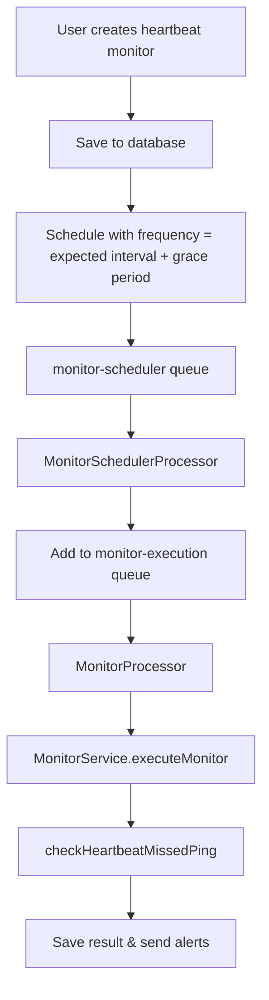

# Heartbeat Monitor Refactor - Standardized Implementation

## Overview

This document describes the comprehensive refactor of the heartbeat monitoring system to align it with the standard monitor architecture used by other monitor types (HTTP, Ping, Port, etc.).

## Problem Statement

### Previous Issues
1. **Inconsistent Architecture**: Heartbeat monitors used a hybrid approach with app-side service + runner instead of the standard monitor pattern
2. **Wrong Check Frequency**: Used user-configured "Check for Missed Pings" dropdown instead of `expected interval + grace period`
3. **Redundant Queues**: `heartbeat-checker` queue was unnecessary and complex
4. **Complex Logic**: App-side filtering instead of simple scheduled execution
5. **Wrong Recent Check Results**: Showed "Ping overdue" instead of actual scheduled checks
6. **Unnecessary UI Complexity**: Users had to configure check frequency manually

## Solution: Standardized Heartbeat Monitors

### **New Architecture**

Heartbeat monitors now follow the **exact same pattern** as other monitors:



### **Key Changes**

#### 1. **Standard Scheduling**
- **Before**: Hybrid approach with app-side service + separate heartbeat checker
- **After**: Standard monitor scheduling using `monitor-scheduler` queue
- **Frequency**: Automatically calculated as `expected interval + grace period`

#### 2. **Simplified UI**
- **Before**: Users had to configure "Check for Missed Pings" frequency
- **After**: Frequency is automatically calculated and displayed
- **Removed**: "Check for Missed Pings" dropdown
- **Added**: Real-time display of calculated check frequency

#### 3. **Consistent Execution**
- **Before**: App-side filtering + runner execution
- **After**: Standard monitor execution in runner only
- **Logic**: Same `checkHeartbeatMissedPing` method, but called via standard monitor flow

#### 4. **Proper Recent Check Results**
- **Before**: Showed "Ping overdue" every minute from app-side service
- **After**: Shows actual scheduled checks at `expected interval + grace period`

## Implementation Details

### **1. Monitor Form Changes**

**File**: `app/src/components/monitors/monitor-form.tsx`

#### **Removed Fields:**
- "Check for Missed Pings" dropdown (interval field for heartbeat monitors)

#### **Added Features:**
- Real-time display of calculated check frequency
- Automatic frequency calculation: `expected interval + grace period`

#### **Code Changes:**
```typescript
// Heartbeat monitors should check at expected interval + grace period
const expectedIntervalMinutes = data.heartbeatConfig_expectedInterval || 60;
const gracePeriodMinutes = data.heartbeatConfig_gracePeriod || 10;
const checkFrequencyMinutes = expectedIntervalMinutes + gracePeriodMinutes;

apiData.frequencyMinutes = checkFrequencyMinutes;
```

### **2. Monitor Scheduler Changes**

**File**: `app/src/lib/monitor-scheduler.ts`

#### **Removed:**
- Special handling to skip heartbeat monitors
- Heartbeat monitors now use standard scheduling

#### **Code Changes:**
```typescript
// Include heartbeat monitors in standard scheduling
// They will be scheduled with their configured frequency (expected interval + grace period)
const jobDataPayload: MonitorJobData = {
  monitorId: monitor.id,
  type: monitor.type as MonitorJobData['type'],
  target: monitor.target,
  config: monitor.config as any,
  frequencyMinutes: monitor.frequencyMinutes,
};
```

### **3. Queue System Cleanup**

#### **Removed Files:**
- `app/src/lib/heartbeat-service.ts` - App-side service no longer needed
- `app/src/lib/heartbeat-scheduler.ts` - Separate scheduler no longer needed
- `runner/src/scheduler/processors/heartbeat-checker.processor.ts` - Separate processor no longer needed
- `runner/src/monitor/services/heartbeat.service.ts` - Separate service no longer needed

#### **Updated Files:**
- `app/src/lib/queue.ts` - Removed `HEARTBEAT_CHECKER_QUEUE` references
- `runner/src/scheduler/scheduler.module.ts` - Removed heartbeat checker processor
- `runner/src/monitor/monitor.module.ts` - Removed heartbeat service
- `runner/src/scheduler/constants.ts` - Removed heartbeat checker queue constant

### **4. Monitor Service Enhancement**

**File**: `runner/src/monitor/monitor.service.ts`

#### **Improved Logic:**
- Better error handling and logging
- More robust ping detection
- Consistent result creation

## Benefits

### **1. Consistency**
- Heartbeat monitors now work exactly like other monitors
- Same scheduling, execution, and result handling
- Unified architecture across all monitor types

### **2. Simplicity**
- No more complex hybrid approach
- No more app-side filtering logic
- Standard monitor execution flow

### **3. Accuracy**
- Check frequency is mathematically correct (`expected interval + grace period`)
- Recent check results show actual scheduled checks
- No more unnecessary frequent checks

### **4. Maintainability**
- Less code to maintain
- Standard patterns across all monitors
- Easier to debug and extend

### **5. User Experience**
- No more confusing "Check for Missed Pings" dropdown
- Clear display of calculated check frequency
- Consistent UI with other monitor types

## Migration Guide

### **For Existing Heartbeat Monitors**

1. **Automatic Migration**: Existing heartbeat monitors will be automatically migrated to the new system
2. **Frequency Update**: The check frequency will be updated to `expected interval + grace period`
3. **No Data Loss**: All existing configuration and results are preserved

### **For Developers**

1. **No Breaking Changes**: The API endpoints remain the same
2. **Same Configuration**: Monitor creation/editing works the same way
3. **Improved Logging**: Better error messages and debugging information

## Testing

### **Manual Testing Checklist**

1. **Create Heartbeat Monitor**
   - [ ] Monitor is created with correct frequency
   - [ ] UI shows calculated check frequency
   - [ ] No "Check for Missed Pings" dropdown

2. **Edit Heartbeat Monitor**
   - [ ] Frequency updates correctly when expected interval/grace period changes
   - [ ] UI updates in real-time

3. **Monitor Execution**
   - [ ] Monitor checks at correct frequency (`expected interval + grace period`)
   - [ ] Recent check results show actual scheduled checks
   - [ ] No more "Ping overdue" every minute

4. **Ping Endpoints**
   - [ ] `/api/heartbeat/[token]` still works
   - [ ] `/api/heartbeat/[token]/fail` still works
   - [ ] Notifications are sent correctly

5. **Other Monitors**
   - [ ] HTTP monitors still work correctly
   - [ ] Ping monitors still work correctly
   - [ ] Port monitors still work correctly

## Future Enhancements

### **Potential Improvements**

1. **Advanced Heartbeat Features**
   - Custom ping intervals per monitor
   - Different grace periods for different scenarios
   - Heartbeat analytics and trends

2. **UI Enhancements**
   - Visual heartbeat timeline
   - Ping history charts
   - Real-time status indicators

3. **Integration Features**
   - Webhook support for heartbeat pings
   - API key authentication for heartbeat endpoints
   - Custom ping payload validation

## Conclusion

The heartbeat monitor refactor successfully standardizes the implementation while maintaining all existing functionality. The new approach is:

- **More consistent** with other monitor types
- **Simpler to understand** and maintain
- **More accurate** in its check frequency
- **Better user experience** with clearer UI

This refactor eliminates the complex hybrid approach and provides a solid foundation for future heartbeat monitor enhancements. 