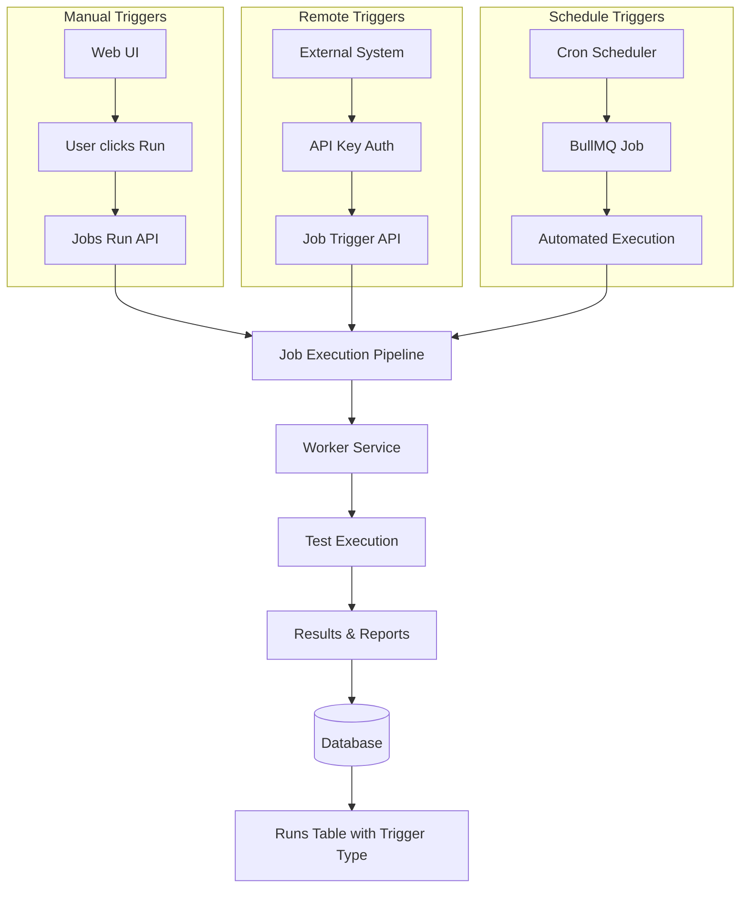

# Job Trigger System Documentation

## Overview

This document outlines the comprehensive job trigger system in Supertest, which supports three distinct trigger types: `manual`, `remote`, and `schedule`. The system provides full traceability and control over how jobs are initiated and executed.

## Trigger Types Architecture

### 1. Manual Trigger (`manual`)
- **Source**: User-initiated job execution from the web UI
- **Label**: "Manual"
- **Authentication**: Session-based user authentication
- **Flow**: Interactive job execution with immediate feedback

### 2. Remote Trigger (`remote`)
- **Source**: External API calls using API keys
- **Label**: "Remote"  
- **Authentication**: API key validation required
- **Flow**: Programmatic integration for CI/CD and external systems

### 3. Schedule Trigger (`schedule`)
- **Source**: Automated execution based on cron schedules
- **Label**: "Schedule"
- **Authentication**: Internal system execution
- **Flow**: Time-based automated job execution

## Database Schema Changes

### Database Schema Implementation

The trigger system is implemented through database schema updates:

**Runs Table Enhancement:**
- Added `trigger` field to track job execution source
- Field type: varchar(50) with default value 'manual'
- Supports three trigger types: `manual`, `remote`, `schedule`

**JobTrigger Type Definition:**
- Enum-like type definition for trigger values
- Ensures type safety across the application
- Default value: 'manual' for backward compatibility

**Database Migration:**
- Migration adds trigger column to existing runs table
- Maintains referential integrity with existing data
- Supports historical trigger type tracking

## API Changes

### 1. Job Run API (`/api/jobs/run`)
- **Method**: POST
- **Trigger**: `manual` (default)
- **Changes**: Now accepts and validates trigger parameter
- **Validation**: Ensures trigger is one of: `manual`, `remote`, `schedule`

### 2. Remote Trigger API (`/api/jobs/[id]/trigger`)
- **Method**: POST
- **Trigger**: `remote`
- **Authentication**: API key required
- **Features**: 
  - API key validation
  - Job existence validation
  - Test association validation
  - Usage statistics tracking

### 3. Runs API (`/api/runs`)
- **Method**: GET
- **Changes**: Now includes `trigger` field in response
- **Display**: Shows trigger type in runs table

## Frontend Changes

### 1. Runs Table Display
- **Column**: "Trigger" column added to runs table
- **Icons**: Different icons for each trigger type
- **Colors**: Distinct colors for visual differentiation
- **Fallback**: Shows "-" for unknown trigger types

### 2. Job Execution Components
- **Manual Trigger**: Run button in jobs table
- **Remote Trigger**: API documentation and curl examples
- **Schedule Trigger**: Cron scheduler interface

### 3. Data Flow
- **API Response**: Includes trigger field
- **UI Components**: Properly handle trigger field
- **Type Safety**: TypeScript interfaces updated

## Backend Changes

### 1. Runner Service
- **Schema**: Added `JobTrigger` type and `trigger` field
- **Processor**: Updated to handle trigger field in job execution
- **Scheduler**: Properly sets `schedule` trigger for scheduled jobs

### 2. Queue System
- **Interface**: Updated `JobExecutionTask` to include trigger field
- **Validation**: Ensures trigger is passed through the entire execution pipeline

## E2E Flow Analysis

### Manual Trigger Flow
1. User clicks "Run" button in UI
2. Frontend sends POST to `/api/jobs/run` with `trigger: "manual"`
3. API validates trigger and creates run record
4. Job is queued for execution
5. Runner processes job and updates status
6. UI displays run with manual trigger icon

### Remote Trigger Flow
1. External system sends POST to `/api/jobs/[id]/trigger` with API key
2. API validates API key and job existence
3. API calls internal `/api/jobs/run` with `trigger: "remote"`
4. Job is queued for execution
5. Runner processes job and updates status
6. UI displays run with remote trigger icon

### Schedule Trigger Flow
1. Cron scheduler triggers based on schedule
2. BullMQ job is created with job data
3. Runner scheduler processor handles the job
4. Creates run record with `trigger: "schedule"`
5. Job is queued for execution
6. Runner processes job and updates status
7. UI displays run with schedule trigger icon

## Improvements Made

### 1. Data Consistency
- ✅ All run creation points now include trigger field
- ✅ Database schema updated with proper defaults
- ✅ API responses include trigger information
- ✅ UI components properly handle trigger field

### 2. Type Safety
- ✅ TypeScript interfaces updated
- ✅ Proper validation in API endpoints
- ✅ Schema definitions consistent across app and runner

### 3. User Experience
- ✅ Visual indicators for different trigger types
- ✅ Consistent iconography and colors
- ✅ Proper fallback handling for unknown triggers

### 4. API Design
- ✅ RESTful endpoints for remote triggering
- ✅ Proper authentication and authorization
- ✅ Comprehensive error handling
- ✅ Usage statistics tracking

## Testing Recommendations

### 1. Manual Trigger Testing
- [ ] Test run button in jobs table
- [ ] Verify trigger field is set to "manual"
- [ ] Check UI displays correct icon

### 2. Remote Trigger Testing
- [ ] Test API key authentication
- [ ] Test job existence validation
- [ ] Test curl command examples
- [ ] Verify trigger field is set to "remote"

### 3. Schedule Trigger Testing
- [ ] Test cron schedule creation
- [ ] Test scheduled job execution
- [ ] Verify trigger field is set to "schedule"
- [ ] Test next run calculation

### 4. UI Testing
- [ ] Test trigger column display
- [ ] Test icon and color rendering
- [ ] Test fallback handling
- [ ] Test data table filtering

## Future Enhancements

### 1. Trigger Analytics
- Track trigger type usage patterns
- Monitor trigger success rates
- Analyze trigger timing patterns

### 2. Advanced Trigger Types
- Webhook triggers
- Git push triggers
- Time-based triggers with timezone support

### 3. Trigger Configuration
- Allow users to configure trigger behavior
- Support for trigger-specific settings
- Trigger validation rules

### 4. Trigger History
- Detailed trigger history per job
- Trigger audit logs
- Trigger performance metrics

## Migration Notes

### Database Migration
- Existing runs without trigger field will default to "manual"
- Migration script available to update existing records
- Backward compatibility maintained

### API Compatibility
- All existing API endpoints remain functional
- New trigger field is optional in responses
- Default trigger behavior unchanged

### UI Compatibility
- Existing UI components continue to work
- New trigger column is optional
- Graceful handling of missing trigger data

## Conclusion

The job trigger system has been successfully implemented with comprehensive support for manual, remote, and scheduled triggers. The system provides clear visual indicators, maintains data consistency, and offers a robust foundation for future enhancements.

All changes maintain backward compatibility while adding significant value through improved traceability and user experience. 