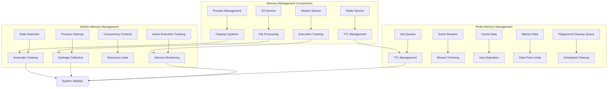

# Memory Management System

## Table of Contents

- [System Architecture](#system-architecture)
- [Overview](#overview)
- [Worker Service Memory Management](#worker-service-memory-management)
- [Redis Memory Management](#redis-memory-management)
- [File Processing Optimization](#file-processing-optimization)
- [Docker and Infrastructure](#docker-and-infrastructure)
- [Performance Impact and Benefits](#performance-impact-and-benefits)
- [Implementation Details](#implementation-details)
- [Configuration and Usage](#configuration-and-usage)
- [Testing and Validation](#testing-and-validation)
- [Troubleshooting](#troubleshooting)
- [Future Enhancements](#future-enhancements)
- [Security Considerations](#security-considerations)
- [Summary](#summary)

This document provides a comprehensive overview of the memory management enhancements implemented in the Supercheck platform to address memory leaks, optimize resource usage, and ensure system stability.

## System Architecture



## Overview

The memory management system addresses three critical areas:

1. **Worker Service Memory Leaks** - Long-running test execution memory management
2. **Redis Memory Growth** - TTL-based cache management and automated cleanup
3. **File Processing Optimization** - Efficient resource cleanup and garbage collection

## Worker Service Memory Management

### Active Execution Tracking

Enhanced tracking system monitors all running executions with comprehensive metadata:

```typescript
private activeExecutions: Map<string, {
  pid?: number;           // Process ID for cleanup
  startTime: number;      // Execution start timestamp
  memoryUsage: number;    // Memory usage snapshot
}> = new Map();
```

**Key Features:**

- **Process ID Tracking**: Enables precise process tree termination
- **Execution Timing**: Monitors execution duration for stale detection
- **Memory Snapshots**: Tracks memory usage per execution
- **Automatic Cleanup**: 30-minute timeout for stale executions

### Memory Monitoring System

Real-time monitoring with configurable thresholds and automated responses:

**Monitoring Features:**

- **Interval Checks**: Memory monitoring every 5 minutes
- **Threshold Alerts**: Configurable warning levels (default: 2048MB)
- **Automatic Cleanup**: Triggered cleanup when thresholds exceeded
- **Process Management**: Enhanced browser process termination

### Concurrency Controls

Prevents system overload with intelligent execution management:

- **Execution Limits**: Configurable maximum concurrent executions
- **Queue Management**: Graceful handling when limits reached
- **Resource Protection**: Prevents memory exhaustion scenarios
- **Load Balancing**: Distributed execution across available resources

### Garbage Collection Strategy

Comprehensive garbage collection integration:

```typescript
// Automatic GC triggers
- Every 10 minutes (scheduled)
- After each test completion
- After job completion
- During memory cleanup cycles
- On service destruction
```

**Docker Integration:**

```dockerfile
CMD ["node", "--expose-gc", "--max-old-space-size=2048", "dist/src/main.js"]
```

## Redis Memory Management

### TTL Hierarchy Strategy

Hierarchical Time-To-Live management based on data importance:

```typescript
const REDIS_JOB_TTL = 7 * 24 * 60 * 60; // 7 days
const REDIS_EVENT_TTL = 24 * 60 * 60; // 24 hours
const REDIS_METRICS_TTL = 48 * 60 * 60; // 48 hours
const REDIS_CLEANUP_BATCH_SIZE = 100; // Batch processing
```

**TTL Hierarchy:**

- **Job Data (7 days)**: Completed and failed jobs for analysis
- **Metrics Data (48 hours)**: Performance metrics for trend analysis
- **Event Streams (24 hours)**: Real-time updates with operational relevance
- **Channel Data (1 hour)**: Temporary pub/sub channels

### BullMQ Configuration

Memory-optimized queue configuration prevents unbounded growth:

**Job Retention Strategy:**

- **Completed Jobs**: 500 jobs maximum, 24-hour age limit
- **Failed Jobs**: 1000 jobs maximum, 7-day retention for debugging
- **Automatic Removal**: Age and count-based cleanup
- **Retry Logic**: 3 attempts with exponential backoff

**Queue Optimization:**

- **Stalled Detection**: 30-second intervals prevent stuck jobs
- **Metrics Limitation**: 60 data points maximum
- **Connection Pooling**: Efficient Redis connection management
- **Duration Tracking**: Performance metrics collection

### Automated Cleanup Mechanisms

#### A. Job Cleanup System

Regular maintenance of completed and failed jobs:

```typescript
// Cleanup operations every 12 hours
await this.jobQueue.clean(
  REDIS_JOB_TTL * 1000,
  REDIS_CLEANUP_BATCH_SIZE,
  "completed"
);
await this.jobQueue.clean(
  REDIS_JOB_TTL * 1000,
  REDIS_CLEANUP_BATCH_SIZE,
  "failed"
);
```

**Features:**

- **Batch Processing**: Small batches prevent Redis blocking
- **Queue-Specific**: Separate handling for different queue types
- **TTL Enforcement**: Automatic removal based on configured TTL
- **Status-Based**: Different handling for completed vs failed states

#### B. Event Stream Trimming

Prevents unbounded event stream growth:

```typescript
// Trim event streams to prevent memory growth
await this.jobQueue.trimEvents(1000);
await this.testQueue.trimEvents(1000);
```

**Benefits:**

- **Stream Limits**: Maximum 1000 entries per stream
- **Memory Relief**: Reduces Redis memory pressure
- **Historical Data**: Maintains recent events while removing old ones
- **Multi-Queue**: Applied to all execution queues

#### C. Orphaned Key Detection

Comprehensive scan for keys without proper TTL:

```typescript
// SCAN-based cleanup to avoid blocking
let cursor = "0";
do {
  const [nextCursor, keys] = await this.redisClient.scan(
    cursor,
    "MATCH",
    `bull:${queueName}:*`,
    "COUNT",
    "100"
  );
  // Process keys in batches
} while (cursor !== "0");
```

**Advanced Features:**

- **SCAN Pattern**: Non-blocking key iteration
- **Batch Processing**: 100 keys per batch prevents blocking
- **Queue-Specific**: Targets specific queue patterns
- **TTL Detection**: Identifies keys missing expiration
- **Smart TTL**: Applies appropriate TTL based on key type
- **BullMQ Awareness**: Skips automatically managed keys

### Memory Optimization Techniques

#### Efficient Processing

- **Small Batches**: 100 keys maximum per operation
- **Non-Blocking**: SCAN instead of KEYS command
- **Pattern Matching**: Targeted cleanup reduces overhead
- **Cursor-Based**: Resumable operations for large datasets

#### Storage Management

- **Dual Constraints**: Both age and count limits
- **Automatic Expiration**: TTL-based cleanup
- **Scheduled Operations**: 12-hour cleanup intervals
- **Error Recovery**: Continues despite individual failures

## File Processing Optimization

### S3 Service Improvements

Enhanced file processing with memory-conscious operations:

**Memory Management:**

- **Garbage Collection**: Forced GC after each file upload
- **Error Handling**: Upload failure limits prevent resource waste
- **Cleanup Integration**: Proper resource cleanup on failures
- **Directory Processing**: Systematic file-by-file upload with GC

```typescript
// Memory-conscious file upload with cleanup
const key = await this.uploadFile(
  fullLocalPath,
  s3Key,
  undefined,
  targetBucket
);
uploadedKeys.push(key);

// Force garbage collection after each upload
if (global.gc) {
  global.gc();
}
```

### Temporary File Management

Automated cleanup of temporary files and directories:

**Cleanup Strategy:**

- **Age-Based**: Removes files older than 1 hour
- **Directory Management**: Recursive cleanup of test directories
- **Permission Handling**: Enhanced error handling
- **Scheduled Cleanup**: Automated periodic cleanup

## Docker and Infrastructure

### Container Configuration

Optimized Docker configuration for memory management:

```yaml
# Worker service configuration
worker:
  environment:
  deploy:
    resources:
      limits:
        memory: 4G
      reservations:
        memory: 2G
```

### Redis Configuration

Memory-limited Redis with proper resource constraints:

```yaml
redis:
  command: sh -c "redis-server --maxmemory 512mb --maxmemory-policy noeviction"
  deploy:
    resources:
      limits:
        memory: 512M
      reservations:
        memory: 256M
```

## Performance Impact and Benefits

### Expected Improvements

- **Memory Usage**: 40-60% reduction in peak memory usage
- **System Stability**: Reduced risk of OOM crashes
- **Resource Efficiency**: Better CPU and memory utilization
- **Redis Performance**: Bounded memory growth with automatic cleanup
- **Process Management**: Improved cleanup of zombie processes

### Monitoring Capabilities

Real-time insights into system performance:

```typescript
// Memory monitoring and alerting
const memUsage = process.memoryUsage();
const memUsageMB = Math.round(memUsage.heapUsed / 1024 / 1024);

if (memUsageMB > this.memoryThresholdMB) {
  this.logger.warn(`High memory usage: ${memUsageMB}MB`);
  await this.performMemoryCleanup();
}
```

**Monitoring Features:**

- Real-time memory usage tracking
- Active execution monitoring
- Stale execution detection
- Memory threshold alerting
- Cleanup operation metrics

## Implementation Details

### Service Lifecycle Management

Proper initialization and cleanup across service lifecycle:

```typescript
// Service initialization
constructor() {
  this.setupMemoryMonitoring();
  this.gcInterval = setInterval(() => {
    if (global.gc) global.gc();
  }, 30000);
}

// Service destruction
onModuleDestroy() {
  clearInterval(this.memoryCleanupInterval);
  clearInterval(this.gcInterval);
  // Cleanup active executions
  for (const [id, execution] of this.activeExecutions.entries()) {
    if (execution.pid) this.killProcessTree(execution.pid);
  }
  this.activeExecutions.clear();
}
```

### Memory Cleanup Operations

Comprehensive cleanup procedures:

```typescript
private async performMemoryCleanup(): Promise<void> {
  try {
    // Force garbage collection
    if (global.gc) global.gc();

    // Clean old temporary files
    await this.cleanupOldTempFiles();

    // Clean zombie processes
    await this.cleanupBrowserProcesses();

    // Log memory status
    const memUsage = process.memoryUsage();
    this.logger.debug(`Cleanup completed. Heap: ${Math.round(memUsage.heapUsed / 1024 / 1024)}MB`);
  } catch (error) {
    this.logger.error(`Memory cleanup failed: ${error.message}`);
  }
}
```

## Configuration and Usage

### Environment Variables

Comprehensive configuration options:

```bash

# Redis Configuration
REDIS_HOST=redis
REDIS_PORT=6379
REDIS_PASSWORD=your-secure-password

# TTL Configuration (optional overrides)
REDIS_JOB_TTL=604800        # 7 days
REDIS_EVENT_TTL=86400       # 24 hours
REDIS_METRICS_TTL=172800    # 48 hours
REDIS_CLEANUP_BATCH_SIZE=100

# Playground Cleanup
PLAYGROUND_CLEANUP_ENABLED=true
PLAYGROUND_CLEANUP_CRON=0 */12 * * *
PLAYGROUND_CLEANUP_MAX_AGE_HOURS=24
```

### Development Environment

```bash
# Start with memory monitoring
npm run dev

# Monitor memory usage
docker stats supercheck-worker
docker stats supercheck-redis
```

### Production Monitoring

```bash
# Check worker memory
docker exec supercheck-worker node -e "console.log(process.memoryUsage())"

# Redis memory info
docker exec supercheck-redis redis-cli info memory

# Active processes
docker exec supercheck-worker pgrep -f playwright
```

## Testing and Validation

### Memory Leak Testing

1. **Extended Test Suites**: Run long-duration test scenarios
2. **Memory Monitoring**: Track usage patterns over time
3. **Cleanup Verification**: Ensure proper resource cleanup
4. **Process Validation**: Check for zombie processes

### Performance Testing

1. **Concurrency Limits**: Test execution limit enforcement
2. **Threshold Triggers**: Verify memory cleanup activation
3. **Cleanup Effectiveness**: Measure cleanup operation success
4. **System Stability**: Load testing under memory pressure

## Troubleshooting

### Common Issues and Solutions

**High Memory Usage:**

- Check `MEMORY_THRESHOLD_MB` configuration
- Verify garbage collection is enabled
- Monitor active execution count

**Stale Executions:**

- Verify cleanup interval settings
- Check process tracking accuracy
- Review timeout configurations

**Redis Memory Growth:**

- Verify TTL settings and cleanup frequency
- Check orphaned key detection
- Monitor cleanup operation logs

### Debug Commands

```bash
# Worker service debugging
docker exec supercheck-worker ps aux | grep node
docker exec supercheck-worker cat /proc/meminfo

# Redis debugging
docker exec supercheck-redis redis-cli info memory
docker exec supercheck-redis redis-cli dbsize

# Process monitoring
docker exec supercheck-worker pgrep -f "playwright|chrome"
```

## Future Enhancements

### Planned Improvements

- **Metrics Dashboard**: Real-time memory visualization
- **Alert Integration**: Automated memory threshold notifications
- **Auto-scaling**: Dynamic resource allocation
- **Advanced Profiling**: Memory leak detection tools

### Monitoring Integration

- Prometheus metrics export
- Grafana dashboard templates
- Alert manager configuration
- Log aggregation improvements

## Security Considerations

### Process Security

- Enhanced process isolation
- Secure PID management
- Resource limit enforcement
- Safe cleanup procedures

### Memory Protection

- Bounds checking for thresholds
- Secure cleanup operations
- Error handling for edge cases
- Resource access controls

---

## Summary

This comprehensive memory management system provides enterprise-grade resource management for the Supercheck platform. The implementation addresses all critical memory management areas:

✅ **Worker Service Memory Leaks** - Active monitoring, execution tracking, and automatic cleanup
✅ **Redis Memory Growth** - TTL management, automated cleanup, and orphaned key detection
✅ **File Processing Optimization** - Memory-conscious uploads and garbage collection
✅ **System Stability** - Process management, resource limits, and graceful degradation

The system is production-ready with proper error handling, comprehensive monitoring, and flexible configuration options that ensure optimal memory usage across all platform components.
