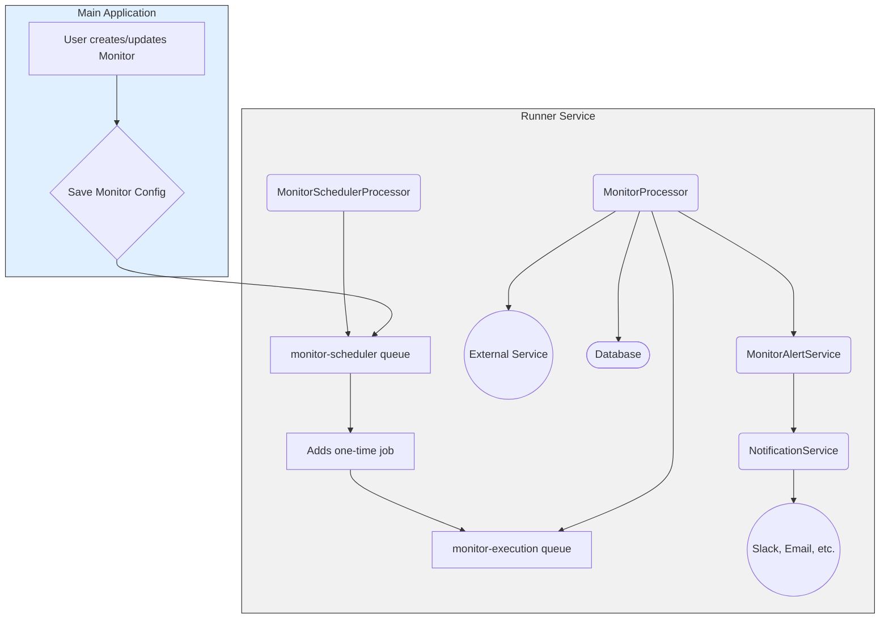
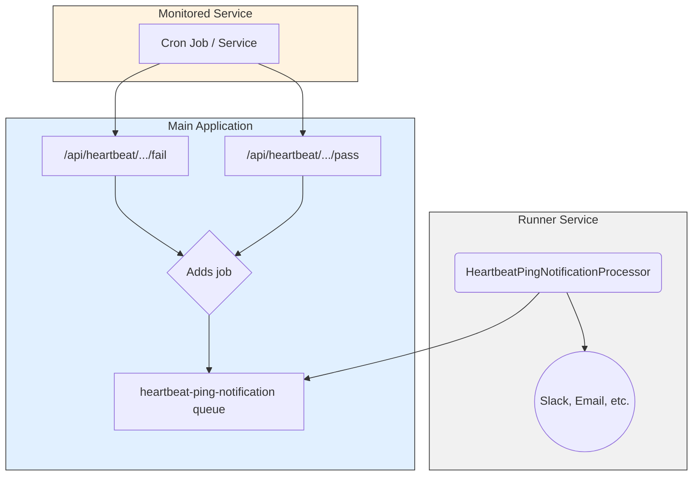
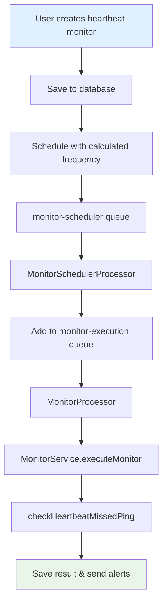

# Monitoring System Specification

This document provides a comprehensive technical specification for the Supertest monitoring system, covering architecture design, queue management, heartbeat monitoring, scheduling implementation, and production deployment considerations.

## Table of Contents

1. [System Overview](#system-overview)
2. [Architecture](#architecture)
3. [Queue System](#queue-system)
4. [Heartbeat Monitoring](#heartbeat-monitoring)
5. [Scheduling System](#scheduling-system)
6. [Fixes and Improvements](#fixes-and-improvements)
7. [Implementation Details](#implementation-details)
8. [Testing and Verification](#testing-and-verification)
9. [Configuration](#configuration)
10. [Troubleshooting](#troubleshooting)

## System Overview

The monitoring system delivers comprehensive real-time monitoring capabilities including HTTP endpoint monitoring, network connectivity testing, port availability checks, and multi-channel alerting. The system is architected using Next.js frontend, NestJS worker services, PostgreSQL for data persistence, and BullMQ with Redis for distributed job processing.

### Core Capabilities

#### Monitoring Types
- **HTTP/HTTPS Monitoring**: Full-featured web service monitoring with custom headers, authentication, response validation, and SSL certificate tracking
- **Network Connectivity**: ICMP ping monitoring for server availability and network path verification  
- **Port Accessibility**: TCP/UDP port monitoring to verify service availability on specific ports
- **Heartbeat Monitoring**: Passive monitoring system where external services report their status via webhook endpoints

#### System Features
- **Adaptive SSL Certificate Monitoring**: Intelligent certificate expiration checking with frequency optimization based on expiration proximity
- **Immediate Validation**: New monitors execute immediately upon creation for instant configuration verification
- **Real-time Updates**: Server-Sent Events (SSE) provide live status updates and immediate feedback
- **Enterprise Alerting**: Multi-channel notification system supporting email, Slack, webhooks, Telegram, Discord, and Microsoft Teams
- **Threshold-Based Logic**: Configurable failure and recovery thresholds to minimize alert fatigue
- **Professional Notifications**: Rich HTML email templates and structured alert messages with comprehensive context
- **Comprehensive Audit**: Complete alert history with delivery status tracking and error logging

## Architecture

### Frontend (Next.js App)
```
app/
├── src/app/
│   ├── monitors/           # Monitor management pages
│   ├── alerts/            # Alert management and history
│   ├── api/               # API routes for frontend-backend communication
│   └── ...
├── src/components/
│   ├── monitors/          # Monitor-related UI components
│   ├── alerts/           # Alert management UI components
│   └── ui/               # Shared UI components
└── src/lib/
    ├── alert-service.ts  # Alert processing logic
    ├── monitor-service.ts # Monitor management
    ├── monitor-scheduler.ts # Monitor scheduling
    └── ...
```

### Backend (NestJS Runner)
```
runner/
├── src/
│   ├── monitor/
│   │   ├── monitor.service.ts     # Core monitoring logic
│   │   ├── monitor.processor.ts   # Job queue processing
│   │   ├── services/
│   │   │   └── monitor-alert.service.ts # Alert handling
│   │   ├── processors/
│   │   │   └── heartbeat-ping-notification.processor.ts # Heartbeat notifications
│   │   └── dto/                   # Data transfer objects
│   ├── scheduler/
│   │   ├── processors/
│   │   │   ├── job-scheduler.processor.ts
│   │   │   └── monitor-scheduler.processor.ts
│   │   └── constants.ts
│   ├── execution/
│   │   ├── services/              # Execution services
│   │   └── processors/            # Background job processors
│   └── db/
│       └── schema.ts              # Database schema
```

### Database Schema
- **monitors**: Monitor configurations and metadata
- **monitor_results**: Historical monitoring results
- **notification_providers**: Alert channel configurations
- **monitor_notification_settings**: Monitor-to-provider relationships
- **jobs**: Scheduled monitoring jobs
- **runs**: Job execution history

## Queue System

The monitoring system uses BullMQ and Redis for robust job processing with the following queues:

### Active Monitor Scheduling & Execution

#### 1. **`monitor-scheduler`**
- **Purpose**: Manages the schedules for all active monitors
- **Job Type**: Repeating jobs
- **How it Works**: A unique, repeating job is created for each active monitor based on its configured frequency (e.g., every 5 minutes). When a job's schedule fires, its only task is to add a *new, one-time* execution job to the `monitor-execution` queue. This queue acts as a distributed cron system.

#### 2. **`monitor-execution`**
- **Purpose**: To execute the actual monitor checks
- **Job Type**: One-time jobs
- **How it Works**: The `MonitorProcessor` listens to this queue. It picks up jobs, executes the check, and saves the result. If a notification is required (e.g., status change), it delegates the task to the `MonitorAlertService`, which then uses the generic `NotificationService` to send alerts.

### Heartbeat Monitoring

#### 3. **`heartbeat-ping-notification`**
- **Purpose**: To decouple immediate notification requests for heartbeat pings from the main application
- **Job Type**: One-time jobs
- **How it Works**: When the `app` receives a ping on a `/fail` or `/pass` URL for a heartbeat monitor, it first checks if the status has changed. If it has (e.g., was `up`, now `/fail`), it immediately updates the database and dispatches a job to this queue. The `runner` has a processor that listens to this queue and sends the alert, ensuring the `app` remains fast and responsive.

### Queue Architecture Diagrams

#### Active Monitoring Flow


#### Heartbeat Notification Flow


## Heartbeat Monitoring

Heartbeat monitors follow the **standard monitor pattern** and use the same scheduling and execution system as other monitors. The key difference is in the execution logic, which checks for missed pings rather than actively pinging external services.

### Current Implementation Logic

#### **Frequency Calculation Strategy**
**Implementation Status**: Fully implemented with smart adaptive checking algorithm.

```typescript
// Helper function to calculate optimal check frequency for heartbeat monitors
const calculateOptimalFrequency = (expected: number, grace: number) => {
  // Total time to wait before considering the heartbeat failed
  const totalWaitMinutes = expected + grace;
  
  // For very short total wait times (≤5min), check at half the total wait time
  // but ensure we don't check more frequently than every minute
  if (totalWaitMinutes <= 5) {
    return Math.max(1, Math.round(totalWaitMinutes / 2));
  }
  
  // For longer intervals, check at 1/3 of the total wait time
  // This ensures failures are detected reasonably quickly after they occur
  // but not so frequently as to waste resources
  const optimalFrequency = Math.max(1, Math.round(totalWaitMinutes / 3));
  
  // Apply reasonable limits: minimum 1 minute, maximum 60 minutes
  return Math.max(1, Math.min(optimalFrequency, 60));
};
```

**Real-world Examples**:
```
1 min interval + 0 min grace → Check every 1 min
1 min interval + 1 min grace → Check every 1 min  
5 min interval + 5 min grace → Check every 3 min (≤5 total, so totalWait/2)
60 min interval + 10 min grace → Check every 23 min (>5 total, so totalWait/3)
```

#### **Detection Logic** 
**Implementation Status**: Optimized detection algorithm that creates database entries only for actual failures.

The `checkHeartbeatMissedPing` method in `MonitorService` implements the following logic:

1. **Initial Ping Check**: For monitors that haven't received their first ping yet
   - Checks if monitor was created more than `totalWaitMinutes` ago
   - If overdue: Creates failure entry with "No initial ping received" message
   - If within grace period: Returns `null` (no database entry)

2. **Subsequent Ping Check**: For monitors that have received at least one ping
   - Compares `minutesSinceLastPing` against `totalWaitMinutes`
   - If overdue: Creates failure entry with detailed timing information
   - If recent: Returns `null` (no database entry)

3. **Failure Detection Timeline**:
   ```
   Expected: 60min, Grace: 10min, Check: 23min intervals
   
   0min: Service starts, next ping expected at 60min
   23min: Check - OK (no ping expected yet)
   46min: Check - OK (no ping expected yet)  
   60min: Service fails, no ping sent
   70min: Check - FAILURE DETECTED (exactly at grace period end)
   93min: Check - Still down (send recovery alert when ping resumes)
   ```

#### **Status Tracking Implementation**
**Implementation Status**: Robust status tracking system with comprehensive change detection.

```typescript
// Status tracking in monitor config
interface MonitorConfig {
  expectedIntervalMinutes: number;
  gracePeriodMinutes: number;
  lastPingAt?: string;                    // Latest ping timestamp
  heartbeatUrl: string;                   // Generated ping URL
  // ... other fields
}

// Status updates through ping endpoints
// /api/heartbeat/[token] - Updates lastPingAt and sets status to 'up'
// /api/heartbeat/[token]/fail - Sets status to 'down' with failure details
```

**Features**:
- **Persistent tracking**: `lastPingAt` stored in monitor configuration
- **Status change detection**: Compares current vs recent monitor results
- **Automatic recovery**: Status automatically changes to 'up' when pings resume
- **Alert integration**: Status changes trigger appropriate notifications

#### **Database Entry Strategy**
**Implementation Status**: Efficient database strategy optimized for failure-only logging.

```typescript
// Current logic (optimized for efficiency)
if (minutesSinceLastPing > totalWaitMinutes) {
  // Create failure entry only when overdue
  return {
    status: 'down',
    isUp: false,
    details: {
      errorMessage: 'No ping received within expected interval',
      expectedInterval: expectedIntervalMinutes,
      gracePeriod: gracePeriodMinutes,
      lastPingAt: currentLastPingAt,
      totalWaitMinutes,
      // ... detailed failure information
    }
  };
} else {
  // Return null to skip database entry (no failure to record)
  return null;
}
```

**Benefits**:
- **Efficient**: Only creates database entries when failures occur
- **Clean data**: Monitor results show actual failure events, not constant "up" status
- **Performance**: Reduces database writes for normal operation

### Heartbeat Ping Endpoints

#### **Success Ping**: `GET/POST /api/heartbeat/[token]`
- Updates monitor status to 'up'
- Records `lastPingAt` timestamp in monitor config
- Creates successful monitor result entry
- Triggers recovery notification if previously down

#### **Failure Ping**: `GET/POST /api/heartbeat/[token]/fail`
- Updates monitor status to 'down'
- Records `lastPingAt` timestamp (failure is still activity)
- Creates failure monitor result entry with error details
- Triggers failure notification if previously up

### Notification System

#### **Manual Notification Trigger**
- **Endpoint**: `POST /api/monitors/[id]/notify`
- **Purpose**: Allows manual triggering of notifications for status changes
- **Features**:
  - Validates monitor existence and alert configuration
  - Checks notification provider settings
  - Respects alert configuration (failure/recovery settings)
  - Saves alert history for tracking
  - Supports multiple notification providers (Slack, Email, Webhook)

#### **Automatic Notifications**
- **Recovery**: Triggered when status changes from 'down' to 'up'
- **Failure**: Triggered when status changes from 'up' to 'down'
- **Queue**: Uses `heartbeat-ping-notification` queue for async processing
- **Processor**: `HeartbeatPingNotificationProcessor` handles notification delivery

### Configuration Recommendations

**For Production Heartbeat Monitors**:
```typescript
interface OptimalHeartbeatConfig {
  // User-configured
  expectedIntervalMinutes: number;    // e.g., 60
  gracePeriodMinutes: number;         // e.g., 10
  
  // System-calculated optimal values
  checkFrequencyMinutes: number;      // calculated via calculateOptimalFrequency()
  alertDelayMinutes: 0;               // Alert immediately on detection
  recoveryConfirmationChecks: 1;     // Confirm recovery after 1 successful ping
}
```

### Standard Heartbeat Scheduling

Heartbeat monitors are scheduled using the same `monitor-scheduler` queue as other monitors:

1. **Frequency Calculation**: Uses `calculateOptimalFrequency(expectedInterval, gracePeriod)`
2. **Scheduling**: Standard monitor scheduling via `monitor-scheduler` queue
3. **Execution**: Standard monitor execution via `monitor-execution` queue
4. **Logic**: `checkHeartbeatMissedPing` method in `MonitorService`

### Standard Monitor Pattern

Heartbeat monitors follow the exact same pattern as other monitors:



### System Benefits

#### **Architectural Consistency**
Unified architecture across all monitor types (HTTP, Ping, Port, Heartbeat) ensures consistent behavior and maintainability.

#### **Operational Simplicity** 
Standardized scheduling and execution patterns eliminate complexity and reduce operational overhead.

#### **Mathematical Optimization**
Check frequencies are algorithmically calculated to optimize detection speed while minimizing resource consumption.

#### **Development Efficiency**
Consistent patterns across monitor types streamline development, testing, and maintenance workflows.

#### **User Experience**
Clear UI feedback with calculated check frequencies and real-time status updates provide immediate operational visibility.

#### **Resource Efficiency**
Failure-only database logging minimizes storage requirements while maintaining complete failure audit trails.

