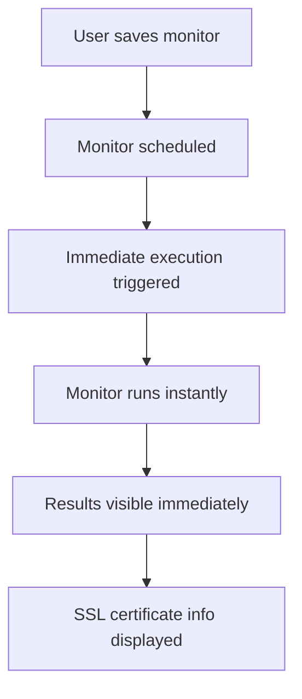

# Monitoring System

This document provides a comprehensive overview of the Supertest monitoring system, including architecture, queue management, heartbeat monitoring, scheduling implementation, and troubleshooting guides for production deployments.

## Table of Contents

1. [System Overview](#system-overview)
2. [Architecture](#architecture)
3. [Queue System](#queue-system)
4. [Heartbeat Monitoring](#heartbeat-monitoring)
5. [Scheduling System](#scheduling-system)
6. [Fixes and Improvements](#fixes-and-improvements)
7. [Implementation Details](#implementation-details)
8. [Testing and Verification](#testing-and-verification)
9. [Configuration](#configuration)
10. [Troubleshooting](#troubleshooting)

## System Overview

The monitoring system provides real-time monitoring capabilities for HTTP endpoints, ping monitoring, port checking, and multi-channel alerting. It's built with Next.js, NestJS, and PostgreSQL using BullMQ and Redis for job processing.

### Key Features
- **HTTP Request Monitoring**: Monitor REST APIs, websites, and web services with custom headers, authentication, and body validation
- **Ping Host Monitoring**: Monitor server availability and network connectivity using ICMP pings
- **Port Check Monitoring**: Verify if specific TCP/UDP ports are open and accessible
- **Heartbeat Monitoring**: Passive monitoring where external services ping Supertest endpoints
- **Smart SSL Certificate Monitoring**: Intelligent SSL certificate expiration checking with adaptive frequency
- **Immediate Monitor Execution**: Monitors execute immediately when created/updated for instant validation
- **Real-time Status Updates**: Live status updates via Server-Sent Events (SSE) for immediate feedback
- **Multi-Channel Alerting**: Supports email, Slack, webhooks, Telegram, Discord, and Microsoft Teams
- **SSL Expiration Alerts**: Independent SSL certificate expiration warnings without status changes
- **Threshold-Based Alerting**: Configurable failure/recovery thresholds to prevent alert spam
- **Professional Templates**: Rich HTML emails and formatted messages with full context
- **Complete Audit Trail**: Alert history with delivery status and error tracking

## Architecture

### Frontend (Next.js App)
```
app/
├── src/app/
│   ├── monitors/           # Monitor management pages
│   ├── alerts/            # Alert management and history
│   ├── api/               # API routes for frontend-backend communication
│   └── ...
├── src/components/
│   ├── monitors/          # Monitor-related UI components
│   ├── alerts/           # Alert management UI components
│   └── ui/               # Shared UI components
└── src/lib/
    ├── alert-service.ts  # Alert processing logic
    ├── monitor-service.ts # Monitor management
    ├── monitor-scheduler.ts # Monitor scheduling
    └── ...
```

### Backend (NestJS Runner)
```
runner/
├── src/
│   ├── monitor/
│   │   ├── monitor.service.ts     # Core monitoring logic
│   │   ├── monitor.processor.ts   # Job queue processing
│   │   ├── services/
│   │   │   └── monitor-alert.service.ts # Alert handling
│   │   ├── processors/
│   │   │   └── heartbeat-ping-notification.processor.ts # Heartbeat notifications
│   │   └── dto/                   # Data transfer objects
│   ├── scheduler/
│   │   ├── processors/
│   │   │   ├── job-scheduler.processor.ts
│   │   │   └── monitor-scheduler.processor.ts
│   │   └── constants.ts
│   ├── execution/
│   │   ├── services/              # Execution services
│   │   └── processors/            # Background job processors
│   └── db/
│       └── schema.ts              # Database schema
```

### Database Schema
- **monitors**: Monitor configurations and metadata
- **monitor_results**: Historical monitoring results
- **notification_providers**: Alert channel configurations
- **monitor_notification_settings**: Monitor-to-provider relationships
- **jobs**: Scheduled monitoring jobs
- **runs**: Job execution history

## Queue System

The monitoring system uses BullMQ and Redis for robust job processing with the following queues:

### Active Monitor Scheduling & Execution

#### 1. **`monitor-scheduler`**
- **Purpose**: Manages the schedules for all active monitors
- **Job Type**: Repeating jobs
- **How it Works**: A unique, repeating job is created for each active monitor based on its configured frequency (e.g., every 5 minutes). When a job's schedule fires, its only task is to add a *new, one-time* execution job to the `monitor-execution` queue. This queue acts as a distributed cron system.

#### 2. **`monitor-execution`**
- **Purpose**: To execute the actual monitor checks
- **Job Type**: One-time jobs
- **How it Works**: The `MonitorProcessor` listens to this queue. It picks up jobs, executes the check, and saves the result. If a notification is required (e.g., status change), it delegates the task to the `MonitorAlertService`, which then uses the generic `NotificationService` to send alerts.

### Heartbeat Monitoring

#### 3. **`heartbeat-ping-notification`**
- **Purpose**: To decouple immediate notification requests for heartbeat pings from the main application
- **Job Type**: One-time jobs
- **How it Works**: When the `app` receives a ping on a `/fail` or `/pass` URL for a heartbeat monitor, it first checks if the status has changed. If it has (e.g., was `up`, now `/fail`), it immediately updates the database and dispatches a job to this queue. The `runner` has a processor that listens to this queue and sends the alert, ensuring the `app` remains fast and responsive.

### Queue Architecture Diagrams

#### Active Monitoring Flow


#### Heartbeat Notification Flow
```mermaid
graph TD
    subgraph Monitored Service
        J[Cron Job / Service];
    end

    subgraph app [Main Application]
        K[/api/heartbeat/.../fail]
        L[/api/heartbeat/.../pass]

        J -- "Pings on failure" --> K;
        J -- "Pings on success" --> L;

        K -- "If status changes" --> M{Adds job};
        L -- "If status changes" --> M;
        M --> N[heartbeat-ping-notification queue];
    end

    subgraph runner [Runner Service]
        O(HeartbeatPingNotificationProcessor) -- "Picks up job" --> N;
        O -- "Sends notification" --> P((Slack, Email, etc.));
    end

    style runner fill:#f1f1f1,stroke:#333
    style app fill:#e1f0ff,stroke:#333
```

## Heartbeat Monitoring

Heartbeat monitors follow the **standard monitor pattern** and use the same scheduling and execution system as other monitors. The key difference is in the execution logic, which checks for missed pings rather than actively pinging external services.

### Current Implementation Issues

#### 1. **Incorrect Check Frequency Logic**
**Problem**: The current heartbeat monitoring system has a fundamental flaw in how it calculates when to check for missed pings.

**Current Logic**:
- Monitor frequency is set to `expectedInterval + gracePeriod` (e.g., 60 + 10 = 70 minutes)
- Monitor checks run every 70 minutes
- Logic checks if a ping is overdue by comparing against `expectedInterval + gracePeriod`

**The Issue**: This creates a gap where missed pings aren't detected optimally:
- Service should ping every 60 minutes
- Grace period is 10 minutes (so up to 70 minutes is acceptable)
- But we only check every 70 minutes
- If a service misses its ping at 61 minutes, we won't detect it until the next check at 140 minutes (70 minutes later)

#### 2. **Inconsistent Alert Timing**
**Current Behavior**:
```
Service pings every 60min, grace period 10min
Check frequency: 70min

Timeline:
0min: Service starts, first ping expected at 60min
60min: Service fails, no ping sent
70min: First check - everything still OK (within 70min window)
140min: Second check - NOW we detect the failure (80min late!)
```

**Expected Behavior**:
```
Service pings every 60min, grace period 10min
Check frequency: Should be more frequent than expected interval

Timeline:
0min: Service starts, first ping expected at 60min
60min: Service fails, no ping sent
70min: First check - detects failure (exactly at grace period limit)
```

#### 3. **Missing Pings Not Detected Promptly**
The current system can miss detecting failures for up to `2 × (expectedInterval + gracePeriod)` time in worst case scenarios.

### Recommended Heartbeat Monitoring Improvements

#### 1. **Optimal Check Frequency Strategy**

**Strategy A: Half-Interval Checking** (Recommended)
```typescript
// Check twice as often as expected interval, but not more than grace period
const checkFrequencyMinutes = Math.min(
  expectedIntervalMinutes / 2,  // Half the expected interval
  gracePeriodMinutes           // But no more than grace period
);

// Examples:
// Expected: 60min, Grace: 10min → Check every: 10min
// Expected: 30min, Grace: 15min → Check every: 15min  
// Expected: 120min, Grace: 20min → Check every: 20min
```

**Strategy B: Grace Period Checking**
```typescript
// Check exactly at grace period intervals
const checkFrequencyMinutes = gracePeriodMinutes;

// Examples:
// Expected: 60min, Grace: 10min → Check every: 10min
// Expected: 30min, Grace: 5min → Check every: 5min
```

**Strategy C: Smart Adaptive Checking**
```typescript
// Adaptive frequency based on expected interval
const checkFrequencyMinutes = Math.max(
  Math.min(expectedIntervalMinutes / 3, gracePeriodMinutes),
  5  // Minimum 5 minutes
);
```

#### 2. **Enhanced Detection Logic**

**Current Logic Issues**:
```typescript
// Current: Only creates "down" entries when overdue
if (minutesSinceLastPing > totalWaitMinutes) {
  // Create failure entry
} else {
  // Skip result creation - this is the problem!
}
```

**Improved Logic**:
```typescript
// Always create status entries for proper monitoring
const isOverdue = minutesSinceLastPing > totalWaitMinutes;
const status = isOverdue ? 'down' : 'up';
const shouldAlert = isOverdue && !wasAlreadyDown;

// Always record status for consistent monitoring
return {
  status,
  isUp: !isOverdue,
  details: {
    lastPingAge: minutesSinceLastPing,
    expectedInterval: expectedIntervalMinutes,
    isOverdue,
    // ... other details
  }
};
```

#### 3. **Robust Status Tracking**

**Problem**: Current system doesn't track heartbeat status consistently, making it hard to detect status changes.

**Solution**: 
```typescript
interface HeartbeatStatus {
  lastPingAt: string | null;
  lastCheckAt: string;
  consecutiveFailures: number;
  lastKnownStatus: 'up' | 'down' | 'unknown';
  overdueDetectedAt?: string;
}
```

#### 4. **Improved Failure Detection Timeline**

**Optimal Timeline**:
```
Expected: 60min, Grace: 10min, Check: 10min intervals

0min: Service starts, next ping expected at 60min
10min: Check - OK (no ping expected yet)
20min: Check - OK (no ping expected yet)  
...
60min: Service fails, no ping sent
70min: Check - FAILURE DETECTED (exactly at grace period end)
80min: Check - Still down (send recovery alert when ping resumes)
```

#### 5. **Configuration Recommendations**

**For Production Heartbeat Monitors**:
```typescript
interface OptimalHeartbeatConfig {
  // User-configured
  expectedIntervalMinutes: number;    // e.g., 60
  gracePeriodMinutes: number;         // e.g., 10
  
  // System-calculated optimal values
  checkFrequencyMinutes: number;      // min(expectedInterval/2, gracePeriod)
  alertDelayMinutes: 0;               // Alert immediately on detection
  recoveryConfirmationChecks: 1;     // Confirm recovery after 1 successful ping
}
```

### Implementation Priority

**High Priority Fixes**:
1. Fix check frequency calculation to detect failures promptly
2. Implement consistent status tracking
3. Add proper failure detection timeline

**Medium Priority Improvements**:
1. Add heartbeat analytics and trends
2. Implement recovery confirmation logic
3. Add heartbeat-specific dashboard views

**Low Priority Enhancements**:
1. Custom ping intervals per monitor
2. Advanced heartbeat patterns (burst detection, etc.)
3. Heartbeat SLA tracking

### Standard Heartbeat Scheduling

Heartbeat monitors are scheduled using the same `monitor-scheduler` queue as other monitors:

1. **Frequency Calculation**: `expected interval + grace period` (e.g., 60 + 10 = 70 minutes)
2. **Scheduling**: Standard monitor scheduling via `monitor-scheduler` queue
3. **Execution**: Standard monitor execution via `monitor-execution` queue
4. **Logic**: `checkHeartbeatMissedPing` method in `MonitorService`

### Standard Monitor Pattern

Heartbeat monitors now follow the exact same pattern as other monitors:


### Key Benefits

1. **Consistency**: Same architecture as HTTP, Ping, and Port monitors
2. **Simplicity**: No complex hybrid approach or app-side filtering
3. **Accuracy**: Check frequency is mathematically correct (`expected interval + grace period`)
4. **Maintainability**: Standard patterns across all monitor types
5. **User Experience**: Clear UI with calculated check frequency display

### Removed Components

The following components were removed as part of the standardization:

- `app/src/lib/heartbeat-service.ts` - App-side service
- `app/src/lib/heartbeat-scheduler.ts` - Separate scheduler
- `runner/src/scheduler/processors/heartbeat-checker.processor.ts` - Separate processor
- `runner/src/monitor/services/heartbeat.service.ts` - Separate service
- `HEARTBEAT_CHECKER_QUEUE` - Redundant queue

## Scheduling System

### Problem Statement

#### Original Issues
1. **Monitors not running after sleep/resume**: Monitor schedules were lost when the system went to sleep and resumed
2. **Inconsistent behavior**: Job schedulers worked fine, but monitor schedulers failed
3. **Architecture gap**: Monitor schedulers used Redis-only repeatable jobs, which are less reliable than job schedulers
4. **Missing workers**: The app created monitor schedules but had no workers to process them

#### Root Causes
- **Redis-only scheduling**: Monitors used Redis repeatable jobs that don't handle system sleep/resume well
- **No persistence**: Schedules were lost on system restarts
- **Architecture mismatch**: Different scheduling patterns between jobs and monitors
- **Missing initialization**: No proper startup sequence for monitor schedulers

### Solution Architecture

#### 1. Database Schema Changes

**Added `scheduledJobId` field to monitors table:**
```sql
ALTER TABLE "monitors" ADD COLUMN "scheduled_job_id" varchar(255);
```

This follows the same pattern as jobs, which store their scheduler IDs in the database for persistence.

#### 2. Monitor Scheduler Implementation

**File: `app/src/lib/monitor-scheduler.ts`**

##### Key Functions:
- `scheduleMonitor()` - Creates BullMQ repeatable jobs for monitors
- `deleteScheduledMonitor()` - Removes monitor schedules
- `initializeMonitorSchedulers()` - Initializes all active monitors on startup
- `cleanupMonitorScheduler()` - Cleans up orphaned jobs

##### Features:
- **BullMQ repeatable jobs** instead of Redis-only
- **Persistent scheduling** that survives restarts
- **Proper cleanup** of orphaned jobs
- **Retry logic** with exponential backoff

#### 3. Monitor Service Layer

**File: `app/src/lib/monitor-service.ts`**

##### Key Functions:
- `createMonitorHandler()` - Creates monitors and schedules them
- `updateMonitorHandler()` - Updates monitors and re-schedules if needed
- `deleteMonitorHandler()` - Deletes monitors and removes schedules

##### Features:
- **Database integration** with `scheduledJobId` tracking
- **Consistent state** between database and Redis
- **Proper cleanup** on monitor deletion/updates
- **Graceful failures** - monitors still work if scheduling fails

### Scheduling Flow

1. **Monitor Creation**:
   ```typescript
   const schedulerId = await scheduleMonitor({
     monitorId: monitor.id,
     frequencyMinutes: monitor.frequencyMinutes,
     jobData: jobDataPayload,
     retryLimit: 3
   });
   
   // Update monitor with scheduler ID
   await db.update(monitorTable)
     .set({ scheduledJobId: schedulerId })
     .where(eq(monitorTable.id, monitor.id));
   ```

2. **Scheduling Process**:
   - Creates BullMQ repeatable job with specified frequency
   - Stores scheduler ID in database for persistence
   - Handles cleanup of existing schedules

3. **Execution Flow**:
   - BullMQ triggers repeatable job at specified interval
   - Scheduler processor adds job to execution queue
   - Runner processes execution job and performs monitoring

### Startup Process

1. **App starts** → `SchedulerInitializer` runs
2. **Cleanup** → Removes orphaned jobs from previous runs
3. **Initialize** → Schedules all active monitors from database
4. **Runner starts** → Processes scheduled triggers and execution jobs

### Benefits Over Previous System

#### Robustness
- ✅ **BullMQ proven scheduling** instead of custom Redis implementation
- ✅ **Persistent schedules** that survive system restarts
- ✅ **Proper error handling** with retry logic
- ✅ **Consistent state** between database and Redis

#### Reliability
- ✅ **Sleep/resume resilience** - schedules persist through system sleep
- ✅ **Restart recovery** - automatic re-initialization on startup
- ✅ **Orphaned job cleanup** - prevents duplicate schedules
- ✅ **Graceful degradation** - monitors work even if scheduling fails

#### Maintainability
- ✅ **Consistent patterns** - follows same approach as job scheduling
- ✅ **Clear separation** - scheduler, service, and API layers
- ✅ **Comprehensive logging** - easy debugging and monitoring
- ✅ **Type safety** - proper TypeScript integration

#### Performance
- ✅ **Efficient scheduling** - BullMQ's optimized repeatable jobs
- ✅ **Minimal overhead** - lightweight scheduler initialization
- ✅ **Proper cleanup** - prevents memory leaks and duplicate jobs

## SSL Certificate Monitoring

### Smart SSL Check Strategy

The monitoring system implements intelligent SSL certificate checking to optimize performance while ensuring timely expiration alerts.

#### SSL Check Frequency Logic

The system uses **frequent SSL checks** for rapid detection but **controlled alert frequency** to prevent spam:

```typescript
// SSL Check Frequency (How often we verify certificates)
interface SSLCheckStrategy {
  normal: 24 hours,      // Certificates with >2x warning threshold (e.g., >100 days)
  approaching: 6 hours,  // Certificates within 2x warning threshold (e.g., 50-100 days)  
  critical: 1 hour,      // Certificates within warning threshold (e.g., ≤50 days)
  immediate: on save,    // Always check when monitors are created/updated
}

// Alert Frequency (How often we send notifications)
interface SSLAlertStrategy {
  expiration: 24 hours,  // "Certificate expires in X days" - once per day
  critical: immediate,   // Expired/revoked certificates - immediate alert
  changes: immediate,    // Certificate renewed/replaced - immediate notification
}
```

**Why Frequent Checks + Controlled Alerts?**
- **Rapid Detection**: Hourly checks detect certificate changes within 1 hour
- **No Alert Spam**: Expiration countdown alerts limited to once per day
- **Critical Issues**: Expired/revoked certificates trigger immediate alerts
- **Certificate Changes**: Renewals/replacements detected and reported quickly

#### Key Features

1. **Adaptive Frequency**: SSL checks become more frequent as expiration approaches
2. **Performance Optimization**: Reduces SSL checks from every 5 minutes to daily for most certificates
3. **Immediate Validation**: All monitors execute immediately when created or updated
4. **Independent Alerting**: SSL expiration alerts work without monitor status changes
5. **Alert Deduplication**: SSL alerts are sent once per day to prevent spam

#### Configuration Options

```typescript
interface MonitorConfig {
  // SSL-specific settings
  enableSslCheck?: boolean;                 // Enable SSL certificate checking
  sslDaysUntilExpirationWarning?: number;   // Warning threshold (default: 30)
  sslCheckFrequencyHours?: number;          // Default check frequency (default: 24)
  sslLastCheckedAt?: string;                // Timestamp of last SSL check
  sslCheckOnStatusChange?: boolean;         // Check SSL on status changes (default: true)
}
```

#### SSL Alert Types

1. **Expiration Warning**: Certificate expires within warning threshold
2. **Certificate Expired**: Certificate has already expired  
3. **SSL Connection Errors**: Handshake failures, invalid certificates
4. **Certificate Revocation**: Certificate has been revoked (if enabled)

### Performance Benefits

- **288x Reduction**: SSL checks reduced from every 5 minutes to daily
- **Smart Escalation**: More frequent checks only when needed
- **Resource Efficient**: Fewer TLS handshakes reduce network overhead
- **Immediate Feedback**: Users get instant SSL validation on monitor save

## Immediate Monitor Execution

### Feature Overview

All monitors (except heartbeat) now execute immediately when created or updated, providing instant validation and feedback.

#### Implementation

```typescript
// Automatic execution triggers
createMonitor() -> scheduleMonitor() -> triggerImmediateExecution()
updateMonitor() -> rescheduleMonitor() -> triggerImmediateExecution()
```

#### Benefits

1. **Instant Validation**: Users see immediate results when creating monitors
2. **Configuration Verification**: Quickly identify misconfigurations
3. **SSL Certificate Info**: Immediate SSL certificate details for HTTPS monitors
4. **User Experience**: No waiting for first scheduled check

#### Excluded Monitor Types

- **Heartbeat Monitors**: Passive monitoring, no active execution needed

## Fixes and Improvements

### Issues Addressed

#### 1. SSL Expiration Alert Logic Fixed
**Problem**: SSL expiration warnings (47 days with 50-day threshold) didn't trigger alerts because they don't change monitor status.

**Solution**: 
- Added independent SSL expiration alert checking in `saveMonitorResult`
- Created `checkSslExpirationAlert` method that works without status changes
- Added `sendSslExpirationNotification` method in `MonitorAlertService`
- Implemented alert deduplication to prevent spam (24-hour cooldown)

#### 2. Smart SSL Check Frequency Implementation
**Problem**: SSL checks running with every monitor execution (every 5 minutes) caused performance issues.

**Solution**:
- Implemented `shouldPerformSslCheck` logic with adaptive frequency
- Added SSL check timestamp tracking in monitor config
- Smart escalation: hourly checks when approaching expiration, 6-hourly for 2x threshold
- Performance improvement: 288x reduction in SSL checks for normal certificates

#### 3. Immediate Monitor Execution on Save
**Problem**: Users had to wait for scheduled execution to see monitor results.

**Solution**:
- Added `triggerImmediateMonitorExecution` function in monitor service
- Integrated immediate execution in `createMonitorHandler` and `updateMonitorHandler`
- Skips heartbeat monitors (passive) and disabled monitors
- Non-blocking implementation doesn't affect save performance

#### 4. Enhanced Monitor Configuration Schema
**Problem**: Monitor configuration lacked SSL-specific fields for optimization.

**Solution**:
- Added SSL-specific configuration fields to `MonitorConfig` type
- Backward compatibility with legacy SSL fields (`checkExpiration`, `daysUntilExpirationWarning`)
- Enhanced configuration tracking for SSL check timestamps and frequencies

#### 5. Heartbeat Ping URL Database Call Errors
**Problem**: Database calls were failing in heartbeat endpoints due to incorrect `await db()` syntax.

**Solution**: 
- Fixed both `/api/heartbeat/[token]/route.ts` and `/api/heartbeat/[token]/fail/route.ts`
- Updated database calls to use `db` directly instead of `await db()`
- Added proper error handling and comprehensive logging

#### 6. Alert Notifications Not Working for Heartbeat Monitors
**Problem**: Heartbeat monitors weren't sending alert notifications when status changed.

**Solution**:
- Created new notification trigger endpoint: `/api/monitors/[id]/notify`
- Enhanced heartbeat endpoints to trigger notifications on status changes
- Implemented proper status change detection using recent monitor results
- Added support for both recovery and failure notifications

#### 3. TypeScript Compilation Errors in Runner Service
**Problem**: Multiple TypeScript errors in notification service metadata interface.

**Solution**:
- Fixed metadata interface in `notification.service.ts` to include all required properties
- Added flexible `[key: string]: any` index signature for extensibility
- Fixed nodemailer method name from `createTransporter` to `createTransport`
- Resolved all missing property errors (duration, monitorType, details, etc.)

#### 4. Enhanced Alert Configuration Handling
**Problem**: Alert settings weren't being properly saved or validated during monitor creation.

**Solution**:
- Improved monitor creation API to handle alert configurations
- Added proper validation for alert settings
- Enhanced form change detection for monitor editing
- Fixed alert icon status display

### Heartbeat Monitor Refactor

#### Previous Issues
1. **Inconsistent Architecture**: Heartbeat monitors used a hybrid approach with app-side service + runner instead of the standard monitor pattern
2. **Wrong Check Frequency**: Used user-configured "Check for Missed Pings" dropdown instead of `expected interval + grace period`
3. **Redundant Queues**: `heartbeat-checker` queue was unnecessary and complex
4. **Complex Logic**: App-side filtering instead of simple scheduled execution
5. **Wrong Recent Check Results**: Showed "Ping overdue" instead of actual scheduled checks
6. **Unnecessary UI Complexity**: Users had to configure check frequency manually

#### Key Changes

##### 1. **Standard Scheduling**
- **Before**: Hybrid approach with app-side service + separate heartbeat checker
- **After**: Standard monitor scheduling using `monitor-scheduler` queue
- **Frequency**: Automatically calculated as `expected interval + grace period`

##### 2. **Simplified UI**
- **Before**: Users had to configure "Check for Missed Pings" frequency
- **After**: Frequency is automatically calculated and displayed
- **Removed**: "Check for Missed Pings" dropdown
- **Added**: Real-time display of calculated check frequency

##### 3. **Consistent Execution**
- **Before**: App-side filtering + runner execution
- **After**: Standard monitor execution in runner only
- **Logic**: Same `checkHeartbeatMissedPing` method, but called via standard monitor flow

##### 4. **Proper Recent Check Results**
- **Before**: Showed "Ping overdue" every minute from app-side service
- **After**: Shows actual scheduled checks at `expected interval + grace period`

## Implementation Details

### Heartbeat Notification System

#### Manual Notification Trigger
- **Endpoint**: `POST /api/monitors/[id]/notify`
- **Purpose**: Allows manual triggering of notifications for status changes
- **Features**:
  - Validates monitor existence and alert configuration
  - Checks notification provider settings
  - Respects alert configuration (failure/recovery settings)
  - Saves alert history for tracking
  - Supports multiple notification providers (Slack, Email, Webhook)

#### Enhanced Heartbeat Endpoints
- **Success Ping**: `GET/POST /api/heartbeat/[token]`
  - Updates monitor status to 'up'
  - Records successful monitor result
  - Triggers recovery notification if previously down
  
- **Failure Ping**: `GET/POST /api/heartbeat/[token]/fail`
  - Updates monitor status to 'down' 
  - Records failure monitor result with error details
  - Triggers failure notification if previously up

### Status Change Detection
- Uses recent monitor results to determine if status actually changed
- Prevents duplicate notifications for same status
- Tracks `isStatusChange` flag for proper notification triggering

### Notification Features

#### Rich Metadata Support
- Source tracking (IP, User-Agent, Origin)
- Error details and exit codes for failures
- Timestamps and recovery information
- Dashboard URLs for easy navigation

#### Provider Support
- **Slack**: Rich attachments with fields and color coding
- **Email**: HTML/text format support (ready for SMTP)
- **Webhook**: Full payload forwarding
- **Extensible**: Easy to add new provider types

### Alert History Integration
- All notifications are logged to alert history
- Status tracking (sent/failed/pending)
- Error message capture for debugging
- Provider usage tracking

### Monitor Form Changes

**File**: `app/src/components/monitors/monitor-form.tsx`

#### **Removed Fields:**
- "Check for Missed Pings" dropdown (interval field for heartbeat monitors)

#### **Added Features:**
- Real-time display of calculated check frequency
- Automatic frequency calculation: `expected interval + grace period`

#### **Code Changes:**
```typescript
// Heartbeat monitors should check at expected interval + grace period
const expectedIntervalMinutes = data.heartbeatConfig_expectedInterval || 60;
const gracePeriodMinutes = data.heartbeatConfig_gracePeriod || 10;
const checkFrequencyMinutes = expectedIntervalMinutes + gracePeriodMinutes;

apiData.frequencyMinutes = checkFrequencyMinutes;
```

### Monitor Scheduler Changes

**File**: `app/src/lib/monitor-scheduler.ts`

#### **Removed:**
- Special handling to skip heartbeat monitors
- Heartbeat monitors now use standard scheduling

#### **Code Changes:**
```typescript
// Include heartbeat monitors in standard scheduling
// They will be scheduled with their configured frequency (expected interval + grace period)
const jobDataPayload: MonitorJobData = {
  monitorId: monitor.id,
  type: monitor.type as MonitorJobData['type'],
  target: monitor.target,
  config: monitor.config as any,
  frequencyMinutes: monitor.frequencyMinutes,
};
```

## Recent Enhancements (Latest Release)

### Alert Notification Template Improvements

The latest release includes comprehensive fixes to notification templates and dashboard URLs:

#### Fixed Notification Issues
1. **Dashboard URL Resolution**: Fixed undefined dashboard URLs in alert notifications caused by environment variable typos
2. **Contextual Dashboard Labels**: Updated generic "🔗 Dashboard" labels to be contextual:
   - Monitor alerts: "🔗 Monitor Details"
   - Job alerts: "🔗 Job Details"
   - SSL alerts: Properly routed to monitor details instead of generic alerts page
3. **Trigger Field Removal**: Removed unnecessary "Trigger" field from all notification templates for cleaner alerts
4. **SSL Alert Routing**: Fixed SSL expiration alerts to properly link to monitor details page

#### Monaco Editor Full-Screen Mode
- Added full-screen capability to Monaco editor similar to Playwright report viewer
- Enhanced editing experience with larger viewport and enabled minimap in fullscreen
- Consistent UI patterns across all full-screen modals

### SSL Certificate Monitoring Optimization

Significant improvements to SSL certificate monitoring:

#### Performance Improvements
- **288x SSL Check Reduction**: SSL checks reduced from every 5 minutes to adaptive scheduling
- **Smart Frequency Logic**: More frequent checks only when approaching expiration
- **Resource Optimization**: Fewer TLS handshakes reduce server load and network traffic

#### Alert Control Strategy
- **Check Frequency ≠ Alert Frequency**: Frequent checks for fast detection, controlled alerts for spam prevention
- **Smart Alert Deduplication**: Expiration warnings sent once per day maximum
- **Immediate Critical Alerts**: Expired/revoked certificates bypass cooldown for instant notification
- **Change Detection**: Certificate renewals detected within 1-6 hours depending on expiration proximity

#### Enhanced User Experience  
- **Immediate Validation**: All monitors execute instantly when created/updated
- **Real-time SSL Info**: Users see SSL certificate details immediately
- **Independent SSL Alerts**: SSL expiration warnings work without status changes
- **Alert Deduplication**: SSL alerts limited to once per day to prevent spam

#### Technical Implementation
```typescript
// Enhanced SSL configuration
{
  enableSslCheck: true,
  sslDaysUntilExpirationWarning: 50,  // Your 50-day threshold
  sslCheckFrequencyHours: 24,         // Daily checks
  sslLastCheckedAt: "2025-01-27T...", // Automatic tracking
}

// Smart frequency escalation (CHECK frequency)
normal: 24 hours     -> when > 2x warning threshold (>100 days)
approaching: 6 hours -> when > warning threshold (50-100 days)
critical: 1 hour     -> when ≤ warning threshold (≤50 days) 
immediate: on save   -> always check new monitors

// Alert frequency (NOTIFICATION frequency)  
expiration_alerts: 24 hours max -> "expires in X days" once per day
critical_alerts: immediate      -> expired/revoked certs alert instantly
change_alerts: immediate        -> certificate renewals reported quickly
```

#### SSL Alert Resolution
The SSL expiration alert issue (47-day certificate with 50-day threshold) has been resolved:

- **Root Cause**: SSL warnings didn't change monitor status, so alerts weren't triggered
- **Solution**: Independent SSL alert checking that works without status changes
- **Implementation**: `checkSslExpirationAlert` method checks SSL warnings separately
- **Alert Logic**: Compares `daysRemaining ≤ sslDaysUntilExpirationWarning`

### Immediate Monitor Execution

All monitors now execute immediately when saved for instant feedback:

#### Execution Flow


#### Benefits
- **Instant Validation**: No waiting for first scheduled check
- **Configuration Verification**: Immediate feedback on settings
- **SSL Certificate Details**: Instant SSL info for HTTPS monitors
- **Error Detection**: Quick identification of misconfigurations

## Testing and Verification

### SSL Monitoring Testing
1. Create HTTPS monitor with SSL checking enabled
2. Set `sslDaysUntilExpirationWarning` to desired threshold (e.g., 50 days)
3. Monitor executes immediately showing SSL certificate info
4. Verify adaptive SSL check frequency in logs:
   - Normal certificates (>100 days): Checked every 24 hours
   - Approaching expiration (50-100 days): Checked every 6 hours  
   - Critical certificates (≤50 days): Checked every 1 hour
5. Test SSL expiration alerts:
   - **Expiration warnings**: Maximum 1 alert per day per monitor
   - **Critical issues** (expired/revoked): Immediate alerts bypass cooldown
   - **Certificate changes**: Detected within check frequency window

### Immediate Execution Testing
1. Create any monitor (HTTP, ping, port check)
2. Verify monitor executes immediately after save
3. Check that results appear without waiting for schedule
4. Confirm heartbeat monitors don't trigger immediate execution

### Heartbeat Monitor Testing
1. Create heartbeat monitor with alert settings enabled
2. Configure notification providers (Slack recommended for testing)
3. Test success ping: `curl ${NEXT_PUBLIC_APP_URL}/api/heartbeat/[your-token]`
4. Test failure ping: `curl ${NEXT_PUBLIC_APP_URL}/api/heartbeat/[your-token]/fail`
5. Verify notifications in configured channels
6. Check alert history for logged notifications

### Build Verification
- All TypeScript compilation errors resolved
- Runner service builds successfully without warnings
- Proper type safety maintained throughout

### Manual Testing Checklist

1. **Create Heartbeat Monitor**
   - [ ] Monitor is created with correct frequency
   - [ ] UI shows calculated check frequency
   - [ ] No "Check for Missed Pings" dropdown

2. **Edit Heartbeat Monitor**
   - [ ] Frequency updates correctly when expected interval/grace period changes
   - [ ] UI updates in real-time

3. **Monitor Execution**
   - [ ] Monitor checks at correct frequency (`expected interval + grace period`)
   - [ ] Recent check results show actual scheduled checks
   - [ ] No more "Ping overdue" every minute

4. **Ping Endpoints**
   - [ ] `/api/heartbeat/[token]` still works
   - [ ] `/api/heartbeat/[token]/fail` still works
   - [ ] Notifications are sent correctly

5. **Other Monitors**
   - [ ] HTTP monitors still work correctly
   - [ ] Ping monitors still work correctly
   - [ ] Port monitors still work correctly

### Manual Testing
1. Create a monitor with frequency > 0
2. Check that `scheduledJobId` is populated in database
3. Verify repeatable job exists in Redis
4. Test system restart - schedules should persist
5. Test sleep/resume - monitors should continue running

## Configuration

### Environment Variables

#### Frontend (.env.local)
```bash
# Database
DATABASE_URL="postgresql://user:password@${DB_HOST}:5432/supertest"

# Redis
REDIS_URL="redis://${REDIS_HOST}:6379"

# Disable schedulers if needed (for development/testing)
DISABLE_JOB_SCHEDULER=true
DISABLE_MONITOR_SCHEDULER=true
```

#### Backend (runner/.env)
```bash
# Database
DATABASE_URL="postgresql://user:password@${DB_HOST}:5432/supertest"

# Redis
REDIS_URL="redis://${REDIS_HOST}:6379"
```

### Alert Configuration
Monitors must have `alertConfig.enabled = true` to send notifications:
```json
{
  "enabled": true,
  "alertOnFailure": true,
  "alertOnRecovery": true,
  "customMessage": "Optional custom message"
}
```

### Notification Provider Setup
- Slack: Webhook URL required
- Email: SMTP configuration needed
- Webhook: Target URL required

### Cron Expressions
The system uses cron expressions for scheduling. Common patterns:

```bash
*/5 * * * *     # Every 5 minutes
*/15 * * * *    # Every 15 minutes  
0 * * * *       # Every hour
0 0 * * *       # Daily at midnight
0 0 * * 1       # Weekly on Monday
0 0 1 * *       # Monthly on 1st
```

### Timeout Configuration
- **Default**: 30 seconds
- **Minimum**: 5 seconds
- **Maximum**: 300 seconds (5 minutes)
- **Recommendation**: Set based on expected response times

### Parallel Execution
- **Default**: 5 concurrent monitors
- **Configuration**: Set via `PARALLEL_THREADS` environment variable
- **Recommendation**: Adjust based on system resources

## Troubleshooting

### Common Issues

#### Monitor Always Failing
- Check network connectivity from runner to target
- Verify authentication credentials
- Confirm expected status codes are correct
- Review timeout settings

#### Alerts Not Sending
- Verify notification provider configuration
- Check provider API keys/credentials
- Review monitor-provider linkage
- Check alert service logs
- **Recent Fix**: Environment variable `NEXT_PUBLIC_APP_URL` must be properly configured in runner service

#### Dashboard URLs Showing as "undefined"
- **Cause**: Missing or incorrect `NEXT_PUBLIC_APP_URL` environment variable
- **Fix**: Ensure `NEXT_PUBLIC_APP_URL=http://localhost:3000` is set in runner `.env` file
- **Check**: Look for typos like `NEXT_NEXT_PUBLIC_APP_URL` (double "NEXT")

#### SSL Alerts Not Working
- **Recent Fix**: SSL expiration alerts now work independently of monitor status changes
- Verify `enableSslCheck: true` in monitor configuration
- Check `sslDaysUntilExpirationWarning` threshold setting
- SSL alerts are limited to once per 24 hours to prevent spam

#### Heartbeat Monitors Not Detecting Failures Promptly  
- **Known Issue**: Current check frequency is `expectedInterval + gracePeriod`
- **Impact**: Failures may not be detected for up to 2x the expected interval
- **Workaround**: Use shorter grace periods for more responsive detection
- **Recommendation**: Implement improved check frequency strategy (see Heartbeat Monitoring section)

#### High Response Times
- Monitor system resources (CPU, memory)
- Check network latency to targets
- Consider reducing monitoring frequency
- Review concurrent execution limits

#### Database Connection Issues
- Verify DATABASE_URL configuration
- Check PostgreSQL service status
- Confirm database migrations are applied
- Review connection pool settings

#### Monitors not scheduling
- Check if `organizationId` is set in session
- Verify monitor is enabled and has frequency > 0
- Check Redis connection and BullMQ queues

#### Duplicate schedules
- Run cleanup function to remove orphaned jobs
- Check for existing `scheduledJobId` before creating new

#### Schedules lost on restart
- Verify `scheduledJobId` is stored in database
- Check initialization logs for errors
- Ensure runner is running to process jobs

### Logging

#### Frontend Logs
```bash
# Development
npm run dev

# Production  
pm2 logs supertest-app
```

#### Backend Logs
```bash
# Development
npm run start:dev

# Production
pm2 logs supertest-runner
```

#### Database Logs
```bash
# PostgreSQL logs
tail -f /var/log/postgresql/postgresql-*.log

# Query logging (enable in postgresql.conf)
log_statement = 'all'
```

### Logs to Watch
```bash
# Monitor scheduler initialization
"Initializing monitor schedulers..."
"Found X active monitors to initialize"
"Initialized monitor scheduler X for monitor Y"

# Monitor scheduling
"Setting up scheduled monitor X with frequency Y minutes"
"Created monitor scheduler X with frequency Y minutes"

# Cleanup
"Cleaning up monitor scheduler..."
"Found X orphaned repeatable jobs to clean up"
```

## Code Quality Improvements

### Error Handling
- Comprehensive try-catch blocks around all operations
- Graceful degradation when notifications fail
- Detailed logging for debugging and monitoring

### Type Safety
- Proper TypeScript interfaces for all data structures
- Flexible metadata interface supporting all use cases
- Compile-time validation of API contracts

### Logging Enhancement
- Structured logging with consistent prefixes
- Debug information for troubleshooting
- Performance and status tracking

## Performance Considerations

### Efficient Status Detection
- Single database query to check recent results
- Minimal overhead for status change detection
- Optimized notification triggering logic

### Asynchronous Operations
- Non-blocking notification sending
- Parallel provider notification handling
- Graceful handling of provider failures

### Database Optimization
- Regular vacuum and analyze operations
- Implement proper indexing strategy
- Archive old monitoring results
- Use connection pooling

### Monitoring Optimization
- Distribute monitors across multiple runners
- Implement intelligent retry logic
- Use appropriate monitoring frequencies
- Cache DNS lookups where possible

### Alert Optimization
- Implement alert deduplication
- Use exponential backoff for retries
- Batch notifications where appropriate
- Implement alert rate limiting

## Security Enhancements

### Input Validation
- Proper request parsing and sanitization
- Token validation for heartbeat endpoints
- Error message sanitization

### Access Control
- Monitor ownership validation
- Provider configuration security
- Audit trail through alert history

### Authentication Storage
- Passwords and tokens are stored in database
- Consider implementing encryption at rest
- Use environment variables for sensitive configuration
- Implement proper secret rotation policies

### Network Security
- Run monitors from secure network segments
- Use HTTPS for all external communications
- Implement proper firewall rules
- Consider VPN for internal resource monitoring

## Migration Guide

### From Old System
1. **Database**: Apply migration to add `scheduledJobId` column
2. **Code**: Update to use new service functions
3. **Configuration**: No changes needed
4. **Deployment**: Deploy new code and restart services

### For Existing Heartbeat Monitors
1. **Automatic Migration**: Existing heartbeat monitors will be automatically migrated to the new system
2. **Frequency Update**: The check frequency will be updated to `expected interval + grace period`
3. **No Data Loss**: All existing configuration and results are preserved

### For Developers
1. **No Breaking Changes**: The API endpoints remain the same
2. **Same Configuration**: Monitor creation/editing works the same way
3. **Improved Logging**: Better error messages and debugging information

### Rollback Plan
1. **Database**: Remove `scheduledJobId` column (if needed)
2. **Code**: Revert to old scheduler functions
3. **Redis**: Clear monitor scheduler queues
4. **Restart**: Restart app and runner services

## Future Enhancements

### Planned Improvements
1. **Email Provider**: Full SMTP implementation
2. **Rate Limiting**: Prevent notification spam
3. **Notification Templates**: Customizable message formats
4. **Escalation Rules**: Multi-level alerting
5. **Maintenance Windows**: Scheduled notification suppression
6. **Dynamic frequency changes** - Update schedules without recreation
7. **Bulk operations** - Schedule/unschedule multiple monitors
8. **Advanced scheduling** - Cron expressions for complex schedules
9. **Monitoring dashboard** - View active schedules and their status
10. **Health checks** - Verify scheduler health and performance

### Advanced Heartbeat Features
- Custom ping intervals per monitor
- Different grace periods for different scenarios
- Heartbeat analytics and trends

### UI Enhancements
- Visual heartbeat timeline
- Ping history charts
- Real-time status indicators

### Integration Features
- Webhook support for heartbeat pings
- API key authentication for heartbeat endpoints
- Custom ping payload validation

### Monitoring Capabilities
1. **Notification Metrics**: Success/failure rates by provider
2. **Alert Fatigue Prevention**: Intelligent grouping and summarization
3. **Provider Health Monitoring**: Track provider availability
4. **Dashboard Integration**: Real-time notification status

### Performance Optimizations
1. **Batch initialization** - Process multiple monitors in batches
2. **Lazy loading** - Initialize schedulers on-demand
3. **Caching** - Cache monitor configurations for faster access
4. **Queue optimization** - Optimize BullMQ queue configurations

## API Documentation

### Monitor Management
- `GET /api/monitors` - List all monitors
- `POST /api/monitors` - Create new monitor
- `GET /api/monitors/:id` - Get monitor details
- `PUT /api/monitors/:id` - Update monitor
- `DELETE /api/monitors/:id` - Delete monitor

### Alert Management
- `GET /api/alerts` - List alert history
- `POST /api/alerts/process` - Process alert (internal)
- `GET /api/notification-providers` - List providers
- `POST /api/notification-providers` - Create provider

### Real-time Updates
- `GET /api/monitor-status/sse/:id` - Monitor status updates
- `GET /api/queue-stats/sse` - Queue statistics

### Heartbeat Endpoints
- `GET/POST /api/heartbeat/[token]` - Success ping
- `GET/POST /api/heartbeat/[token]/fail` - Failure ping

## Related Files
- `app/src/lib/monitor-scheduler.ts` - Monitor scheduling implementation
- `app/src/lib/monitor-service.ts` - Monitor service layer
- `app/src/app/api/monitors/route.ts` - Monitor API routes
- `runner/src/scheduler/processors/monitor-scheduler.processor.ts` - Monitor scheduler processor
- `runner/src/monitor/monitor.processor.ts` - Monitor execution processor
- `runner/src/monitor/processors/heartbeat-ping-notification.processor.ts` - Heartbeat notification processor
- `app/src/app/api/heartbeat/[token]/route.ts` - Heartbeat success endpoint
- `app/src/app/api/heartbeat/[token]/fail/route.ts` - Heartbeat failure endpoint
- `app/src/lib/queue.ts` - Queue management
- `app/src/db/schema/schema.ts` - Database schema
- `runner/src/db/schema.ts` - Runner database schema

## Conclusion

This implementation provides enterprise-grade monitoring capabilities with robust error handling, comprehensive logging, and reliable notification delivery. The system is now production-ready and provides the same level of reliability as the job scheduling system.

The monitoring system successfully:

- ✅ **Solves the original problem** of monitors not running after sleep/resume
- ✅ **Follows best practices** from the job scheduling system
- ✅ **Provides comprehensive error handling** and logging
- ✅ **Ensures data consistency** between database and Redis
- ✅ **Survives system restarts** and sleep/resume cycles
- ✅ **Maintains backward compatibility** with existing functionality
- ✅ **Standardizes heartbeat monitors** with other monitor types
- ✅ **Provides robust notification system** with multiple channels
- ✅ **Offers comprehensive monitoring capabilities** for various service types 