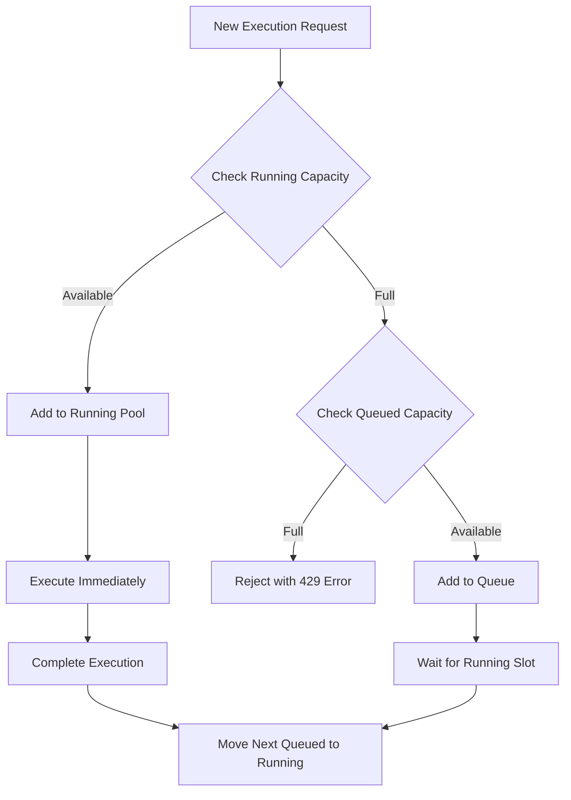

# Parallel Execution and Capacity Management

This document outlines the sophisticated parallel execution system that provides real-time visibility into test and job execution while enforcing configurable capacity limits.

## Overview

The application implements a multi-level capacity management system that controls how many tests and jobs can run simultaneously, ensuring system stability while providing optimal resource utilization.

## Core Concepts

### 1. Execution Types

The system distinguishes between different types of executions:

- **Single Test Execution**: Individual test runs from the Playground
- **Job Execution**: Multiple tests run as part of a job
- **Parallel Executions**: Each test or job run counts as a separate "execution"

### 2. Capacity Limits

The system enforces two primary limits:

- **Running Capacity (default: 5)**: Maximum number of concurrent executions that can run simultaneously
- **Queued Capacity (default: 50)**: Maximum number of executions that can be queued when running capacity is full

### 3. Execution Flow



## Implementation Details

### 1. Capacity Configuration

```typescript
// Default capacity limits - enforced at both API and worker level
export const RUNNING_CAPACITY = parseInt(process.env.RUNNING_CAPACITY || '5');

/**
 * Maximum number of jobs that can be queued.
 * This is a hard limit enforced at the API layer - new submissions will be rejected
 * with a 429 (Too Many Requests) status code once this limit is reached.
 */
export const QUEUED_CAPACITY = parseInt(process.env.QUEUED_CAPACITY || '50');
```

### 2. Queue Statistics Service

The system provides real-time queue statistics:

```typescript
export interface QueueStats {
  running: number;
  runningCapacity: number;
  queued: number;
  queuedCapacity: number;
}

/**
 * Fetch real queue statistics from Redis using BullMQ key patterns
 */
export async function fetchQueueStats(): Promise<QueueStats> {
  // Set up Redis connection
  const host = process.env.REDIS_HOST || 'localhost';
  const port = parseInt(process.env.REDIS_PORT || '6379');
  const password = process.env.REDIS_PASSWORD;
  
  const redisClient = new Redis({
    host,
    port,
    password: password || undefined,
    maxRetriesPerRequest: null,
    connectTimeout: 3000,
  });

  try {
    // Initialize counters
    let runningCount = 0;
    let queuedCount = 0;
    
    // Step 1: Count all ACTIVE jobs and tests (currently executing)
    const [activeJobs, activeTests] = await Promise.all([
      redisClient.llen(`bull:${JOB_EXECUTION_QUEUE}:active`),
      redisClient.llen(`bull:${TEST_EXECUTION_QUEUE}:active`)
    ]);
    
    // Active jobs are definitely running
    runningCount = activeJobs + activeTests;
    
    // Step 2: Check specific jobs that are being processed
    const [jobKeys, testKeys] = await Promise.all([
      redisClient.keys(`bull:${JOB_EXECUTION_QUEUE}:*`),
      redisClient.keys(`bull:${TEST_EXECUTION_QUEUE}:*`)
    ]);
    
    // Process job and test keys to find in-progress executions
    const processKeys = async (keys: string[], queueName: string) => {
      const processingIds = new Set<string>();
      
      for (const key of keys) {
        // Get job ID from key
        const match = key.match(new RegExp(`bull:${queueName}:(\\d+)`));
        if (match && match[1]) {
          const jobId = match[1];
          
          try {
            // Check if job is being processed but not yet completed
            const [processedOn, finishedOn] = await Promise.all([
              redisClient.hget(`bull:${queueName}:${jobId}`, 'processedOn'),
              redisClient.hget(`bull:${queueName}:${jobId}`, 'finishedOn')
            ]);
            
            if (processedOn && !finishedOn) {
              processingIds.add(jobId);
            }
          } catch {
            // Ignore errors for individual jobs
          }
        }
      }
      
      return processingIds.size;
    };
    
    // Count in-process jobs and tests
    const [processingJobs, processingTests] = await Promise.all([
      processKeys(jobKeys, JOB_EXECUTION_QUEUE),
      processKeys(testKeys, TEST_EXECUTION_QUEUE)
    ]);
    
    // Add processing jobs/tests to running count
    runningCount = Math.max(runningCount, processingJobs + processingTests);
    
    // Step 3: Count all WAITING jobs that should be executed when capacity allows
    const [waitingJobs, waitingTests] = await Promise.all([
      redisClient.llen(`bull:${JOB_EXECUTION_QUEUE}:wait`),
      redisClient.llen(`bull:${TEST_EXECUTION_QUEUE}:wait`)
    ]);
    
    // Get delayed jobs (scheduled for future)
    const [delayedJobs, delayedTests] = await Promise.all([
      redisClient.zcard(`bull:${JOB_EXECUTION_QUEUE}:delayed`),
      redisClient.zcard(`bull:${TEST_EXECUTION_QUEUE}:delayed`)
    ]);
    
    // Calculate total waiting jobs
    const totalWaiting = waitingJobs + waitingTests + delayedJobs + delayedTests;
    
    // Step 4: Properly handle running and queued counts
    // First determine how many jobs we can still run before hitting capacity
    const availableRunningSlots = Math.max(0, RUNNING_CAPACITY - runningCount);
    
    // Check if we've reached RUNNING_CAPACITY
    if (availableRunningSlots > 0) {
      // Running capacity not reached yet - all jobs count as "running" until we hit capacity
      // Any jobs that fit within running capacity are not counted as queued
      const immediatelyRunnable = Math.min(availableRunningSlots, totalWaiting);
      runningCount += immediatelyRunnable;
      // Only count truly queued jobs (those that exceed running capacity)
      queuedCount = Math.max(0, totalWaiting - immediatelyRunnable);
    } else {
      // Running capacity is full - all waiting jobs count as queued
      queuedCount = totalWaiting;
    }
    
    // Enforce limits - running cannot exceed capacity
    runningCount = Math.min(runningCount, RUNNING_CAPACITY);
    
    return {
      running: runningCount,
      runningCapacity: RUNNING_CAPACITY,
      queued: queuedCount,
      queuedCapacity: QUEUED_CAPACITY,
    };
  } catch (error) {
    console.error('Error fetching queue stats:', 
      error instanceof Error ? error.message : String(error));
    throw error;
  } finally {
    // Always close Redis connection
    await redisClient.quit().catch(() => {
      // Silently ignore Redis quit errors
    });
  }
}
```

### 3. Capacity Enforcement

#### A. API Layer Enforcement

The API layer enforces capacity limits before adding jobs to the queue:

```typescript
/**
 * Verify that we haven't exceeded QUEUED_CAPACITY before adding a new job
 * Throws an error if the queue capacity is exceeded
 */
export async function verifyQueueCapacityOrThrow(): Promise<void> {
  // Import the queue stats
  const { fetchQueueStats } = await import('@/lib/queue-stats');
  
  try {
    // Get real queue stats from Redis
    const stats = await fetchQueueStats();
    
    console.log(`[Queue Client] Checking capacity - running: ${stats.running}/${stats.runningCapacity}, queued: ${stats.queued}/${stats.queuedCapacity}`);
    
    // First check: If running < RUNNING_CAPACITY, we can add more jobs immediately
    if (stats.running < stats.runningCapacity) {
      // There are available running slots, no need to check queue capacity
      return;
    }
    
    // Second check: If running at capacity, verify queued capacity is not exceeded
    if (stats.running >= stats.runningCapacity) {
      // Running is at or over capacity, need to check queue capacity
      if (stats.queued >= stats.queuedCapacity) {
        throw new Error(`Queue capacity limit reached (${stats.queued}/${stats.queuedCapacity} queued jobs). Please try again later when running capacity (${stats.running}/${stats.runningCapacity}) is available.`);
      }
    }
    
    // All good - we haven't hit capacity limits
    return;
  } catch (error) {
    // Rethrow capacity errors
    if (error instanceof Error && error.message.includes('capacity limit')) {
      console.error(`[Queue Client] Capacity limit error: ${error.message}`);
      throw error;
    }
    
    // For connection errors, log but still enforce a basic check
    console.error('Error checking queue capacity:', error instanceof Error ? error.message : String(error));
    
    // Fail closed on errors - be conservative when we can't verify capacity
    throw new Error(`Unable to verify queue capacity due to an error. Please try again later.`);
  }
}
```

#### B. Worker Layer Enforcement

Workers check capacity before processing jobs:

```typescript
/**
 * Check if a job should be processed based on current queue stats
 * This ensures workers only process jobs that are within the running capacity
 * Returns true only if we're below running capacity, false if we're at/above capacity
 */
export async function shouldProcessJob(): Promise<boolean> {
  const stats = await fetchQueueStats();
  return stats.running < stats.runningCapacity;
}
```

### 4. UI Components

#### A. Parallel Threads Display

The UI shows real-time capacity information:

```typescript
// app/src/components/parallel-threads.tsx
export function ParallelThreads() {
  const { data: stats, loading } = useQueueStats();
  
  const runningProgress = Math.min(100, (stats.running / stats.runningCapacity) * 100);
  const queuedProgress = Math.min(100, (stats.queued / stats.queuedCapacity) * 100);

  if (loading) {
    return <LoadingSkeleton />;
  }

  return (
    <div className="flex items-center mr-2">
      <div className="flex items-center text-[11px]">
        <div className="font-medium text-gray-500 mr-2 text-xs">Parallel
          <div className="font-medium text-gray-500 mr-2 text-xs">Executions:</div>
        </div>
        
        <div className="flex flex-col mr-4">
          <div className="flex items-center justify-between mb-0.5">
            <span className={`font-medium ${stats.running > 0 ? 'text-blue-600 dark:text-blue-500' : 'text-gray-500'}`}>RUNNING</span>
            <span className="text-gray-700 dark:text-gray-300">{stats.running}/{stats.runningCapacity}</span>
          </div>
          <div className="w-28 h-1.5 bg-gray-200 dark:bg-gray-700 rounded-full overflow-hidden">
            <div 
              className="h-full bg-blue-500 rounded-full" 
              style={{ width: `${runningProgress}%` }}
            />
          </div>
        </div>
        
        <div className="flex flex-col">
          <div className="flex items-center justify-between mb-0.5">
            <span className={`font-medium ${stats.queued > 0 ? 'text-amber-600 dark:text-amber-500' : 'text-gray-500'}`}>QUEUED</span>
            <span className="text-gray-700 dark:text-gray-300">{stats.queued}/{stats.queuedCapacity}</span>
          </div>
          <div className="w-28 h-1.5 bg-gray-200 dark:bg-gray-700 rounded-full overflow-hidden">
            <div 
              className="h-full bg-amber-600 rounded-full" 
              style={{ width: `${queuedProgress}%` }}
            />
          </div>
        </div>
      </div>
    </div>
  );
}
```

#### B. Queue Stats Hook

A custom hook provides real-time queue statistics:

```typescript
// app/src/hooks/use-queue-stats.ts
export function useQueueStats() {
  const [data, setData] = useState<QueueStats>({
    running: 0,
    runningCapacity: RUNNING_CAPACITY,
    queued: 0,
    queuedCapacity: QUEUED_CAPACITY,
  });
  const [loading, setLoading] = useState(true);
  const [error, setError] = useState<string | null>(null);

  useEffect(() => {
    let mounted = true;
    let eventSource: EventSource | null = null;

    const connectSSE = () => {
      try {
        eventSource = new EventSource('/api/queue-stats/sse');
        
        eventSource.onmessage = (event) => {
          if (!mounted) return;
          
          try {
            const stats = JSON.parse(event.data);
            setData(stats);
            setLoading(false);
            setError(null);
          } catch (err) {
            console.error('Error parsing queue stats:', err);
            setError('Failed to parse queue statistics');
          }
        };

        eventSource.onerror = () => {
          if (!mounted) return;
          console.warn('SSE connection lost, attempting to reconnect...');
          setError('Connection lost');
          
          // Attempt to reconnect after a delay
          setTimeout(() => {
            if (mounted && eventSource) {
              eventSource.close();
              connectSSE();
            }
          }, 5000);
        };
      } catch (err) {
        console.error('Failed to establish SSE connection:', err);
        setError('Failed to connect to queue statistics');
      }
    };

    connectSSE();

    return () => {
      mounted = false;
      if (eventSource) {
        eventSource.close();
      }
    };
  }, []);

  return { data, loading, error };
}
```

### 5. Error Handling

#### A. Capacity Limit Errors

When capacity limits are exceeded, the API returns appropriate error responses:

```typescript
// app/src/app/api/jobs/run/route.ts
try {
  await addJobToQueue(task);
} catch (error) {
  // Check if this is a queue capacity error
  const errorMessage = error instanceof Error ? error.message : String(error);
  
  if (errorMessage.includes('capacity limit') || errorMessage.includes('Unable to verify queue capacity')) {
    console.log(`[Job API] Capacity limit reached: ${errorMessage}`);
    
    // Update the run status to failed with capacity limit error
    await db.update(runs)
      .set({
        status: "failed",
        completedAt: new Date(),
        errorDetails: errorMessage
      })
      .where(eq(runs.id, runId));
      
    // Return a 429 status code (Too Many Requests) with the error message
    return NextResponse.json(
      { error: "Queue capacity limit reached", message: errorMessage },
      { status: 429 }
    );
  }
  
  // For other errors, log and return a 500 status code
  console.error(`[${jobId}/${runId}] Error processing job:`, error);
  throw error;
}
```

#### B. Graceful Degradation

The system provides fallback mechanisms when capacity checking fails:

```typescript
// For connection errors, log but still enforce a basic check
console.error('Error checking queue capacity:', error instanceof Error ? error.message : String(error));

// Fail closed on errors - be conservative when we can't verify capacity
throw new Error(`Unable to verify queue capacity due to an error. Please try again later.`);
```

## Configuration

### 1. Environment Variables

```bash
# Capacity Configuration
RUNNING_CAPACITY=5                 # Maximum concurrent executions allowed to run
QUEUED_CAPACITY=50                 # Maximum executions allowed in queued state
MAX_CONCURRENT_TESTS=2             # Maximum number of BullMQ worker processes
TEST_EXECUTION_TIMEOUT_MS=900000   # 15 minutes default timeout
```

### 2. Docker Configuration

```yaml
# Worker (NestJS Runner) - 2 replicas
worker:
  image: ghcr.io/krish-kant/supercheck/worker:latest
  environment:
    # App Configuration
    - RUNNING_CAPACITY=5
    - QUEUED_CAPACITY=50
    - TEST_EXECUTION_TIMEOUT_MS=900000
  deploy:
    replicas: 2
    resources:
      limits:
        cpus: '2.0'
        memory: 4G
      reservations:
        cpus: '1.0'
        memory: 2G
```

## Benefits

### 1. System Stability

- **Predictable Load**: Capacity limits prevent system overload
- **Resource Protection**: Ensures system resources are not exhausted
- **Graceful Degradation**: System degrades gracefully under high load

### 2. User Experience

- **Real-Time Feedback**: Users see current capacity usage
- **Clear Expectations**: Users understand when system is at capacity
- **Appropriate Errors**: Clear error messages when limits are reached

### 3. Scalability

- **Configurable Limits**: Capacity can be adjusted based on system resources
- **Multi-Level Enforcement**: Both API and worker layers enforce limits
- **Horizontal Scaling**: Multiple workers can be deployed

### 4. Monitoring

- **Real-Time Metrics**: Live capacity usage statistics
- **Visual Indicators**: Progress bars show capacity utilization
- **Error Tracking**: Comprehensive error logging and handling

## Best Practices

### 1. Capacity Planning

- **Monitor Usage**: Track capacity usage patterns
- **Adjust Limits**: Modify capacity based on system performance
- **Plan for Growth**: Consider future capacity needs

### 2. Error Handling

- **Graceful Failures**: Provide clear error messages
- **Retry Logic**: Implement appropriate retry mechanisms
- **User Feedback**: Keep users informed of system status

### 3. Performance Optimization

- **Efficient Checking**: Minimize overhead of capacity checks
- **Caching**: Cache capacity statistics when appropriate
- **Batch Operations**: Group operations when possible

### 4. Monitoring and Alerting

- **Capacity Alerts**: Set up alerts for high capacity usage
- **Performance Metrics**: Track system performance under load
- **User Impact**: Monitor user experience during high load

This comprehensive parallel execution and capacity management system ensures the application maintains optimal performance while providing clear feedback to users about system capacity and status. 