# Playwright MCP Test Generation Specification

## Table of Contents

- [Overview](#overview)
- [Architecture Integration](#architecture-integration)
- [MCP Server Configuration](#mcp-server-configuration)
- [Test Generation Workflow](#test-generation-workflow)
- [Enterprise-Grade Best Practices](#enterprise-grade-best-practices)
- [Security Considerations](#security-considerations)
- [Implementation Guidelines](#implementation-guidelines)
- [Integration with Supercheck](#integration-with-supercheck)
- [Maintenance and Scalability](#maintenance-and-scalability)
- [Examples and Templates](#examples-and-templates)

## Overview

This specification defines how to integrate Playwright Model Context Protocol (MCP) for automated test generation within the Supercheck platform. The solution enables AI-driven test creation while maintaining enterprise-grade security, reliability, and scalability.

### Objectives

1. **Automated Test Generation**: Leverage AI to generate Playwright tests from natural language descriptions
2. **Enterprise Security**: Ensure generated tests meet security standards and don't expose vulnerabilities
3. **Seamless Integration**: Integrate with existing Supercheck architecture and execution pipeline
4. **Quality Assurance**: Maintain high quality and reliability of generated tests
5. **Scalability**: Support enterprise-scale test generation and management

### Key Components

- **Playwright MCP Server**: Browser automation and test recording capabilities
- **Test Generation Service**: AI-powered test creation and enhancement
- **Validation Pipeline**: Security and quality checks for generated tests
- **Integration Layer**: Seamless connection with Supercheck's test execution system

## Architecture Integration

### System Context

```mermaid
graph TB
    subgraph "MCP Test Generation Layer"
        MCP1[Playwright MCP Server<br/>• Browser Automation<br/>• Test Recording<br/>• Code Generation]
        MCP2[Test Generation Service<br/>• AI Enhancement<br/>• Template Processing<br/>• Quality Validation]
    end

    subgraph "Supercheck Platform"
        APP[Next.js App<br/>• Test Management UI<br/>• API Routes<br/>• Validation]
        WORKER[NestJS Worker<br/>• Test Execution<br/>• Report Generation<br/>• Artifact Storage]
        QUEUE[Redis Queue<br/>• Job Management<br/>• Priority Handling<br/>• Capacity Control]
    end

    subgraph "Storage & Infrastructure"
        DB[(PostgreSQL<br/>• Test Metadata<br/>• Generation History<br/>• Audit Logs)]
        S3[MinIO/S3<br/>• Test Artifacts<br/>• Generated Scripts<br/>• Reports]
        REDIS[(Redis<br/>• Session Storage<br/>• Cache Layer<br/>• Status Updates)]
    end

    %% Flow Connections
    MCP1 --> MCP2
    MCP2 --> APP
    APP --> QUEUE
    QUEUE --> WORKER
    WORKER --> DB
    WORKER --> S3
    APP --> REDIS
    WORKER --> REDIS

    %% Styling
    classDef mcp fill:#e3f2fd,stroke:#1976d2,stroke-width:2px
    classDef supercheck fill:#f3e5f5,stroke:#7b1fa2,stroke-width:2px
    classDef storage fill:#e8f5e8,stroke:#388e3c,stroke-width:2px

    class MCP1,MCP2 mcp
    class APP,WORKER,QUEUE supercheck
    class DB,S3,REDIS storage
```



### Data Flow

1. **Test Request**: User provides natural language description or URL
2. **MCP Processing**: Playwright MCP records interactions and generates base test
3. **AI Enhancement**: Test generation service enhances and optimizes the test
4. **Validation**: Security and quality validation pipeline
5. **Integration**: Test is stored in Supercheck and becomes executable
6. **Execution**: Test runs through standard Supercheck execution pipeline

## MCP Server Configuration

### Server Setup

#### Option 1: Standalone MCP Server

```json
{
  "mcpServers": {
    "playwright-testgen": {
      "command": "npx",
      "args": [
        "@playwright/mcp@latest",
        "--headless",
        "--browser=chromium",
        "--isolated",
        "--output-dir=/tmp/playwright-testgen",
        "--save-trace"
      ],
      "env": {
        "PLAYWRIGHT_HEADLESS": "true",
        "PLAYWRIGHT_BROWSER": "chromium",
        "NODE_ENV": "production"
      }
    }
  }
}
```

#### Option 2: Docker-based MCP Server

```json
{
  "mcpServers": {
    "playwright-testgen": {
      "command": "docker",
      "args": [
        "run",
        "-i",
        "--rm",
        "--init",
        "-v",
        "/tmp/playwright-testgen:/tmp/playwright-testgen",
        "mcr.microsoft.com/playwright/mcp:latest",
        "--headless",
        "--browser=chromium"
      ]
    }
  }
}
```

### Advanced Configuration

```typescript
// playwright-mcp-config.ts
export const PlaywrightMCPConfig = {
  // Browser configuration
  browser: {
    browserName: "chromium",
    headless: true,
    launchOptions: {
      args: [
        "--disable-dev-shm-usage",
        "--disable-gpu",
        "--no-sandbox",
        "--disable-web-security",
        "--disable-features=VizDisplayCompositor",
      ],
    },
    contextOptions: {
      viewport: { width: 1280, height: 720 },
      ignoreHTTPSErrors: true,
      userAgent: "Supercheck-TestGen/1.0",
    },
  },

  // Server configuration
  server: {
    port: 8931,
    host: "localhost",
  },

  // Capabilities
  capabilities: ["tabs", "pdf"],

  // Output configuration
  outputDir: "/tmp/playwright-testgen",

  // Network security
  network: {
    allowedOrigins: [
      "http://localhost:*",
      "https://*.example.com",
      "https://*.staging.example.com",
    ],
    blockedOrigins: ["https://*.malicious-site.com"],
  },

  // Content filtering
  imageResponses: "allow",
};
```

## Test Generation Workflow

### Phase 1: Test Recording and Capture

```mermaid
sequenceDiagram
    participant User as 👤 User
    participant UI as 🖥️ Supercheck UI
    participant MCP as 🤖 Playwright MCP
    participant AI as 🧠 AI Enhancement
    participant DB as 💾 Database

    User->>UI: Request test generation
    UI->>MCP: Start recording session
    MCP->>MCP: Initialize browser context
    MCP-->>UI: Session ready

    User->>MCP: Perform test actions
    MCP->>MCP: Record interactions
    MCP->>MCP: Generate base test code

    MCP->>AI: Send base test for enhancement
    AI->>AI: Analyze and optimize
    AI-->>MCP: Enhanced test code

    MCP->>DB: Store generated test
    MCP-->>UI: Test generation complete
    UI-->>User: Test ready for review
```



### Phase 2: AI Enhancement Pipeline

```typescript
// test-generation.service.ts
export class TestGenerationService {
  async generateTest(request: TestGenerationRequest): Promise<GeneratedTest> {
    // 1. Initialize MCP session
    const session = await this.initializeMCPSession(request);

    try {
      // 2. Record user interactions or process natural language
      const baseTest = await this.recordOrGenerateTest(session, request);

      // 3. Apply AI enhancements
      const enhancedTest = await this.enhanceWithAI(baseTest, {
        addAssertions: true,
        optimizeSelectors: true,
        addErrorHandling: true,
        includeWaitStrategies: true,
      });

      // 4. Security validation
      const validatedTest = await this.validateTestSecurity(enhancedTest);

      // 5. Quality assessment
      const qualityScore = await this.assessTestQuality(validatedTest);

      // 6. Store in Supercheck
      return await this.storeGeneratedTest(validatedTest, {
        qualityScore,
        metadata: request.metadata,
      });
    } finally {
      // 7. Cleanup MCP session
      await this.cleanupMCPSession(session);
    }
  }

  private async enhanceWithAI(
    test: BaseTest,
    options: EnhancementOptions
  ): Promise<EnhancedTest> {
    const prompt = this.buildEnhancementPrompt(test, options);

    const response = await this.aiService.generate({
      model: "gpt-4o-mini",
      prompt,
      temperature: 0.1,
      maxTokens: 4000,
    });

    return this.parseEnhancedTest(response.content);
  }
}
```

### Phase 3: Validation and Quality Assurance

```typescript
// test-validation.service.ts
export class TestValidationService {
  async validateTest(testCode: string): Promise<ValidationResult> {
    const validations = await Promise.all([
      this.validateSecurity(testCode),
      this.validateSyntax(testCode),
      this.validateBestPractices(testCode),
      this.validatePerformance(testCode),
    ]);

    return {
      isValid: validations.every((v) => v.isValid),
      errors: validations.flatMap((v) => v.errors),
      warnings: validations.flatMap((v) => v.warnings),
      score: this.calculateQualityScore(validations),
    };
  }

  private async validateSecurity(
    testCode: string
  ): Promise<SecurityValidation> {
    const securityChecks = [
      this.checkForDangerousImports(testCode),
      this.checkForSSRFVulnerabilities(testCode),
      this.checkForXSSVulnerabilities(testCode),
      this.checkForCredentialExposure(testCode),
      this.checkForInsecureSelectors(testCode),
    ];

    const results = await Promise.all(securityChecks);

    return {
      isValid: results.every((r) => r.passed),
      errors: results.filter((r) => !r.passed).map((r) => r.error),
      warnings: results.filter((r) => r.warning).map((r) => r.warning),
    };
  }
}
```

## Enterprise-Grade Best Practices

### 1. Test Organization and Structure

```typescript
// Generated test template
export const TestTemplate = `
import { test, expect } from '@playwright/test';

test.describe('${testSuiteName}', () => {
  test.beforeEach(async ({ page }) => {
    // Setup code
    await page.goto('${baseUrl}');
    // Authentication if needed
  });

  test('${testName}', async ({ page }) => {
    // Test implementation
    ${generatedTestCode}
    
    // Assertions
    ${generatedAssertions}
  });

  test.afterEach(async ({ page }) => {
    // Cleanup code
    await page.context().clearCookies();
  });
});
`;
```

### 2. Selector Strategy

```typescript
// Selector optimization service
export class SelectorOptimizer {
  optimizeSelector(selector: string, page: Page): string {
    // Priority order: test-id > data-testid > role > text > css
    if (selector.startsWith("[data-testid=")) {
      return selector; // Already optimal
    }

    // Try to find test-id
    const testId = this.findTestId(selector, page);
    if (testId) {
      return `[data-testid="${testId}"]`;
    }

    // Try role-based selector
    const roleSelector = this.generateRoleSelector(selector, page);
    if (roleSelector) {
      return roleSelector;
    }

    // Fallback to optimized CSS selector
    return this.optimizeCSSSelector(selector);
  }

  private findTestId(selector: string, page: Page): string | null {
    // Implementation to find test-id from element
  }

  private generateRoleSelector(selector: string, page: Page): string | null {
    // Implementation to generate role-based selector
  }
}
```

### 3. Error Handling and Resilience

```typescript
// Resilient test template
export const ResilientTestTemplate = `
import { test, expect } from '@playwright/test';

test('${testName}', async ({ page }) => {
  try {
    // Wait for network idle before starting
    await page.waitForLoadState('networkidle');
    
    // Implement retry logic for flaky operations
    await this.retryOperation(async () => {
      await page.click('${selector}');
      await page.waitForSelector('${expectedSelector}', { timeout: 5000 });
    }, 3);
    
    // Add explicit waits for dynamic content
    await page.waitForFunction(() => {
      return document.querySelector('${dynamicElement}') !== null;
    });
    
    // Perform assertions with custom timeout
    await expect(page.locator('${assertionSelector}'))
      .toBeVisible({ timeout: 10000 });
      
  } catch (error) {
    // Capture screenshot on failure
    await page.screenshot({ 
      path: 'failure-${Date.now()}.png',
      fullPage: true 
    });
    
    // Log detailed error information
    console.error('Test failed:', {
      error: error.message,
      url: page.url(),
      timestamp: new Date().toISOString()
    });
    
    throw error;
  }
});

async function retryOperation(operation: () => Promise<void>, maxRetries: number) {
  for (let i = 0; i < maxRetries; i++) {
    try {
      await operation();
      return;
    } catch (error) {
      if (i === maxRetries - 1) throw error;
      await new Promise(resolve => setTimeout(resolve, 1000 * (i + 1)));
    }
  }
}
`;
```

### 4. Performance Optimization

```typescript
// Performance optimization guidelines
export const PerformanceOptimizations = {
  // Reduce unnecessary waits
  waitForElements: "Use waitForSelector instead of fixed timeouts",

  // Optimize browser launch
  browserArgs: [
    "--disable-dev-shm-usage",
    "--disable-gpu",
    "--no-sandbox",
    "--disable-background-timer-throttling",
    "--disable-backgrounding-occluded-windows",
    "--disable-renderer-backgrounding",
  ],

  // Resource management
  cleanupStrategies: [
    "Clear cookies after each test",
    "Close unused pages",
    "Dispose browser context properly",
  ],

  // Parallel execution
  parallelConfig: {
    workers: 1, // Align with Supercheck capacity
    fullyParallel: false,
    maxFailures: 1,
  },
};
```

## Security Considerations

### 1. Input Validation and Sanitization

```typescript
// Security validation service
export class SecurityValidationService {
  private readonly BLOCKED_PATTERNS = [
    /eval\s*\(/gi,
    /Function\s*\(/gi,
    /document\.write/gi,
    /innerHTML\s*=/gi,
    /outerHTML\s*=/gi,
    /localStorage/gi,
    /sessionStorage/gi,
    /document\.cookie/gi,
  ];

  private readonly ALLOWED_SELECTORS = [
    /^[a-zA-Z][\w-]*$/, // Simple IDs
    /^\[data-testid=[\w-]+\]$/, // Test IDs
    /^(button|input|select|textarea)\[[\w-]+=['"][\w-]+['"]\]$/, // Form elements
    /^\[role=\w+\]$/, // Role-based selectors
  ];

  async validateTestSecurity(testCode: string): Promise<SecurityResult> {
    const violations: SecurityViolation[] = [];

    // Check for dangerous patterns
    for (const pattern of this.BLOCKED_PATTERNS) {
      if (pattern.test(testCode)) {
        violations.push({
          type: "dangerous_pattern",
          pattern: pattern.source,
          severity: "high",
        });
      }
    }

    // Check selectors
    const selectors = this.extractSelectors(testCode);
    for (const selector of selectors) {
      if (!this.isSelectorAllowed(selector)) {
        violations.push({
          type: "unsafe_selector",
          selector,
          severity: "medium",
        });
      }
    }

    // Check for URL patterns
    const urls = this.extractUrls(testCode);
    for (const url of urls) {
      if (!this.isUrlAllowed(url)) {
        violations.push({
          type: "unsafe_url",
          url,
          severity: "high",
        });
      }
    }

    return {
      isSecure: violations.length === 0,
      violations,
      recommendations: this.generateRecommendations(violations),
    };
  }

  private isUrlAllowed(url: string): boolean {
    const allowedDomains = [
      "localhost",
      "127.0.0.1",
      /\.example\.com$/,
      /\.staging\.example\.com$/,
      /\.test\.example\.com$/,
    ];

    try {
      const urlObj = new URL(url);
      return allowedDomains.some((domain) =>
        domain instanceof RegExp
          ? domain.test(urlObj.hostname)
          : urlObj.hostname === domain
      );
    } catch {
      return false;
    }
  }
}
```

### 2. Sandboxing and Isolation

```typescript
// Test execution sandbox
export class TestSandbox {
  async createSandboxContext(options: SandboxOptions): Promise<BrowserContext> {
    const context = await this.browser.newContext({
      ...options,
      // Security restrictions
      ignoreHTTPSErrors: false,
      javaScriptEnabled: true,
      httpCredentials: undefined, // No automatic credentials

      // Network restrictions
      serviceWorkers: "block",
      offline: false,

      // Storage restrictions
      storageState: undefined, // No persistent storage

      // Permission restrictions
      permissions: [], // No additional permissions

      // Browser restrictions
      bypassCSP: false,
      extraHTTPHeaders: {
        "X-Test-Environment": "sandbox",
      },
    });

    // Add security monitoring
    await this.setupSecurityMonitoring(context);

    return context;
  }

  private async setupSecurityMonitoring(
    context: BrowserContext
  ): Promise<void> {
    // Monitor console for security warnings
    context.on("console", (msg) => {
      if (msg.type() === "warning" && msg.text().includes("security")) {
        this.securityLogger.warn("Security warning in test", {
          message: msg.text(),
          location: msg.location(),
        });
      }
    });

    // Monitor network requests
    context.on("request", (request) => {
      const url = request.url();
      if (!this.isUrlWhitelisted(url)) {
        request.abort("blockedbyclient");
        this.securityLogger.warn("Blocked request", { url });
      }
    });
  }
}
```

### 3. Credential Management

```typescript
// Secure credential handling
export class CredentialManager {
  async injectCredentials(
    context: BrowserContext,
    testId: string
  ): Promise<void> {
    // Get credentials from secure storage
    const credentials = await this.getSecureCredentials(testId);

    if (!credentials) {
      return;
    }

    // Inject credentials securely
    await context.addInitScript(() => {
      // Create secure credential storage
      window.testCredentials = {
        // Only expose necessary credentials
        username: credentials.username,
        // Use token-based auth instead of passwords
        authToken: credentials.authToken,
      };
    });

    // Set authentication headers
    await context.setExtraHTTPHeaders({
      Authorization: `Bearer ${credentials.authToken}`,
    });
  }

  private async getSecureCredentials(
    testId: string
  ): Promise<Credentials | null> {
    // Retrieve from encrypted storage
    const encrypted = await this.vault.get(`test:${testId}:credentials`);
    return encrypted ? this.decrypt(encrypted) : null;
  }
}
```

## Implementation Guidelines

### 1. MCP Service Integration

```typescript
// mcp-integration.service.ts
@Injectable()
export class MCPIntegrationService {
  private mcpConnection: MCPConnection | null = null;

  async initializeMCP(): Promise<void> {
    try {
      this.mcpConnection = await createConnection({
        browser: {
          launchOptions: {
            headless: true,
            args:
              process.env.NODE_ENV === "production"
                ? this.getProductionArgs()
                : this.getDevelopmentArgs(),
          },
        },
      });

      await this.mcpConnection.connect(
        new SSEServerTransport("/mcp-messages", this.responseStream)
      );

      this.logger.log("MCP connection established");
    } catch (error) {
      this.logger.error("Failed to initialize MCP", error);
      throw error;
    }
  }

  async startTestGeneration(request: TestGenerationRequest): Promise<string> {
    if (!this.mcpConnection) {
      throw new Error("MCP connection not initialized");
    }

    // Create generation session
    const sessionId = randomUUID();

    try {
      // Initialize browser context
      await this.mcpConnection.request("browser_navigate", {
        url: request.targetUrl,
      });

      // Start recording if interactive mode
      if (request.mode === "interactive") {
        await this.mcpConnection.request("start_recording", {
          sessionId,
          options: {
            includeComments: true,
            optimizeSelectors: true,
            addAssertions: true,
          },
        });
      }

      return sessionId;
    } catch (error) {
      this.logger.error("Failed to start test generation", error);
      throw error;
    }
  }

  async generateFromDescription(
    description: string,
    url: string
  ): Promise<GeneratedTest> {
    // Navigate to target URL
    await this.mcpConnection.request("browser_navigate", { url });

    // Analyze page structure
    const pageAnalysis = await this.mcpConnection.request("page_analyze", {
      includeAccessibility: true,
      includeInteractiveElements: true,
    });

    // Generate test using AI
    const aiPrompt = this.buildTestGenerationPrompt(description, pageAnalysis);
    const testCode = await this.aiService.generateTest(aiPrompt);

    // Validate and optimize
    const optimizedTest = await this.optimizeGeneratedTest(testCode);

    return {
      code: optimizedTest,
      metadata: {
        generatedAt: new Date(),
        source: "ai-description",
        url,
        description,
      },
    };
  }
}
```

### 2. API Endpoints

```typescript
// test-generation.controller.ts
@Controller("api/test-generation")
export class TestGenerationController {
  @Post("start")
  async startGeneration(
    @Body() request: StartGenerationRequest
  ): Promise<GenerationSession> {
    const session = await this.mcpService.startTestGeneration(request);

    return {
      sessionId: session.id,
      status: "started",
      expiresAt: new Date(Date.now() + 30 * 60 * 1000), // 30 minutes
      websocketUrl: `/ws/test-generation/${session.id}`,
    };
  }

  @Post("generate-from-description")
  async generateFromDescription(
    @Body() request: GenerateFromDescriptionRequest
  ): Promise<GeneratedTestResponse> {
    const test = await this.mcpService.generateFromDescription(
      request.description,
      request.url
    );

    // Validate security
    const securityCheck = await this.securityService.validateTest(test.code);
    if (!securityCheck.isSecure) {
      throw new BadRequestException(
        "Generated test failed security validation"
      );
    }

    // Store in Supercheck
    const savedTest = await this.testService.createTest({
      title: request.title || `Generated: ${request.description}`,
      description: `AI-generated test from: ${request.description}`,
      script: test.code,
      type: "browser",
      projectId: request.projectId,
      organizationId: request.organizationId,
      metadata: test.metadata,
    });

    return {
      test: savedTest,
      securityWarnings: securityCheck.violations,
      qualityScore: securityCheck.score,
    };
  }

  @Get("session/:sessionId/status")
  async getSessionStatus(
    @Param("sessionId") sessionId: string
  ): Promise<SessionStatus> {
    return this.mcpService.getSessionStatus(sessionId);
  }

  @Post("session/:sessionId/stop")
  async stopSession(@Param("sessionId") sessionId: string): Promise<void> {
    await this.mcpService.stopSession(sessionId);
  }
}
```

### 3. WebSocket Integration for Real-time Updates

```typescript
// test-generation.gateway.ts
@WebSocketGateway({
  namespace: "/test-generation",
  cors: true,
})
export class TestGenerationGateway {
  @WebSocketServer()
  server: Server;

  private sessions = new Map<string, GenerationSession>();

  @SubscribeMessage("join-session")
  async handleJoinSession(
    @ConnectedSocket() client: Socket,
    @MessageBody() data: { sessionId: string }
  ): Promise<void> {
    const session = this.sessions.get(data.sessionId);
    if (!session) {
      client.emit("error", { message: "Session not found" });
      return;
    }

    client.join(data.sessionId);
    client.emit("session-joined", { status: session.status });
  }

  @SubscribeMessage("browser-action")
  async handleBrowserAction(
    @ConnectedSocket() client: Socket,
    @MessageBody() data: BrowserAction
  ): Promise<void> {
    const sessionId = Array.from(client.rooms)[1]; // Get session room
    const session = this.sessions.get(sessionId);

    if (!session) {
      client.emit("error", { message: "Session not found" });
      return;
    }

    try {
      // Execute browser action via MCP
      const result = await this.mcpService.executeBrowserAction(
        sessionId,
        data.action,
        data.params
      );

      // Broadcast to all clients in session
      this.server.to(sessionId).emit("action-result", {
        action: data.action,
        result,
        timestamp: new Date(),
      });
    } catch (error) {
      client.emit("error", { message: error.message });
    }
  }

  async broadcastTestUpdate(
    sessionId: string,
    testCode: string
  ): Promise<void> {
    this.server.to(sessionId).emit("test-updated", {
      code: testCode,
      timestamp: new Date(),
    });
  }
}
```

## Integration with Supercheck

### 1. Database Schema Extensions

```sql
-- Test generation history table
CREATE TABLE test_generation_history (
  id UUID PRIMARY KEY DEFAULT uuidv7(),
  test_id UUID REFERENCES tests(id) ON DELETE CASCADE,
  generated_by_user_id UUID REFERENCES user(id),
  generation_method VARCHAR(50) NOT NULL, -- 'mcp', 'ai', 'manual'
  generation_metadata JSONB,
  mcp_session_id VARCHAR(255),
  quality_score INTEGER CHECK (quality_score >= 0 AND quality_score <= 100),
  security_validation JSONB,
  created_at TIMESTAMP DEFAULT NOW()
);

-- MCP session tracking
CREATE TABLE mcp_sessions (
  id UUID PRIMARY KEY DEFAULT uuidv7(),
  session_id VARCHAR(255) UNIQUE NOT NULL,
  user_id UUID REFERENCES user(id),
  project_id UUID REFERENCES projects(id),
  status VARCHAR(50) DEFAULT 'active',
  browser_state JSONB,
  recorded_actions JSONB,
  started_at TIMESTAMP DEFAULT NOW(),
  expires_at TIMESTAMP,
  completed_at TIMESTAMP
);

-- Test templates
CREATE TABLE test_templates (
  id UUID PRIMARY KEY DEFAULT uuidv7(),
  organization_id UUID REFERENCES organization(id),
  name VARCHAR(255) NOT NULL,
  description TEXT,
  template_code TEXT NOT NULL,
  category VARCHAR(100),
  tags TEXT[],
  is_public BOOLEAN DEFAULT false,
  usage_count INTEGER DEFAULT 0,
  created_by_user_id UUID REFERENCES user(id),
  created_at TIMESTAMP DEFAULT NOW()
);
```

### 2. Service Integration

```typescript
// test-generation.integration.service.ts
@Injectable()
export class TestGenerationIntegrationService {
  async createTestFromGeneration(
    generationData: GeneratedTest,
    context: TestContext
  ): Promise<Test> {
    // Create test record
    const test = await this.testService.create({
      title: generationData.title,
      description: generationData.description,
      script: generationData.code,
      type: "browser",
      projectId: context.projectId,
      organizationId: context.organizationId,
      createdByUserId: context.userId,
      metadata: {
        generated: true,
        generationMethod: generationData.method,
        generationMetadata: generationData.metadata,
      },
    });

    // Track generation history
    await this.testGenerationHistoryService.create({
      testId: test.id,
      generatedByUserId: context.userId,
      generationMethod: generationData.method,
      generationMetadata: generationData.metadata,
      mcpSessionId: generationData.sessionId,
      qualityScore: generationData.qualityScore,
      securityValidation: generationData.securityValidation,
    });

    // Apply tags if provided
    if (generationData.tags?.length > 0) {
      await this.tagService.applyTagsToTest(test.id, generationData.tags);
    }

    return test;
  }

  async enhanceExistingTest(
    testId: string,
    enhancementRequest: EnhancementRequest
  ): Promise<Test> {
    const test = await this.testService.findById(testId);
    if (!test) {
      throw new NotFoundException("Test not found");
    }

    // Use MCP to analyze current test
    const analysis = await this.mcpService.analyzeTest(test.script);

    // Generate enhancements
    const enhancedCode = await this.mcpService.enhanceTest(
      test.script,
      enhancementRequest,
      analysis
    );

    // Validate enhanced test
    const validation = await this.securityService.validateTest(enhancedCode);
    if (!validation.isSecure) {
      throw new BadRequestException("Enhanced test failed security validation");
    }

    // Update test with enhanced version
    const updatedTest = await this.testService.update(testId, {
      script: enhancedCode,
      updatedAt: new Date(),
      metadata: {
        ...test.metadata,
        enhanced: true,
        enhancedAt: new Date(),
        enhancementRequest,
      },
    });

    return updatedTest;
  }
}
```

### 3. Queue Integration

```typescript
// test-generation-queue.processor.ts
@Processor("test-generation")
export class TestGenerationProcessor {
  @Process("generate-test")
  async handleTestGeneration(job: Job<GenerationJob>): Promise<void> {
    const { testId, generationRequest, context } = job.data;

    try {
      // Update job status
      await this.updateJobStatus(job.id, "processing");

      // Initialize MCP session
      const session = await this.mcpService.createSession({
        jobId: job.id,
        context,
      });

      // Generate test based on request type
      let generatedTest: GeneratedTest;

      switch (generationRequest.type) {
        case "description":
          generatedTest = await this.mcpService.generateFromDescription(
            generationRequest.description,
            generationRequest.url
          );
          break;

        case "recording":
          generatedTest = await this.mcpService.processRecording(
            generationRequest.recordingData
          );
          break;

        case "template":
          generatedTest = await this.mcpService.applyTemplate(
            generationRequest.templateId,
            generationRequest.parameters
          );
          break;

        default:
          throw new Error(`Unknown generation type: ${generationRequest.type}`);
      }

      // Validate and store test
      const validatedTest = await this.validateAndStoreTest(
        generatedTest,
        testId,
        context
      );

      // Update job status
      await this.updateJobStatus(job.id, "completed", {
        testId: validatedTest.id,
      });
    } catch (error) {
      this.logger.error(`Test generation failed for job ${job.id}`, error);
      await this.updateJobStatus(job.id, "failed", {
        error: error.message,
      });
      throw error;
    }
  }
}
```

## Maintenance and Scalability

### 1. Monitoring and Observability

```typescript
// test-generation-monitoring.service.ts
@Injectable()
export class TestGenerationMonitoringService {
  private metrics = {
    generationRequests: new Counter({
      name: "test_generation_requests_total",
      help: "Total number of test generation requests",
      labelNames: ["method", "status"],
    }),

    generationDuration: new Histogram({
      name: "test_generation_duration_seconds",
      help: "Time taken to generate tests",
      labelNames: ["method"],
      buckets: [1, 5, 10, 30, 60, 120, 300],
    }),

    qualityScores: new Histogram({
      name: "test_generation_quality_score",
      help: "Quality scores of generated tests",
      buckets: [20, 40, 60, 80, 100],
    }),

    mcpSessions: new Gauge({
      name: "mcp_sessions_active",
      help: "Number of active MCP sessions",
    }),
  };

  async recordGenerationAttempt(
    method: string,
    duration: number,
    status: "success" | "error",
    qualityScore?: number
  ): Promise<void> {
    this.metrics.generationRequests.labels(method, status).inc();

    this.metrics.generationDuration.labels(method).observe(duration);

    if (qualityScore !== undefined) {
      this.metrics.qualityScores.observe(qualityScore);
    }
  }

  async trackMCPSession(
    sessionId: string,
    action: "create" | "destroy"
  ): Promise<void> {
    if (action === "create") {
      this.metrics.mcpSessions.inc();
    } else {
      this.metrics.mcpSessions.dec();
    }
  }
}
```

### 2. Scaling Strategies

```typescript
// scalable-mcp-service.ts
@Injectable()
export class ScalableMCPService {
  private sessionPool: Map<string, MCPSession> = new Map();
  private maxSessions = parseInt(process.env.MCP_MAX_SESSIONS || "10");

  async getSession(request: SessionRequest): Promise<MCPSession> {
    // Check if existing session can be reused
    const existingSession = this.findReusableSession(request);
    if (existingSession) {
      return existingSession;
    }

    // Check capacity
    if (this.sessionPool.size >= this.maxSessions) {
      await this.cleanupOldSessions();
    }

    // Create new session
    const session = await this.createNewSession(request);
    this.sessionPool.set(session.id, session);

    return session;
  }

  private async cleanupOldSessions(): Promise<void> {
    const sessions = Array.from(this.sessionPool.values());
    const expiredSessions = sessions
      .filter((s) => s.expiresAt < new Date())
      .sort((a, b) => a.expiresAt.getTime() - b.expiresAt.getTime());

    // Remove expired sessions
    for (const session of expiredSessions.slice(
      0,
      Math.ceil(this.maxSessions * 0.2)
    )) {
      await this.destroySession(session.id);
    }
  }

  private findReusableSession(request: SessionRequest): MCPSession | null {
    const sessions = Array.from(this.sessionPool.values());

    return (
      sessions.find(
        (session) =>
          session.status === "idle" &&
          session.projectId === request.projectId &&
          session.expiresAt > new Date()
      ) || null
    );
  }
}
```

### 3. Performance Optimization

```typescript
// performance-optimization.service.ts
@Injectable()
export class PerformanceOptimizationService {
  private cache = new Map<string, CachedResult>();
  private readonly CACHE_TTL = 5 * 60 * 1000; // 5 minutes

  async optimizeTestGeneration(
    request: TestGenerationRequest
  ): Promise<OptimizedResult> {
    const cacheKey = this.generateCacheKey(request);

    // Check cache first
    const cached = this.cache.get(cacheKey);
    if (cached && cached.expiresAt > new Date()) {
      return cached.result;
    }

    // Perform optimization
    const optimized = await this.performOptimization(request);

    // Cache result
    this.cache.set(cacheKey, {
      result: optimized,
      expiresAt: new Date(Date.now() + this.CACHE_TTL),
    });

    return optimized;
  }

  private async performOptimization(
    request: TestGenerationRequest
  ): Promise<OptimizedResult> {
    const optimizations = await Promise.all([
      this.optimizeSelectors(request),
      this.optimizeWaits(request),
      this.optimizeAssertions(request),
      this.optimizeErrorHandling(request),
    ]);

    return {
      optimizedCode: this.applyOptimizations(request.code, optimizations),
      optimizations: optimizations,
      performanceGain: this.calculatePerformanceGain(optimizations),
    };
  }

  async preloadCommonResources(): Promise<void> {
    // Preload common page templates
    const commonTemplates = [
      "login-form",
      "dashboard",
      "product-list",
      "checkout-flow",
    ];

    for (const template of commonTemplates) {
      await this.templateService.preloadTemplate(template);
    }
  }
}
```

## Examples and Templates

### 1. Common Test Templates

```typescript
// Login Test Template
export const LoginTestTemplate = `
import { test, expect } from '@playwright/test';

test.describe('Authentication', () => {
  test('successful login', async ({ page }) => {
    await page.goto('/login');
    
    // Fill login form
    await page.fill('[data-testid=username-input]', '${process.env.TEST_USERNAME}');
    await page.fill('[data-testid=password-input]', '${process.env.TEST_PASSWORD}');
    await page.click('[data-testid=login-button]');
    
    // Wait for navigation
    await page.waitForURL('/dashboard');
    
    // Verify successful login
    await expect(page.locator('[data-testid=user-menu]')).toBeVisible();
    await expect(page.locator('[data-testid=welcome-message]')).toContainText('Welcome');
  });
  
  test('failed login with invalid credentials', async ({ page }) => {
    await page.goto('/login');
    
    // Fill with invalid credentials
    await page.fill('[data-testid=username-input]', 'invalid@example.com');
    await page.fill('[data-testid=password-input]', 'invalidpassword');
    await page.click('[data-testid=login-button]');
    
    // Verify error message
    await expect(page.locator('[data-testid=error-message]')).toBeVisible();
    await expect(page.locator('[data-testid=error-message]'))
      .toContainText('Invalid credentials');
  });
});
`;

// E-commerce Test Template
export const EcommerceTestTemplate = `
import { test, expect } from '@playwright/test';

test.describe('E-commerce Flow', () => {
  test('complete purchase flow', async ({ page }) => {
    // Navigate to product
    await page.goto('/products/test-product');
    
    // Add to cart
    await page.click('[data-testid=add-to-cart-button]');
    await expect(page.locator('[data-testid=cart-badge]')).toContainText('1');
    
    // View cart
    await page.click('[data-testid=cart-icon]');
    await expect(page.locator('[data-testid=cart-item]')).toHaveCount(1);
    
    // Checkout
    await page.click('[data-testid=checkout-button]');
    
    // Fill shipping information
    await page.fill('[data-testid=shipping-name]', 'Test User');
    await page.fill('[data-testid=shipping-email]', 'test@example.com');
    await page.fill('[data-testid=shipping-address]', '123 Test St');
    await page.fill('[data-testid=shipping-city]', 'Test City');
    
    // Continue to payment
    await page.click('[data-testid=continue-to-payment]');
    
    // Verify order summary
    await expect(page.locator('[data-testid=order-total]')).toBeVisible();
    
    // Place order (using test payment method)
    await page.click('[data-testid=place-order-button]');
    
    // Verify order confirmation
    await expect(page.locator('[data-testid=order-confirmation]')).toBeVisible();
    await expect(page.locator('[data-testid=order-number]')).toBeVisible();
  });
});
`;
```

### 2. AI Enhancement Examples

```typescript
// Example: Before and after AI enhancement

// Before (basic recorded test)
const basicTest = `
await page.goto('https://example.com/login');
await page.fill('#username', 'testuser');
await page.fill('#password', 'testpass');
await page.click('#login-button');
`;

// After (AI-enhanced test)
const enhancedTest = `
import { test, expect } from '@playwright/test';

test.describe('User Authentication', () => {
  test('should login successfully with valid credentials', async ({ page }) => {
    // Navigate to login page
    await page.goto('/login');
    
    // Wait for page to be fully loaded
    await page.waitForLoadState('networkidle');
    
    // Verify login form is present
    await expect(page.locator('[data-testid=login-form]')).toBeVisible();
    
    // Fill credentials with proper waits
    await page.locator('[data-testid=username-input]')
      .fill('testuser', { timeout: 5000 });
    await page.locator('[data-testid=password-input]')
      .fill('testpass', { timeout: 5000 });
    
    // Click login button and wait for response
    await Promise.all([
      page.waitForURL('/dashboard'), // Wait for navigation
      page.locator('[data-testid=login-button]').click()
    ]);
    
    // Verify successful login
    await expect(page.locator('[data-testid=user-profile]')).toBeVisible();
    await expect(page.locator('[data-testid=welcome-message]'))
      .toContainText('Welcome, testuser');
    
    // Verify authentication token is set
    const authToken = await page.evaluate(() => 
      localStorage.getItem('auth_token')
    );
    expect(authToken).toBeTruthy();
  });
});
`;
```

### 3. Integration Examples

```typescript
// Example: Complete test generation flow
export class TestGenerationExample {
  async generateCompleteTest(): Promise<void> {
    // 1. Initialize MCP session
    const session = await this.mcpService.createSession({
      projectId: "project-123",
      userId: "user-456",
    });

    try {
      // 2. Navigate to target application
      await this.mcpService.navigate(session.id, "https://app.example.com");

      // 3. Start recording
      await this.mcpService.startRecording(session.id, {
        includeComments: true,
        optimizeSelectors: true,
        addAssertions: true,
      });

      // 4. Perform test actions (simulated)
      const actions = [
        { type: "click", selector: "[data-testid=login-button]" },
        {
          type: "fill",
          selector: "[data-testid=email]",
          value: "test@example.com",
        },
        {
          type: "fill",
          selector: "[data-testid=password]",
          value: "password123",
        },
        { type: "click", selector: "[data-testid=submit]" },
      ];

      for (const action of actions) {
        await this.mcpService.executeAction(session.id, action);
      }

      // 5. Stop recording and get generated test
      const generatedTest = await this.mcpService.stopRecording(session.id);

      // 6. AI enhancement
      const enhancedTest = await this.aiService.enhanceTest(generatedTest, {
        addErrorHandling: true,
        addWaitStrategies: true,
        improveSelectors: true,
        addDocumentation: true,
      });

      // 7. Security validation
      const securityCheck = await this.securityService.validateTest(
        enhancedTest.code
      );
      if (!securityCheck.isSecure) {
        throw new Error("Generated test failed security validation");
      }

      // 8. Store in Supercheck
      const test = await this.testService.create({
        title: "Login Flow Test",
        description: "AI-generated test for user login flow",
        script: enhancedTest.code,
        type: "browser",
        projectId: "project-123",
        organizationId: "org-789",
        metadata: {
          generated: true,
          generationMethod: "mcp-recording",
          qualityScore: securityCheck.score,
          sessionId: session.id,
        },
      });

      console.log(`Test generated successfully: ${test.id}`);
    } finally {
      // 9. Cleanup session
      await this.mcpService.destroySession(session.id);
    }
  }
}
```

This comprehensive specification provides a robust foundation for implementing Playwright MCP test generation within Supercheck, ensuring enterprise-grade security, scalability, and maintainability while leveraging AI-powered test creation capabilities.
