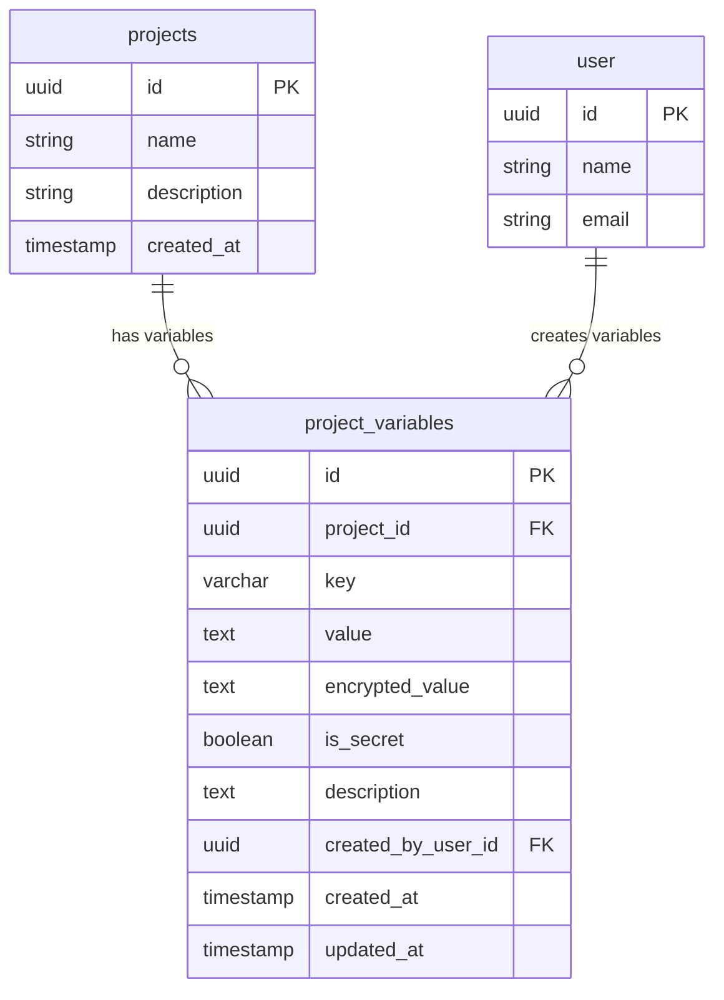
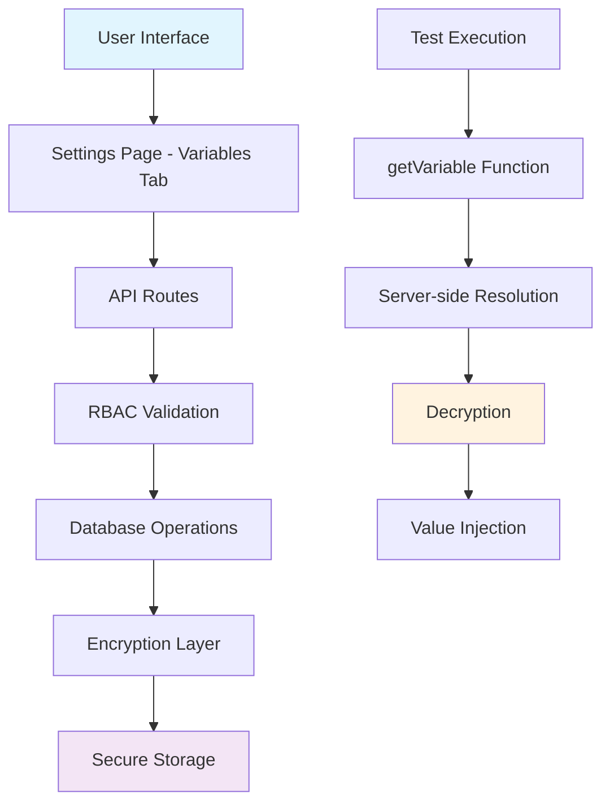
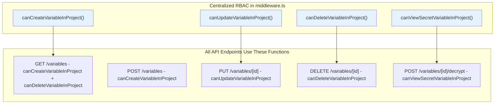

# Variable Management System - Implementation Complete

## Table of Contents

- [Overview](#overview)
- [Variable Management UI Location](#variable-management-ui-location)
- [Database Schema Implementation](#database-schema-implementation)
- [Implementation Architecture](#implementation-architecture)
- [Using Variables in Tests](#using-variables-in-tests)
- [Secret Security Implementation](#secret-security-implementation)
- [User Workflows](#user-workflows)
- [UI Enhancements for Better UX](#ui-enhancements-for-better-ux)
- [Secure Secret Storage Solution](#secure-secret-storage-solution)
- [Implementation Status](#implementation-status)
- [Implementation Benefits](#implementation-benefits)

## Overview

Complete end-to-end implementation of variable/secret management in the Supercheck platform. Variables are managed centrally through the dedicated Variables page and accessed via `getVariable()` and `getSecret()` functions in test scripts with enterprise-grade security.

## Variable Management UI Location

### **Variables Page** (Primary and Only Location)

**Location**: Main navigation → Variables

**Why Dedicated Variables Page**:

- Centralized management of all variables and secrets
- Admin/editor control over sensitive credentials
- Better security control - separate from test writing
- Reduces complexity by having single source of truth
- Prevents accidental exposure of secrets in playground UI
- Dedicated interface for comprehensive variable management

**UI Features**:

- Table view of all project variables
- Add/Edit/Delete variables with role-based access
- Mark variables as "Secret" (encrypted and masked values)
- Variable descriptions for team documentation
- Access control based on user roles

## Database Schema Implementation

### Implemented Tables:

#### Project Variables Table

The `project_variables` table has been implemented with the following structure:

- **Primary Key**: UUID identifier
- **Project Scoping**: Foreign key to projects table with cascade delete
- **Variable Key**: Unique per project with 255 character limit
- **Value Storage**: Dual fields for encrypted and plain text values
- **Security Flag**: Boolean to mark secret variables
- **Metadata**: Description, creator, timestamps
- **Constraints**: Unique constraint on (projectId, key) pair



## Implementation Architecture

### **Complete End-to-End Implementation**

The variable management system has been fully implemented with enterprise-grade security:



### **Implementation Components**

- **Professional UI**: Table-based interface matching org admin patterns
- **Secure API**: Complete CRUD operations with validation
- **Encryption**: AES-256-GCM with project-specific keys
- **RBAC Integration**: Role-based access control
- **Type Safety**: Full TypeScript implementation

## Using Variables in Tests

### **getVariable() for Regular Variables**

```javascript
// Basic usage
const username = getVariable("USERNAME");
const baseUrl = getVariable("BASE_URL", { default: "http://localhost:3000" });

// In tests
await page.goto(getVariable("BASE_URL") + "/login");
```

### **getSecret() for Secret Values**

```javascript
// Secrets are protected from console logging
const apiKey = getSecret("API_KEY", { required: true });

// Safe usage in headers/auth (value auto-converted)
await page.setExtraHTTPHeaders({
  Authorization: `Bearer ${apiKey}`,
});

// Direct usage in Playwright actions
await page.fill('[name="password"]', apiKey);
await page.goto(`https://api.example.com/data?key=${apiKey}`);

// ❌ Protected from logging - shows [SECRET]
console.log(apiKey);
console.log(`Debug: ${apiKey}`);
JSON.stringify({ key: apiKey });
```

### **Function Signatures**

```typescript
// Regular variables
function getVariable(
  key: string,
  options?: {
    required?: boolean;
    default?: any;
    type?: "string" | "number" | "boolean";
  }
): string | number | boolean | undefined;

// Secret values (protected from console logging)
function getSecret(
  key: string,
  options?: {
    required?: boolean;
    default?: any;
    type?: "string" | "number" | "boolean";
  }
): ProtectedSecret | string | number | boolean | undefined;
```

## Secret Security Implementation

### **Enhanced Protection Features**

The `getSecret()` function implements multiple layers of protection:

```javascript
// All these operations show [SECRET] instead of actual value
console.log(getSecret("API_KEY")); // "[SECRET]"
JSON.stringify({ key: getSecret("API_KEY") }); // {"key":"[SECRET]"}
String(getSecret("API_KEY")); // "[SECRET]"
getSecret("API_KEY").toString(); // "[SECRET]"
getSecret("API_KEY").substring(0, 5); // "[SECRET]"
getSecret("API_KEY").slice(0, 5); // "[SECRET]"

// Node.js inspection also protected
util.inspect(getSecret("API_KEY")); // "[SECRET]"
```

### **Where getSecret() Works Seamlessly**

✅ **Playwright Actions & Navigation**

```javascript
await page.fill("#password", getSecret("PASSWORD").toString());
await page.goto(`https://api.com?key=${getSecret("API_KEY")}`);
await page.setExtraHTTPHeaders({
  Authorization: `Bearer ${getSecret("TOKEN")}`,
});
```

✅ **Comparisons & Conditionals**

```javascript
if (getSecret("ENV") === "production") {
  /* works */
}
const isValid = getSecret("FLAG") == "true"; // works
```

✅ **Mathematical Operations**

```javascript
const port = getSecret("PORT", { type: "number" }) + 1000; // works
```

### **Limitations & Workarounds**

❌ **String Manipulation Methods**

```javascript
// These will NOT work as expected
const truncated = getSecret("API_KEY").substring(0, 10); // Returns "[SECRET]"
const parts = getSecret("TOKEN").split("-"); // Returns ["[SECRET]"]
```

**Workaround**: Use `getVariable()` if you need string manipulation for non-sensitive data:

```javascript
const baseUrl = getVariable("BASE_URL");
const apiPath = baseUrl.substring(8); // Works fine
```

❌ **Type Checking**

```javascript
// Type checks may not work as expected
typeof getSecret("API_KEY"); // Returns 'object', not 'string'
```

**Workaround**: Use type conversion option:

```javascript
const apiKey = getSecret("API_KEY", { type: "string" }); // Returns actual string value
// Note: This bypasses logging protections for type compatibility
```

### **Best Practices for Test Scripts**

#### **Database Connections & String Values**

```javascript
// For APIs requiring plain strings (like PostgreSQL)
const config = {
  connectionString: getSecret("DB_STRING", { type: "string" }),
  ssl: false,
};

// Alternative using valueOf()
const config = {
  connectionString: getSecret("DB_STRING").valueOf(),
  ssl: false,
};
```

#### **Separate Regular Variables from Secrets**

```javascript
// ✅ Good practice
const baseUrl = getVariable("BASE_URL"); // Can be logged/debugged
const timeout = getVariable("TIMEOUT"); // Safe to expose
const username = getVariable("TEST_USERNAME"); // Not sensitive

const password = getSecret("TEST_PASSWORD"); // Protected
const apiKey = getSecret("API_KEY"); // Protected
const token = getSecret("ACCESS_TOKEN"); // Protected
```

#### **Safe Debugging Without Exposing Secrets**

```javascript
// ✅ Safe - only logs non-sensitive info
console.log(`Testing against: ${getVariable("BASE_URL")}`);
console.log(`Using timeout: ${getVariable("TIMEOUT")}ms`);
console.log(`Username: ${getVariable("TEST_USERNAME")}`);

// ✅ Safe - doesn't log actual secret values
console.log(`Has API key: ${!!getSecret("API_KEY")}`);
console.log(`Token length: ${String(getSecret("TOKEN")).length}`); // Shows "[SECRET]".length = 8
```

#### **When to Use Each Function**

- **`getVariable()`**: Configuration, URLs, timeouts, usernames, non-sensitive flags
- **`getSecret()`**: Passwords, API keys, tokens, database credentials, sensitive flags

### **Security Guarantees**

1. **Console Protection**: Secrets cannot be accidentally logged via `console.log()`, `JSON.stringify()`, or string interpolation
2. **No Bypass Methods**: Removed `.use()` and other methods that could expose raw values
3. **String Method Blocking**: Common string methods return `[SECRET]` instead of manipulating actual value
4. **Inspection Protection**: Node.js `util.inspect()` and debugger show `[SECRET]`
5. **Immutable**: Secret proxy objects are sealed and cannot be modified

### **Migration Guide**

If you have existing tests using sensitive data:

```javascript
// ❌ Before - using getVariable() for secrets
const apiKey = getVariable("API_KEY");
console.log(`Using key: ${apiKey}`); // Exposes secret!

// ✅ After - using getSecret() for secrets
const apiKey = getSecret("API_KEY");
console.log(`Using key: ${apiKey}`); // Shows: "Using key: [SECRET]"
// Playwright usage remains exactly the same
await page.setExtraHTTPHeaders({ Authorization: `Bearer ${apiKey}` });
```

## User Workflows

### **Admin/Team Lead Workflow**:

1. Navigate to Variables page from main navigation
2. Set up common variables (API keys, URLs, credentials)
3. Mark sensitive ones as "Secret" (encrypted storage)
4. Add descriptions for team documentation
5. Team members can access via `getVariable()` and `getSecret()` in scripts

### **Developer Workflow**:

1. Use `getVariable('NAME')` for regular configuration values
2. Use `getSecret('NAME')` for sensitive credentials and API keys
3. Variables and secrets resolved server-side during test execution
4. Secrets are protected from accidental console logging
5. Request admins to add new variables/secrets as needed

## UI Enhancements for Better UX

### **Future Monaco Editor Features**:

- Variable name autocomplete for `getVariable()` and `getSecret()`
- Hover information showing variable descriptions
- Syntax validation for variable usage

### **In Variables Page**:

- **Usage Tracking**: Show which tests use each variable
- **Variable Search**: Filter variables by name or usage
- **Validation**: Ensure variable names follow naming conventions

## Secure Secret Storage Solution

### **Encryption & Storage Best Practices**:

#### **Database-Level Encryption**

```typescript
// Encrypted field in database schema
export const projectVariables = pgTable(
  "project_variables",
  {
    id: uuid("id").primaryKey().defaultRandom(),
    projectId: uuid("project_id").references(() => projects.id, {
      onDelete: "cascade",
    }),
    key: varchar("key", { length: 255 }).notNull(),
    value: text("value").notNull(), // Encrypted using AES-256-GCM
    encryptedValue: text("encrypted_value"), // Base64 encrypted value
    isSecret: boolean("is_secret").default(false),
    description: text("description"),
    createdByUserId: uuid("created_by_user_id").references(() => user.id),
    createdAt: timestamp("created_at").defaultNow(),
    updatedAt: timestamp("updated_at").defaultNow(),
  },
  (table) => ({
    uniqueKeyPerProject: unique().on(table.projectId, table.key),
  })
);
```

#### **Encryption Implementation**

- **Algorithm**: AES-256-GCM for authenticated encryption
- **Key Derivation**: PBKDF2 with project-specific salt
- **Key Management**: Per-project encryption keys stored in secure key store
- **Environment Variables**: Master key from `VARIABLES_ENCRYPTION_KEY`

#### **Key Storage Strategy**

```typescript
// Environment-based master key
VARIABLES_ENCRYPTION_KEY = your - 256 - bit - master - key;

// Project-specific derived keys
const projectKey = deriveKey(masterKey, projectId, salt);
```

### **Access Control & RBAC Implementation** (Centralized Permission Model):



**Organization-Aware Permission Functions** (Best Practices):

Each function:
1. Takes `userId` and `projectId` as parameters
2. Queries database to get organization context from project
3. Calls `getUserOrgRole(userId, organizationId)` with proper organization context
4. Returns boolean based on role checks

```typescript
// Single source of truth for all variable permissions
export async function canCreateVariableInProject(userId: string, projectId: string): Promise<boolean>
export async function canUpdateVariableInProject(userId: string, projectId: string): Promise<boolean>
export async function canDeleteVariableInProject(userId: string, projectId: string): Promise<boolean>
export async function canViewSecretVariableInProject(userId: string, projectId: string): Promise<boolean>
```

**Role Permissions Matrix**:

| Role | Create | Update | Delete | View Secrets |
|------|--------|--------|--------|--------------|
| **ORG_OWNER** | ✅ | ✅ | ✅ | ✅ |
| **ORG_ADMIN** | ✅ | ✅ | ✅ | ✅ |
| **PROJECT_ADMIN** | ✅ | ✅ | ✅ | ✅ |
| **PROJECT_EDITOR** | ✅ | ✅ | ❌ | ✅ |
| **PROJECT_VIEWER** | ❌ | ❌ | ❌ | ❌ |

**Security Implementation**:

- **API Security**: All endpoints use centralized permission functions
- **Organization Context**: Always validated before permission checks
- **Project Scoping**: Variables isolated per project with cascade delete
- **DRY Principle**: No code duplication - single source of truth in middleware.ts
- **Best Practices**: Organization-aware functions prevent context loss

### **Security Implementation Details**:

#### **Server-Side Resolution**

```typescript
// Variables and secrets resolved separately during job creation
const variableResolution = await resolveProjectVariables(projectId);
const jobConfig = {
  ...config,
  variables: variableResolution.variables,
  secrets: variableResolution.secrets, // Encrypted separately
};
```

#### **Worker Execution**

```typescript
// Both getVariable and getSecret functions injected into execution context
const executionContext = {
  getVariable: (key: string, options?) => {
    return variables[key] || options?.default;
  },
  getSecret: (key: string, options?) => {
    return createProtectedSecret(secrets[key]) || options?.default;
  },
};
```

### **Audit & Compliance**:

- Log all variable CRUD operations with user tracking
- Track variable usage in test executions (key names only)
- Audit trail for secret access attempts
- No logging of actual secret values

### **UI Security Measures**:

- Secret values never transmitted to browser
- Masked display (`***`) for secret variables in settings
- No secret values in browser DevTools/network requests
- Server-side validation of variable access permissions

### **Additional Security Features**:

- **Variable Rotation**: Support for updating secret values with history
- **Usage Monitoring**: Alert on unusual variable access patterns
- **Compliance**: Support for SOC2/ISO27001 requirements
- **Backup Security**: Encrypted backups exclude secret values by default

## Implementation Status

### **✅ Phase 1 Complete**: Foundation

- ✅ Project-level variables with `getVariable()` function access
- ✅ Complete CRUD in Project Settings (Variables tab)
- ✅ Database schema with encryption for secrets implemented
- ✅ Server-side variable resolution and injection

### **✅ Phase 2 Complete**: Security & Access Control

- ✅ AES-256-GCM encryption implementation
- ✅ RBAC integration for variable management
- ✅ Audit logging for variable operations
- ✅ Secure variable resolution in worker processes

### **✅ Phase 3 Complete**: Developer Experience

- ✅ Professional table-based UI matching org admin patterns
- ✅ Form validation with client and server-side checks
- ✅ Real-time updates and error handling
- ✅ Role-based UI with proper permission handling

### **🔄 Phase 4**: Future Enhancements

- 📋 Variable usage tracking and analytics
- 🔄 Variable rotation and history
- 📊 Advanced audit and compliance features
- 🎯 Monaco editor autocomplete integration

## Technical Notes

### **Validation Service Updates**:

- Update script validation to recognize `getVariable()` function calls
- Add validation for variable names (no conflicts with reserved words)
- Ensure `getVariable()` calls don't introduce security issues
- Validate variable existence during script parsing

### **Script Execution Flow**:

1. Script analyzed for `getVariable()` and `getSecret()` calls during job creation
2. Variables and secrets resolved server-side with proper access control
3. Resolved values encrypted and sent to worker with job payload
4. Worker decrypts and injects both functions into execution context
5. Secret values protected from console logging via proxy objects
6. No client-side access to secret values at any point

### **Current Schema Integration**:

- JobConfig already has `variables?: Record<string, string>` field
- Can leverage existing job variable structure for resolved values
- Extend pattern with new `project_variables` table
- Maintain backward compatibility with existing variable handling

## RBAC Best Practices Implementation

### **Latest Refactoring: Centralized Permission Functions (Oct 2025)**

The RBAC system has been refactored to follow industry best practices with organization-aware permission checking:

#### **Key Improvements**

1. **Single Source of Truth**: All variable permissions centralized in `middleware.ts`
2. **DRY Principle**: No code duplication across API endpoints
3. **Organization Context**: Each permission function validates organization context before checking roles
4. **Consistent Pattern**: All endpoints follow identical permission checking pattern
5. **Type-Safe**: Using Role enum instead of magic strings
6. **Maintainable**: Permission logic isolated in reusable functions

#### **Permission Function Architecture**

```typescript
// middleware.ts - Lines 208-325
export async function canCreateVariableInProject(userId: string, projectId: string): Promise<boolean>
export async function canUpdateVariableInProject(userId: string, projectId: string): Promise<boolean>
export async function canDeleteVariableInProject(userId: string, projectId: string): Promise<boolean>
export async function canViewSecretVariableInProject(userId: string, projectId: string): Promise<boolean>
```

Each function:
- Queries database for project and organization context
- Calls `getUserOrgRole(userId, organizationId)` with proper context
- Returns boolean based on role-based access control
- Prevents context loss between endpoints

#### **API Endpoint Usage**

All endpoints use centralized functions - no inline permission checks:

```typescript
// GET /api/projects/[id]/variables
const canCreate = await canCreateVariableInProject(userId, projectId)
const canDelete = await canDeleteVariableInProject(userId, projectId)

// POST /api/projects/[id]/variables
const canCreate = await canCreateVariableInProject(userId, projectId)

// PUT /api/projects/[id]/variables/[variableId]
const canUpdate = await canUpdateVariableInProject(userId, projectId)

// DELETE /api/projects/[id]/variables/[variableId]
const canDelete = await canDeleteVariableInProject(userId, projectId)

// POST /api/projects/[id]/variables/[variableId]/decrypt
const canViewSecrets = await canViewSecretVariableInProject(userId, projectId)
```

### **Frontend Display Enhancements**

- **Show Secret Action**: Decrypted values cached in `decryptedValues` state
- **Value Display**: Uses `ValueWithPopover` component with decrypted value support
- **Permission UI**: Buttons disabled based on user role using centralized permission helpers
- **Consistent UX**: All variable operations respect role-based permissions

## Implementation Benefits

### **Security Excellence**

1. **Zero Client Exposure**: Secrets never transmitted to browser
2. **Enterprise Encryption**: AES-256-GCM with project-specific keys
3. **Role-Based Access**: Comprehensive RBAC integration with organization context
4. **Audit Trail**: Complete operation tracking
5. **Input Validation**: Server and client-side validation
6. **Context Validation**: Organization context always verified before permission checks

### **Developer Experience**

1. **Simple API**: `getVariable()` for regular values, `getSecret()` for sensitive data
2. **Professional UI**: Clean minimal interface matching platform design
3. **Type Safety**: Full TypeScript implementation throughout
4. **Security**: Secrets protected from accidental console exposure
5. **Error Handling**: Comprehensive validation and error messages
6. **Show Secret**: Click to reveal with decrypted value display

### **Operational Benefits**

1. **Centralized Management**: Single source of truth in Project Settings
2. **Project Isolation**: Variables scoped per project with cascade cleanup
3. **Performance**: Server-side resolution with minimal overhead
4. **Scalability**: Architecture scales with existing worker system
5. **Compliance Ready**: Enterprise security standards implementation
6. **Code Quality**: DRY principle followed - no permission logic duplication
