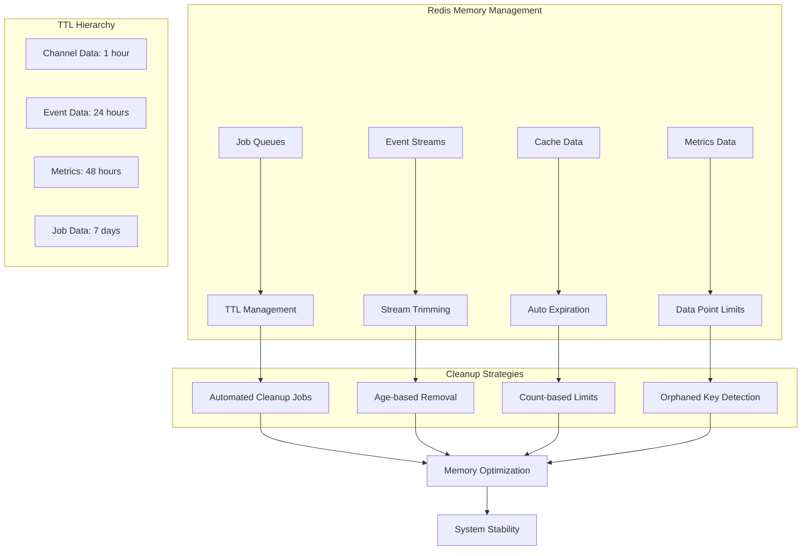

# Redis Memory Management and Cleanup System

## System Architecture



## Overview

The application uses Redis extensively for job queuing (BullMQ), real-time status updates, and caching. Without proper memory management, Redis can grow indefinitely, leading to out-of-memory conditions and degraded performance. This system implements a comprehensive cleanup strategy to maintain predictable memory usage.

## Memory Management Strategy

### 1. TTL (Time-To-Live) Settings

The system implements a hierarchical TTL strategy with different expiration times based on data importance and usage patterns:

**TTL Hierarchy:**
- **Job Data (7 days)**: Completed and failed jobs are retained for analysis and debugging
- **Metrics Data (48 hours)**: Performance metrics are kept for trend analysis  
- **Event Streams (24 hours)**: Real-time status updates expire after operational relevance
- **Channel Data (1 hour)**: Temporary pub/sub channels have the shortest lifespan

**Processing Strategy:**
- Keys are processed in small batches to prevent Redis blocking
- TTL values are configurable through environment variables
- Different data types have appropriate retention periods based on business needs

### 2. BullMQ Configuration

The system uses BullMQ with memory-optimized settings designed to prevent unbounded growth:

**Job Retention Strategy:**
- **Completed Jobs**: Limited to 500 jobs with 24-hour age limit
- **Failed Jobs**: Limited to 1000 jobs with 7-day retention for debugging
- **Automatic Removal**: Jobs are automatically cleaned based on count and age limits
- **Retry Logic**: Failed jobs attempt up to 3 retries with exponential backoff

**Queue Optimization:**
- **Stalled Job Detection**: Regular checks every 30 seconds prevent stuck jobs
- **Metrics Limitation**: Only 60 data points stored to limit memory usage
- **Connection Pooling**: Efficient Redis connection management
- **Duration Tracking**: Performance metrics collection for monitoring

**Memory Protection:**
- Prevents orphaned Redis keys through proper cleanup
- Configurable limits based on system capacity
- Age-based expiration ensures temporal relevance

### 3. Automated Cleanup Mechanisms

#### A. Job Cleanup

The system performs regular cleanup of completed and failed jobs:
- **Batch Processing**: Jobs are cleaned in small batches to prevent Redis blocking
- **Queue-Specific Cleanup**: Both job execution and test execution queues are maintained
- **TTL Enforcement**: Jobs older than configured TTL are automatically removed
- **Status-Based Cleanup**: Separate handling for completed and failed job states

#### B. Event Stream Trimming

Event streams are capped to prevent unbounded growth:
- **Stream Length Limits**: Event streams are trimmed to maximum number of entries
- **Memory Pressure Relief**: Reduces Redis memory usage for high-throughput systems
- **Historical Data**: Maintains recent events while removing older entries
- **Multiple Queue Support**: Trimming applied to all job and test execution queues

#### C. Orphaned Key Detection

Background workers scan for keys without TTL and add expiration:
- **SCAN Pattern Usage**: Uses Redis SCAN command to efficiently iterate through keys
- **Batch Processing**: Processes keys in small batches to prevent blocking Redis
- **Queue-Specific Targeting**: Focuses on specific queue patterns to avoid unnecessary scans
- **TTL Detection**: Identifies keys without expiration and applies appropriate TTL values
- **Key Type Recognition**: Different expiration times based on key purpose (events, metrics, job data)
- **BullMQ Awareness**: Skips keys that BullMQ manages automatically to prevent conflicts
- **TTL Application**: Applies appropriate expiration times to orphaned keys
- **Logging Integration**: Debug logging for cleanup operations and error handling  
- **Error Handling**: Robust error handling to prevent cleanup failures from affecting operations

### 4. Memory Optimization Techniques

#### A. Batched Processing
- **Small Batch Sizes**: Processes 100 keys at a time to prevent Redis blocking
- **Memory-Friendly**: Reduces memory pressure during cleanup operations
- **Configurable**: Batch size can be adjusted based on system capacity

#### B. Efficient Key Scanning  
- **SCAN vs KEYS**: Uses Redis SCAN command instead of KEYS to avoid blocking
- **Pattern Matching**: Targets specific queue patterns to reduce unnecessary work
- **Cursor-Based**: Iterates through keys in a non-blocking manner

#### C. Storage Limit Management
- **Completed Jobs**: Limited to 500 jobs with 24-hour retention
- **Failed Jobs**: Limited to 1000 jobs with 7-day retention for debugging
- **Age and Count Limits**: Dual constraints prevent unbounded growth

#### D. Scheduled Cleanup Operations
- **12-Hour Intervals**: Regular cleanup runs every 12 hours
- **Automatic Execution**: No manual intervention required
- **Error Recovery**: Continues operations even if individual cleanup fails

## Implementation Architecture

### 1. Redis Service Implementation

The Redis service provides the core memory management functionality:

**Service Architecture:**
- **NestJS Injectable Service**: Integrates with NestJS lifecycle and dependency injection
- **Redis Connection Management**: Configurable connection with authentication support
- **Queue Event Monitoring**: Monitors job and test execution queues
- **Scheduled Cleanup**: Automatic periodic cleanup every 12 hours

**Key Responsibilities:**
- **Connection Management**: Maintains Redis connection with retry logic
- **Cleanup Scheduling**: Sets up and manages cleanup intervals
- **Memory Monitoring**: Tracks Redis memory usage patterns
- **Error Handling**: Graceful error handling for cleanup operations

### 2. Queue Client Architecture

The frontend queue client provides distributed cleanup capabilities:

**Client Features:**
- **Initial Startup Cleanup**: Cleans orphaned keys on application startup
- **Periodic Maintenance**: Scheduled cleanup every 12 hours
- **Process Lifecycle Management**: Proper cleanup on process exit
- **Error Resilience**: Continues operations even with cleanup failures

**Integration Points:**
- **Multi-Queue Support**: Handles multiple queue types simultaneously
- **Connection Sharing**: Uses existing Redis connections efficiently
- **Logging Integration**: Comprehensive logging for debugging and monitoring

### 3. Comprehensive Cleanup Operations

The system performs multi-layered cleanup operations:

**Queue Types Managed:**
- Test execution queues for individual test runs
- Job execution queues for batch operations
- Monitor execution queues for system monitoring
- Heartbeat and notification queues for alerts
- Scheduler queues for automated job execution

**Cleanup Operations:**
- **Age-Based Removal**: Removes jobs older than configured TTL
- **Count-Based Limits**: Enforces maximum job retention counts
- **Event Stream Trimming**: Prevents event log growth
- **Orphaned Key Detection**: Identifies and removes abandoned keys

## Benefits

### 1. Predictable Memory Usage

- **Bounded Growth**: Memory usage is capped by TTL settings and cleanup limits
- **Automatic Cleanup**: No manual intervention required
- **Consistent Performance**: System performance remains stable over time

### 2. Automatic Recovery

- **Memory Leak Protection**: Orphaned keys are automatically detected and cleaned
- **Self-Healing**: System recovers from memory issues without manual intervention
- **Graceful Degradation**: Performance degrades gracefully under memory pressure

### 3. Protection Against Out-of-Memory

- **Redis OOM Prevention**: Prevents Redis from running out of memory
- **System Stability**: Ensures the entire application remains stable
- **Resource Efficiency**: Optimizes Redis memory usage for cost-effectiveness

### 4. Consistent Performance

- **Predictable Behavior**: Memory usage follows predictable patterns
- **No Performance Degradation**: System performance remains consistent regardless of uptime
- **Scalable Architecture**: Memory management scales with system load

## Monitoring and Debugging

### 1. Logging

The system provides comprehensive logging for cleanup operations:

```typescript
this.logger.log('Setting up periodic Redis cleanup task');
this.logger.debug(`Set TTL of ${expiryTime}s for key: ${key}`);
this.logger.debug(`Processed ${processedKeys} Redis keys for queue: ${queueName}`);
this.logger.log('Redis cleanup completed successfully');
```

### 2. Error Handling

Robust error handling ensures cleanup failures don't affect system operation:

```typescript
try {
  await this.performRedisCleanup();
} catch (error) {
  this.logger.error('Error during scheduled Redis cleanup:', error);
}
```

### 3. Metrics

The system tracks cleanup metrics for monitoring:

- Number of keys processed per cleanup cycle
- TTL values set for different key types
- Cleanup operation duration
- Error rates and types

## Configuration

### Environment Variables

The Redis memory management system can be configured via environment variables:

```bash
# Redis Configuration
REDIS_HOST=redis
REDIS_PORT=6379
REDIS_PASSWORD=

# Memory Management (optional overrides)
REDIS_JOB_TTL=604800        # 7 days in seconds
REDIS_EVENT_TTL=86400       # 24 hours in seconds
REDIS_METRICS_TTL=172800    # 48 hours in seconds
REDIS_CLEANUP_BATCH_SIZE=100
```

### Docker Configuration

Redis is configured with memory limits in Docker:

```yaml
redis:
  image: redis:latest
  command: sh -c "rm -rf /data/* && redis-server --maxmemory 256mb --maxmemory-policy noeviction --save '' --appendonly no"
  deploy:
    resources:
      limits:
        cpus: '0.25'
        memory: 256M
      reservations:
        cpus: '0.1'
        memory: 128M
```

## Best Practices

### 1. Regular Monitoring

- Monitor Redis memory usage regularly
- Set up alerts for memory usage approaching limits
- Track cleanup operation success rates

### 2. Tuning TTL Values

- Adjust TTL values based on application needs
- Consider data retention requirements
- Balance memory usage with debugging needs

### 3. Batch Size Optimization

- Adjust batch sizes based on Redis performance
- Monitor cleanup operation duration
- Optimize for your specific workload

### 4. Error Handling

- Implement proper error handling for cleanup operations
- Log cleanup failures for investigation
- Ensure cleanup failures don't affect system operation

This comprehensive Redis memory management system ensures the application maintains optimal performance while preventing memory-related issues that could affect system stability and reliability. 