# Test Execution Flow

## Flow Diagram

```mermaid
flowchart TB
    subgraph "Single Test Execution (Playground)"
        A1[User clicks 'Run Test' in Playground] --> B1[Frontend validates inputs]
        B1 --> C1[Send POST to /api/test]
        C1 --> D1[executeTest function]
        D1 --> E1[Generate test ID & directories]
        E1 --> F1[Validate code]
        F1 --> G1[Create initial loading report]
        G1 --> H1[Queue test for execution]
        H1 --> I1[Execute test in child process]
        I1 --> J1[Generate final report]
        
        K1[Frontend adds test to list] --> L1[Set iframe to report URL]
        L1 --> M1[EventSource connects to SSE]
        M1 --> N1[Receive real-time updates]
        N1 --> O1[Auto-reload on completion]
    end
    
    subgraph "Multiple Test Execution (Jobs)"
        A2[User runs job with multiple tests] --> B2[Frontend sends POST to /api/jobs/run]
        B2 --> C2[Create test run record in DB]
        C2 --> D2[Fetch test scripts]
        D2 --> E2[executeMultipleTests function]
        E2 --> F2[Create job directories]
        F2 --> G2[Validate code for each test]
        G2 --> H2[Create individual test files]
        H2 --> I2[Execute tests with global config]
        I2 --> J2[Process individual results]
        J2 --> K2[Generate combined report]
        K2 --> L2[Upload report to S3]
        
        M2[Frontend shows job status] --> N2[Set iframe to job report URL]
        N2 --> O2[EventSource connects to SSE]
        O2 --> P2[Receive real-time updates]
        P2 --> Q2[Auto-reload on completion]
    end
    
    C1 -.-> |API Response| K1
    E2 -.-> |Status Updates| M2
```



## Single Test Execution (Playground)

1. **Test Initiation**: User clicks "Run Test" in playground UI
2. **API Call**: Frontend sends test data to `/api/test` endpoint
3. **Backend Processing**:
   - Generates unique test ID
   - Validates test code
   - Creates only the essential report directory
   - Generates initial loading report with SSE connection
4. **Test Execution**:
   - Test added to execution queue (max 2 concurrent tests)
   - Executes in child process using Playwright
   - Real-time status updates via Server-Sent Events
5. **Report Generation**:
   - Initial loading report with auto-reload functionality
   - Final HTML report when test completes
   - Stored locally (not uploaded to S3)

## Multiple Test Execution (Jobs)

1. **Job Submission**: POST to `/api/jobs/run` with job ID and test list
2. **Database Recording**: Creates test run record with pending status
3. **Test Preparation**:
   - Fetches scripts from database if not provided
   - Validates each test script
   - Creates individual test files
4. **Bulk Execution**:
   - Executes all tests with shared configuration
   - Tracks individual test results
   - Provides real-time status with SSE
5. **Result Handling**:
   - Generates combined HTML report
   - Updates job status in database
   - Uploads results to S3 job bucket

## Directory Structure

The application maintains a minimal directory structure for test results:

```
/public/test-results/
  /{test-id}/
    /report/             # HTML report directory
      index.html         # Main report file
      trace/             # Trace data embedded in the report
      assets/            # Report assets
```

## Storage Configuration

- **Traces**: Enabled but stored directly within the HTML report, not in separate directories

## Error Handling

- **Validation Failures**: Generates special error reports
- **Execution Failures**: Captures error details and logs
- **Report Access Issues**: Handles "File not found" with user-friendly messages
- **Test Timeout**: Set to 15 minutes maximum execution time

## Key Implementation Details

- **Concurrency Management**: Limited to 2 concurrent tests (configurable via environment variable)
- **Non-Blocking Architecture**: Tests run in child processes
- **Real-time Updates**: SSE for live progress updates
- **S3 Storage**: Job reports stored in S3 job bucket
- **Minimal Directory Creation**: Only creates essential directories for test reports
- **Environment Variables**: Passed to child processes for configuration

## Environment Configuration

The application uses two environment files:

1. **.env**: Base configuration with default values
   - Contains S3/MinIO configuration and database settings
   - Used in both development and production
   - Should NOT contain sensitive secrets for production

2. **.env.local**: Development overrides (not committed to version control)
   - Used for local development settings
   - Contains developer-specific configuration
   - Can override values from .env

**Current Configuration**:

- S3 endpoint and credentials for artifact storage
- Database file location
- BrowserStack credentials
- Test execution settings:
  - `MAX_CONCURRENT_TESTS`: Number of tests running in parallel (default: 2)
  - `TEST_EXECUTION_TIMEOUT_MS`: Maximum test execution time (default: 900000ms)
  - `TRACE_RECOVERY_INTERVAL_MS`: How often to check for trace issues (default: 300000ms)

**Best Practices Recommendations**:

- Keep the dual-file approach (.env + .env.local) which follows Next.js conventions
- Move sensitive credentials to .env.local only
- Add documentation for required environment variables
- Consider using environment-specific files (.env.production) for deployment
