# Test Execution Flow Documentation

This document explains the complete flow of test execution in the SuperTest application, covering both single test execution in the playground and multiple test execution in jobs.

## Flow Diagram

```mermaid
flowchart TB
    subgraph "Single Test Execution (Playground)"
        A1[User clicks 'Run Test' in Playground] --> B1[Frontend validates inputs]
        B1 --> C1[Send POST to /api/test]
        C1 --> D1[executeTest function]
        D1 --> E1[Generate test ID & directories]
        E1 --> F1[Validate code]
        F1 --> G1[Create initial loading report]
        G1 --> H1[Queue test for execution]
        H1 --> I1[Execute test in child process]
        I1 --> J1[Generate final report]
        
        K1[Frontend adds test to list] --> L1[Set iframe to report URL]
        L1 --> M1[EventSource connects to SSE]
        M1 --> N1[Receive real-time updates]
        N1 --> O1[Auto-reload on completion]
    end
    
    subgraph "Multiple Test Execution (Jobs)"
        A2[User runs job with multiple tests] --> B2[Frontend sends POST to /api/jobs/run]
        B2 --> C2[Create test run record in DB]
        C2 --> D2[Fetch test scripts]
        D2 --> E2[executeMultipleTests function]
        E2 --> F2[Create job directories]
        F2 --> G2[Validate code for each test]
        G2 --> H2[Create individual test files]
        H2 --> I2[Execute tests with global config]
        I2 --> J2[Process individual results]
        J2 --> K2[Generate combined report]
        
        L2[Frontend shows job status] --> M2[Set iframe to job report URL]
        M2 --> N2[EventSource connects to SSE]
        N2 --> O2[Receive real-time updates]
        O2 --> P2[Auto-reload on completion]
    end
    
    C1 -.-> |API Response| K1
    E2 -.-> |Status Updates| L2
```

## Single Test Execution Flow (Playground)

### Phase 1: UI Interaction & API Call

1. **User Clicks "Run Test" Button**: The process begins when the user clicks the "Run Test" button in the playground UI, triggering the `runTest()` function.

2. **Switch to Report Tab**: The UI automatically switches to the report tab to show immediate feedback.

3. **Validate Inputs**: The code validates required inputs like the test title.

4. **Prepare Test Data**: The code, title, description, and type are packaged into an object to send to the API.

5. **API Endpoint Call**: The frontend sends a POST request to `/api/test` with the test data.

### Phase 2: Backend Execution Setup

1. **Execute Test Function**: The API endpoint calls the `executeTest()` function, which:
   - Generates a unique test ID using `crypto.randomUUID()`
   - Marks the test as active in the tracking system
   - Creates directories for test artifacts
   - Validates the test code
   - Creates an initial "loading" HTML report with SSE connection setup
   - Updates the test status to "running"
   - Queues the test for execution in a child process

2. **Frontend Updates Test List**: After receiving the API response, the frontend adds the new test to the list with "pending" status.

3. **Set Initial Report URL**: The frontend sets the iframe source to the initial report URL, which shows a loading indicator.

### Phase 3: Background Test Execution & Real-time Status Updates

1. **Test Status Changes**: As the test executes, its status is updated in a global map (`testStatusMap`).

2. **Server-Sent Events (SSE)**: The initial HTML report contains JavaScript that:
    - Establishes an EventSource connection to `/api/test-status/sse/{testId}`
    - Listens for real-time updates about the test status
    - Automatically reloads the page when the test completes

3. **Background Test Execution**: Meanwhile, the test runs in a child process:
    - The Playwright test executes in a separate process with environment variables for artifact paths
    - Output (stdout/stderr) is collected and stored
    - When the test completes, a final HTML report is generated
    - The test status is updated to "completed"

### Phase 4: Report Display & Completion

1. **EventSource Listens for Changes**: The EventSource in the loading report listens for status changes.

2. **Auto-reload on Completion**: When the test completes (status is "completed"), the EventSource triggers an automatic reload of the report page, showing the final test results.

## Multiple Test Execution Flow (Jobs)

### Phase 1: Job Submission & Setup

1. **User Initiates Job Run**: The user clicks "Run Job" to execute multiple tests, triggering a POST request to `/api/jobs/run`.

2. **Create Test Run Record**: A new test run record is created in the database with a unique run ID.

3. **Prepare Test Scripts**: Each test in the job is processed:
   - Scripts are loaded directly if provided
   - Scripts are fetched from the database if not provided
   - Placeholder scripts are created for tests without valid scripts

### Phase 2: Multiple Test Execution

1. **executeMultipleTests Function**: Called with the collection of test scripts and run ID:
   - Creates necessary directories for the job
   - Marks the run as active in the tracking system
   - Initializes the test status as "pending"

2. **Individual Test File Creation**: For each test in the job:
   - The script is validated
   - A test file is created in the job directory
   - Failed validation results in a special failing test file

3. **Execute Tests with Global Config**: All tests are executed in a single run using `executeMultipleTestFilesWithGlobalConfig`:
   - Uses the same Playwright configuration
   - Collects results from all tests
   - Generates a combined HTML report

4. **Process Individual Results**: Each test's outcome is recorded separately.

5. **Update Test Status**: The overall job status is updated to "completed" with success or failure.

### Phase 3: Real-time Updates & Reporting

1. **Frontend Shows Job Status**: The UI displays the job status and test results.

2. **EventSource Connection**: Similar to single tests, an EventSource connection receives status updates.

3. **Combined Report Display**: When complete, a single HTML report shows all test results together.

4. **Test Run Record Update**: The database record is updated with the final status and completion time.

## Key Implementation Details

1. **Initial Loading Report**: A temporary HTML report is generated immediately, showing a spinner and establishing an EventSource connection.

2. **Non-Blocking Execution**: Tests run in a child process, allowing the UI to remain responsive.

3. **Concurrency Management**: A queue limits concurrent test executions to prevent overloading the system.

4. **Server-Sent Events**: Real-time updates are delivered through SSE, eliminating the need for polling.

5. **Shared Report Structure**: Both single and multiple test executions use the same reporting structure.

6. **Test Tracking**: Active tests are tracked to prevent premature cleanup of test directories.

7. **Resource Management**: Test artifacts are organized in distinct directories to prevent conflicts.

8. **Error Handling**: Validation failures and runtime errors are captured and presented in the reports.

This architecture ensures users get immediate feedback while tests run in the background, and can view both in-progress and completed test reports with real-time updates seamlessly.
